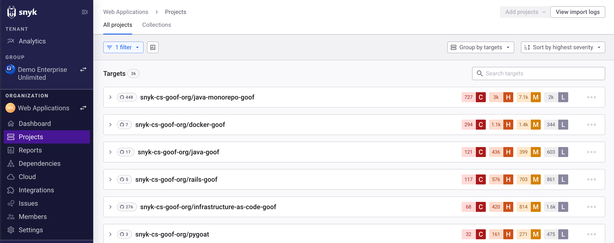

# Import Project repository

## How importing repositories works

After you select repositories on the Snyk Web UI and click **Add selected repositories**, the import starts, and a progress bar appears on the **Projects** page.

When the import is finished, a confirmation message appears on the Projects page. Your imported repositories appear as separate Target folders on the Projects page. Each Target folder has the name of your Git repository account and the imported repository and contains the Snyk Projects that were created for it.

<figure><figcaption>
Target folders on Projects page
</figcaption></figure>

If some of the files in the selected repositories were not imported, you receive a notification about the Projects that were not imported.&#x20;
