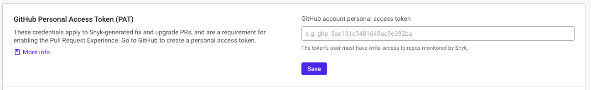
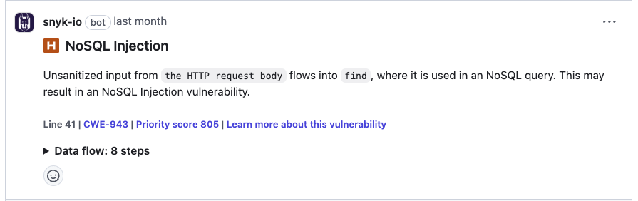
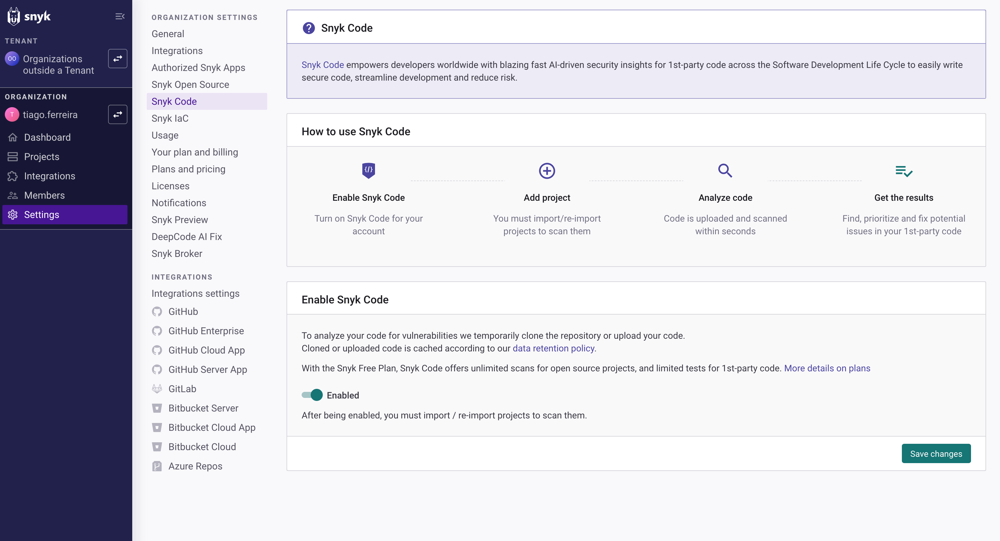
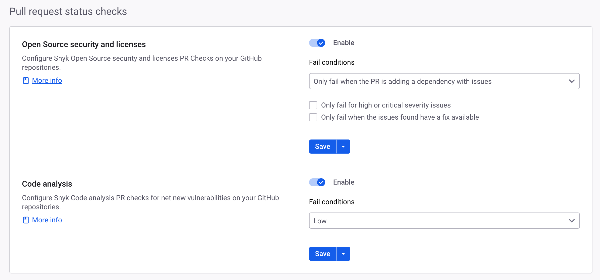

# Pull Request experience


**Release status**

As part of the Pull Request experience, Snyk Agent fix in the PR is in [Early Access](../../../discover-snyk/getting-started/snyk-release-process.md#early-access-features).


The Pull Request experience is an enhancement of the foundational [Pull Request Checks](./) functionality. It streamlines the security review process by reducing the need to switch between different developer tools, and providing contextually relevant feedback within your Source Code Manager (SCM) interface.

The Pull Request Experience consists of the following features:

* [Issue Summary Comment](pull-request-experience.md#issue-summary-comment)
* [Inline Comments](pull-request-experience.md#inline-comments)
* [Snyk Agent Fix in the PR](pull-request-experience.md#snyk-agent-fix-in-the-pr)

Issue summary comment provides a collated view of the last PR Check results, categorizing findings by severity and type directly within the pull request.

Inline comments give a granular view of the pull request with information on severity, the data flow of vulnerabilities, and more. This allows you to make quick decisions on issue prioritization and remediation.

Snyk Agent fix in the PR enables action to be taken based on the previous features in the Pull Request Experience and the recommendations given.

## Prerequisites

### User role requirement

To configure and manage the pull request experience, the user must be a [Group Admin](../../../snyk-platform-administration/user-roles/pre-defined-roles.md#group-level-permissions). This is to ensure access to all integrations for setup as the pull request experience is configured at the Organization level.

### Pull request checks enablement


The Pull request experience is set up individually for each integration. If you have multiple integrations, you need to configure the pull request experience separately for each one.


Ensure the following is complete:

* [Configure PR checks](configure-pull-request-checks.md).
* Set up at least one SCM integration with Snyk and import a minimum of one Project from your repository.
* Snyk Code is enabled for your Snyk Organization. Contact your Account Representative or [Snyk Support](https://support.snyk.io/s/) if you do not have this enabled.

### Pull request experience feature requirements

Additional to the general SCM and PR Checks prerequisites, certain features within the pull request experience have their own requirements:

* To configure the inline comments feature, enable the **Code analysis** PR checks setting. This is located on the Organization level under **Settings** > **Integrations**.
* Specify a dedicated GitHub account if you are using a GitHub integration. This helps Snyk identify the comments source on pull requests.

<figure><figcaption>
Code analysis feature for pull request status checks
</figcaption></figure>

### SCM permission and access scope requirements

The pull request experience integrates with various SCM platforms, each with specific requirements for a successful configuration with Snyk. Your existing SCM integration setup will work with the Pull Request experience out of the box, except for GitHub (OAuth) which requires an additional Fix PR token. For additional information, see [User permissions and access scopes](../../../developer-tools/scm-integrations/user-permissions-and-access-scopes.md).


For information on which SCM integrations are supported in each pull request experience feature, see the individual feature sections: [Issue Summary Comment](pull-request-experience.md#issue-summary-comment), [Inline Comments](pull-request-experience.md#inline-comments), and [Snyk Agent Fix in the PR](pull-request-experience.md#snyk-agent-fix-in-the-pr).


## Configure pull request experience at the integration level

Configure the pull request experience for one or more integrations in your Snyk Organization, for which [PR checks](configure-pull-request-checks.md#configure-pr-checks-at-the-integration-level) are also enabled.

1. Select the Snyk Organization for which you want to enable the pull request experience. Navigate to **Settings** > **Integrations** > **Source control** > **Edit settings**, to open the settings configuration.
2. Configure and save the following changes:
   1. Enable [issue summary comment](pull-request-experience.md#issue-summary-comment): Enable this option to create an issue summary comment on each pull request, which aggregates the PR check results. If it is disabled, the entire pull request experience is disabled.
   2. Create comments for success cases: By default, an issue summary comment is created even if no vulnerabilities are detected by the PR check. Disable this option to stop creating issue summary comments for non-failing PR checks.
   3. Enable[ inline comments](pull-request-experience.md#inline-comments)**:** Enable inline comments to add a comment for each issue found by Snyk Code PR check.
   4. Enable [Snyk Agent fix in the PR](pull-request-experience.md#snyk-agent-fix-in-the-pr): Enable requesting Snyk Agent fix suggestions for issues found by Snyk Code PR check, and applying the fixes to the PR branch.

<figure><figcaption>
Configuration details for the PR Comment experience
</figcaption></figure>

<figure><figcaption>
Configuration details for the GitHub integration
</figcaption></figure>

## Issue summary comment

The issue summary comment feature adds a comment to each pull request, summarizing the latest PR check results. The summary includes the type of checks performed and a breakdown of the findings by severity. Select **View Details** to access the PR check details in the Snyk Web UI.

<figure><figcaption>
Issue summary comment feature for pull request experience
</figcaption></figure>

## Inline comments

The inline comments feature adds a detailed comment for each issue identified by the Snyk Code pull request check. Each comment includes the severity level, the name and a short description of the issue, helpful links for further information, and, if applicable, the data flow. For best results, Snyk recommends generating and applying fixes for a single inline comment at a time, to avoid situations where applying a fix causes conflicts with another previously generated fix.


This feature is limited to 10 inline comments at pull request level. The summary comment will display a message if the cap is surpassed.


For GitLab and Azure Repos, consider the following conditions:

* The Data Flow section in the inline comments is not available.
* Inline comments for vulnerabilities introduced outside modified lines are unavailable for GitLab.
* Inline comments for Code Analysis done using Snyk Local Code Engine are unavailable.

For Brokered integrations, the Data Flow section in the inline comments is available only for GitHub, GitHub Cloud App, Bitbucket Cloud, and Bitbucket Connect App.

<figure><figcaption>
Inline comment feature for pull request experience
</figcaption></figure>

## Snyk Agent fix in the PR


**Release status**

Snyk Agent fix in the PR is in [Early Access](../../../discover-snyk/getting-started/snyk-release-process.md#early-access-features).\
Snyk Agent fix in the PR will work only on inline comments created after the feature is enabled.


The Snyk Agent fix in the PR feature enables the user to request and apply fixes for vulnerabilities identified by the Snyk Code pull request check and posted as inline comments. By enabling this feature, the user is able to interact with inline comments in the following way:&#x20;

* Request an initial fix by replying to an inline comment using the `@snyk /fix` command.

<figure><figcaption>
Inline Comments with Snyk Agent Fix enabled
</figcaption></figure>

<figure><figcaption>
Request a fix by replying to the inline comment
</figcaption></figure>

* Request a different suggestion by replying with the `@snyk /fix` command to a previously generated fix. Snyk Agent fix can generate up to five potential fixes, depending on the issue type.
* Apply a specific fix by using the `@snyk /apply #` command, where # is the number of the suggestion the user wishes to apply. A commit is created by Snyk on the PR branch, containing the selected fix.

### Exceptions

* The `@snyk /fix` command can be used only for automatically fixable vulnerabilities, identified in the inline comments with a zap icon and command description. See  [fix-code-vulnerabilities-automatically.md](../../snyk-code/manage-code-vulnerabilities/fix-code-vulnerabilities-automatically.md "mention") for supported languages and limitations.
* Fixes expire after the time displayed in each suggestion, in accordance with the [#cache-retention-period-related-to-vulnerability-source-data](../../../snyk-data-and-governance/how-snyk-handles-your-data.md#cache-retention-period-related-to-vulnerability-source-data "mention"). After expiration, a new fix can be requested by using the `@snyk /fix` command.
* Snyk Agent fix in the PR is not supported for [Snyk Code Local Engine](../../snyk-code/snyk-code-local-engine.md).
* The `@snyk /fix` and `@snyk /apply #` commands can be used only as replies to the Inline Comments created by Snyk, commands created on other comment threads will not be processed.

## Frequently Asked Questions (FAQs) and Troubleshooting


For detailed descriptions on troubleshooting scenarios and their relevant resolutions, see [Troubleshoot PR Checks](troubleshoot-pr-checks.md).


### How can I handle false positives?

If a finding is a false positive, you can manually resolve the comment in the SCM. It will remain resolved even if the issue is detected again in a subsequent PR check.

### What happens to comments when a new commit is pushed?

#### **Issue Summary Comment**

When a new commit is pushed to the pull request, the existing summary comment is updated with the latest Snyk scan results for that commit. This means the issues count is refreshed to reflect the most recent analysis. No new issue summary comment is added, ensuring developers get a concise view of potential vulnerabilities without being flooded with notifications.

#### **Inline Comments**

For every pushed commit, a review is created if Snyk Code PR Check detects new issues. Each issue is added as an inline comment. If an issue from a previous commit is fixed in the new commit, its comment is marked as resolved. Unresolved issues remain as inline comments.

### Why are PR comments not appearing in my repository?

To ensure your repository receives PR comments, review the [Prerequisites for the Snyk Pull Request Experience](pull-request-experience.md#prerequisites) section. Ensure all required conditions are met and properly fulfilled.

Inline comments are available only for issues detected by Snyk Code PR Checks. To ensure that issues appear as inline comments, verify the following requirements:

1. **Snyk Code** is enabled for your Organization.

<figure><figcaption>
Configuration details to enable Snyk Code
</figcaption></figure>

2. **Code Analysis** is enabled in the Pull request status checks section for your integration.

<figure><figcaption>
Configuration details to enable Code Analysis
</figcaption></figure>

3. **Inline Comments** are enabled in the **Pull Request Experience** section for your integration.

<figure><figcaption>
Configuration details to enable Inline Comments
</figcaption></figure>

### Why are some findings not appearing as inline comments?

Inline comments are only available for issues detected by Snyk Code PR checks. Their behavior may vary depending on the SCM platform. On most platforms, an inline comment is added for each issue found. However, on GitLab, inline comments are only added for issues found within the files that were modified in the pull request.

### Is Snyk Broker supported?

Yes. Brokered integrations are supported for both **i**ssue summary comment and inline comments, with compatibility for both Classic and Universal Broker.&#x20;

Supported Snyk Broker version 4.194 or higher for the issue summary comment and inline comments features.

Snyk Agent fix in the PR is supported in Snyk Broker version 4.219 or higher.

### Why is Snyk Agent fix in the PR not working after enabling the setting?

When you enable the Snyk Agent Fix in the PR setting, a background process is initiated to upgrade the [Snyk webhooks](../snyk-pull-or-merge-requests/#snyk-scm-webhooks) in the user's repository with the pull request comment event subscription necessary for the feature. This process can take a couple of minutes to complete. During this time, the feature will not be fully active or available, and Snyk will not be able to react to commands in the PR.&#x20;

To troubleshoot the webhook upgrade process, go to the repository settings page of your SCM, and confirm that the Snyk webhook is subscribed to the 'Pull request review comments' event.

### Why is Snyk Agent fix replying with command execution is already in progress, when I submitted a single command?

This can happen when a repository is imported into multiple Snyk Organisations and there are multiple Snyk webhooks defined on the repository. For best results ensure that only a single Snyk webhook is subscribed to pull request comment events. If needed, the Snyk webhook event subscriptions can be edited from the repository settings page of your SCM.

### Why did my comment fail with a message about replying to the first comment in the thread in Bitbucket?

In some cases, commands in comment replies may fail to run in long or complex threads. This can happen because the thread's length or structure prevents us from handling the reply correctly. If you encounter this rare issue, please scroll to the first comment in the thread and reply to that with your command. This will allow us to process it successfully and always works as a fallback.

### Why doesn’t applying an AI Fix work on some pull requests from forks in Bitbucket Cloud?

AI Fix supports pull requests from repositories within the same workspace (e.g., `base_workspace/fork_repo` → `base_workspace/base_repo`), but it does not support pull requests from a fork located in a different workspace (e.g., `fork_workspace/fork_repo` → `base_workspace/base_repo`). This limitation is specific to the Bitbucket Cloud Connect app when the integration only has access to the base workspace. To enable AI Fix for these cross-workspace pull requests, you can switch to the Bitbucket Cloud PAT integration instead.

### I'm having trouble with the Snyk Agent Fix feature on Bitbucket Cloud. How can I debug it?

If you are having issues with agent-based fixes on Bitbucket Cloud and can't identify the cause, a useful troubleshooting step is to inspect the webhook history in your Bitbucket repository settings.

The Snyk Agent Fix feature relies on webhooks to communicate between Bitbucket Cloud and our systems. By checking the webhook history, you can verify if webhooks are being delivered successfully and inspect the responses from the service. This can help diagnose network issues, configuration problems, or errors returned by the service. In order to have access to the webhook history in Bitbucket Cloud you need to:

1. Go to your repository on Bitbucket Cloud.
2. Click on **Repository settings** in the left sidebar.
3. Under the "WORKFLOW" section, select **Webhooks.**
4. Locate the webhook used for the integration.
5. Click **View requests** next to the webhook URL.
6. Click on **Enable History**.
7. Post a new Snyk Agent Fix command so you can see the webhook deliveries.
