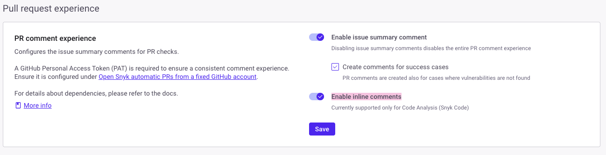

# Pull Request Experience

The Snyk Pull Request Experience reduces context switching by displaying additional information about the PR Check scan results in the pull request.

The following features are part of the Pull Request Experience:

* [Issue Summary Comment](pull-request-experience.md#issue-summary-comment)
* [Inline Comments](pull-request-experience.md#inline-comments)

## Prerequisites for the Snyk Pull Request Experience

* Snyk PR Checks must be enabled. For more information, see [Configure Pull Request Checks](configure-pull-request-checks.md).
* For the GitHub integration, you must specify a GitHub account  to provide a consistent comment experience. For more information, see [Opening fix and upgrade pull requests from a fixed GitHub account](../snyk-pull-or-merge-requests/opening-fix-and-upgrade-pull-requests-from-a-fixed-github-account.md).
* For inline comments, enable the **Code analysis PR checks** setting at the [integration level](https://docs.snyk.io/scan-with-snyk/pull-requests/pull-request-checks/pull-request-experience#configure-pull-request-experience-at-the-integration-level). In the Snyk Web UI, under **Settings** > **Integrations** > **Edit settings**,  verify that the option is enabled under **Pull request status checks** > **Code analysis**.

<figure><figcaption>
Code analysis feature for Pull Request status checks
</figcaption></figure>

## Issue Summary Comment


**Release status**

Issue Summary Comment for Snyk PR Checks is in [Early Access](../../../getting-started/snyk-release-process.md#early-access).


The Issue Summary Comment feature adds a comment to each pull request, summarizing the latest PR Check results. The summary includes the type of checks performed and a breakdown of the findings by severity. Select **View Details** to access the PR Check details in the Snyk Web UI.

<figure><figcaption>
Issue Summary Comment feature for Pull Request Experience
</figcaption></figure>

## Inline Comments


**Release status**

Inline Comments for Snyk PR Checks is in [Early Access](../../../getting-started/snyk-release-process.md#early-access) and available only for Snyk Code PR Checks.


The Inline Comments feature adds a detailed comment for each issue identified by the Snyk Code Pull Request Check. Each comment includes the severity level, the name and a short description of the issue, helpful links for further information, and, if applicable, the data flow.&#x20;

This feature is limited to 10 inline comments at Pull Request level. The Summary Comment will display a message if the cap is surpassed.

<figure><figcaption>
Inline Comment feature for Pull Request Experience
</figcaption></figure>

## Configure Pull Request Experience

You can configure the Pull Request Experience [at the Integration level](pull-request-experience.md#configure-pr-checks-at-the-integration-level) for your Snyk Organization.


The Pull Request Experience is set up individually for each integration. If you have multiple integrations, you need to configure the Pull Request Experience separately for each one.


### Configure Pull Request Experience at the Integration level

Configure the Pull Request Experience for one or more integrations in your Snyk Organization, for which [PR Checks](configure-pull-request-checks.md#configure-pr-checks-at-the-integration-level) are also enabled.

1. In the Snyk Organization you wish to activate and configure the Pull Request Experience for, navigate to **Settings** > **Integrations** and select **Edit settings** your connected source code manager to open the settings configuration.
2. Configure and save the following changes:
   1. **Enable Issue Summary Comment:** Enable this option to create an Issue Summary Comment on each pull request, which aggregates the PR Check results. If it is disabled, the entire Pull Request Experience is disabled.
   2. **Create comments for success cases:** By default, an Issue Summary Comment is created even if no vulnerabilities are detected by the PR Check. Disable this option to stop creating Issue Summary Comments for non-failing PR Checks.
   3. **Enable Inline Comments:** Enable inline comments to add a comment for each issue found by Snyk Code PR Check.

<figure><figcaption>
Configuration details for the GitHub integration
</figcaption></figure>

For the GitHub integration, configure opening fix and upgrade pull requests from a fixed GitHub account, by providing a Personal Access Token (PAT), which has `write` permissions or above to the repos monitored by Snyk. See[Opening fix and upgrade pull requests from a fixed GitHub account](../snyk-pull-or-merge-requests/opening-fix-and-upgrade-pull-requests-from-a-fixed-github-account.md) for more information.

<figure><figcaption>
Configuration details for the GitHub integration
</figcaption></figure>

## Known limitations

Snyk Pull Request Experience is in Early Access and therefore subject to changes and improvements based on your feedback.

Snyk will continuously update this section during the Early Access period as limitations are resolved and new ones are identified.

### GitLab and Azure Repos

Support for Snyk Pull Request Experience is available for GitLab and Azure Repos with the following limitations:

* The Data Flow section in the inline comments is not available.
* Inline comments for vulnerabilities introduced outside of modified lines are unavailable for GitLab.
* Inline comments for Code Analysis done using Snyk Local Code Engine are unavailable.

### Broker

Support for Snyk Pull Request Experience is available for Brokered integrations with the following limitation: the Data Flow section in the inline comments is available only for GitHub, GitHub Cloud App, Bitbucket Cloud, and Bitbucket Connect App.

## Frequently Asked Questions (FAQs)

### How can I handle false positives?

If a finding is a false positive, you can manually resolve the comment in the SCM. It will remain resolved even if the issue is detected again in a subsequent PR check.

### What happens to comments when a new commit is pushed?

#### **Issue Summary Comment**

When a new commit is pushed to the pull request, the existing summary comment is updated with the latest Snyk scan results for that commit. This means the issues count is refreshed to reflect the most recent analysis. No new issue summary comment is added, ensuring developers get a concise view of potential vulnerabilities without being flooded with notifications.

#### **Inline Comments**

For every pushed commit, a review is created if Snyk Code PR Check detects new issues. Each issue is added as an inline comment. If an issue from a previous commit is fixed in the new commit, its comment is marked as resolved. Unresolved issues remain as inline comments.

### Why are PR comments not appearing in my repository?

To ensure your repository receives PR comments, review the [Prerequisites for the Snyk Pull Request Experience](pull-request-experience.md#prerequisites-for-the-snyk-pull-request-experience) section. Ensure all required conditions are met and properly fulfilled.

Inline comments are available only for issues detected by Snyk Code PR Checks. To ensure that issues appear as inline comments, verify the following requirements:

1. **Snyk Code** is enabled for your Organization.

<figure><figcaption>
Configuration details to enable Snyk Code
</figcaption></figure>

2. **Code Analysis** is enabled in the Pull request status checks section for your integration.

<figure><figcaption>
Configuration details to enable Code Analysis
</figcaption></figure>

3. **Inline Comments** are enabled in the **Pull Request Experience** section for your integration.

<figure><figcaption>
Configuration details to enable Inline Comments
</figcaption></figure>

### Why are some findings not appearing as inline comments?

Inline comments are only available for issues detected by Snyk Code PR Checks. Their behavior may vary depending on the SCM platform. On most platforms, an inline comment is added for each issue found. However, on GitLab, inline comments are only added for issues found within the files that were modified in the pull request.

### Is Snyk Broker supported?

Yes. Brokered integrations are supported for both Issue Summary Comment and Inline Comments, with compatibility for both Classic and Universal Broker.&#x20;

Supported Snyk Broker version 4.194 or higher.

