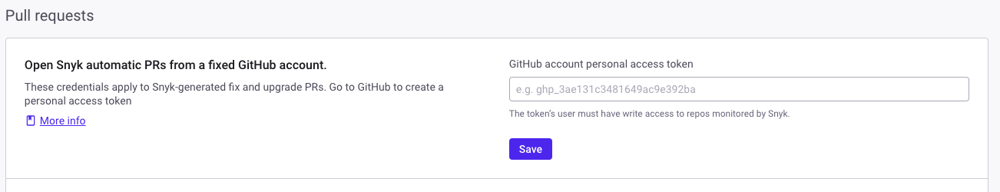

# Pull Request Experience

The Snyk Pull Request Experience reduces context switching by displaying additional information about the PR Check scan results in the pull request.

The following features are part of the Pull Request Experience:

* [Issue Summary Comment](pull-request-experience.md#issue-summary-comment)
* [Inline Comments](pull-request-experience.md#inline-comments)

## Prerequisites for the Snyk Pull Request Experience

* Snyk PR Checks must be enabled. For more information, see [Configure Pull Request Checks](configure-pull-request-checks.md).
* For the GitHub integration, a specific GitHub account needs to be set to open fix and upgrade PRs. The Personal Access Token (PAT) configured in this way is required by the Pull Request Experience to provide a consistent comment experience. See [Opening fix and upgrade pull requests from a fixed GitHub account](../snyk-pull-or-merge-requests/opening-fix-and-upgrade-pull-requests-from-a-fixed-github-account.md) for more information.
* For inline comments, the **Code analysis PR checks** setting needs to be enabled at the [integration level](https://docs.snyk.io/scan-with-snyk/pull-requests/pull-request-checks/pull-request-experience#configure-pull-request-experience-at-the-integration-level). In the Snyk Web UI, under **Settings** > **Integrations** > **Edit settings**,  verify that the option is enabled under **Pull request status checks** > **Code analysis**. If "Code analysis" is not visible, please reach out to your Snyk account team to enable Snyk Code for your account. If it is already enabled, check under **Settings** > **Snyk Code** to ensure it is turned on.

<figure><figcaption>
Code analysis feature for Pull Request status checks
</figcaption></figure>

## Issue Summary Comment


**Release status**

Issue Summary Comment for Snyk PR Checks is in [Early Access](../../../getting-started/snyk-release-process.md#early-access).


The Issue Summary Comment feature adds a comment to each pull request, summarizing the latest PR Check results. The summary includes the type of checks performed and a breakdown of the findings by severity. Select **View Details** to access the PR Check details in the Snyk Web UI.

<figure><figcaption>
Issue Summary Comment feature for Pull Request Experience
</figcaption></figure>

## Inline Comments


**Release status**

Inline Comments for Snyk PR Checks is in [Early Access](../../../getting-started/snyk-release-process.md#early-access) and available only for Snyk Code PR Checks.


The Inline Comments feature adds a detailed comment for each issue identified by the Snyk Code Pull Request Check. Each comment includes the severity level, the name and a short description of the issue, helpful links for further information, and, if applicable, the data flow.&#x20;

This feature is limited to 10 inline comments at Pull Request level. The Summary Comment will display a message if the cap is surpassed.

<figure><figcaption>
Inline Comment feature for Pull Request Experience
</figcaption></figure>

## Configure Pull Request Experience

You can configure the Pull Request Experience [at the Integration level](pull-request-experience.md#configure-pr-checks-at-the-integration-level) for your Snyk Organization.


The Pull Request Experience is set up individually for each integration. If you have multiple integrations, you need to configure the Pull Request Experience separately for each one.


### Configure Pull Request Experience at the Integration level

Configure the Pull Request Experience for one or more integrations in your Snyk Organization, for which [PR Checks](configure-pull-request-checks.md#configure-pr-checks-at-the-integration-level) are also enabled.

1. In the Snyk Organization you wish to activate and configure the Pull Request Experience for, navigate to **Settings** > **Integrations** and select **Edit settings** your connected source code manager to open the settings configuration.
2. Configure and save the following changes:
   1. **Enable issue summary comment:** Enable this option to create an Issue Summary Comment on each pull request, which aggregates the PR Check results. If it is disabled, the entire Pull Request Experience is disabled.
   2. **Create comments for success cases:** By default, an Issue Summary Comment is created even if no vulnerabilities are detected by the PR Check. Disable this option to stop creating Issue Summary Comments for non-failing PR Checks.
   3. **Enable inline comments:** Enable inline comments to add a comment for each issue found by Snyk Code PR Check.

<figure><figcaption>
Configuration details for the GitHub integration
</figcaption></figure>

For the GitHub integration, configure opening fix and upgrade pull requests from a fixed GitHub account, by providing a Personal Access Token (PAT), which has `write` permissions or above to the repos monitored by Snyk. See[Opening fix and upgrade pull requests from a fixed GitHub account](../snyk-pull-or-merge-requests/opening-fix-and-upgrade-pull-requests-from-a-fixed-github-account.md) for more information.

<figure><figcaption>
Configuration details for the GitHub integration
</figcaption></figure>

## Known limitations

Snyk Pull Request Experience is in Early Access and therefore subject to changes and improvements based on your feedback.

Snyk will continuously update this section during the Early Access period as limitations are resolved and new ones are identified.

### GitLab and Azure Repos

Support for Snyk Pull Request Experience is available for GitLab and Azure Repos with the following limitations:

* The Data Flow section in the inline comments is not available.
* Inline comments for vulnerabilities introduced outside of modified lines are unavailable for GitLab.
* Inline comments for Code Analysis done using Snyk Local Code Engine are unavailable.

### Broker

Support for Snyk Pull Request Experience is available for Brokered integrations with the following limitation: the Data Flow section in the inline comments is available only for GitHub, GitHub Cloud App, Bitbucket Cloud, and Bitbucket Connect App.

## Frequently Asked Questions (FAQs)

### How can false positives be handled?

If a finding is a false positive, the comment can be manually resolved in the SCM. It will remain resolved even if the issue is detected again in a subsequent PR check.

### When a new commit is pushed, what is the behavior of the comments?

#### Issue Summary Comment

When a new commit is pushed to the PR, the existing summary comment is updated with the Snyk results for that commit i.e. the summary with the new count of findings. No additional comment is posted. This provides a clear overview of potential vulnerabilities without overwhelming developers with excessive notifications.

#### Inline Comments

For each commit, a review is created if there are any new findings. Each finding is added as an inline comment. If a finding from a previous commit is no longer present in the new commit, its corresponding inline comment is marked as resolved. Findings that continue to exist remain unchanged as inline comments.

### Why can’t I see some findings as comments?

Inline comment support varies depending on the SCM platform you are using. The availability of comments depends on where the finding is located in relation to the code changes in your pull request:

- **GitHub & Bitbucket**
   - ✅ Supported **inside the diff**
   - ✅ Supported **outside the diff but within modified files**
   - ❌ _Not supported outside the diff and modified files_

- **GitLab & Azure Repos**
   - ❌ _Inline comments are not supported_

If you don't see certain findings as comments, it may be due to SCM limitations on where inline comments can appear.

### Why is my repository not receiving any PR comments?

- If your repository is not receiving PR comments, ensure that everything is configured correctly as per the documentation.

- For the **GitHub integration**, please ensure that the GitHub account and **Personal Access Token (PAT)** for opening fix and upgrade PRs is configured. Check [this](../snyk-pull-or-merge-requests/opening-fix-and-upgrade-pull-requests-from-a-fixed-github-account.md) guide for more details.

<figure><figcaption>
Configuration details to set the PAT for fix and upgrade PRs
</figcaption></figure>

- Ensure PR checks are working, if not, check [how to troubleshoot PR checks](../pull-request-checks/troubleshoot-pr-checks.md).

### Why is my repository not receiving any SAST inline comments?

If your repository is not receiving SAST inline comments, ensure the following settings are correctly configured:

1. Make sure **Snyk Code** is enabled for your organization.

<figure><figcaption>
Configuration details to enable Snyk Code
</figcaption></figure>

2. Navigate to the integration settings and enable **Code Analysis** in the **Pull Request Checks** section.

<figure><figcaption>
Configuration details to enable Code Analysis
</figcaption></figure>

3. In the **Pull Request Experience** section, turn on **Inline Comments** to ensure SAST findings appear directly in the code review.

<figure><figcaption>
Configuration details to enable Inline Comments
</figcaption></figure>

⚠️ If you are using **Snyk Local Code Engine**, inline comments are **not** available for Code Analysis using this engine.

### Is Broker supported?

Yes, brokered integrations are supported for both **Issue Summary Comment** and **Inline Comments**. Both Legacy and Universal Broker are supported. Note: The broker's version 4.194 and above are supported. 
