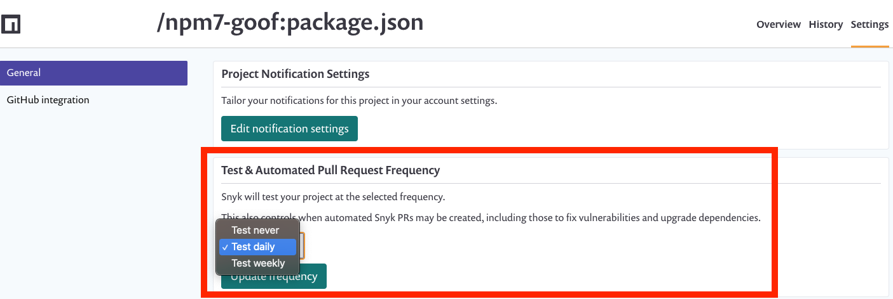
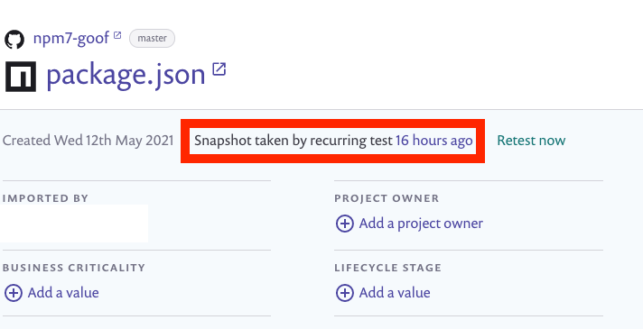
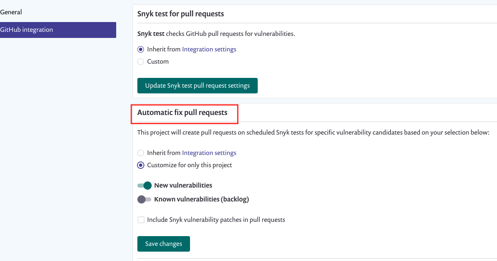

# Create automatic PRs for new fixes (Fix PRs)


**Feature availability**

* The **Automatic Fix PRs** feature is supported for the following SCM integrations: GitHub, GitHub Enterprise, GitHub Cloud App, Bitbucket Server, Bitbucket Cloud, Bitbucket Connect, GitLab, and Azure Repos.
* The **Automatic Fix PR** settings may vary depending on the integration.


The following rules are applied to the creation of automatic PRs for vulnerabilities:

* Pull requests are created based on the **Test & Automated Pull Request Frequency** notification setting.
* If you select **Retest now** for the Project, a scan runs manually. The 24-hour window is marked as having had the scan run. and no automatic PR is created until the next automated scan runs.
* One pull request is created per Project.
* If **either** the vulnerability is new and has a fix available **or** the fix is new and is not ignored, a Fix PR can be created.
* For known vulnerabilities, see [Configure Automatic Backlog PRs.](create-automatic-prs-for-backlog-issues-and-known-vulnerabilities-backlog-prs.md)&#x20;

<figure><figcaption>
Test &#x26; Automated Pull Request Frequency setting
</figcaption></figure>

To determine when your last 24-hour window began, check the Project issue card for **Snapshot taken by recurring test** and check your email for **\[snyk] Vulnerability alert** for specific scan results:

<figure><figcaption>
Snapshot taken by recurring test 16 hours ago
</figcaption></figure>

Pull requests for new vulnerabilities are enabled by default for new integrations.

See the [Git repository SCM integrations](../../../scm-ide-and-ci-cd-integrations/snyk-scm-integrations/) pages for details about supported integrations.

## Enable or disable pull requests for an integration

Follow these steps to enable pull requests at the global integration level:

1. Navigate to **Settings >** **Integrations**.
2. Select an SCM integration, for example, GitHub.
3. Enable **New vulnerabilities** and **Save.**

**Apply changes to all overridden Projects** will update all of the individual Project settings for **Automatic fix PRs**. If a Project previously had its own settings for automatic fix full requests, clicking the button will override the Project setting with the global setting.

<figure><figcaption>
Configure Automatic Fix PRs
</figcaption></figure>

## Enable or disable pull requests for a single Project

Enabling or disabling at a Project level will override the pull request setting for this single Project, so it will not inherit from the global integration setting.

1. Under **Projects,** select a Project and select **Settings**.
2. Select an SCM integration, for example, GitHub.
3. In the **Automatic fix pull requests** section:
   * Select **Customize for only this project**
   * Enable **New vulnerabilities**
   * Select **Save changes**

<figure><figcaption>
Automatic Fix pull requests settings at the project level
</figcaption></figure>
