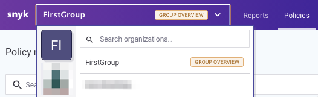
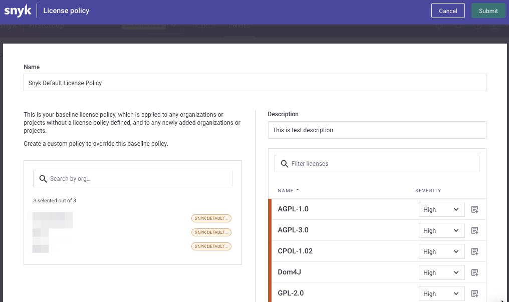

# Setting a license policy

Administrators can configure the following per license:

* The level of severity— values include None, Low, Medium and High.
  * When None is selected, instructions cannot be inserted since licenses marked with None will not appear in any Snyk test results.
  * New licenses added by Snyk will inherit the Unknown license type severity. In cases where this severity was not set to None, newly added licenses will appear in Snyk test results.
* Legal instructions for developers—enter free text to provide any necessary instructions for developers.
  * We recommend describing your company’s specific policy, explaining the need for collaboration from your developers as well as providing them step-by-step instructions if any are needed
  * Legal instructions will appear in the CLI results and on issue cards within the project view


**Feature availability**\
For customers with a Business plan: if no group is available, org administrators can make license policy changes; if a group is available, group administrators can make license policy changes. For customers with an Enterprise plan, group administrators can create or modify a policy. See [pricing plans](https://snyk.io/plans/) for more details.


## Assign rules and severities

1. From the Policy modal, click in the **Severity** box on the right hand side to set the severity for specific licenses
2. To enter an explanation and recommendations for fixes, click the **Instructions** icon and enter your text
   1. Click **Add** to save your changes to the instructions
   2. Once added, the **Add instructions** link becomes **Edit instructions**
3. Select **Submit** to save your policy.
4. The new severity and/or instructions are automatically updated on our servers. Once the next scheduled test runs, or once any user re-tests a project. Updated results are delivered according to these changes.

**Note:** _if your company's account has a group (or more), to access the License policy settings, go to the Group's Overview (from the top left dropdown) and go to **Policies** to select the organization(s) to update the Licenses policy._

