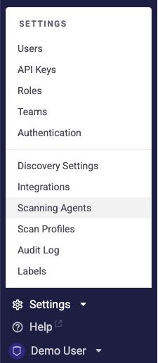
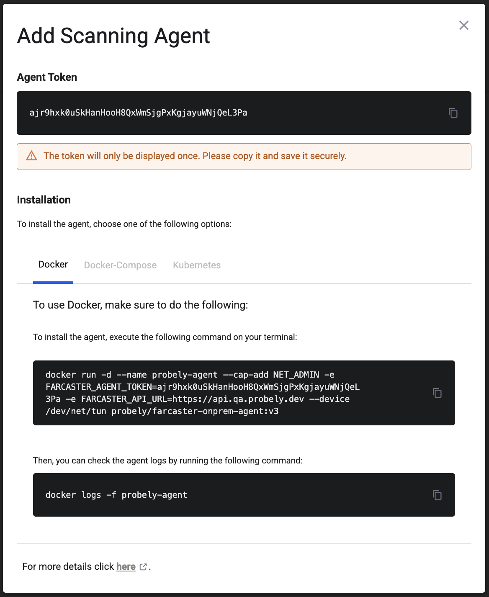
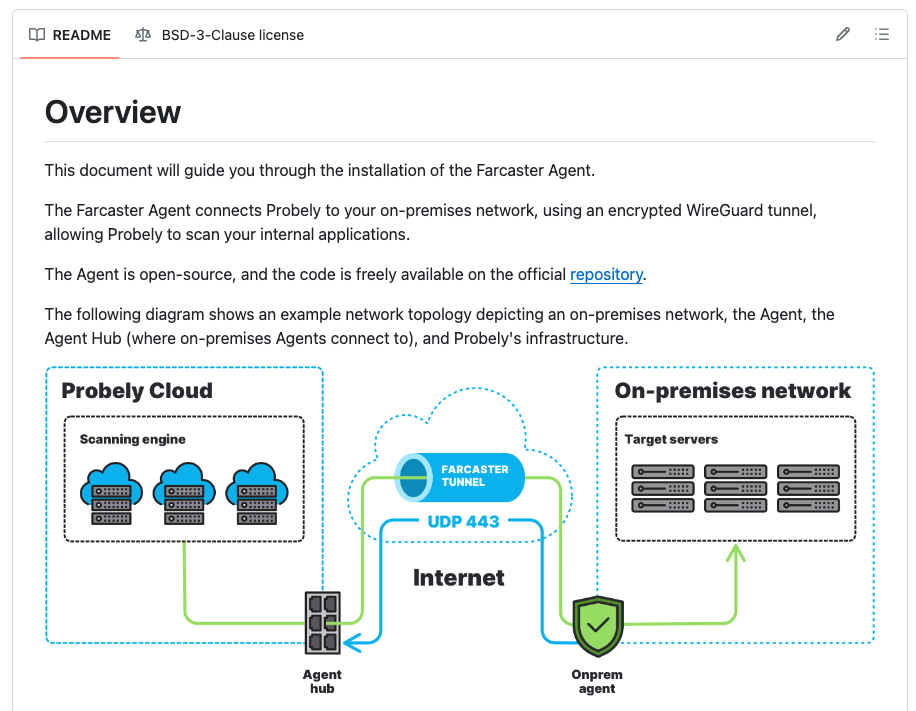

# How to install a Scanning Agent

Learn how to install Snyk API & Web Scanning Agent

The Scanning Agent allows scanning internal applications with a secure, clean, and easy-to-set-up solution to scan your non-public applications. You can learn more about the Scanning Agent in this article on [how to scan internal applications with a Scanning Agent](https://help.probely.com/en/articles/4615595-how-to-scan-internal-applications-with-a-scanning-agent).

Installing a Scanning Agent involves two steps:

1.  

    Create the Scanning Agent in Snyk API & Web.

    

2.  

    Install Snyk API & Web's Farcaster Agent on your network.

    

This article describes these steps in detail.

# Step 1: Create the Scanning Agent

This first step creates the Scanning Agent on the Snyk API & Web side:

1.  

    Open the **Settings** dropdown menu on the bottom-left corner of the navigation bar and click on **Scanning Agents**. If you do not see this option, contact your account owner.\
    ​

    

    

    

    

    

    

2.  

    Click on **ADD AGENT**.

    

    

    1.  

        Type the name of the Scanning Agent.

        

    2.  

        If the Scanning Agent is restricted to targets of some teams, tick the checkbox and select those teams from the dropdown. Learn [how to get started with Teams](https://help.probely.com/en/articles/6345396-how-to-get-started-with-teams).\
        ​

        

    

3.  

    Click on **GENERATE**.\
    ​

    

    

    

    

    

    

4.  

    A pop-up window is displayed with important information that, for security reasons, will not be visible again. So, you should do the following:

    

    

    

    

    1.  

        Under **Agent Token**, copy and save the token securely.\
        ​

        

    2.  

        Under **Installation**, go to the tabs for the way you want to install the agent:\
        ​

        

        

        1.  

            **DOCKER** - To use Docker, copy and save securely the following:

            

            

            1.  

                The Docker command to install the agent.

                

            2.  

                The Docker command to check the agent logs.\
                ​

                

            

        2.  

            **DOCKER-COMPOSE** - To use Docker-compose, copy and save securely the following:

            

            

            1.  

                The `docker-compose.yml` manifest for the agent.

                

            2.  

                The Docker-compose command to start the agent.\
                ​

                

            

        3.  

            **KUBERNETES** - To use Kubernetes, copy and save securely the following:

            

            

            1.  

                The Kubernetes command to create the Snyk API & Web namespace.

                

            2.  

                The Kubernetes command to create the agent token secret.

                

            3.  

                The Kubernetes command to deploy the agent pod.

                

            

            

            

        

    

# Step 2: Install Snyk API & Web's Farcaster Agent

In this step, you will install Snyk API & Web’s Farcaster Agent on your network. It is the piece that will allow connecting Snyk API & Web Cloud servers and your internal applications to perform scans. For that, read and follow <a href="https://github.com/Probely/farcaster-onprem-agent/" rel="nofollow noopener noreferrer" target="_blank">the instructions on GitHub</a> using the information you saved in Step 1. of this article.\
​

In any case, you can quickly install the Farcaster Agent by executing the following command in your terminal:

    docker run -d \ 
    --cap-add NET_ADMIN \ 
    --device /dev/net/tun \ 
    -e FARCASTER_AGENT_TOKEN=<YOUR_FARCASTER_AGENT_TOKEN> \ 
    probely/farcaster-onprem-agent:v3

In the command, replace **\<YOUR_FARCASTER_AGENT_TOKEN\>** with the token you generated and saved in Step 1.

After running this command, the container should be up and running. You just have to set the Scanning Agent in your targets (see the section **How to scan with a Scanning Agent?** in [this article](https://help.probely.com/en/articles/4615595-how-to-scan-internal-applications-with-a-scanning-agent)) and run scans on those targets to scan your internal applications.

Please don't hesitate to contact us with any questions about the Scanning Agent.

P.S.: Why the name Farcaster? Read about it in [Why is the Scanning Agent named Farcaster?](https://help.probely.com/en/articles/4615879-why-is-the-scanning-agent-named-farcaster)

Did this answer your question?

😞

😐

😃

- 
- 
- 

<a href="https://www.intercom.com/intercom-link?company=Snyk+API+%26+Web&amp;solution=customer-support&amp;utm_campaign=intercom-link&amp;utm_content=We+run+on+Intercom&amp;utm_medium=help-center&amp;utm_referrer=https%3A%2F%2Fhelp.probely.com%2Fen%2Farticles%2F6503388-how-to-install-a-scanning-agent&amp;utm_source=desktop-web" class="pl-2 align-middle no-underline">We run on Intercom</a>

