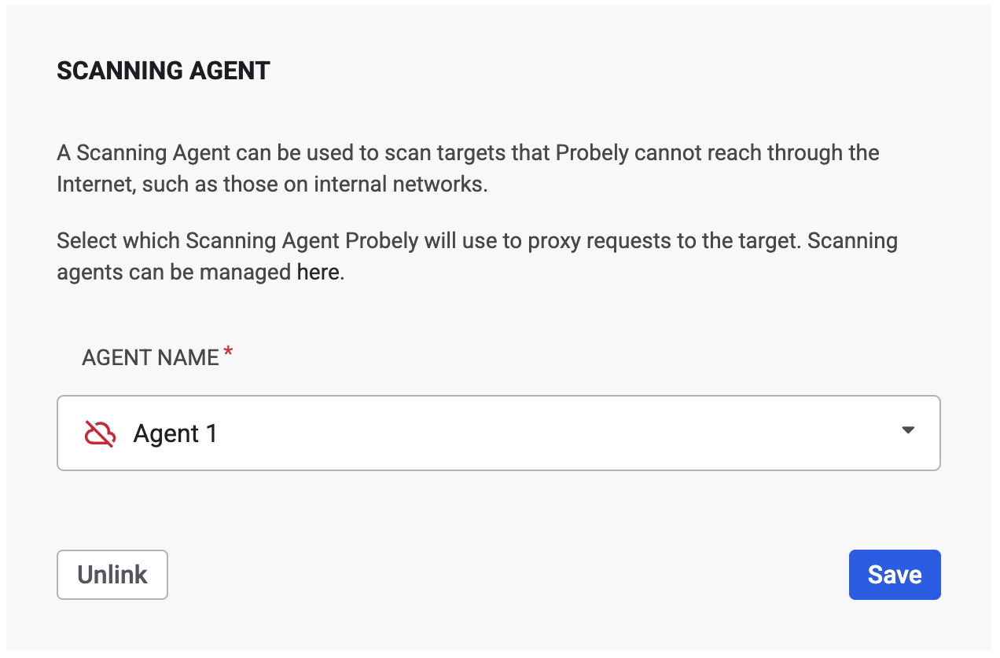
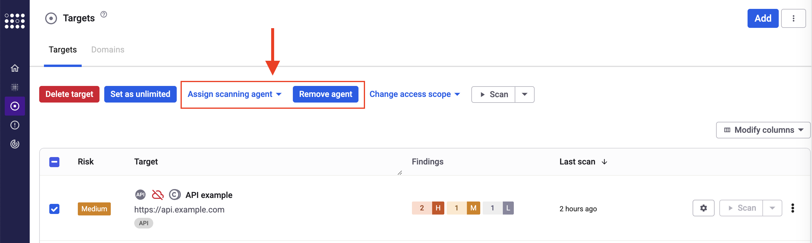

# How to scan internal applications with a Scanning Agent

Scan your internal applications with Snyk API & Web's Scanning Agent. A secure, clean, and easy-to-set-up solution to scan non-public applications.

This article overviews what a Scanning Agent is, how it works, and how to install and scan with it.

# What is a Scanning Agent for?

Snyk API & Web's Scanning Agent allows you to scan internal applications for vulnerabilities without exposing them to the Internet or even to our IP addresses. It is the ideal approach to scan any application that is only reachable from within your network, including development/staging/pre-release and/or internal production applications that support your business.

You can use a single Scanning Agent to scan multiple internal targets, but you can also have different Scanning Agents, each one reaching a part of your network. There is no need for a single Scanning Agent to connect to the whole network.

# How does a Scanning Agent work?

A Scanning Agent creates an encrypted and authenticated tunnel where traffic flows securely between Snyk API & Web and your network.

To make sure we meet your security expectations, we follow a set of principles:

- 

  All code is open source and <a href="https://github.com/Probely/farcaster-onprem-agent/" rel="nofollow noopener noreferrer" target="_blank">publicly available</a>.

  

- 

  You have complete control over the Scanning Agent, including the right to change it.

  

- 

  Snyk API & Web cannot access the Scanning Agent.

  

- 

  The Scanning Agent runs in containers with the least required privileges.

  

- 

  All traffic is encrypted end-to-end.

  

- 

  The Scanning Agent does not open any network port.

  

# How to install a Scanning Agent?

To install a Scanning Agent, refer to this article on [how to install a Scanning Agent](https://help.probely.com/en/articles/6503388-how-to-install-a-scanning-agent) and the installation reference and source code for the installer available at <a href="https://github.com/Probely/farcaster-onprem-agent/" rel="nofollow noopener noreferrer" target="_blank">Snyk API &amp; Web's GitHub repositories</a>.

# How to scan a target with a Scanning Agent?

When a Scanning Agent is configured and running, you must choose which targets will use it:

1.  

    In the <a href="https://plus.probely.app/" rel="nofollow noopener noreferrer" target="_blank">Snyk API &amp; Web app</a>, go to the **Targets** menu.

    

2.  

    Identify the target in the list for which you want to set the Scanning Agent and click on the cogwheel to open its settings.

    

3.  

    Under the **Scanner** tab, go to the **SCANNING AGENT** section and select the Scanning Agent you want to use.

    

4.  

    Click **Save**.

    

Clicking **Unlink** removes the Scanning Agent for the target.

You can also assign/remove a Scanning Agent to/from multiple targets in the targets list. Select the targets you want to configure, and the options will appear:

As the image above shows, targets configured to use a Scanning Agent will show a cloud icon.

# What are the statuses of a Scanning Agent?

A Scanning Agent can have one of the following statuses:

<table>
<colgroup>
<col style="width: 50%" />
<col style="width: 50%" />
</colgroup>
<tbody>
<tr>
<td style="background-color: #e8e8e880">

<strong>Status</strong>

</td>
<td style="background-color: #e8e8e880">

<strong>Description</strong>

</td>
</tr>
<tr>
<td>

 Connected

</td>
<td>

The scanning agent is connected. It was working in the last 180 seconds.

</td>
</tr>
<tr>
<td>

 Connected with issues

</td>
<td>

The scanning agent is connected, but it may have poor network performance if it uses, for example, an HTTP proxy or a direct TCP connection to Snyk API &amp; Web.

For more information, see this article about the <a href="https://web.archive.org/web/20220103191127/http://sites.inka.de/bigred/devel/tcp-tcp.html" rel="nofollow noopener noreferrer" target="_blank">TCP Meltdown</a> problem and check the documentation on <a href="https://github.com/Probely/farcaster-onprem-agent?tab=readme-ov-file#launch-the-agent" rel="nofollow noopener noreferrer" target="_blank">launching the agent</a>.

</td>
</tr>
<tr>
<td>

 Disconnected

</td>
<td>

The scanning agent is disconnected, maybe due to misconfiguration.

Check the scanning agent configuration or the firewall rules, for example.

For more information, check the <a href="https://github.com/Probely/farcaster-onprem-agent?tab=readme-ov-file#installation" rel="nofollow noopener noreferrer" target="_blank">Installation</a> and <a href="https://github.com/Probely/farcaster-onprem-agent?tab=readme-ov-file#network-requirements" rel="nofollow noopener noreferrer" target="_blank">Network Requirements</a> documentation.

</td>
</tr>
</tbody>
</table>

If you still need help, don't hesitate to message us or send us an email to <a href="/cdn-cgi/l/email-protection#0f7c7a7f7f607d7b4f7f7d606d6a6376216c6062" rel="nofollow noopener noreferrer" target="_blank">[email protected]</a>.

P.S.: Why is the Scanning Agent named Farcaster? Learn more about it [here](https://help.probely.com/en/articles/4615879-why-is-the-scanning-agent-named-farcaster).

Did this answer your question?

😞

😐

😃

- 
- 
- 

<a href="https://www.intercom.com/intercom-link?company=Snyk+API+%26+Web&amp;solution=customer-support&amp;utm_campaign=intercom-link&amp;utm_content=We+run+on+Intercom&amp;utm_medium=help-center&amp;utm_referrer=https%3A%2F%2Fhelp.probely.com%2Fen%2Farticles%2F4615595-how-to-scan-internal-applications-with-a-scanning-agent&amp;utm_source=desktop-web" class="pl-2 align-middle no-underline">We run on Intercom</a>

