# Getting Started with Snyk API & Web

New to Snyk API & Web? Follow this short tutorial to start scanning a web app and find its security vulnerabilities.

Welcome to Snyk API & Web!

In this getting started, you will be guided through all the steps needed to start using Snyk API & Web to scan a web app for security vulnerabilities.

In a nutshell, you will do the following steps:

1.  

    Sign up to Snyk API & Web.

    

2.  

    Follow the onboarding flow.

    

3.  

    Check the scan coverage.

    

4.  

    Check the findings.

    

Let’s see these steps in detail.

# Step 1: Sign up to Snyk API & Web

First of all, you need to sign up to create an account in Probely:

1.  

    Open your browser, go to <a href="https://www.probely.com" rel="nofollow noopener noreferrer" target="_blank">https://probely.com</a>, and click on **Sign up** on the homepage.\
    ​

    

    

    <a href="https://downloads.intercomcdn.com/i/o/r3ylwg3q/1480042828/7c988436588394d785f909d3c89c/hp.png?expires=1769985000&amp;signature=adc9ff5904dcb255ac7cc611dc196d56a6be33ae8fb025a4e94be5ec4ec5f15d&amp;req=dSQvFsl6n4ldUfMW1HO4zWkC435O68b5G7PFSIqDU2%2BauYcDidemnw0RJq42%0AX78F%0A" target="_blank" rel="noreferrer nofollow noopener">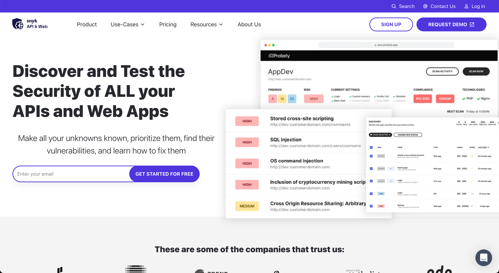</a>

    

    

    

2.  

    Type in your email and click on **Sign up**.\
    ​

    

    

    <a href="https://downloads.intercomcdn.com/i/o/r3ylwg3q/1480042944/b35d3501465131954411619f329a/signup1.png?expires=1769985000&amp;signature=1456640985ee64af4baa562f335a70b26ef71f9c89592dc5ef9c2ea14874cc7c&amp;req=dSQvFsl6n4hbXfMW1HO4zTMkNUIxvJjkzwz48cAv3qOopUUYoGkBvpLUR6TI%0A9mW1%0A" target="_blank" rel="noreferrer nofollow noopener">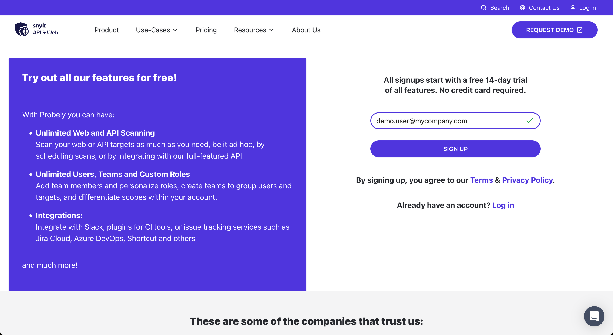</a>

    

    

    

3.  

    You will receive a verification email. Click on **Verify email**.\
    ​

    

    

    <a href="https://downloads.intercomcdn.com/i/o/r3ylwg3q/1480034843/1b25b66fef25899d8ef32bf7f57a/welcome.png?expires=1769985000&amp;signature=3c3fe0d4c7247e88c1d562d3bfdd8eb0bb233e8474d85b1f287605ebb4ea661e&amp;req=dSQvFsl9mYlbWvMW1HO4zZdQqB6vrazmJzpMiioM%2FtgH%2Bdl1N3htc%2Fu27DFj%0Ai7MS%0A" target="_blank" rel="noreferrer nofollow noopener">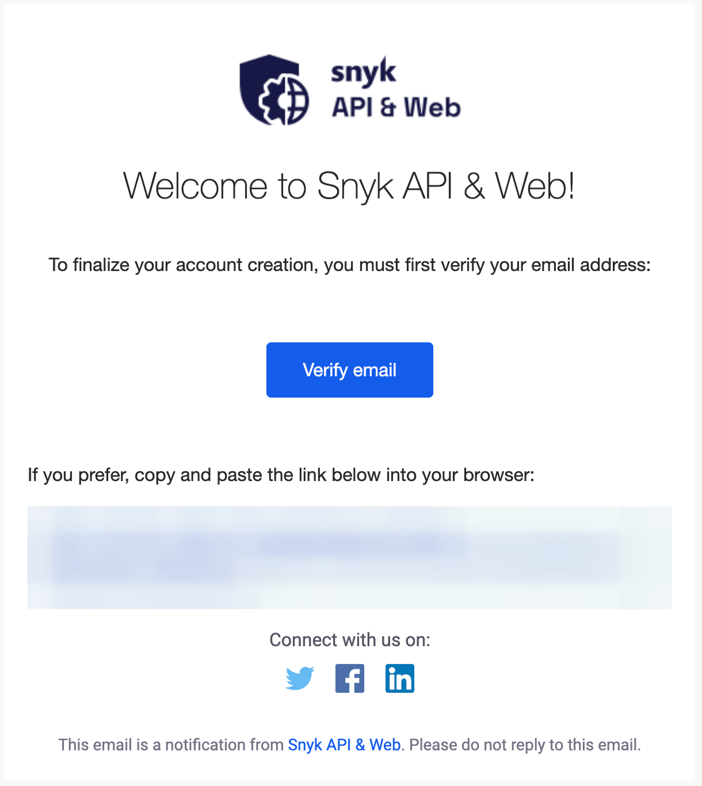</a>

    

    

    

4.  

    Fill out the form and click on **Create account**.

    

<a href="https://downloads.intercomcdn.com/i/o/r3ylwg3q/1347277322/16c097b4b60551e416d728dd5ad4/Screenshot+2025-01-22+at+21_00_07.png?expires=1769985000&amp;signature=3e11e09cd66237e2b0f2d8269156df089029d8a91b771887843bb201f1dc99a5&amp;req=dSMjEct5moJdW%2FMW1HO4zW%2Fk%2FSSUs9cnk%2BywXYNnYKYSDShTSivHpQYKrU5G%0AD9ieLdOcTTrd3T8GOxs%3D%0A" target="_blank" rel="noreferrer nofollow noopener">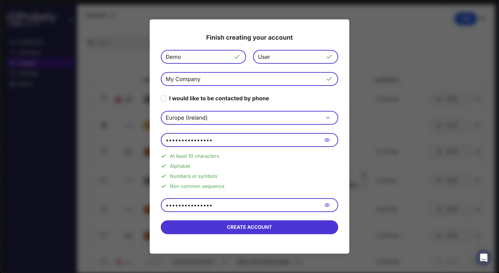</a>

\
And your account is created! Follow on to the next step to start scanning a target.​

# Step 2: Follow the onboarding flow

Once your account is created, you will see some <a href="https://intercom.help/probely/en/articles/10272968-best-practices-for-deploying-dast" rel="nofollow noopener noreferrer" target="_blank">best practices for deploying DAST</a>, and then land on Snyk API & Web's welcome flow:

1.  

    Click on **Next**.

    

    

    <a href="https://downloads.intercomcdn.com/i/o/r3ylwg3q/1476872345/7693ff410823a2ca297bd4066156/login_trial_screen_NEW.png?expires=1769985000&amp;signature=eb9a0df4a6dc3c948234c3c638adcd6d5d622271f444255c45c71bc6c061e01b&amp;req=dSQgEMF5n4JbXPMW1HO4zXyVWuT8V6etElGpgINCKh1FAR6Kivj8p7JDndsZ%0AxCa1%0A" target="_blank" rel="noreferrer nofollow noopener">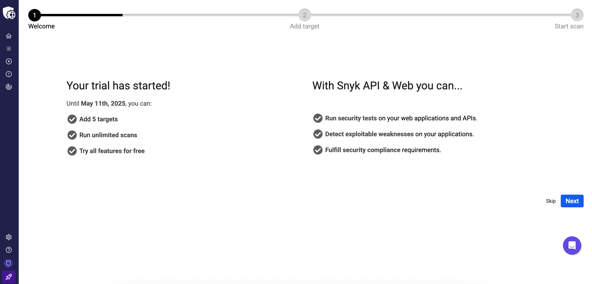</a>

    

    

    \
    ​

    

2.  

    Select **My own target**, and click on **Next**.

    

    

    <a href="https://downloads.intercomcdn.com/i/o/r3ylwg3q/1470575693/ab46f8b943314630a1a7750e6c0c/My_own_target_new.png?expires=1769985000&amp;signature=d07a033991cd67202ac0a849bc394d3ff15471331aa79ee2684f8c3ea3041b25&amp;req=dSQgFsx5mIdWWvMW1HO4zQkwXbsCNMhYM8W7uwTx6C0WyAw%2BRKrr3gYYw63k%0AwD0V%0A" target="_blank" rel="noreferrer nofollow noopener">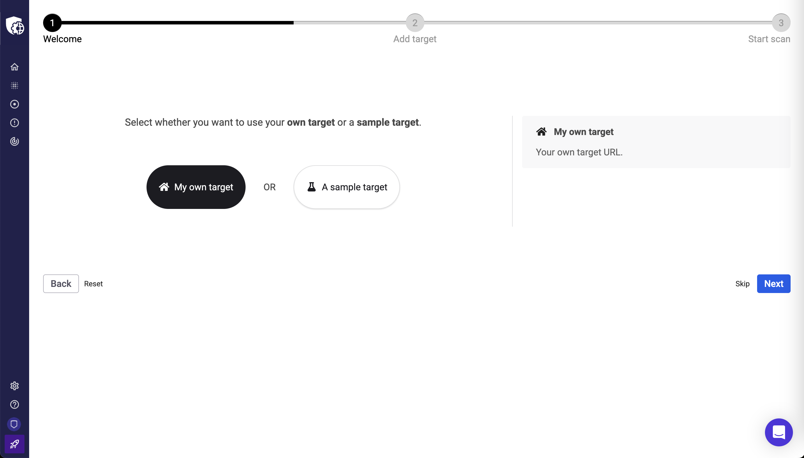</a>

    

    

    

3.  

    Select **Web**, and click on **Next**.\
    ​

    

    

    <a href="https://downloads.intercomcdn.com/i/o/r3ylwg3q/1470580379/f145bd0bae38da675d22cd0d0e69/web_new.png?expires=1769985000&amp;signature=e4c372d92a694a8d0c7824474f6a809f307233005211d93d8c926ff831ce8e4f&amp;req=dSQgFsx2nYJYUPMW1HO4zUSDQlvYzIl3KbHKzwZB5VthLRgXsfPPa%2FjeiQkL%0ACZQE%0A" target="_blank" rel="noreferrer nofollow noopener">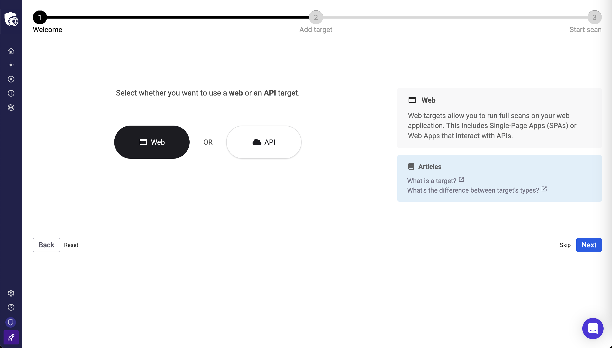</a>

    

    

    

4.  

    Add your first target and click on **Next**.\
    ​\
    In this case, the target information is:

    

    

    1.  

        **Target name**: Example

        

    2.  

        **Target URL**: <a href="https://example.com" rel="nofollow noopener noreferrer" target="_blank">https://example.com</a>

        

    

    

    

    

    When adding your own target, we need to make sure you have ownership over your domain so that scan requests are not interpreted as malicious attacks. Whenever possible, this verification happens automatically; when that is not viable, you must prove ownership of your domain. In this case, the onboarding flow provides an extra step that guides you through that process.

    

    

    <a href="https://downloads.intercomcdn.com/i/o/r3ylwg3q/1470576545/843ad0a91b0e00239bc0e82cd547/prove_ownership_new.png?expires=1769985000&amp;signature=ca198e906e39cac39a1ee5c1e865dd30068f6ddec57a8cfbfbb215da4c75d769&amp;req=dSQgFsx5m4RbXPMW1HO4zTrXliQ5CjuPTOMQkpc0%2FNXGHpsujg6fZ9ntn6fP%0A5WYS%0A" target="_blank" rel="noreferrer nofollow noopener">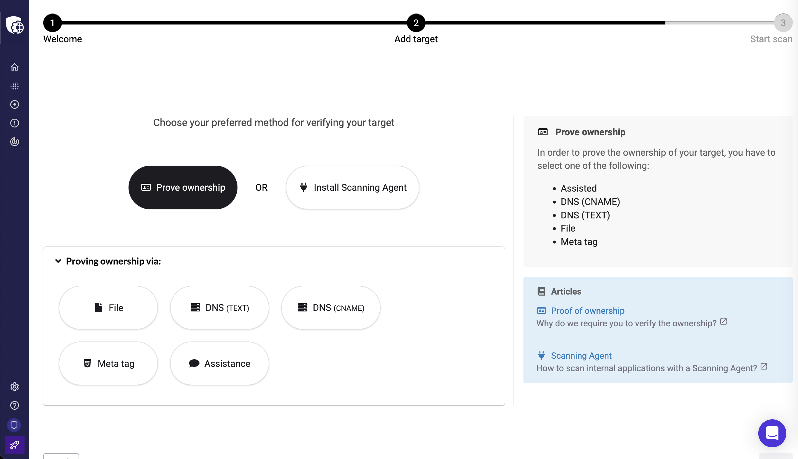</a>

    

    

    

    

    Alternatively, you can install a scanning agent to allow us to reach your target (the onboarding flow will also help you with that).

    

    

    <a href="https://downloads.intercomcdn.com/i/o/r3ylwg3q/1470582450/b5d3e62740cb85fe651d236d70ab/install_scanning_agent_NEW.png?expires=1769985000&amp;signature=e0e5bbca4820cebac2cc0f1d1349d7f315b2814c0a5049104d24fdeb63719eee&amp;req=dSQgFsx2n4VaWfMW1HO4zSyXCc6KE%2F3yUVU7%2F5cPu20gQdLaEouCBnGOXQBb%0AFg2f%0A" target="_blank" rel="noreferrer nofollow noopener">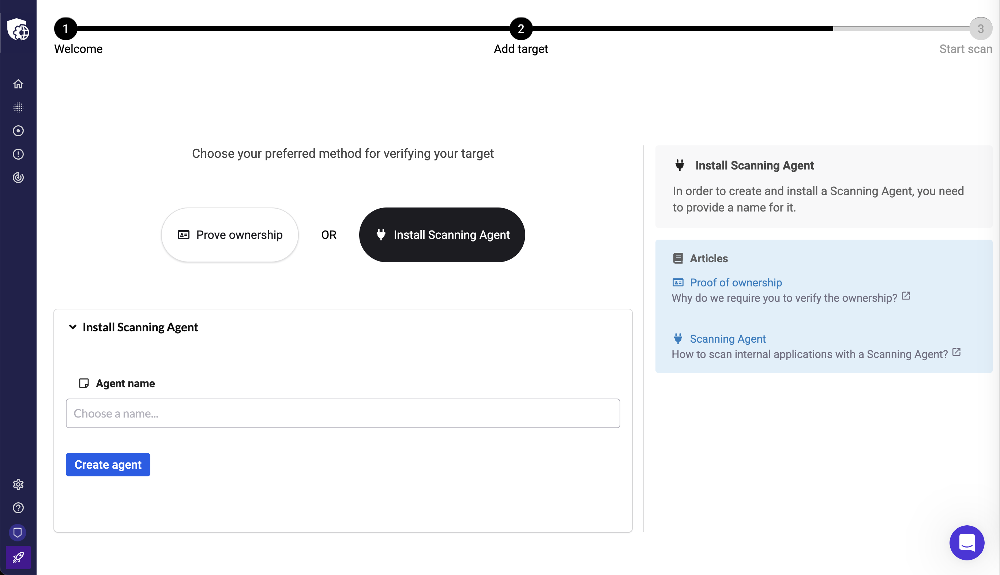</a>

    

    

    \
    ​

    

    

    Once done, click on **Next**.\
    ​

    

5.  

    Click on **Scan** to start scanning your target.

    

    

    <a href="https://downloads.intercomcdn.com/i/o/r3ylwg3q/1470597473/601f40633ce53244b9cb471dc58e/scan_settings_NEW.png?expires=1769985000&amp;signature=5251c64f47ed2bd79650062f0980544939f8a657a1c35613a9b84d8a8f60dfe9&amp;req=dSQgFsx3moVYWvMW1HO4zfx6EtwMOQzI9aiCXvVlPPvl5jJXqq92bosV0f7t%0Asy8U%0A" target="_blank" rel="noreferrer nofollow noopener">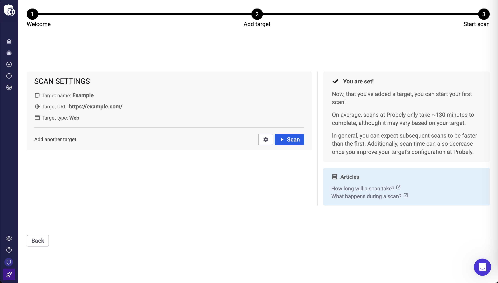</a>

    

    

    

At this point, you should have a success page.

<a href="https://downloads.intercomcdn.com/i/o/r3ylwg3q/1485863713/f9a8ab24da3093885bd8fae78ae3/scan_success.png?expires=1769985000&amp;signature=39a9d22da25d595716b83e7e31313d8a02d043f90a5860a1d529d96f52f86b6c&amp;req=dSQvE8F4noZeWvMW1HO4zQW%2F6Kfs1s0UshjGpZqPaeEZWFCIZgW7kY4pQOlB%0AQEK8Wc2FjKDQXjN%2FePk%3D%0A" target="_blank" rel="noreferrer nofollow noopener">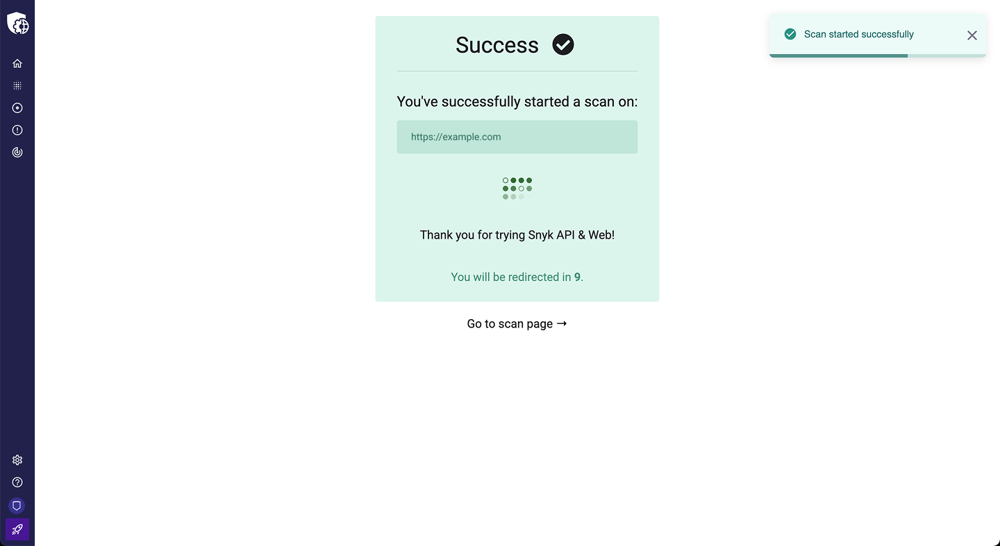</a>

# Step 3: Check the scan coverage

The previous page redirects you to the target’s **Scan results** page, where you can follow the evolution of the scan.

<a href="https://downloads.intercomcdn.com/i/o/r3ylwg3q/1476880762/880a899d2afd4fe44f4b1b151a87/evolution_of_scan_NEW.png?expires=1769985000&amp;signature=0e7c8babce96e826a4175c6f24ef358866b925992ad66981916d8e05e7b946f8&amp;req=dSQgEMF2nYZZW%2FMW1HO4zSdFQx1tIEvN3GSpHmZJwrfDqPrgBjVEitlhFub%2B%0Atk4K9iYvGfLww4WVXHM%3D%0A" target="_blank" rel="noreferrer nofollow noopener">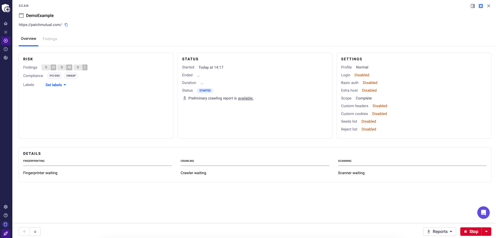</a>

You can download the **Preliminary crawling report** during the scan to take a look at the scan coverage thus far; once the scan ends, you can download the complete **Crawling report**.

In this report, you can check the URLs reached and compare them with what you expected for your application. You can also check the obtained HTTP response codes for each URL to spot any issues.

<a href="https://downloads.intercomcdn.com/i/o/r3ylwg3q/1347269895/bd62e662df91dd2831d9c9faedc7/Screenshot+2025-01-22+at+20_55_10.png?expires=1769985000&amp;signature=5ed850de444d01fb0bc16c4f5400ca302d62677a0110c62351a036d01d7ce6bb&amp;req=dSMjEct4lIlWXPMW1HO4zYwZ5pQ5E6Zh%2BZ9rUuPhd9UzwBBqGlDi%2FTfuJxYs%0A2B%2F6qHi83aNECrQrIKg%3D%0A" target="_blank" rel="noreferrer nofollow noopener">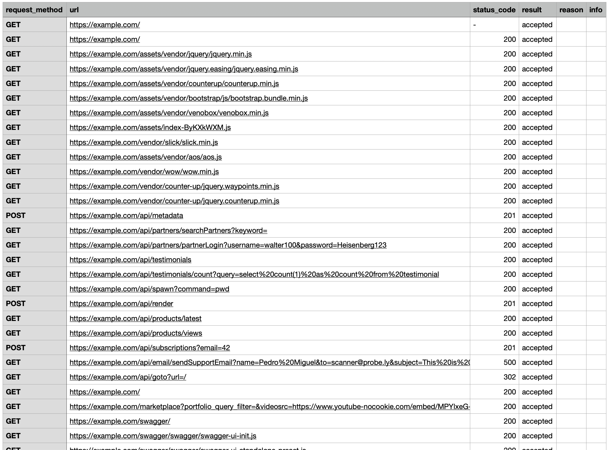</a>

# Step 4: Check the findings

On the **Scan results** page, scroll down to see the list of findings. These are the security vulnerabilities identified during the target scan.

<a href="https://downloads.intercomcdn.com/i/o/r3ylwg3q/1470611231/1319203fa39aa69de769db5b8a79/check_res_NEW.png?expires=1769985000&amp;signature=d3342e28f3ded067d4245bc0ab0cce14995cbe1caced870217c02721e6feb57c&amp;req=dSQgFs9%2FnINcWPMW1HO4zQDPnFcgKpUy6vz5pklOWnxkG8RRfzv7yEJ%2FDNMG%0AjsqeSLHaHxURu0wVob8%3D%0A" target="_blank" rel="noreferrer nofollow noopener">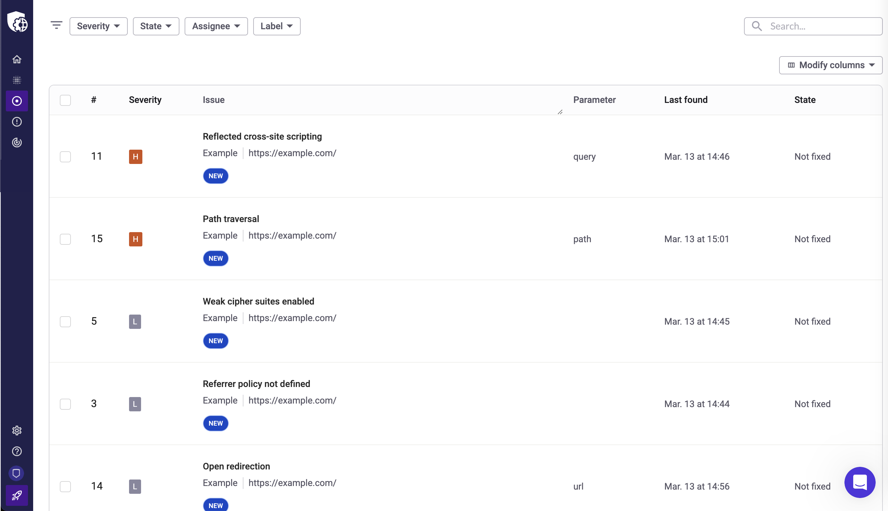</a>

You can click on each finding to learn its details, such as the CVSS score, the definition of the vulnerability, how to fix it, etc. This information will help you better understand the context of each finding so that you can take action accordingly.

<a href="https://downloads.intercomcdn.com/i/o/r3ylwg3q/1476884029/05639ce596a25524f6a803336027/example_finding_NEW.png?expires=1769985000&amp;signature=d3bb78e88e277bf8b80294b3de5292cb0f5a55bfa695417a0dbd5fcdc2963a8b&amp;req=dSQgEMF2mYFdUPMW1HO4zcNwHy7IZ0vYKWE466hr1KrKVLfnfJiWEBA%2Bojec%0A7HIiVYcayAWX6he2IT4%3D%0A" target="_blank" rel="noreferrer nofollow noopener">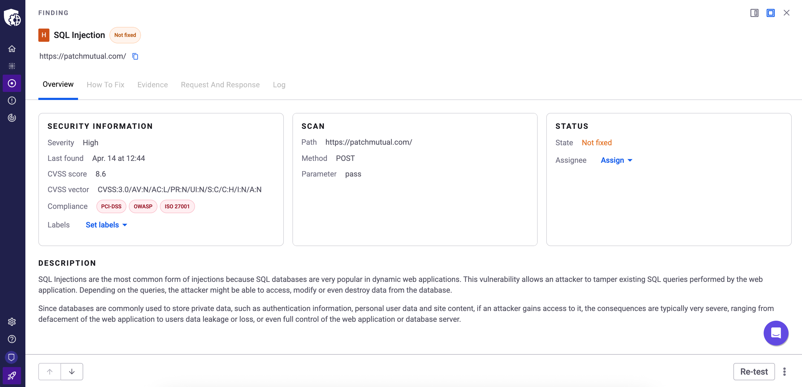</a>

And that’s it!

With these simple steps, you can already assess your applications' security, identify where the vulnerabilities are, and understand and plan your work to secure your applications.

To learn more, start with this article in the Help Center about [Targets from A to Z](https://help.probely.com/en/articles/6600796-targets-from-a-to-z). Then, explore Snyk API & Web features to become more efficient and effective with your security scans.

Did this answer your question?

😞

😐

😃

- 
- 
- 

<a href="https://www.intercom.com/intercom-link?company=Snyk+API+%26+Web&amp;solution=customer-support&amp;utm_campaign=intercom-link&amp;utm_content=We+run+on+Intercom&amp;utm_medium=help-center&amp;utm_referrer=https%3A%2F%2Fhelp.probely.com%2Fen%2Farticles%2F9385585-getting-started-with-snyk-api-web&amp;utm_source=desktop-web" class="pl-2 align-middle no-underline">We run on Intercom</a>

