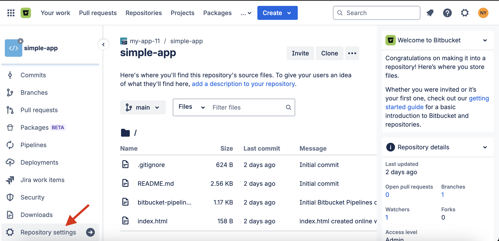
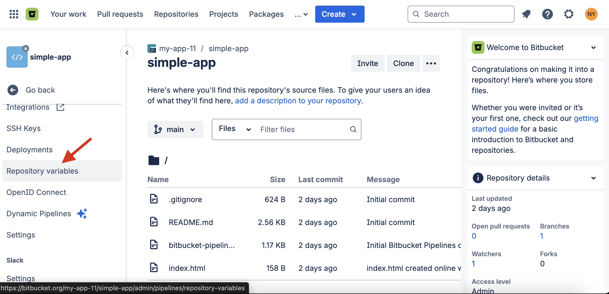
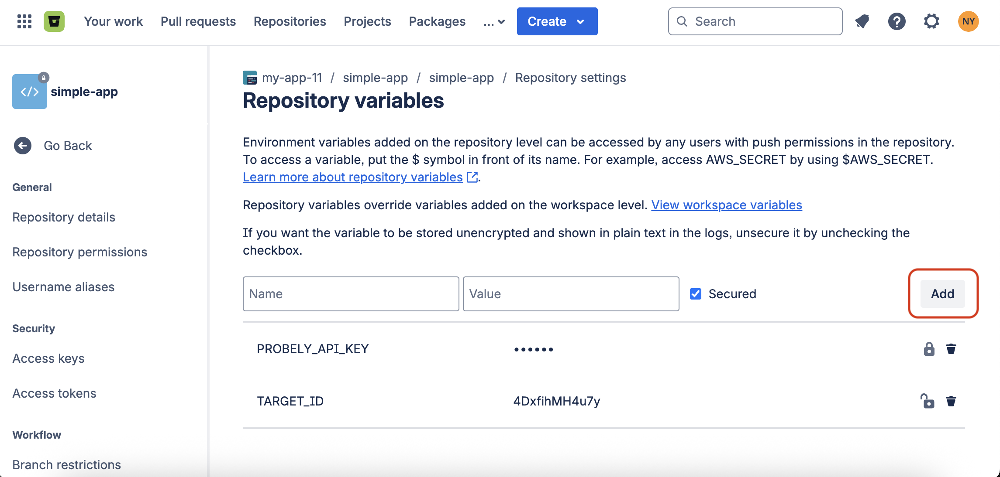
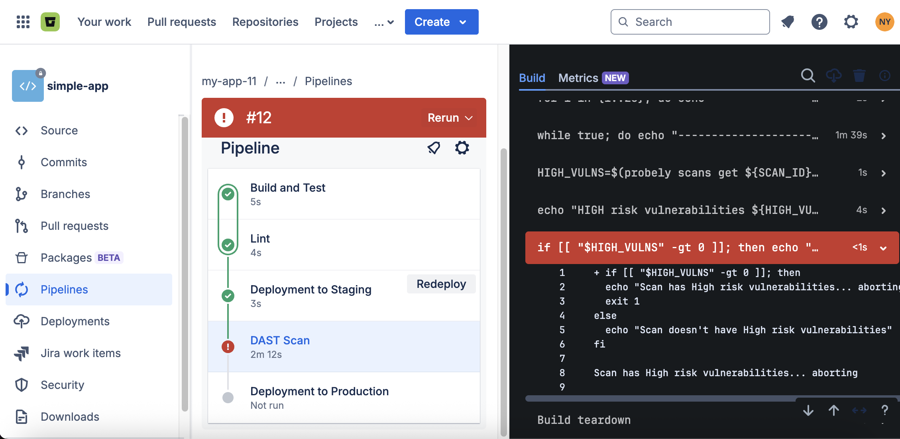

# Integrate Snyk API & Web with Bitbucket Pipelines

This guide provides step-by-step instructions for integrating Snyk API & Web into your Bitbucket Pipelines.

C

This guide focuses on using the Snyk API & Web CLI to run scans. The examples below cover a complete end-to-end journey, from configuring your targets in the Snyk API & Web UI to running different scan scenarios in your pipeline.

# **Prerequisites**

Before you begin, you must configure your scan targets and credentials in the Snyk API & Web application.

## **Create a target in Snyk API & Web**

In the Snyk API & Web app, go to the Targets menu and click the **Add** button. Fill out the form and click **Add** to create the new target.

**Note:** During this process, we check for connectivity. If your target is internal or not yet deployed, you can bypass any warnings and add the target regardless. For more details, see [How to add a Target](https://help.probely.com/en/articles/5733114-how-to-add-a-target).

Before configuring the integration in Bitbucket Pipelines, make sure to retrieve the unique target ID from Snyk API & Web.

1.  

    In your Snyk API & Web dashboard, select **Targets**.

    

2.  

    From the target list, select the target you want to integrate.

    

3.  

    In your browser's address bar, copy the target ID. This is the string of characters immediately following /target/ in the URL.

    

**Note:** After creating a target, it is mandatory to verify your target’s domain. Otherwise, your scans are only limited to lightning scans. To learn more, see our documentation about the [importance of domain ownership verification](https://help.probely.com/en/articles/3285602-why-do-we-require-you-to-verify-the-ownership-of-a-domain).

## **Create a Snyk API & Web API key**

You need an API key with permissions to start a scan on your target. For instructions, see [How to generate an API key](https://help.probely.com/en/articles/8592281-how-to-generate-an-api-key).

# **Step 1: Add your API key and target ID to Bitbucket Pipelines**

To run a scan, your pipeline needs to authenticate with Snyk API & Web and know which target to scan. You must configure your Snyk API & Web API Key and target ID as secure repository variables in your Bitbucket Pipelines project.

1.  

    From your Bitbucket Pipelines project side menu, navigate to **Repository settings \> Repository variables**.\
    ​

    

    

    

    

    

    \
    ​

    

    

    

    

    

    

2.  

    Click **Add** and create an entry for your Snyk API & Web **API Key**, for example, **PROBELY_API_KEY**.\
    ​

    

    

    

    

    

    

3.  

    Click **Add** again to create a second entry for your **target ID**, for example, **TARGET_ID**.

    

**Important:** For enhanced security, always store sensitive values as Bitbucket <a href="https://docs.gitlab.com/ci/variables/#define-a-cicd-variable-in-the-ui" target="_blank" rel="nofollow noopener noreferrer">CI/CD variables</a>. Storing variables directly in your bitbucket-pipelines.yml file is not recommended, as they are saved in plain text and visible to anyone who can view the file.

# **Step 2: Configure your pipeline**

Create a `bitbucket-pipelines.yml` file at the root of your repository and add one of the following code examples based on your use case. You can also find all of them in our <a href="https://github.com/Probely/cicd-pipeline-scan-examples/tree/main/cicd-examples/bitbucket" target="_blank" rel="nofollow noopener noreferrer">Snyk API &amp; Web CI/CD examples repository on GitLab</a>.

## **Important note on these examples**

The YAML configurations below are scanning steps designed to be incorporated into your existing `bitbucket-pipelines.yml` file.

For example, your pipeline might already have steps to build your code, deploy to a QA environment, and run automated tests. You can add the Snyk API & Web scan as another step at any point that makes sense for your workflow, such as after you deploy to QA or staging.

## **Run a scan on a target in non-blocking mode**

This is the simplest configuration. It uses the Snyk API & Web CLI to run a scan on a remote target and does not wait for the scan to finish, allowing the pipeline to complete quickly.

    # bitbucket-remote-app-non-blocking-mode.yaml
    image: ubuntu:latest

    pipelines:
      branches:
        main:
          - step:
              name: Install Snyk API & Web CLI and start a Scan
              caches:
                - pip
              script:
                - apt-get update && apt-get install -y python3-pip python3-venv jq
                - python3 -m venv venv
                - source ./venv/bin/activate
                - pip install probely # install Snyk API & Web CLI
                - probely targets get --api-key $PROBELY_API_KEY
                
                - |
                  echo "Starting Scan..."
                  for i in {1..20}; do
                    echo "-----------------------------------"
                    SCAN_ID=$(probely targets start-scan ${TARGET_ID} -o IDS_ONLY --api-key $PROBELY_API_KEY)
                    echo ${SCAN_ID}
                    if [ -z "${SCAN_ID}" ]; then
                      echo "Scan didn't start... Retry start-scan"
                    else
                      echo "Scan started with SCAN ID: ${SCAN_ID}"
                      break
                    fi
                    sleep 5
                  done
                  if [ -z "$SCAN_ID" ]; then
                    echo "No Scan ID, aborting..."
                    exit 1
                  fi
              services:
                -docker

## **Run a scan on a target in blocking mode**

This configuration starts a scan and then polls the results, failing the pipeline if any high-severity vulnerabilities are found.

    # bitbucket-remote-app-blocking-mode.yaml
    image: ubuntu:latest

    pipelines:
      branches:
        main:
          - step:
              name: Install Snyk API & Web CLI, Scan and wait for scan to complete
              caches:
                - pip
              script:
                - apt-get update && apt-get install -y python3-pip python3-venv jq
                - python3 -m venv venv
                - source ./venv/bin/activate
                - pip install probely # install Snyk API & Web CLI
                - probely targets get --api-key $PROBELY_API_KEY
                
                - |
                  echo "Starting Scan..."
                  for i in {1..20}; do
                    echo "-----------------------------------"
                    SCAN_ID=$(probely targets start-scan ${TARGET_ID} -o IDS_ONLY --api-key $PROBELY_API_KEY)
                    echo ${SCAN_ID}
                    if [ -z "${SCAN_ID}" ]; then
                      echo "Scan didn't start... Retry start-scan"
                    else
                      echo "Scan started with SCAN ID: ${SCAN_ID}"
                      break
                    fi
                    sleep 5
                  done
                  if [ -z "$SCAN_ID" ]; then
                    echo "No Scan ID, aborting..."
                    exit 1
                  fi
                
                - |
                  echo "Waiting for scan to complete..."
                  while true; do
                    echo "-----------------------------------"
                    SCAN_OUTPUT=$(probely scans get ${SCAN_ID} --api-key $PROBELY_API_KEY | tail -1)
                    echo ${SCAN_OUTPUT}
                    echo "-----------------------------------"
                    SCAN_STATUS=$(probely scans get ${SCAN_ID} --api-key $PROBELY_API_KEY -o JSON | jq -r '.status')
                    if [ "$SCAN_STATUS" == "started" ] || [ "$SCAN_STATUS" == "queued" ]; then
                      echo "Scan is running or queued!"
                    else
                      echo "Scan is completed."
                      break
                    fi
                    sleep 30
                  done
                
                # Optional logic - abort the pipeline if there are any HIGH risk vulnerabilities.
                - HIGH_VULNS=$(probely scans get $SCAN_ID --api-key $PROBELY_API_KEY -o JSON | jq -r '.highs')
                - echo "HIGH risk vulnerabilities ${HIGH_VULNS}"
                - |
                  if [[ "$HIGH_VULNS" -gt 0 ]]; then
                    echo "Scan has High risk vulnerabilities... aborting"
                    exit 1
                  else
                    echo "Scan doesn't have High risk vulnerabilities"
                  fi
              services:
                -docker

## **Run a scan on an ephemeral (dynamic) target in blocking mode**

This is a more advanced configuration for building, deploying, and scanning an application in a temporary environment that is created for a specific purpose and then automatically destroyed during the pipeline run.

Using ephemeral environments requires agent token, target hostname and target URL. We recommend storing them as variables for better security.

You also need to create a scanning agent in Snyk API & Web and configure your target to use it. This process requires the `scanning-agent/farcasterd-linux-amd64-0.4.3` file. For detailed instructions, see <a href="../agents/install-a-scanning-agent.md" rel="nofollow noopener noreferrer">How to install a Scanning Agent</a> and <a href="../agents/scan-internal-apps-with-agent.md" rel="nofollow noopener noreferrer">How to scan internal applications</a>.

**Note:** In this code example, Docker is used to create ephemeral environments. However, you can use any other solution to create your environment.

    # bitbucket-ephemeral-app-blocking-mode.yaml
    pipelines:
      default:
        - step:
            name: Build and Test App
            image: python:3.9-slim-buster  # Use a Python image (Debian-based)
            services:
              - docker
            script:
              - apt-get update && apt-get install -y curl jq psmisc coreutils iputils-ping
              - pip3 install probely

              - export DOCKER_HOST=tcp://localhost:2375
              - docker network create custom-network
              - docker build -t test-app .
              - docker run --name test-app --hostname custom-web-app --network custom-network -p 8080:8080 -d test-app
              - CONTAINER_IP=$(docker inspect -f '{{range.NetworkSettings.Networks}}{{.IPAddress}}{{end}}' test-app)
              - echo "${CONTAINER_IP} ${TARGET_HOSTNAME} ${TARGET_HOSTNAME}." | tee -a /etc/hosts
              - cat /etc/hosts # confirm host is on /etc/hosts

              # Wait for the app to start
              - |
                for i in {1..10}; do
                  if curl -s ${TARGET_URL} > /dev/null; then
                    echo "App is up!";
                    break;
                  fi
                  echo "Waiting for the app to be ready...";
                  sleep 2;
                done

              # Test application with curl
              - RESPONSE=$(curl -s -o /dev/null -w "%{http_code}" ${TARGET_URL})
              - |
                if [[ "$RESPONSE" -ne 200 ]]; then
                  echo "App test failed with HTTP status $RESPONSE";
                  docker stop test-app
                  docker rm test-app
                  docker network rm custom-network
                  exit 1;
                fi
              - curl -s -i ${TARGET_URL}
              - echo "App test passed with HTTP status $RESPONSE";

              # Run userspace agent
              - chmod +x scanning-agent/farcasterd-linux-amd64-0.4.3 
              - ./scanning-agent/farcasterd-linux-amd64-0.4.3 --token $AGENT_TOKEN &

              # Wait for the agent to start
              - sleep 40

              - probely targets get --api-key $PROBELY_API_KEY

              # Start Scan
              - |
                for i in {1..20}; do
                  echo "-----------------------------------"
                  SCAN_ID=$(probely targets start-scan $TARGET_ID -o IDS_ONLY --api-key $PROBELY_API_KEY)
                  echo ${SCAN_ID}
                  if [[ -z "$SCAN_ID" ]]; then
                    echo "Scan didn't start... Retry start-scan"
                  else
                    echo "Scan started with SCAN ID ${SCAN_ID}";
                    break;
                  fi
                  sleep 5
                done
                if [[ -z "$SCAN_ID" ]]; then
                  echo "No Scan ID, aborting..."
                  docker stop test-app
                  docker rm test-app
                  docker network rm custom-network
                  killall farcasterd-linux-amd64-0.4.3
                  exit 1
                fi

              # Wait for scan to end
              - |
                while true; do
                  echo "-----------------------------------"
                  SCAN_OUTPUT=$(probely scans get $SCAN_ID --api-key $PROBELY_API_KEY | tail -1)
                  echo ${SCAN_OUTPUT}
                  echo "-----------------------------------"
                  SCAN_STATUS=$(probely scans get $SCAN_ID --api-key $PROBELY_API_KEY -o JSON | jq -r '.status')
                  if [[ "$SCAN_STATUS" == "started" ]] || [[ "$SCAN_STATUS" == "queued" ]]; then
                    echo "Scan is running or queued!";
                  else
                    echo "Scan is not running... finishing"
                    break;
                  fi
                  sleep 30;
                done

              # Optional logic - abort the pipeline if there are any HIGH risk vulnerabilities.
              - HIGH_VULNS=$(probely scans get $SCAN_ID --api-key $PROBELY_API_KEY -o JSON | jq -r '.highs')
              - echo "HIGH vulnerabilities ${HIGH_VULNS}"
              - |
                if [[ "$HIGH_VULNS" -gt 0 ]]; then
                  echo "Scan has High risk vulnerabilities... aborting"
                  docker stop test-app
                  docker rm test-app
                  docker network rm custom-network
                  killall farcasterd-linux-amd64-0.4.3
                  exit 1
                else
                  echo "Scan doesn't have High risk vulnerabilities"
                fi

              # Clean up
              - docker stop test-app
              - docker rm test-app
              - docker network rm custom-network
              - killall farcasterd-linux-amd64-0.4.3

## **Advanced scenario: dynamic target creation**

This example demonstrates how to use the Snyk API & Web CLI to dynamically check for, create, and then scan a target that may not already exist in the Snyk API & Web UI.

    # bitbucket-create-remote-app-blocking-mode.yaml
    image: ubuntu:latest

    pipelines:
      branches:
        main:
          - step:
              name: Install Snyk API & Web CLI, Scan and wait for scan to complete
              caches:
                - pip
              script:
                - apt-get update && apt-get install -y python3-pip python3-venv jq
                - python3 -m venv venv
                - source ./venv/bin/activate
                - pip install probely # install Snyk API & Web CLI
                - probely targets get --api-key $PROBELY_API_KEY

                - TARGET_REPO_LABEL_ID=$(probely target-labels get --f-search ${BITBUCKET_REPO_SLUG} -o IDS_ONLY --api-key ${PROBELY_API_KEY})
                - echo "TARGET LABEL => ${TARGET_REPO_LABEL_ID}"
                - |
                  echo "Create target if does not exist"
                  if [[ -z "${TARGET_REPO_LABEL_ID}" ]]; then
                    echo -e "labels:\n  - name: ${BITBUCKET_REPO_SLUG}" > /tmp/label-${BITBUCKET_REPO_SLUG}.yaml
                    echo "There is no label for this repo slug and no target... create target with label"
                    TARGET_ID=$(probely targets add ${TARGET_URL} --target-name ${TARGET_URL} --target-type WEB -f /tmp/label-${BITBUCKET_REPO_SLUG}.yaml -o IDS_ONLY --api-key ${PROBELY_API_KEY})
                  else
                    TARGET_ID=$(probely targets get --f-search ${TARGET_URL} --f-label ${TARGET_REPO_LABEL_ID} -o IDS_ONLY --api-key ${PROBELY_API_KEY})
                    if [[ -z "${TARGET_ID}" ]]; then
                      echo "There is no target ID, creating a new target"
                      echo -e "labels:\n  - name: ${BITBUCKET_REPO_SLUG}" > /tmp/label-${BITBUCKET_REPO_SLUG}.yaml
                      TARGET_ID=$(probely targets add ${TARGET_URL} --target-name ${TARGET_URL} --target-type WEB -f /tmp/label-${BITBUCKET_REPO_SLUG}.yaml -o IDS_ONLY --api-key ${PROBELY_API_KEY})
                    fi
                  fi

                - echo "Check TARGET_ID ${TARGET_ID}"
                - |
                  if [[ -z "${TARGET_ID}" ]]; then
                    echo "No TARGET_ID... Aborting..."
                    exit 1
                  fi
                
                - |
                  echo "Starting Scan..."
                  for i in {1..20}; do
                    echo "-----------------------------------"
                    SCAN_ID=$(probely targets start-scan ${TARGET_ID} -o IDS_ONLY --api-key $PROBELY_API_KEY)
                    echo ${SCAN_ID}
                    if [ -z "${SCAN_ID}" ]; then
                      echo "Scan didn't start... Retry start-scan"
                    else
                      echo "Scan started with SCAN ID: ${SCAN_ID}"
                      break
                    fi
                    sleep 5
                  done
                  if [ -z "$SCAN_ID" ]; then
                    echo "No Scan ID, aborting..."
                    exit 1
                  fi
                
                - |
                  echo "Waiting for scan to complete..."
                  while true; do
                    echo "-----------------------------------"
                    SCAN_OUTPUT=$(probely scans get ${SCAN_ID} --api-key $PROBELY_API_KEY | tail -1)
                    echo ${SCAN_OUTPUT}
                    echo "-----------------------------------"
                    SCAN_STATUS=$(probely scans get ${SCAN_ID} --api-key $PROBELY_API_KEY -o JSON | jq -r '.status')
                    if [ "$SCAN_STATUS" == "started" ] || [ "$SCAN_STATUS" == "queued" ]; then
                      echo "Scan is running or queued!"
                    else
                      echo "Scan is completed."
                      break
                    fi
                    sleep 30
                  done
                
                # Optional logic - abort the pipeline if there are any HIGH risk vulnerabilities.
                - HIGH_VULNS=$(probely scans get $SCAN_ID --api-key $PROBELY_API_KEY -o JSON | jq -r '.highs')
                - echo "HIGH risk vulnerabilities ${HIGH_VULNS}"
                - |
                  if [[ "$HIGH_VULNS" -gt 0 ]]; then
                    echo "Scan has High risk vulnerabilities... aborting"
                    exit 1
                  else
                    echo "Scan doesn't have High risk vulnerabilities"
                  fi
              services:
                - docker

# **Step 3: Run the pipeline and view the results**

After committing your `bitbucket-pipelines.yml` file, you can run the pipeline in Bitbucket Pipelines to test the integration.

Once the scan is complete, you can view the detailed findings in your Snyk API & Web dashboard.

Did this answer your question?

😞

😐

😃

- 
- 
- 

<a href="https://www.intercom.com/intercom-link?company=Snyk+API+%26+Web&amp;solution=customer-support&amp;utm_campaign=intercom-link&amp;utm_content=We+run+on+Intercom&amp;utm_medium=help-center&amp;utm_referrer=https%3A%2F%2Fhelp.probely.com%2Fen%2Farticles%2F12692848-integrate-snyk-api-web-with-bitbucket-pipelines&amp;utm_source=desktop-web" class="pl-2 align-middle no-underline">We run on Intercom</a>

