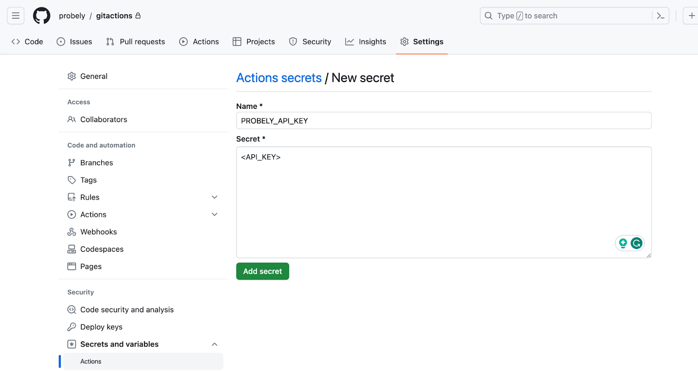
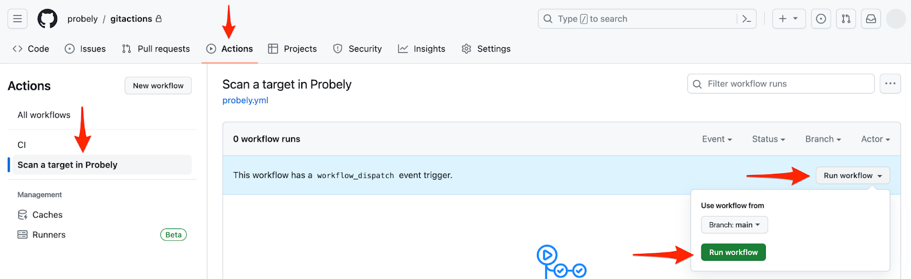
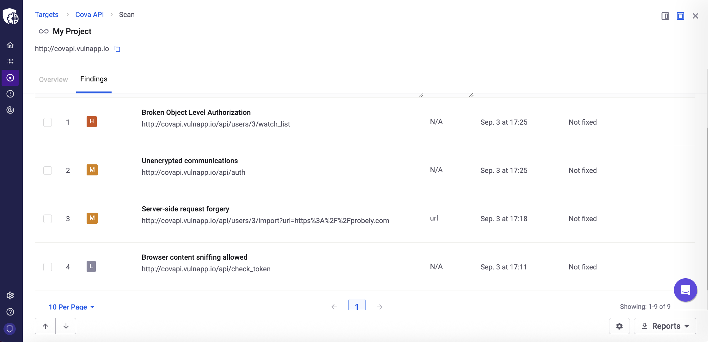

# Integrate Snyk API & Web with GitHub Actions

This guide provides step-by-step instructions for integrating Snyk API & Web into your GitHub Actions pipelines.

To foster automation between systems, you can trigger target scans directly from your GitHub repository on events like a push to your main branch.

We offer two integration methods:

- 

  **Snyk API & Web Action:** A simple way to quickly add a scan to your workflow.

  

- 

  **Snyk API & Web CLI:** A more flexible and powerful method that gives you full control over complex scenarios like blocking builds and scanning ephemeral applications.

  

# **Prerequisites**

Before you begin, you must configure your scan targets and credentials in the Snyk API & Web application.

## **Create a target in Snyk API & Web**

In the Snyk API & Web app, go to the Targets menu and click the **Add** button. Fill out the form and click **Add** to create the new target.

**Note:** During this process, we check for connectivity. If your target is internal or not yet deployed, you can bypass any warnings and add the target regardless. For more details, see [How to add a Target](https://help.probely.com/en/articles/5733114-how-to-add-a-target).

Before configuring the integration in GitHub Actions, make sure to retrieve the unique target ID from Snyk API & Web.

1.  

    In your Snyk API & Web dashboard, select **Targets**.

    

2.  

    From the target list, select the target you want to integrate.

    

3.  

    In your browser's address bar, copy the target ID. This is the string of characters immediately following /target/ in the URL.

    

**Note:** After creating a target, it is mandatory to verify your target’s domain. Otherwise, your scans are only limited to lightning scans. To learn more, see our documentation about the [importance of domain ownership verification](https://help.probely.com/en/articles/3285602-why-do-we-require-you-to-verify-the-ownership-of-a-domain).

## **Create a Snyk API & Web API key**

You need an API key with permissions to start a scan on your target. For instructions, see [How to generate an API key](https://help.probely.com/en/articles/8592281-how-to-generate-an-api-key).

# **Step 1: Add your API key and target ID to GitHub**

To allow GitHub Actions to communicate with Snyk API & Web, you must store your credentials as secure repository secrets.

1.  

    In your GitHub repository, navigate to the **Settings** tab.

    

2.  

    In the side menu, expand **Secrets and variables** and click **Actions**.\
    ​

    

    

    

    

    

    

3.  

    Click the **New repository secret** button.

    

4.  

    Create a secret named **PROBELY_API_KEY** and paste the API Key you generated as the value.\
    ​

    

    

    

    

# **Step 2: Configure your pipeline**

## **Option 1: Use the Snyk API & Web GitHub Action**

This integration method uses our official <a href="https://github.com/Probely/probely-github-action" rel="nofollow noopener noreferrer" target="_blank">GitHub Action</a>.\
​

    # Sample workflow for scanning a target with Snyk API & Web
    on:
      # Runs on pushes targeting the default branch
      push:
        branches: ["main"]
      # Allows you to run this workflow manually from the Actions tab  workflow_dispatch:
    jobs:
    scan:
       runs-on: ubuntu-latest
       steps:
          - name: Scan with Snyk API & Web
            id: snyk-scan
            uses: Probely/probely-github-action@main
            with:
             api-key: ${{ secrets.PROBELY_API_KEY }}
             target-id: "<TARGET_ID>"
             region: "eu"

Depending on the region where your Snyk API & Web instance is located, you need to specify a region value. The options are: `eu`, `us`, `au`.

Remember to replace `<TARGET_ID>` with the **target ID** you copied in the Prerequisites step.

## **Option 2: Use the Snyk API & Web CLI**

For more control over the pipeline, such as blocking builds or scanning ephemeral applications, you can use the <a href="https://developers.probely.com/cli/overview-cli-documentation" rel="nofollow noopener noreferrer" target="_blank">Snyk API &amp; Web CLI</a> directly.

Create a `probely.yml` file at the root of your repository, under the `.github/workflows/` directory, and add one of the following code examples based on your use case. You can also find all of them in our <a href="https://github.com/Probely/cicd-pipeline-scan-examples/tree/main/cicd-examples/github" rel="nofollow noopener noreferrer" target="_blank">Snyk API &amp; Web CI/CD examples repository on GitLab</a>.

### **Important note on these examples**

The YAML configurations below are scanning steps designed to be incorporated into your existing `probely.yml` file.

For example, your pipeline might already have steps to build your code, deploy to a QA environment, and run automated tests. You can add the Snyk API & Web scan as another step at any point that makes sense for your workflow, such as after you deploy to QA or staging.

### **Run a scan on a target in non-blocking mode**

This workflow installs the CLI and starts a scan, but does not wait for the results, allowing your pipeline to complete quickly.

    # github-remote-app-non-blocking-mode.yaml
    name: CI

    on:
      push:
        branches: [ "main" ]
      pull_request:
        branches: [ "main" ]

      workflow_dispatch:

    jobs:
      build:
        runs-on: ubuntu-latest

        steps:
          # Step 1: Install Snyk API & Web CLI edit
          - name: Install Snyk API & Web CLI
            run: |
              # Install Snyk API & Web CLI
              pip install probely
              # Test probely GET TARGETS
              probely targets get --api-key ${{ secrets.PROBELY_API_KEY }}
          
          # Step 2: Start Scan
          - name: Start Scan
            run: |
              for i in {1..20}; do
                echo "-----------------------------------"
                SCAN_ID=$(probely targets start-scan ${{ vars.TARGET_ID }} -o IDS_ONLY --api-key ${{ secrets.PROBELY_API_KEY }})
                echo ${SCAN_ID}
                if [ -f ${SCAN_ID} ]; then
                  echo "Scan didn't start... Retry start-scan"
                else
                  echo "Scan started with SCAN ID: ${SCAN_ID}";
                  echo "SCAN_ID=${SCAN_ID}" >> $GITHUB_ENV
                  break;
                fi
                sleep 5
              done
              if [ -f $SCAN_ID ]; then
                echo "No Scan ID, aborting..."
                exit 1
              fi

### **Run a scan on a target in blocking mode**

This workflow starts a scan and then polls the results, failing the build if any high-severity vulnerabilities are found.

    # github-remote-app-blocking-mode.yaml
    name: CI

    on:
      push:
        branches: [ "main" ]
      pull_request:
        branches: [ "main" ]

      workflow_dispatch:

    jobs:
      build:
        runs-on: ubuntu-latest

        steps:
          # Step 1: Install Snyk API & Web CLI edit
          - name: Install Snyk API & Web CLI
            run: |
              # Install Snyk API & Web CLI
              pip install probely
              # Test probely GET TARGETS
              probely targets get --api-key ${{ secrets.PROBELY_API_KEY }}
          
          # Step 2: Start Scan
          - name: Start Scan
            run: |
              for i in {1..20}; do
                echo "-----------------------------------"
                SCAN_ID=$(probely targets start-scan ${{ vars.TARGET_ID }} -o IDS_ONLY --api-key ${{ secrets.PROBELY_API_KEY }})
                echo ${SCAN_ID}
                if [ -f ${SCAN_ID} ]; then
                  echo "Scan didn't start... Retry start-scan"
                else
                  echo "Scan started with SCAN ID: ${SCAN_ID}";
                  echo "SCAN_ID=${SCAN_ID}" >> $GITHUB_ENV
                  break;
                fi
                sleep 5
              done
              if [ -f $SCAN_ID ]; then
                echo "No Scan ID, aborting..."
                exit 1
              fi

          # Step 3: Wait for scan to end
          - name: Wait for scan to end
            run: |
              # Wait until scan ends
              while true; do
                echo "-----------------------------------"
                SCAN_OUTPUT=$(probely scans get ${SCAN_ID} --api-key ${{ secrets.PROBELY_API_KEY }} | tail -1)
                echo ${SCAN_OUTPUT}
                echo "-----------------------------------"
                SCAN_STATUS=$(probely scans get ${SCAN_ID} --api-key ${{ secrets.PROBELY_API_KEY }} -o JSON | jq -r '.status')
                if [ $SCAN_STATUS == "started" ] || [ $SCAN_STATUS == "queued" ]; then
                  echo "Scan is running or queued!";
                else
                  echo "Scan is not running... finishing"
                  break;
                fi
                sleep 30;
              done

          # Step 4: Optional logic - abort the pipeline if there are any HIGH risk vulnerabilities.
          - name: Check for High risk vulnerabilities
            run: |
              # Wait until scan ends
              HIGH_VULNS=$(probely scans get $SCAN_ID --api-key ${{ secrets.PROBELY_API_KEY }} -o JSON | jq -r '.highs')
              echo "HIGH risk vulnerabilities ${HIGH_VULNS}"
              if [[ "$HIGH_VULNS" -gt 0 ]]; then
                echo "Scan has High risk vulnerabilities... aborting"
                exit 1
              else
                echo "Scan doesn't have High risk vulnerabilities"
              fi

### **Run a scan on an ephemeral (dynamic) target in blocking mode**

This is a more advanced configuration for building, deploying, and scanning an application in a temporary environment that is created for a specific purpose and then automatically destroyed during the pipeline run.

Using ephemeral environments requires agent token, target hostname and target URL. We recommend storing them as variables for better security.

You also need to create a scanning agent in Snyk API & Web and configure your target to use it. This process requires the `scanning-agent/farcasterd-linux-amd64-0.4.3` file. For detailed instructions, see <a href="https://www.google.com/search?q=link-to-article" rel="nofollow noopener noreferrer" target="_blank">How to install a Scanning Agent</a> and <a href="https://www.google.com/search?q=link-to-article" rel="nofollow noopener noreferrer" target="_blank">How to scan internal applications</a>.

**Note:** In this code example, Docker is used to create ephemeral environments. However, you can use any other solution to create your environment.

     # github-ephemeral-app-blocking-mode.yaml
    name: CI

    on:
      push:
        branches: [ "main" ]
      pull_request:
        branches: [ "main" ]

      workflow_dispatch:

    jobs:
      build:
        runs-on: ubuntu-latest

        steps:
          # Step 1
          - name: Checkout code
            uses: actions/checkout@v4

          # Step 2: Set up Docker
          - name: Set up Docker
            uses: docker/setup-buildx-action@v2

          # Step 3: Create a custom Docker network
          - name: Create custom Docker network
            run: docker network create custom-network

          # Step 4: Build and run the Docker app container
          - name: Build and run app container
            run: |
              # Build the Docker image
              docker build -t test-app .

              # Run the Docker container with a custom hostname
              docker run --name test-app \
                --hostname custom-web-app \
                --network custom-network \
                -p 8080:8080 \
                -d test-app

          # Step 5: Get container IP
          - name: Get container IP address
            run: |
              CONTAINER_IP=$(docker inspect -f '{{range .NetworkSettings.Networks}}{{.IPAddress}}{{end}}' test-app)
              echo "Container IP is $CONTAINER_IP"

              # Add the custom hostname to the /etc/hosts file
              echo "$CONTAINER_IP ${{ vars.TARGET_HOSTNAME }} ${{ vars.TARGET_HOSTNAME }}." | sudo tee -a /etc/hosts
              cat /etc/hosts # confirm host is on /etc/hosts

          # Step 6: Wait for the app to start
          - name: Wait for app to start
            run: |
              # Wait until the container is ready
              for i in {1..10}; do
                if curl -s ${{ vars.TARGET_URL }} > /dev/null; then
                  echo "App is up!";
                  break;
                fi
                echo "Waiting for the app to be ready...";
                sleep 2;
              done

          # Step 7: Test application with curl
          - name: Test application with curl
            run: |
              # Make a request to the web app using the custom hostname
              RESPONSE=$(curl -s -o /dev/null -w "%{http_code}" ${{ vars.TARGET_URL }})
              
              if [ "$RESPONSE" -ne 200 ]; then
                echo "App test failed with HTTP status $RESPONSE";
                exit 1;
              fi

              curl -s -i ${{ vars.TARGET_URL }}
              
              echo "App test passed with HTTP status $RESPONSE";

          # Setp 8: Start scanning agent
          - name: Start Scanning Agent
            run: |
              # Using docker agent
              docker run -d --name probely-agent \
                --cap-add NET_ADMIN \
                --network custom-network \
                -e FARCASTER_AGENT_TOKEN=${{ secrets.AGENT_TOKEN }} \
                --device /dev/net/tun probely/farcaster-onprem-agent:v2

              # Using userspace agent
              # chmod +x scanning-agent/farcasterd-linux-amd64-0.4.3
              # ./scanning-agent/farcasterd-linux-amd64-0.4.3 --token ${{ secrets.AGENT_TOKEN }} &

          # Step 9: Wait for agent to stat
          - name: Wait for agent to stat
            run: |
              # Wait until the probely-agent is ready
              for i in {1..10}; do
                echo "-----------------------------------"
                AGENT_RUNNING=$(docker logs probely-agent | grep 'Running...' | wc -l)
                if [ $AGENT_RUNNING == "1" ]; then
                  echo "Agent is running!";
                  echo "------------------------"
                  docker logs probely-agent
                  echo "------------------------"
                  sleep 10
                  break;
                fi
                sleep 2;
              done
          
          # Step 10: Install Snyk API & Web CLI
          - name: Install Snyk API & Web CLI
            run: |
              # Install Snyk API & Web CLI
              pip install probely
              # Test probely GET TARGETS
              probely targets get --api-key ${{ secrets.PROBELY_API_KEY }}
          
          # Step 11: Start Scan
          - name: Start Scan
            run: |
              for i in {1..20}; do
                echo "-----------------------------------"
                SCAN_ID=$(probely targets start-scan ${{ vars.TARGET_ID }} -o IDS_ONLY --api-key ${{ secrets.PROBELY_API_KEY }})
                echo ${SCAN_ID}
                if [ -f ${SCAN_ID} ]; then
                  echo "Scan didn't start... Retry start-scan"
                else
                  echo "Scan started with SCAN ID: ${SCAN_ID}";
                  echo "SCAN_ID=${SCAN_ID}" >> $GITHUB_ENV
                  break;
                fi
                sleep 5
              done
              if [ -f $SCAN_ID ]; then
                echo "No Scan ID, aborting..."
                docker stop test-app
                docker stop probely-agent
                docker rm test-app
                docker rm probely-agent
                docker network rm custom-network
                exit 1
              fi

          # Step 12: Wait for scan to end
          - name: Wait for scan to end
            run: |
              # Wait until scan ends
              while true; do
                echo "-----------------------------------"
                SCAN_OUTPUT=$(probely scans get ${SCAN_ID} --api-key ${{ secrets.PROBELY_API_KEY }} | tail -1)
                echo ${SCAN_OUTPUT}
                echo "-----------------------------------"
                SCAN_STATUS=$(probely scans get ${SCAN_ID} --api-key ${{ secrets.PROBELY_API_KEY }} -o JSON | jq -r '.status')
                if [ $SCAN_STATUS == "started" ] || [ $SCAN_STATUS == "queued" ]; then
                  echo "Scan is running or queued!";
                else
                  echo "Scan is not running... finishing"
                  break;
                fi
                sleep 30;
              done

          # Step 13: check high vulnerabities
          - name: Check for high vulnerabilities
            run: |
              HIGH_VULNS=$(probely scans get ${SCAN_ID} --api-key ${{ secrets.PROBELY_API_KEY }} -o JSON | jq -r '.highs')
              echo "HIGH vulnerabilities: ${HIGH_VULNS}"
              if [ $HIGH_VULNS -gt 0 ]; then
                echo "Scan has High vulnerabilities... aborting"
                docker stop test-app
                docker stop probely-agent
                docker rm test-app
                docker rm probely-agent
                docker network rm custom-network

                exit 1
              else
                echo "Scan doesn't have high vulnerabilities"
              fi

          # Step 14: Clean up
          - name: Clean up Docker resources
            run: |
              docker stop test-app
              docker stop probely-agent
              docker rm test-app
              docker rm probely-agent
              dockernetworkrmcustom-network

\
**Step 3: Run the pipeline and view the results**
=================================================

After committing your workflow file, the scan is triggered automatically on a push to the main branch. You can also run the workflow manually.

1.  

    In your GitHub repository, go to the **Actions** tab.

    

2.  

    Under **All workflows**, find and select your scan workflow.

    

3.  

    Click the **Run workflow** dropdown, then the **Run workflow** button to trigger a new scan.\
    ​

    

    

    

    

Once the scan is complete, you can view the detailed findings in your Snyk API & Web dashboard.

Did this answer your question?

😞

😐

😃

- 
- 
- 

<a href="https://www.intercom.com/intercom-link?company=Snyk+API+%26+Web&amp;solution=customer-support&amp;utm_campaign=intercom-link&amp;utm_content=We+run+on+Intercom&amp;utm_medium=help-center&amp;utm_referrer=https%3A%2F%2Fhelp.probely.com%2Fen%2Farticles%2F8608589-integrate-snyk-api-web-with-github-actions&amp;utm_source=desktop-web" class="pl-2 align-middle no-underline">We run on Intercom</a>

