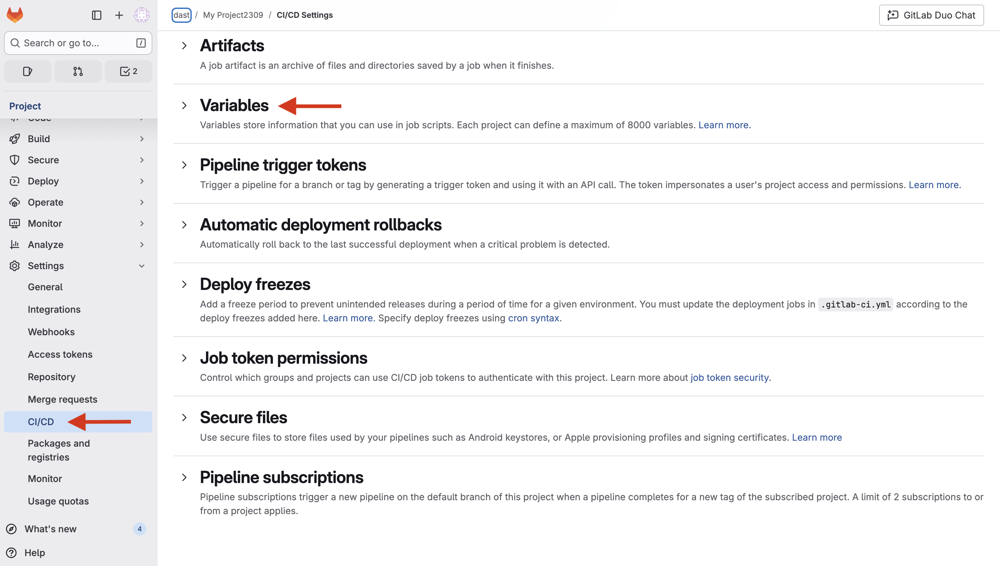
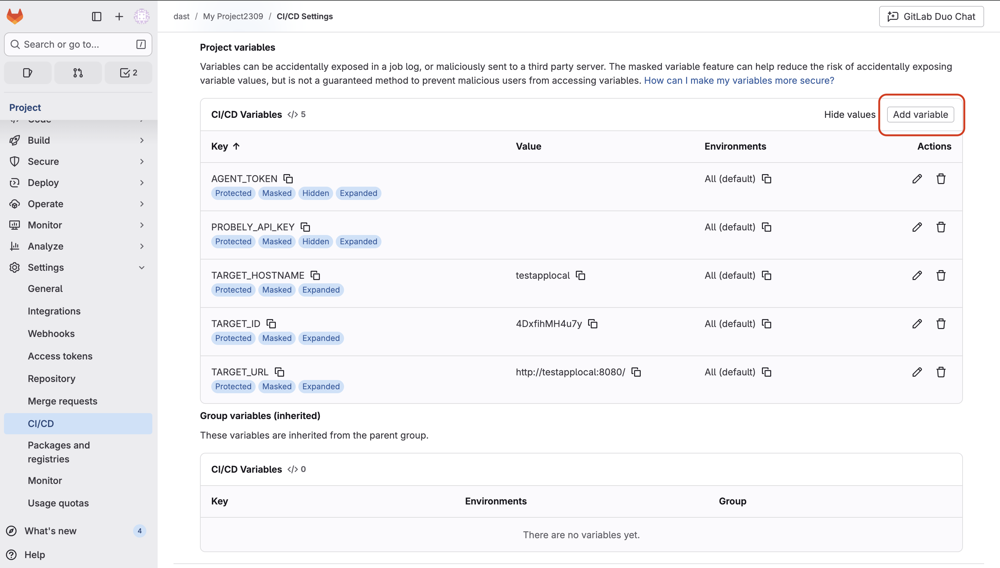
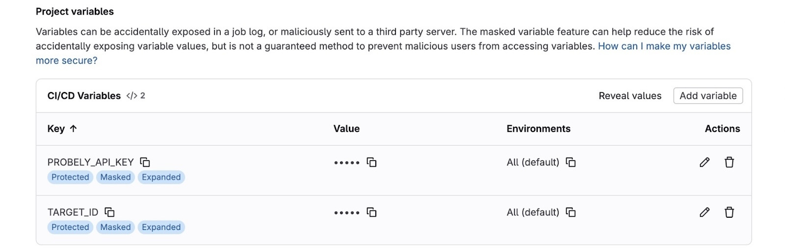
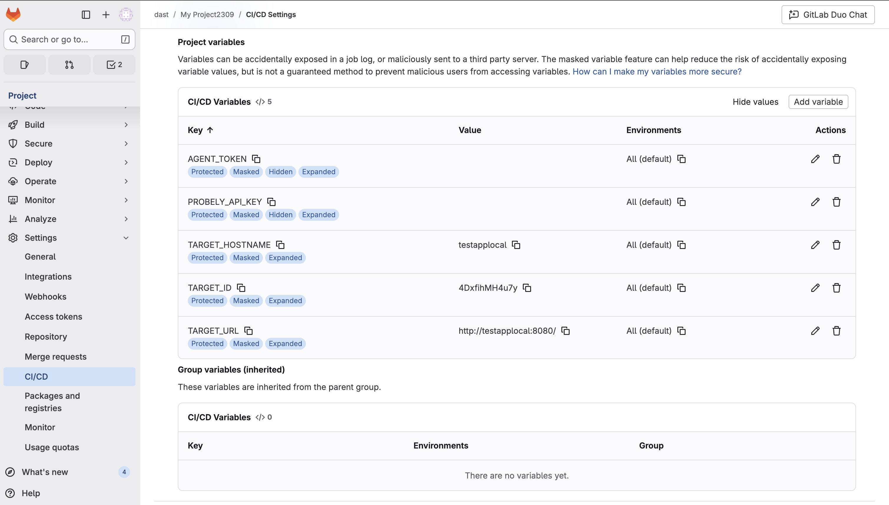
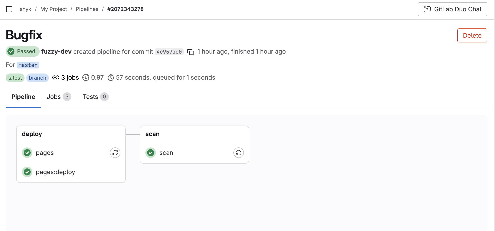
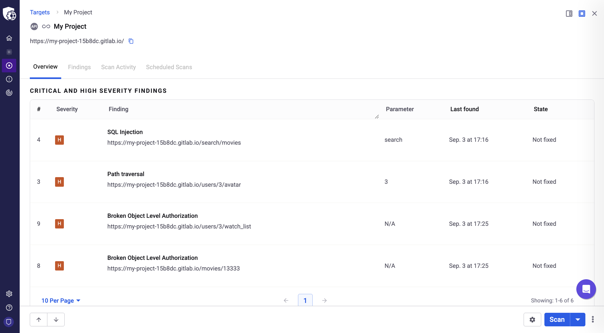

# Integrate Snyk API & Web with GitLab CI/CD

This guide provides step-by-step instructions for integrating Snyk API & Web into your GitLab CI/CD pipelines.

C

This guide focuses on using the Snyk API & Web CLI to run scans. The examples below cover the complete end-to-end journey, from configuring your targets to running scans in different scenarios.

# **Prerequisites**

Before you begin, you must configure your scan targets and credentials in the Snyk API & Web application.

## **Create a target in Snyk API & Web**

In the Snyk API & Web app, go to the **Targets** menu and click the **Add** button. Fill out the form and click **Add** to create the new target.

**Note:** During this process, we check for connectivity. If your target is internal or not yet deployed, you can bypass any warnings and add the target regardless. For more details, see [How to add a Target](https://help.probely.com/en/articles/5733114-how-to-add-a-target).

Before configuring the integration in GitLab, make sure to retrieve the unique **target ID** from Snyk API & Web.

1.  

    In your Snyk API & Web dashboard, select **Targets**.

    

2.  

    From the target list, select the target you want to integrate.

    

3.  

    In your browser's address bar, copy the **target ID**. This is the string of characters immediately following /target/ in the URL.

    

**Note:** After creating a target, it is mandatory to verify your target’s domain. Otherwise, your scans are only limited to lightning scans. To learn more, see our documentation about the [importance of domain ownership verification](https://help.probely.com/en/articles/3285602-why-do-we-require-you-to-verify-the-ownership-of-a-domain).

## **Create a Snyk API & Web API Key**

You need an API key with permissions to start a scan on your target. For instructions, see [How to generate an API key](https://help.probely.com/en/articles/8592281-how-to-generate-an-api-key).

# **Step 1: Add your API Key and target ID to GitLab**

To run a scan, your pipeline needs to authenticate with Snyk API & Web and know which target to scan. You must configure your Snyk API & Web **API Key** and the specific **target ID** as <a href="https://docs.gitlab.com/ci/variables/#define-a-cicd-variable-in-the-ui" rel="nofollow noopener noreferrer" target="_blank">secure CI/CD variables</a> in your GitLab project.

1.  

    From your GitLab project side menu, navigate to **Settings \> CI/CD**.\
    ​

    

    

    

    

    

    

2.  

    Find the **Variables** section and expand it.\
    ​

    

    

    

    

    

    

3.  

    Click **Add variable** and create an entry for your Snyk API & Web **API Key**, for example, **PROBELY_API_KEY**.\
    ​

    

    

    

    

    

    

    

    

    

    

    

4.  

    Click **Add variable** again to create a second entry for your **target ID**, for example, **TARGET_ID**.

    

**Important:** For enhanced security, always store sensitive values as GitLab <a href="https://docs.gitlab.com/ci/variables/#define-a-cicd-variable-in-the-ui" rel="nofollow noopener noreferrer" target="_blank">CI/CD variables</a>. Storing variables directly in your `.gitlab-ci.yml` file is not recommended, as they are saved in plain text and visible to anyone who can view the file.\
​

# **Step 2: Configure your pipeline**

Create a `.gitlab-ci.yml` file at the root of your repository and add one of the following code examples based on your use case. You can also find all of them in our <a href="https://github.com/Probely/cicd-pipeline-scan-examples/tree/main/cicd-examples/gitlab" rel="nofollow noopener noreferrer" target="_blank">Snyk API &amp; Web CI/CD examples repository on GitHub</a>.

## **Important note on these examples**

The YAML configurations below are scanning steps designed to be incorporated into your existing `.gitlab-ci.yml` file.

For example, your pipeline might already have steps to build your code, deploy to a QA environment, and run automated tests. You can add the Snyk API & Web scan as another step at any point that makes sense for your workflow, such as after you deploy to QA or staging.

## **Run a scan on a target in non-blocking mode**

This is the simplest way to get started. It runs a scan on a remotely accessible environment without blocking the pipeline.\
​

    # gitlab-remote-app-non-blocking-mode.yaml
    stages:
      - scan

    scan:
      stage: scan
      image: python:latest
      script:
        - pip install probely
        - probely targets get --api-key ${PROBELY_API_KEY}
        - |
          for i in {1..20}; do
            echo "-----------------------------------"
            SCAN_ID=$(probely targets start-scan ${TARGET_ID} -o IDS_ONLY --api-key ${PROBELY_API_KEY})
            echo ${SCAN_ID}
            if [[ -z "$SCAN_ID" ]]; then
              echo "Scan didn't start... Retry start-scan"
            else
              echo "Scan started with SCAN ID: ${SCAN_ID}";
              break;
            fi
            sleep 5
          done
          if [[ -z "$SCAN_ID" ]]; then
            echo "No Scan ID, aborting..."
            exit 1
          fi

## **Run a scan on a target in blocking mode**

This configuration builds on the first example by adding steps to poll the scan status and block the pipeline if high-severity vulnerabilities are found.

    # gitlab-remote-app-blocking-mode.yaml
    stages:
      - scan

    scan:
      stage: scan
      image: python:3.11-bullseye
      script:
        - apt-get update && apt-get install -y jq
        # Install Snyk API & Web CLI
        - pip install probely
        - probely targets get --api-key ${PROBELY_API_KEY}
        - |
          for i in {1..20}; do
            echo "-----------------------------------"
            SCAN_ID=$(probely targets start-scan ${TARGET_ID} -o IDS_ONLY --api-key ${PROBELY_API_KEY})
            echo ${SCAN_ID}
            if [[ -z "$SCAN_ID" ]]; then
              echo "Scan didn't start... Retry start-scan"
            else
              echo "Scan started with SCAN ID ${SCAN_ID}";
              break;
            fi
            sleep 5
          done
          if [[ -z "$SCAN_ID" ]]; then
            echo "No Scan ID, aborting..."
            exit 1
          fi

        - |
          while true; do
            echo "-----------------------------------"
            SCAN_OUTPUT=$(probely scans get ${SCAN_ID} --api-key ${PROBELY_API_KEY} | tail -1)
            echo ${SCAN_OUTPUT}
            echo "-----------------------------------"
            SCAN_STATUS=$(probely scans get ${SCAN_ID} --api-key ${PROBELY_API_KEY} -o JSON | jq -r '.status')
            if [[ "$SCAN_STATUS" == "started" ]] || [[ "$SCAN_STATUS" == "queued" ]]; then
              echo "Scan is running or queued!";
            else
              echo "Scan is not running... finishing"
              break;
            fi
            sleep 30;
          done

        - HIGH_VULNS=$(probely scans get ${SCAN_ID} --api-key ${PROBELY_API_KEY} -o JSON | jq -r '.highs')
        - echo "HIGH risk vulnerabilities ${HIGH_VULNS}"
        - |
          if [[ "$HIGH_VULNS" -gt 0 ]]; then
            echo "Scan has High risk vulnerabilities... aborting"
            exit 1
          else
            echo "Scan doesn't have High risk vulnerabilities"
          fi

\
**Run a scan on an ephemeral (dynamic) target in blocking mode**
----------------------------------------------------------------

This is a more advanced configuration for building, deploying, and scanning an application in a temporary environment that is created for a specific purpose and then automatically destroyed during the pipeline run.

Using ephemeral environments requires agent token, target hostname and target URL. We recommend storing them as variables for better security.

You also need to create a scanning agent in Snyk API & Web and configure your target to use it. This process requires the `scanning-agent/farcasterd-linux-amd64-0.4.3` file. For detailed instructions, see <a href="https://www.google.com/search?q=link-to-article" rel="nofollow noopener noreferrer" target="_blank">How to install a Scanning Agent</a> and <a href="https://www.google.com/search?q=link-to-article" rel="nofollow noopener noreferrer" target="_blank">How to scan internal applications</a>.

**Note:** In this code example, Docker is used to create ephemeral environments. However, you can use any other solution to create your environment.

    # gitlab-ephemeral-app-blocking-mode.yaml
    stages:
      - build-and-test

    build-and-test:
      stage: build-and-test
      image: docker:latest
      services:
        - docker:dind
      variables:
        DOCKER_HOST: tcp://docker:2375
      script:
        - apk add --no-cache curl jq python3 py3-pip
        - python3 -m venv venv
        - source ./venv/bin/activate
        # Install Snyk API & Web CLI
        - pip install probely
        - probely targets get --api-key ${PROBELY_API_KEY}

        - docker network create custom-network

        - docker build -t test-app . 
        - docker run --name test-app --hostname custom-web-app --network custom-network -p 0.0.0.0:8080:8080 -d test-app

        - cat /etc/hosts # current /etc/hosts
        
        - CONTAINER_IP=$(grep -i 'docker' /etc/hosts | head -1 | awk '{print $1}')
        - echo "Container IP from /etc/hosts is $CONTAINER_IP"
        - echo "${CONTAINER_IP} ${TARGET_HOSTNAME} ${TARGET_HOSTNAME}." | tee -a /etc/hosts  # Add to /etc/hosts
        - cat /etc/hosts  # Confirm host was added

        - |
          for i in {1..10}; do  # Wait for the app to start
            if curl -s ${TARGET_URL} > /dev/null; then
              echo "App is up!";
              break;
            fi
            echo "Waiting for the app to be ready...";
            sleep 2;
          done

        # Test the application
        - RESPONSE=$(curl -s -o /dev/null -w "%{http_code}" ${TARGET_URL})
        - |
          if [[ "$RESPONSE" -ne 200 ]]; then
            echo "App test failed with HTTP status ${RESPONSE}";
            exit 1;
          fi
        - curl -s -i ${TARGET_URL}
        - echo "App test passed with HTTP status ${RESPONSE}";

        # Run userspace agent
        - chmod +x scanning-agent/farcasterd-linux-amd64-0.4.3 
        - ./scanning-agent/farcasterd-linux-amd64-0.4.3 --token ${AGENT_TOKEN} &

        # Wait for the agent to start
        - sleep 40

        # Start Scan
        - |
          for i in {1..20}; do  # Start Snyk API & Web scan
            echo "-----------------------------------"
            SCAN_ID=$(probely targets start-scan ${TARGET_ID} -o IDS_ONLY --api-key ${PROBELY_API_KEY})
            echo ${SCAN_ID}
            if [[ -z "${SCAN_ID}" ]]; then
              echo "Scan didn't start... Retry start-scan"
            else
              echo "Scan started with SCAN ID ${SCAN_ID}";
              break;
            fi
            sleep 5
          done
        - |
          if [[ -z "${SCAN_ID}" ]]; then
            echo "No Scan ID, aborting..."
            exit 1
          fi

        # Wait for scan to end
        - |
          while true; do
            echo "-----------------------------------"
            SCAN_OUTPUT=$(probely scans get ${SCAN_ID} --api-key ${PROBELY_API_KEY} | tail -1)
            echo ${SCAN_OUTPUT}
            echo "-----------------------------------"
            SCAN_STATUS=$(probely scans get ${SCAN_ID} --api-key ${PROBELY_API_KEY} -o JSON | jq -r '.status')
            if [[ "$SCAN_STATUS" == "started" ]] || [[ "$SCAN_STATUS" == "queued" ]]; then
              echo "Scan is running or queued!";
            else
              echo "Scan is not running... finishing"
              break;
            fi
            sleep 30;
          done

        # Check for high vulnerabilities
        - HIGH_VULNS=$(probely scans get ${SCAN_ID} --api-key ${PROBELY_API_KEY} -o JSON | jq -r '.highs')
        - echo "HIGH vulnerabilities  ${HIGH_VULNS}"
        - |
          if [[ "$HIGH_VULNS" -gt 0 ]]; then
            echo "Scan has High vulnerabilities... aborting"
            exit 1
          else
            "Scan doesn't have high vulnerabilities"
          fi

        # Clean up
        - docker stop test-app
        - docker rm test-app
        -dockernetworkrmcustom-network

# **Step 3: Run the pipeline and view the results**

After committing your `.gitlab-ci.yml` file, you can run the pipeline in GitLab to test the integration.

Once the scan is complete, you can view the detailed findings in your Snyk API & Web dashboard.

Did this answer your question?

😞

😐

😃

- 
- 
- 

<a href="https://www.intercom.com/intercom-link?company=Snyk+API+%26+Web&amp;solution=customer-support&amp;utm_campaign=intercom-link&amp;utm_content=We+run+on+Intercom&amp;utm_medium=help-center&amp;utm_referrer=https%3A%2F%2Fhelp.probely.com%2Fen%2Farticles%2F12692938-integrate-snyk-api-web-with-gitlab-ci-cd&amp;utm_source=desktop-web" class="pl-2 align-middle no-underline">We run on Intercom</a>

