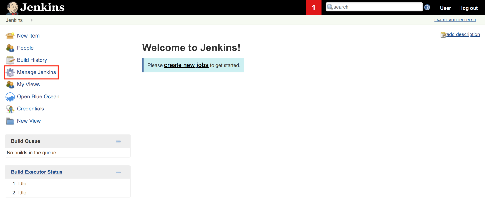
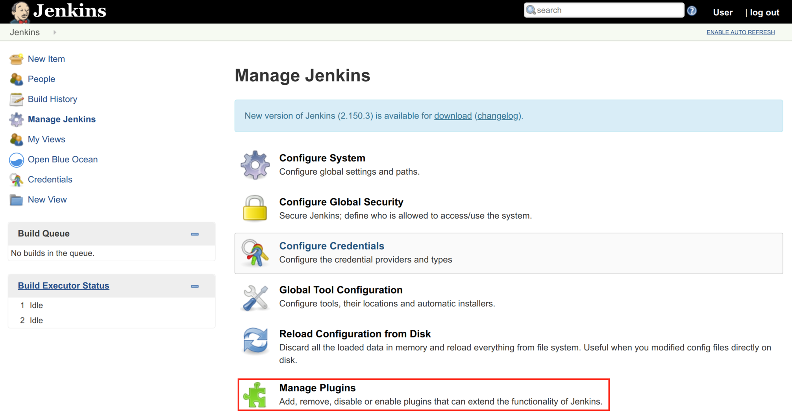
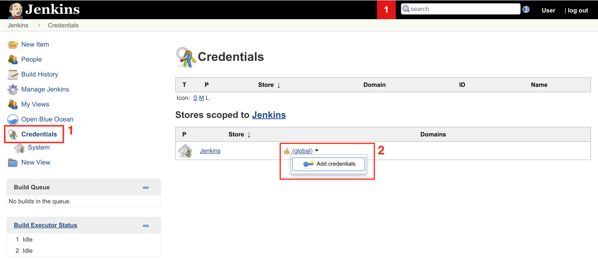
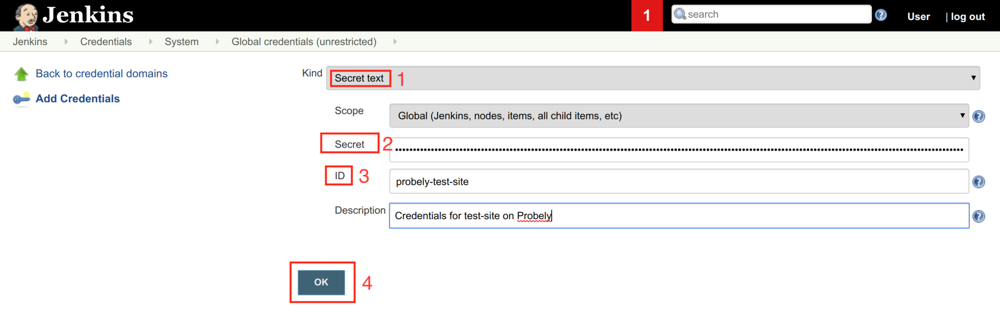
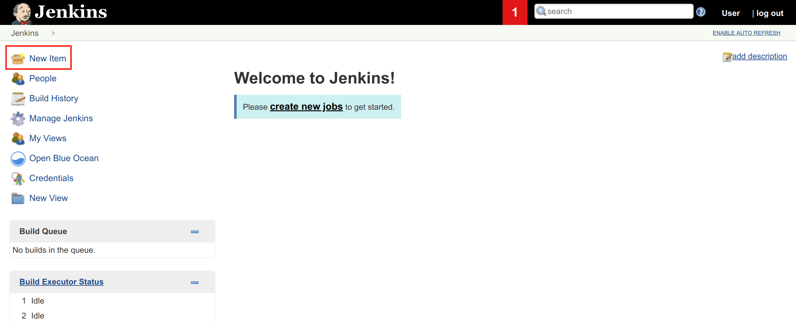
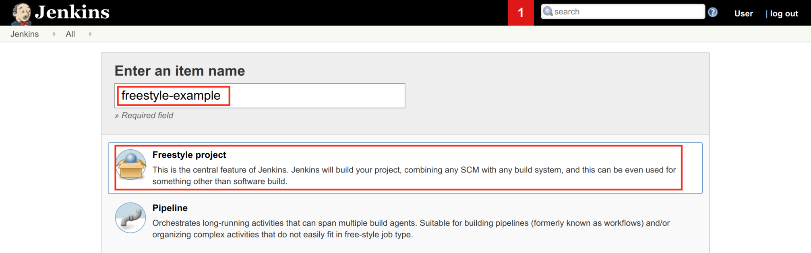
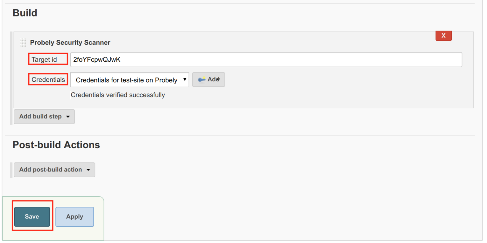
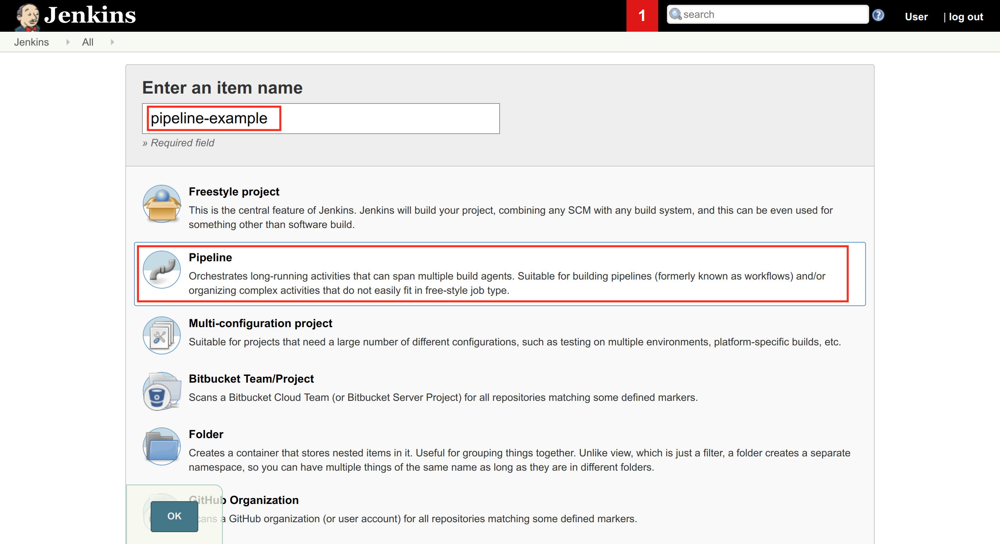
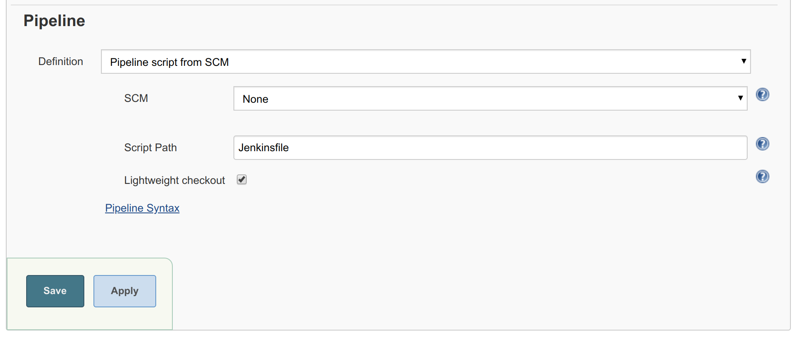

# Integrate Snyk API & Web with Jenkins

Configure Jenkins CI/CD pipeline to scan your application for security issues.

With the Snyk API & Web plugin you can automatically start a scan every time your Jenkins pipeline is executed.\
​\
Jenkins allows you to have an arbitrary number of build and test scenarios, but a common pattern is as follows:

- 

  **Build step**: compiles the application or creates the Docker containers

  

- 

  **Deploy step**: sends the compiled code or the containers to test server and execute them

  

- 

  **Test step**: execute tests on the running application

  

The Snyk API & Web plugin is a build task that should run after the application is built and deployed.\
It is recommended that the security tests run after the integration/functional tests pass, to ensure the application is working properly. A broken application may cause security tests to miss vulnerabilities because a particular feature is not working.

# Installation and setup

Installing and setting up the plugin will take you less than 5 minutes.

1\. Open Jenkins and click on **Manage Jenkins**

2\. Click on **Manage Plugins\
​**

3\. Click on **Available** tab

4\. On the **Filter** search box, enter **probely**\
5. Select the **Probely Security Scanner** plugin\
6. Click on **Download now and install after restart**\
7. After Jenkins restarts, the plugin will be installed. Continue reading to set up the required API key from Snyk API & Web.

Generating an API key\
======================

Before using the plugin, you must [generate an API Key](https://help.probely.com/en/articles/8592281-how-to-generate-an-api-key) for Jenkins to be able to start a scan with Snyk API & Web.

Once the API key is created, take note of its value, as it will be required to configure the Plugin credentials later on, and it will not be displayed again. You will also need the ID of the target you want to scan; you can obtain this ID from the target page.

# Configuring the plugin

The plugin can be used in both Freestyle and Pipeline projects, and this post will provide an example for each one. You can learn more about these two project types and their differences <a href="https://jenkins.io/pipeline/getting-started-pipelines/" target="_blank" rel="nofollow noopener noreferrer">here</a>.

## Configuring credentials

1\. Click on **Credentials\
​**2. Click on the down arrow near (**global**) to enable the dropdown menu and choose **Add credentials**

1\. On the Kind dropdown menu, choose **Secret text**\
2. Enter the API key in the **Secret** textbox\
3. Enter a value for the credentials in the **ID** textbox, for example **probely-test-site**\
4. Enter an optional Description and click **OK**

## Using the plugin in a Freestyle project

Creating a freestyle is the simplest way to have a repeatable process to build and test your application, especially for simple applications with just a few jobs.\
If you already have a freestyle project you only need to configure the plugin: in the project listing page, click the Configure in the drop-down menu next to the project name. If you are creating a new project, follow the next steps:

1\. Click **New Item.**

2\. Enter your project name, choose **Freestyle Project** and click **OK**

3\. In the **Build** section add **Probely scan step**.

We assume you have configured the other project options properly, such as checking out from your SCM, building the code and deploying it.

In the just added **Probely** **Security Scanner** section:

1\. Add the **Target ID** of the target you want to scan.\
2. Select the right credentials, which were configured in **Configuring credentials**. If the connection to Snyk API & Web's API is working correctly, and the credentials are valid, you should see the message "Credentials verified successfully".\
3. When all steps are properly configured, click on **Save**.

The next time the build job for this project runs, Snyk API & Web will test the security of the configured target and will send you an email with the scan results in the end.

## Using the plugin in a Pipeline project

Pipeline projects are the most flexible and powerful way of creating CI/CD pipelines with Jenkins.

The projects need a configuration file, a **Jenkinsfile**. The one in our example uses the more modern declarative syntax, instead of the imperative one.

1\. Click on **New Item**

2\. Enter your project name, choose **Pipeline Project** and click **OK**

3\. Create a Jenkinsfile

    pipeline {
        agent {
            docker {
                image 'maven:3-alpine' 
            }
        }
        stages {
            stage('Unit tests') { 
                steps {
                    sh './gradlew check'
                }
            }
            stage('Scan with Probely') {
                steps {
                    probelyScan targetId: '9nl6yy0TWWKv', credentialsId: 'probely-test-site' 
                }
             }
        }
    }

As with the Freestyle project, the security tests are executed after the functional tests, in this case after the Unit tests stage, to ensure the application is working properly.

4\. Configure Jenkins to use the Jenkins file on your repository

If your Jenkinsfile is stored in a repository that was already configured here (Definition **Pipeline script from SCM)** you only need to commit the updated file to the repository

Hit **Save.** Your pipeline has now a stage that scans your target for vulnerabilities.\
​

You have some options on how Snyk API & Web scans your target, at the target settings page: you can choose different scan profiles, configure authentication in order to scan behind login pages, add custom headers and even enable automatic synchronisation with your project at Jira, just to name a few.

Did this answer your question?

😞

😐

😃

- 
- 
- 

<a href="https://www.intercom.com/intercom-link?company=Snyk+API+%26+Web&amp;solution=customer-support&amp;utm_campaign=intercom-link&amp;utm_content=We+run+on+Intercom&amp;utm_medium=help-center&amp;utm_referrer=https%3A%2F%2Fhelp.probely.com%2Fen%2Farticles%2F2771631-integrate-snyk-api-web-with-jenkins&amp;utm_source=desktop-web" class="pl-2 align-middle no-underline">We run on Intercom</a>

