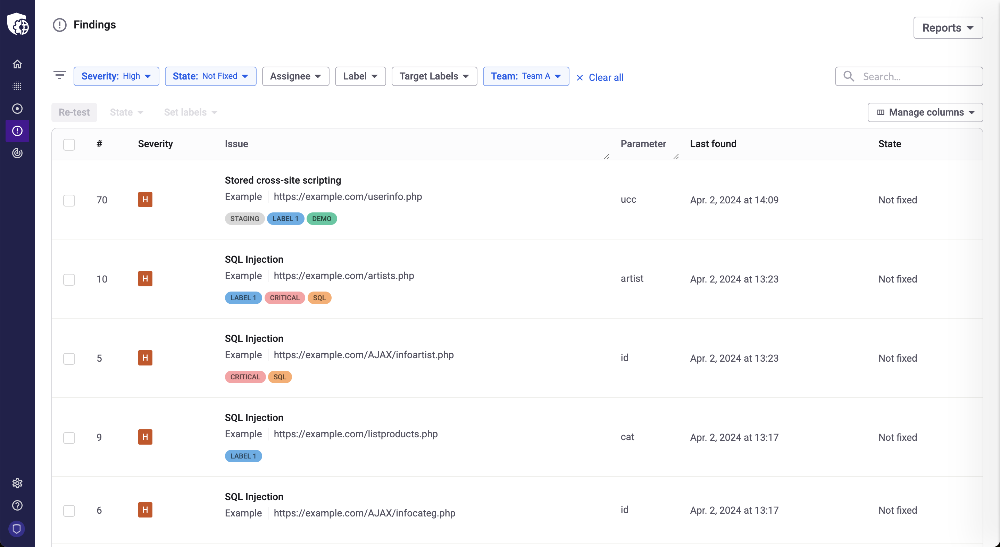
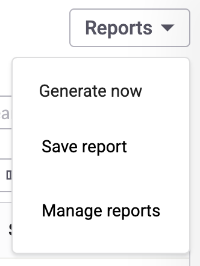
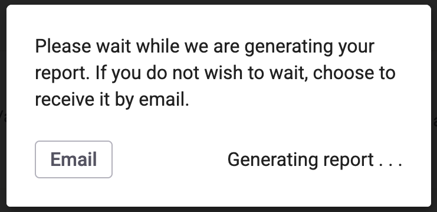
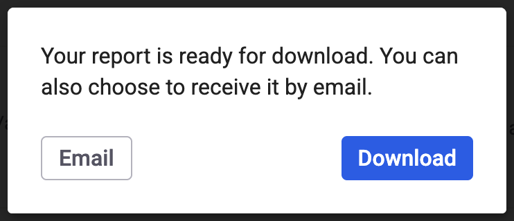
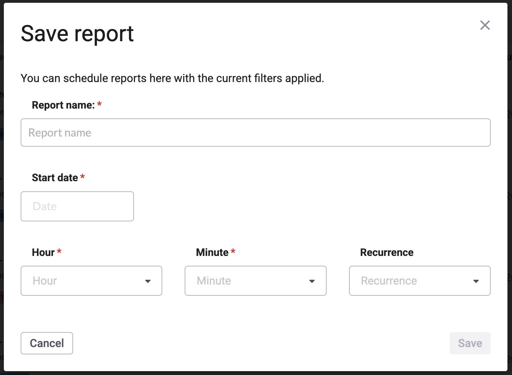
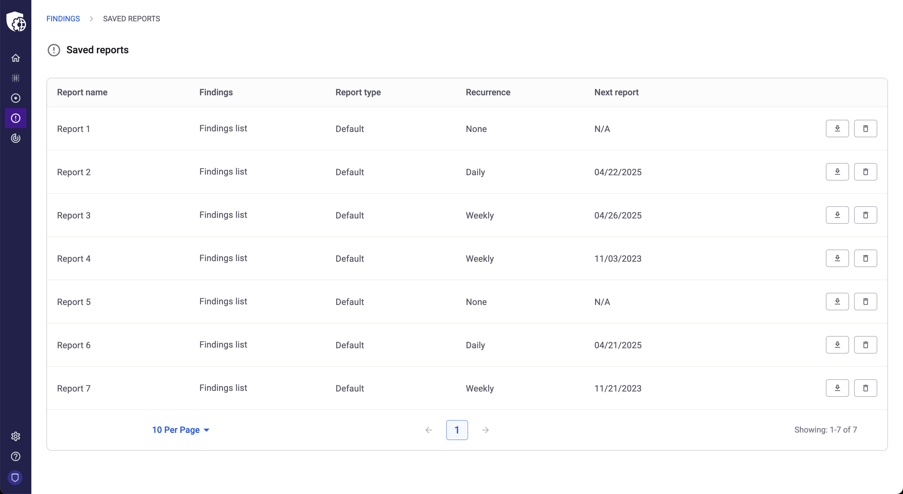

# How to configure and download saved reports

Learn about Saved reports and how to download them

With Snyk API & Web, you can download reports of specific scans ([scan reports](https://help.probely.com/en/articles/3248793-how-to-generate-a-scan-report)), or reports based on search criteria you define, that can comprise multiple targets (saved reports).

This feature (available on the Enterprise plan only) allows you to, for instance, get a report of all High findings across all targets from a specific team.

To generate these reports, go to the global list of **Findings**, apply the search terms and filters wanted, and click on the **Reports** button from the top right corner of the page.

Once you do, a dropdown menu appears with 3 options:

- 

  **Generate now** → this will generate a pdf report of the findings listed, taking into account the search and filters applied on the interface

  

  

  - 

    Similarly to what happens with scan reports, you can choose to send the report by email, or wait for it to be generated and then download it

    

  

- 

  **Save report** → this will save a new report (that will take into account the search and filters applied on the interface) and list it under Manage reports

  

  

  - 

    Reports can be saved with or without Recurrence; if recurrence is configured, you will automatically receive the respective report in your email address at the “next report” date

    

  

- 

  **Manage reports** → this option redirects to a new page where you can manage the reports already saved using the previous option

  

  

  - 

    You can click on the “Findings list” link in the Findings column to access the global Findings list filtered by the same criteria that were used when saving the report; this will give you an overview of the findings that match the criteria applied and you can even tweak this pre-filtered view to generate new reports with similar filters, if needed

    

  - 

    You can click on the “Download” button to download the current report taking into account the filters and search defined - this means every time the report is downloaded, the results may be different (i.e. the findings from the report are always up to date)

    

  - 

    You can click on the “Delete” button to delete the report; if you do, any upcoming reports will be canceled and you will not receive them by email any longer

    

  

Did this answer your question?

😞

😐

😃

- 
- 
- 

<a href="https://www.intercom.com/intercom-link?company=Snyk+API+%26+Web&amp;solution=customer-support&amp;utm_campaign=intercom-link&amp;utm_content=We+run+on+Intercom&amp;utm_medium=help-center&amp;utm_referrer=https%3A%2F%2Fhelp.probely.com%2Fen%2Farticles%2F11115092-how-to-configure-and-download-saved-reports&amp;utm_source=desktop-web" class="pl-2 align-middle no-underline">We run on Intercom</a>

