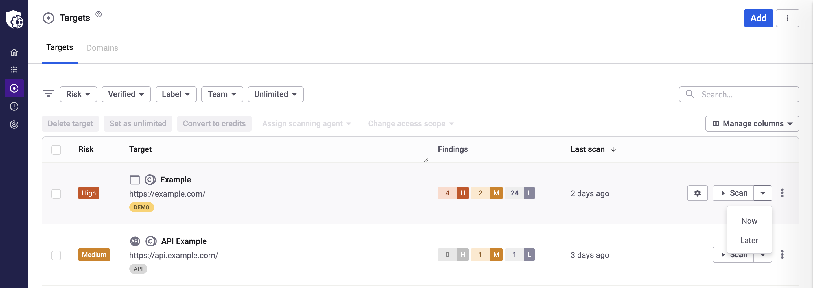
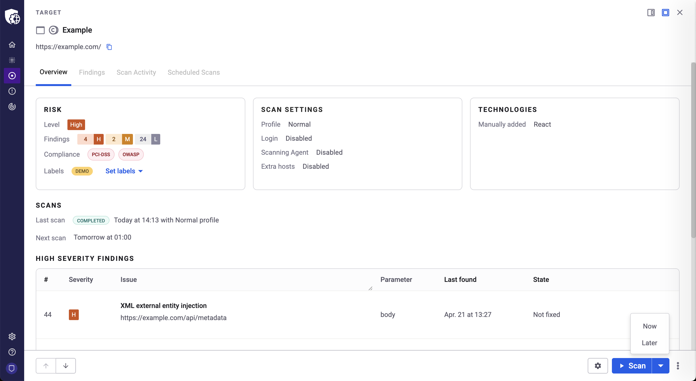
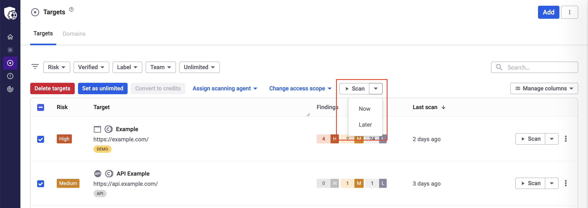
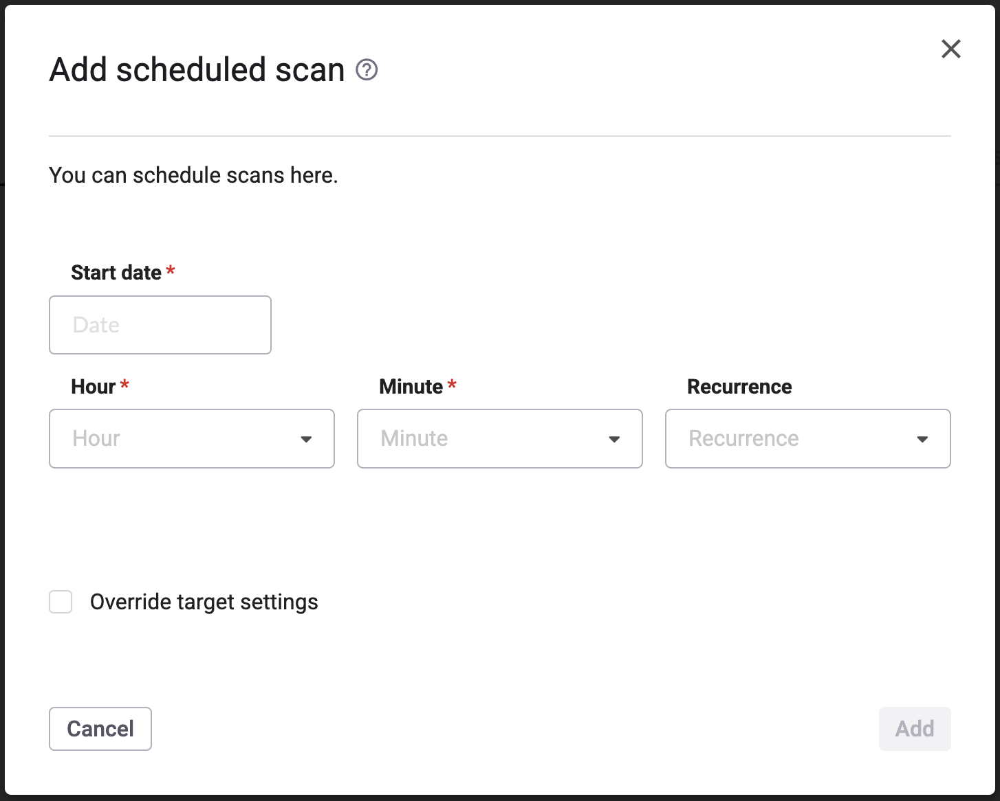
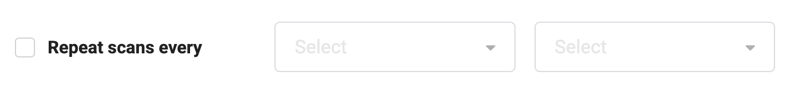
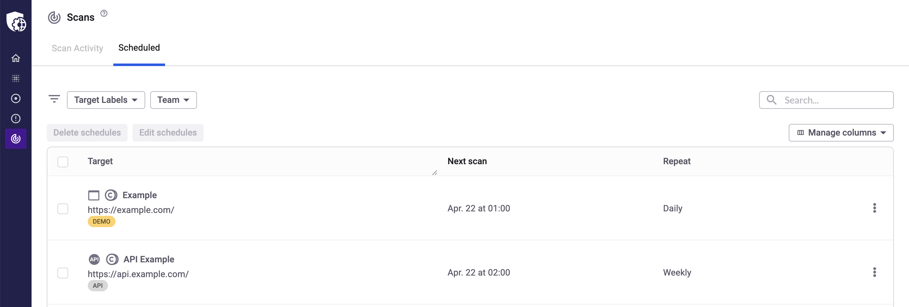
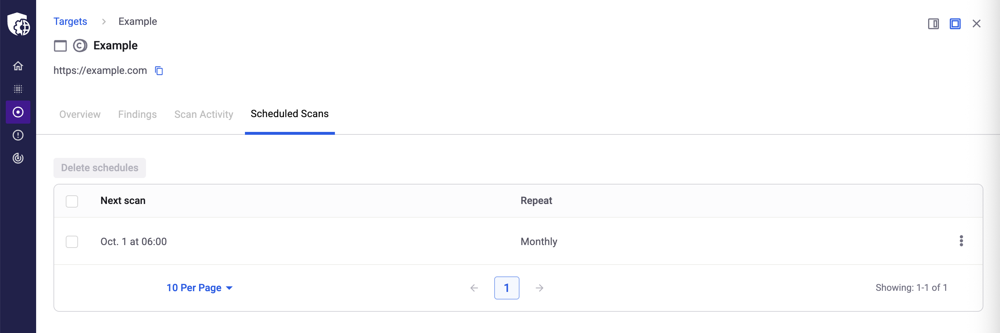

# How to schedule a scan

Learn how to schedule a target scan to run on specific dates and times.

You can set up a schedule so that scans start automatically on specific dates and times.

Creating a scheduled scan involves two steps:

1.  

    Select the action to create scheduled scans.

    

2.  

    Configure the scheduled scan by filling out a form.

    

This article describes these steps in detail.

# Step 1: Select the action

To start the creation of a scheduled scan for a single target, go to the **Targets** section and do one of the following:

- 

  From the [scan actions](https://help.probely.com/en/articles/8581476-actions-on-scans) available on the page, click the caret icon within the **Scan** button**,** and choose **Later**.

  

  

  

  

  

  

  

  \
  ​​

  

- 

  Alternatively, go to the Target details page (any tab), click the caret icon within the **Scan** button**,** and choose **Later**.

  

  

  

  

  

  

  

  

  

  

To start the creation of a scheduled scan for multiple targets, go to the **Targets** section and do the following:

1.  

    Tick the checkboxes to select the targets from the list. If all selected targets have scans in the same state, the button for bulk scan actions becomes available.

    

2.  

    Click the caret icon within the **Scan** button**,** and choose **Later**.

    

    

    

    

    

    

    

    

# Step 2: Configure the scheduled scan

In this step, fill out the form to configure the scheduled scan.\
​

Fill out the following fields:

- 

  **Start date** - The date on which the scan starts.

  

- 

  **Hour and Minute** - The time at which the scans start.

  

- 

  **Recurrence** - The recurrence of the scan:

  

  

  - 

    **None** - The scan runs only once.

    

  - 

    **Daily** - The scan runs every day.

    

  - 

    **Weekly** - The scan runs every week on the day of the week of the **Start date**.

    

  - 

    **Monthly/Quarterly** - The scan runs every month/quarter on the day (number) defined in the **Start date**. In this case, a **Repeat scans every** checkbox is displayed to configure a different day:**\
    ​**

    

    

    

    

    

    \
    In the first dropdown, choose the week of the month (First, Second, Third, Fourth, or Last).\
    In the second dropdown, choose the day of the week (Monday, Tuesday, etc.).

    

  

- 

  **Override the target settings** - Define the Target settings to use:

  

  

  - 

    If not checked, the scheduled scan will use the settings defined for each Target.

    

  - 

    If checked, choose the settings the scheduled scan will use for all Targets. Only the settings that are common to all Targets can be configured.

    

  

  

  This option is only available if all Targets are of the same type: either Web or API.

  

After completing the form, click **Add** to create the scheduled scan.

There are two areas in the Snyk API & Web app to list and manage scheduled scans:

- 

  **Global to the account** - List and manage scheduled scans for all the Targets of the account. Simply go to the **Scans** section and select the **Scheduled** tab.

  

- 

  **A specific target** - List and manage scheduled scans for a specific Target. Go to the **Targets** section, click on the Target to show its details, and click on the **Scheduled Scans** tab.

  

Did this answer your question?

😞

😐

😃

- 
- 
- 

<a href="https://www.intercom.com/intercom-link?company=Snyk+API+%26+Web&amp;solution=customer-support&amp;utm_campaign=intercom-link&amp;utm_content=We+run+on+Intercom&amp;utm_medium=help-center&amp;utm_referrer=https%3A%2F%2Fhelp.probely.com%2Fen%2Farticles%2F2489036-how-to-schedule-a-scan&amp;utm_source=desktop-web" class="pl-2 align-middle no-underline">We run on Intercom</a>

