# Overview of the Snyk API & Web Asset Discovery

Learn about the Snyk API & Web Asset Discovery to identify assets from your attack surface.

Oftentimes, people are not aware of all the assets (web apps and APIs) their organization has, which leads them to overlook their vulnerabilities and inadvertently have them (and the organization) exposed to potential cyber-attacks. With the Snyk API & Web Asset Discovery, you have a way of identifying your company’s assets so that you can effectively protect them before they become a liability.

# How does the Snyk API & Web Asset Discovery work?

This is a common question, and here we will give you an idea of what Snyk API & Web does behind the scenes when performing asset discovery.

The first thing we do is find the domains and sub-domains through the following techniques:

1.  

    **Cloudflare / AWS / Akamai**\
    Snyk API & Web connects to your configured cloud providers to help you discover your web assets. The type of assets Snyk API & Web accesses depends on the provider you have configured.

    

    

    If you have a Cloudflare or Amazon Web Services (AWS) connection configured in your account, Snyk API & Web connects to it to select the configured DNS zones and then the domains/sub-domains from those zones.

    

    

    If you have an Akamai connection configured, Snyk API & Web connects to it to obtain the configured APIs and domains.\
    ​

    

2.  

    **Certificate Transparency**\
    This is an Internet security standard for monitoring and auditing the issuance of digital certificates. Snyk API & Web searches Certificate Transparency to obtain and identify more domains.\
    ​

    

3.  

    **Domain Guessing**\
    At this stage, Snyk API & Web makes informed guesses about possible domains based on the ones that are already known. For example, if we have `www.example.com`, we can try `admin.example.com` or `api.example.com`.

    

With the first list of domains, Snyk API & Web does the following triage:

1.  

    Identifies for which IP (or IPs) each domain is resolved.

    

2.  

    Does a network/port scan for each IP to identify open services and their type.\
    Through that, Snyk API & Web tries to identify if it is a web app or an API.

    

The resulting domains/sub-domains for web apps and APIs become assets, and Snyk API & Web gets more detailed information about them:

1.  

    Takes screenshots of the web apps.

    

2.  

    And runs <a href="https://securityheaders.com/" rel="nofollow noopener noreferrer" target="_blank">Security Headers</a> to get a security score.

    

Assets are listed in the **Discovery** menu of the <a href="https://plus.probely.app/" rel="nofollow noopener noreferrer" target="_blank">Snyk API &amp; Web app</a>. The following sections of this article describe some concepts and common actions available in that page.

# Discovery Sources

When you add a source to your account, Snyk API & Web starts performing regular discovery scans to identify assets in the source’s attack surface.

There are four ways of adding a source:

- 

  By adding a **domain**.\
  Learn more about [How to scan a domain for Asset Discovery](https://help.probely.com/en/articles/9220773-how-to-scan-a-domain-for-asset-discovery).

  

- 

  By connecting to **Cloudflare**.\
  Learn more about [How to scan a Cloudflare connection for Asset Discovery](https://help.probely.com/en/articles/9220795-how-to-scan-a-cloudflare-connection-for-asset-discovery).

  

- 

  By connecting to **AWS**.

  

  

  Learn more about [How to scan an AWS connection for Asset Discovery](https://help.probely.com/en/articles/9220803-how-to-scan-an-aws-connection-for-asset-discovery).

  

- 

  By connecting to **Akamai**.\
  Learn more about [How to scan an Akamai connection for Asset Discovery](https://help.probely.com/en/articles/11769663-how-to-scan-an-akamai-connection-for-asset-discovery).

  

# Discovery Assets

The assets resulting from discovery scans are listed in the **Discovery** menu entry of the Snyk API & Web app.

Here, at the top of the page, Snyk API & Web provides valuable information that you can use as quick filters to help you manage your assets and focus your attention on the ones that matter the most:

<a href="https://downloads.intercomcdn.com/i/o/r3ylwg3q/1486214518/f7b71148712950c7d50a388ecafc/Screenshot+2025-04-21+at+15_24_08+2.png?expires=1769985000&amp;signature=9b0507728c4465949f5617c3468a8e1b0c2fd4cbe62515901d895fe018ab0c84&amp;req=dSQvEMt%2FmYReUfMW1HO4zU1wZYdhO4LLdEHWbk6c0yZyLad7qYt35h5zwosf%0AUh6yFmMwEJ8XEcG6NvI%3D%0A" target="_blank" rel="noreferrer nofollow noopener">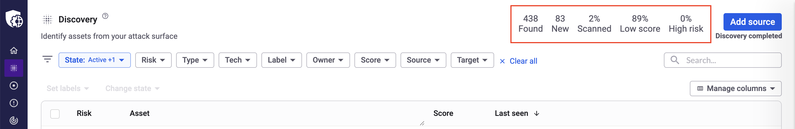</a>

- 

  **Found** - The total number of assets found so far. If you click on it, the list will show all the assets found.

  

- 

  **New** - The total number of newly found assets. If you click on it, the list will only show the newly found assets.

  

- 

  **Scanned** - The percentage of assets that were already added as targets to your Snyk API & Web account and were scanned, meaning they have a risk level associated. If you click on it, the list will only show the assets that match this criteria.

  

- 

  **Low score** - The percentage of assets with a Security Headers score of C or less. If you click on it, the list will only show assets with a score within this range.

  

- 

  **High risk** - The percentage of assets already added as targets to your Snyk API & Web account, which were scanned and identified as High risk. If you click on it, the list will only show the assets that match this criteria.

  

In addition to the quick filters above, you can use the search box (on the right) and the more generic filters to help you navigate the list.

<a href="https://downloads.intercomcdn.com/i/o/r3ylwg3q/1486215502/b38cc309ef32712fe9f7c4312aa5/Screenshot+2025-04-21+at+15_24_08+3.png?expires=1769985000&amp;signature=6021f974888da88238efb562c61791a2070e0329e84659309742fec35d6f2545&amp;req=dSQvEMt%2FmIRfW%2FMW1HO4zfaaADmkkoeFwWPu96b0Y3YQ69ZTbNqhzt0%2BvR9V%0Apfu%2FoOxV6GdtYUnL%2B6E%3D%0A" target="_blank" rel="noreferrer nofollow noopener">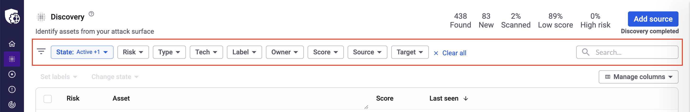</a>

# Discovery Asset Details

To view the details of a specific asset, click on its name in the list. This opens a side panel where you can see all associated vulnerabilities (**Findings**) and begin fixing them.

For more detailed guidance, see our article on [how to interpret target scan results](https://help.probely.com/en/articles/6843262-how-to-interpret-target-scan-results).

<a href="https://downloads.intercomcdn.com/i/o/r3ylwg3q/1480696229/4b6e25051227276914fa5fc824fd/discovery_assets_details_NEW.png?expires=1769985000&amp;signature=0da3e4cb6c11bd79e62f8bec957419c059492dd427f701909a729471f0418b69&amp;req=dSQvFs93m4NdUPMW1HO4zVSBdLtRffX%2FDA20TJLHzEwdffAvXErjjd%2BkqNZy%0AXj6I0Cg8SycVWaYJwaA%3D%0A" target="_blank" rel="noreferrer nofollow noopener">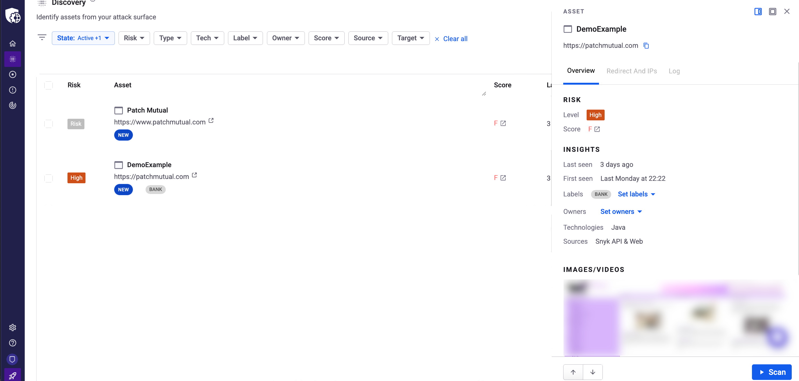</a>

\
​

This panel shows the asset's name and URL, and has 3 tabs, each of them with useful information to help you manage your assets:

- 

  Overview

  

- 

  Redirect And IPs

  

- 

  Log

  

In the first tab, you can see 3 sections:

- 

  Risk

  

  

  - 

    The asset's Risk classification (which is only set after the asset was added as a target and scanned at least once)

    

  - 

    The Security Headers score (with a link to the respective Security Headers details page)

    

  

- 

  Insights

  

  

  - 

    When it was last seen

    

  - 

    When it was seen for the first time

    

  - 

    Labels and owners, if any have been set

    

  - 

    The list of technologies found on the asset

    

  - 

    How it was discovered

    

  

- 

  Images

  

  

  - 

    A thumbnail of the asset’s screenshot (which you can see in detail by clicking on it).

    

  

In the second tab, you can see the following lists:

- 

  **Redirect from** - The list of URLs that redirect to the asset, if any.

  

- 

  **Redirect to** - The list of URLs to which the asset is redirected, if any.

  

- 

  **IP** - The list of IP addresses of the asset.

  

Finally, in the third tab, you can see the list of events associated with that asset, namely scans performed, risk or score updates, and detection of new technologies. Here you can also add notes for your team to see.

Note: You can switch between a small side panel and a full page by clicking on the buttons that appear at the top of the panel.

<a href="https://downloads.intercomcdn.com/i/o/r3ylwg3q/1486235383/7abee384d49d5a6b68aa4c823293/Screenshot+2025-04-21+at+15_36_55+2.png?expires=1769985000&amp;signature=d4a4909f2f2f018d203754cf3d9bde0785a9a50695d3c59e1e1055dcc58c8537&amp;req=dSQvEMt9mIJXWvMW1HO4zUneFrrTUKo3GNv7GeZlJdSC3k7%2FHwr3Ob6poW1e%0ARTe00gAkBGJQKwYbGX4%3D%0A" target="_blank" rel="noreferrer nofollow noopener">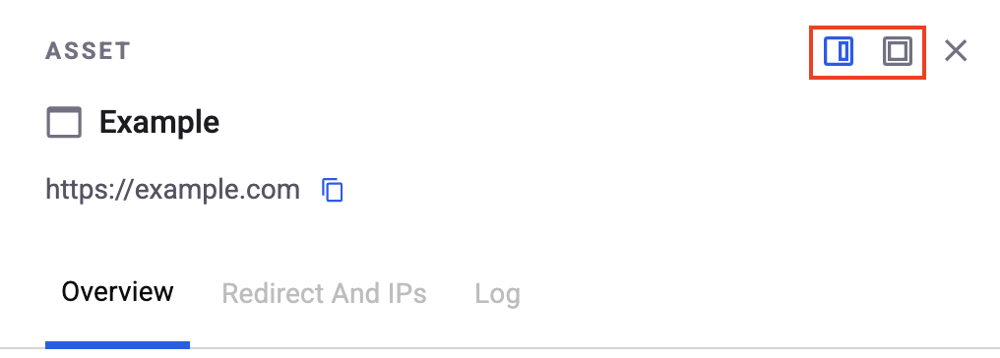</a>

# Actions on Discovery Assets

## Add Target and Scan

If you decide to, you can add assets as targets to your Snyk API & Web account in order to scan them for vulnerabilities. For that, use the **Add target** button in the asset’s row.

<a href="https://downloads.intercomcdn.com/i/o/r3ylwg3q/1422898302/ec1f52bb382570e5a65e0a7e31e4/Screenshot+2025-03-14+at+15_48_16.png?expires=1769985000&amp;signature=bc2881c40b8014fa910c3dd0acaff39efda7ecb9fd784f3cb338fd908a9559e1&amp;req=dSQlFMF3lYJfW%2FMW1HO4zT%2Fzke7r%2FYzZUOmFQcF3PRZdJ77sHu2stTFexwyv%0AGKSzwLlbw%2BUk9fTg54g%3D%0A" target="_blank" rel="noreferrer nofollow noopener">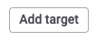</a>

After adding an asset as a target, the **Add target** button changes to a **Scan** button, which you can click to start scanning it for vulnerabilities.

<a href="https://downloads.intercomcdn.com/i/o/r3ylwg3q/1422898978/dbe9502ff2044f2c4ea9e1721374/Screenshot+2025-03-14+at+15_48_20.png?expires=1769985000&amp;signature=7f6464599dd0315f202c5a50b1016a91b75b22183f8be515eb6b6f330a5cbf11&amp;req=dSQlFMF3lYhYUfMW1HO4zRgLuMquC1baHyQcakTpW3e2CkuXyv2L5NQmQ7A1%0AFPiXxrAX8IehL%2F0n0fM%3D%0A" target="_blank" rel="noreferrer nofollow noopener">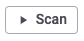</a>

After the target scan has finished, the **Risk** label of the corresponding asset is updated with the risk identified during the target scan.

<a href="https://downloads.intercomcdn.com/i/o/r3ylwg3q/1422901339/a2bfd8e02705a8e2a9f9a2a92d64/Screenshot+2025-03-14+at+15_50_01.png?expires=1769985000&amp;signature=98ee12656cd0a8c8de41802828f678fc29a15e65c3a52c7a84154e24fd40b798&amp;req=dSQlFMB%2BnIJcUPMW1HO4zf7vnspjuufYkFtkjaYWL3nOkQ0W9ROC8FB4hcqW%0AkS19iPWimOyd6CAJ6t4%3D%0A" target="_blank" rel="noreferrer nofollow noopener">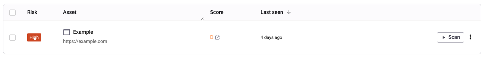</a>

To access a target's details, click on the 3 vertical dots that appear next to the Scan button to display the overflow menu and choose **View target**. From there, you can start analyzing its vulnerabilities (Findings), and start fixing them. Learn more about it in this article on [how to interpret target scan results](https://help.probely.com/en/articles/6843262-how-to-interpret-scan-results).

<a href="https://downloads.intercomcdn.com/i/o/r3ylwg3q/1710796094/76d9db41f2a07d30f2f95fdce361/Screenshot%2B2025-09-05%2Bat%2B13_11_01.png?expires=1769985000&amp;signature=74ea76633a7e0714e7b358921c1b83116966fe2938bf064e07198dddce86c118&amp;req=dScmFs53m4FWXfMW1HO4zcKp3zOdC6Qb2K3sXns0f1vwpmaS4601T3akoBvW%0A3CtbK0biMI0HfzLKpgA%3D%0A" target="_blank" rel="noreferrer nofollow noopener">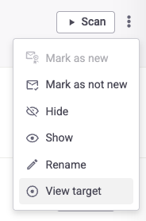</a>

​

## Mark as new/not new

Clicking on the 3 vertical dots that appear next to the main action button (**Add target** / **Scan** / **Stop** button) shows an overflow menu. The first 2 options, **Mark as new / Mark as not new**, let you identify the asset as new/not new, respectively. This action, along with the State filter, lets you better organize and prioritize your list of assets.

<a href="https://downloads.intercomcdn.com/i/o/r3ylwg3q/1422904465/28bc5c569ceac3e1afc329b70414/Screenshot+2025-03-14+at+15_51_31.png?expires=1769985000&amp;signature=e9f8d7d535a73880fa1608de5f9975b9107c48ea10ff07468a54e9b486dd613c&amp;req=dSQlFMB%2BmYVZXPMW1HO4zcrsazrh5wTWRx2Dyib2QoWDdhHLGQlqfgoLnu6l%0A1FAZ5dcFGoiUHt76T1o%3D%0A" target="_blank" rel="noreferrer nofollow noopener">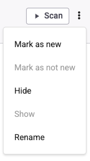</a>

## Hide/Show

Clicking on the 3 vertical dots that appear next to the main action button (**Add target** / **Scan** / **Stop** button) shows an overflow menu. The option **Hide** lets you better organize and prioritize your list of assets by hiding the ones you’re not interested in at the moment. These assets don’t disappear, they’re just filtered out of the default view; you can always filter them by choosing the “Hidden” option in the “State” filter and, if at any point you decide those assets are relevant again, you can get more visibility over them by clicking on the **Show** option.

## Rename

Clicking on the 3 vertical dots that appear next to the main action button (**Add target** / **Scan** / **Stop** button) shows an overflow menu. The last option, **Rename**, opens a modal prompt that allows you to update the asset name.

Since assets and targets are synced together, updating an asset name will also update its matching target’s name. The opposite is also true: by updating the target name, the asset name will also be updated automatically.

<a href="https://downloads.intercomcdn.com/i/o/r3ylwg3q/1422906564/80423bcfdc7de8f59be1a2ba1337/Screenshot+2025-03-14+at+15_52_36.png?expires=1769985000&amp;signature=16cb9f1697f5798aecb288dc3989ee989eaf4e7beab05c191142acfd6d35b2ce&amp;req=dSQlFMB%2Bm4RZXfMW1HO4zXwhA22Gx7Oga3f8q4ek05h6xpucNPSl0X4lqRfD%0AIpsU10uO6u6iPnVllBw%3D%0A" target="_blank" rel="noreferrer nofollow noopener">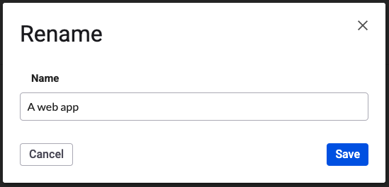</a>

## Set labels

You can assign labels to assets the same way you would to targets; in fact, these are synced between assets and targets, so applying a label to an asset will also automatically apply it to the respective target and vice versa.

You can click on the **Set labels** dropdown to assign one or multiple labels; filter existing labels by typing in the search field, or create new ones and apply them in a single step!

<a href="https://downloads.intercomcdn.com/i/o/r3ylwg3q/1480772397/97e835557a7aec4ba02407354336/discovery_assets_set_labels_NEW.png?expires=1769985000&amp;signature=10983bc9ce04f19c38f0cb4c379f6a7bd807a2596b35c6f7f1a1aaf323bf3d1a&amp;req=dSQvFs55n4JWXvMW1HO4zXPRH8NjbPHGl92nmWLjnq%2FyOUNCLvoruF1CHExK%0APb4%2FIqNFdM%2BbE4whasU%3D%0A" target="_blank" rel="noreferrer nofollow noopener">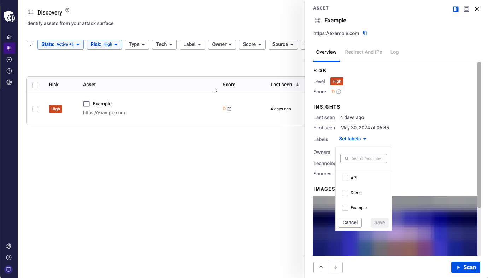</a>

## Set owners

You can assign user labels to assets, to identify their owners. To do so, click on the **Set owners** dropdown to assign one or multiple user labels; filter existing labels by typing in the search field, or create new ones and apply them in a single step!

<a href="https://downloads.intercomcdn.com/i/o/r3ylwg3q/1480774197/af35f21fc430c32e32501f277d45/discovery_assets_set_owners_NEW.png?expires=1769985000&amp;signature=f332175b43abb90d213e835b4e2de90f2133cfaf6602e614e69e8c40031007ba&amp;req=dSQvFs55mYBWXvMW1HO4zYZ4pn2LlwL5AE4YxnQXyz71DpDcPng1V4w2ev9F%0AcuojW1lo4%2Bht0SXi%2BKs%3D%0A" target="_blank" rel="noreferrer nofollow noopener">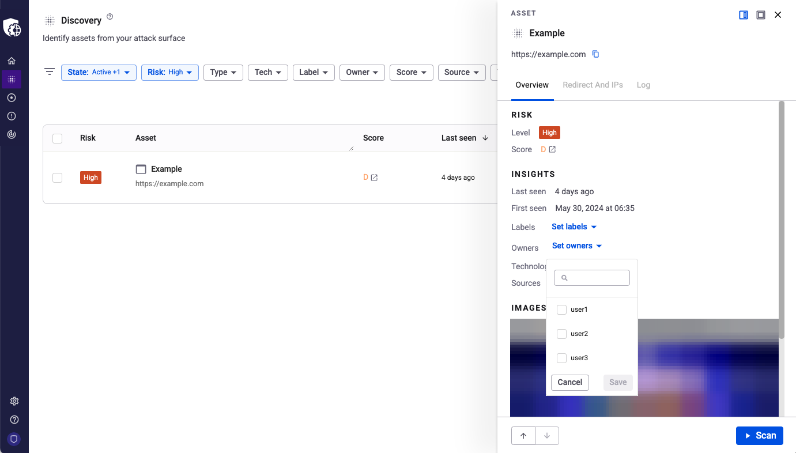</a>

## Logs

You can click on the **Log** tab that appears on the asset’s details to open the logs of that asset since it was first discovered.

In the expanded view of the side panel, you can search for specific log messages or filter them with the Event Type dropdown, or even add notes like you would for findings.

# Bulk Actions on Discovery Assets

To improve your asset management, you can take certain actions in bulk. Just check the checkboxes of the assets that interest you, and the bulk actions will become available at the top of the list.

<a href="https://downloads.intercomcdn.com/i/o/r3ylwg3q/1486231079/5d48f3afc5efe300015f30fc3a64/discovery_bulk.png?expires=1769985000&amp;signature=270b0488e89cd79d0a66b796e0fbb2c251290a9bad39c9abd04fec995c534605&amp;req=dSQvEMt9nIFYUPMW1HO4zej%2BoqHdjgj7dFLo5eUSJdbIbp31zGfJPkhU10Wx%0Afb4btXM6ZHhN5sYBlOc%3D%0A" target="_blank" rel="noreferrer nofollow noopener">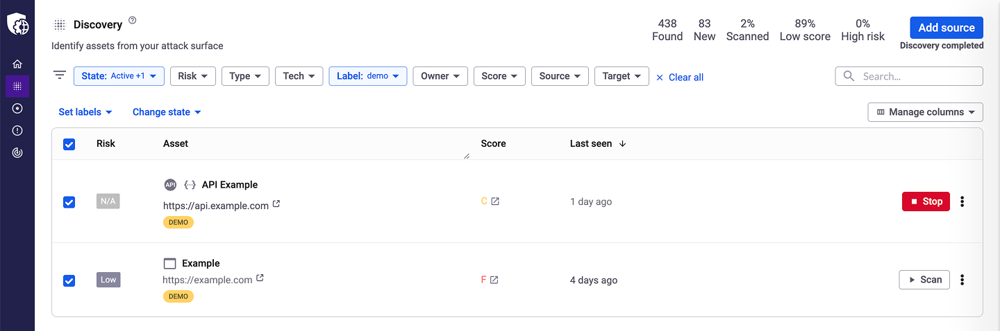</a>

Here you can choose to:

- 

  **Set labels** - Apply labels to assets to help you filter and manage them. For example, you can set a **CRITICAL** label on those assets that are most critical to protect in your organization, bringing attention to them. Note that labels assigned to assets will also be synced to the respective targets.\
  ​

  

- 

  **Change state** - Change the state of a group of assets. For example, you can “hide” assets that are not important so that you can focus on the ones that matter the most. If you change your mind, rest assured that you can “show” them again at any time. You can also set assets as “new” so you don’t miss them, or as “not new”, if you decide you’ve done all you need with them.

  

Did this answer your question?

😞

😐

😃

- 
- 
- 

<a href="https://www.intercom.com/intercom-link?company=Snyk+API+%26+Web&amp;solution=customer-support&amp;utm_campaign=intercom-link&amp;utm_content=We+run+on+Intercom&amp;utm_medium=help-center&amp;utm_referrer=https%3A%2F%2Fhelp.probely.com%2Fen%2Farticles%2F9220762-overview-of-the-snyk-api-web-asset-discovery&amp;utm_source=desktop-web" class="pl-2 align-middle no-underline">We run on Intercom</a>

