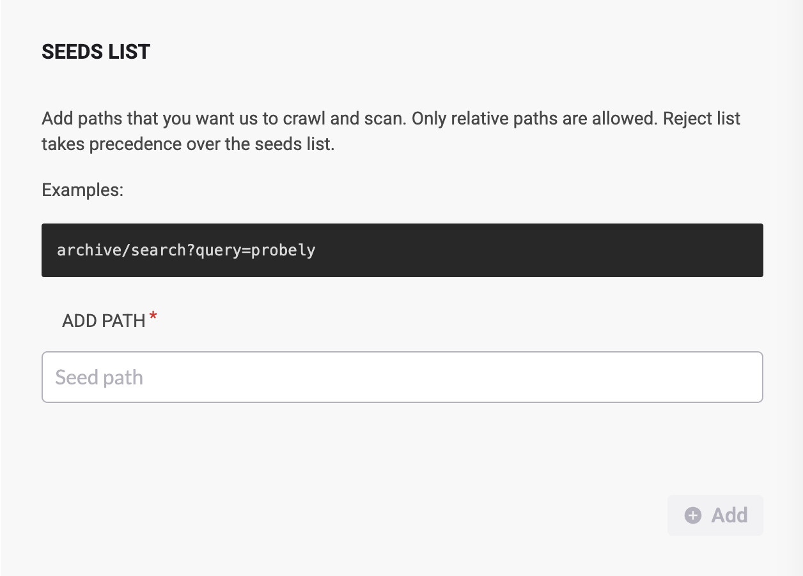
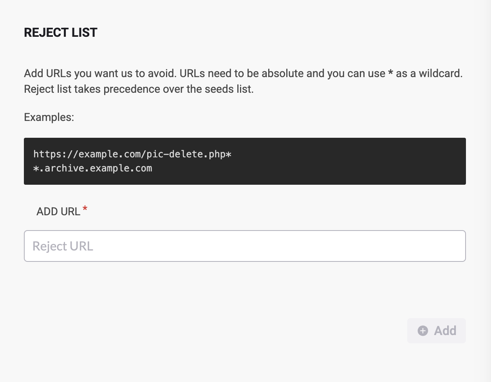
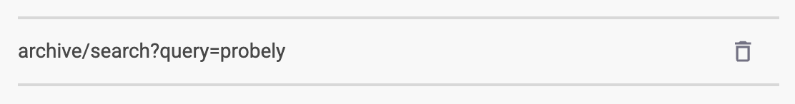

# How to use Seeds and Reject lists

Learn how to use Seeds and Reject lists to optimize target scans.

The Seeds and Reject lists allow you to control the behavior of your target scans by including or excluding areas of the target from scans.

For example, if an area in the target can’t be reached in scans (e.g., an admin area that is only reached through a direct link), add it to the Seeds list to be included in scans. On the other hand, if there’s a critical area being scanned in the target (e.g., a form that sends e-mails to the users) and you don’t want it to be tested, you can add it to the Reject list to exclude it from scanning.

The Seeds list allows you to add areas of the target that otherwise would be “hidden” and not caught by scans. This helps to ensure that scans cover everything you need in the target’s scope.

The Reject List allows you to limit what we visit on the target. It's a collection of URLs that the crawler is instructed to avoid. This helps to exclude unnecessary or sensitive content, such as login pages and logout options, private user data, or repetitive structures like paginated lists.

<table>
<colgroup>
<col style="width: 100%" />
</colgroup>
<tbody>
<tr>
<td style="background-color: #fff2cc">

Keep in mind that the Reject list takes <strong>precedence</strong> over the Seeds list: areas in the Seeds list will be ignored if they match areas in the Reject list.

</td>
</tr>
</tbody>
</table>

# Using the Seeds List

Add the area you want to include in the target scans to the Seeds list as follows:

1.  

    In the <a href="https://plus.probely.app/" rel="nofollow noopener noreferrer" target="_blank">Snyk API &amp; Web app</a>, go to the **Targets** entry.

    

2.  

    Find the target in the list and click on the cogwheel to edit its settings.

    

3.  

    In the **SCANNER** tab, go to the **SEEDS LIST** section, type the path to the area to include in scans in **ADD PATH**, and click on **Add**.\
    You can add more than one path, and they must be relative to the target URL.

    

Scans will follow these paths and explore them, thus expanding the reach across the target.\
​

# Using the Reject List

Add the area you want to exclude from the target scans to the Reject list as follows:

1.  

    In the <a href="https://plus.probely.app/" rel="nofollow noopener noreferrer" target="_blank">Snyk API &amp; Web app</a>, go to the **TARGETS** tab.

    

2.  

    Find the target in the list and click on the cogwheel to edit its settings.

    

3.  

    In the **SCANNER** tab, go to the **REJECT LIST** section, type the area to exclude from scans in **ADD URL**, and click on **Add**.\
    The URLs you type must be absolute, and you can use **\*** as a wildcard.

    

Scans will not follow these paths, thus avoiding these areas in the target scans.

Remember, you can always delete entries in these lists as your scanning needs evolve. To remove an entry, simply click the trash icon.

This tailored approach ensures that “hidden” areas are thoroughly tested while sensitive or unnecessary areas are excluded, which helps optimize your scanning process.

For further details or to explore related topics, please check out the links below:

- 

  [How to add a target](https://help.probely.com/en/articles/5733114-how-to-add-a-target)

  

Did this answer your question?

😞

😐

😃

- 
- 
- 

<a href="https://www.intercom.com/intercom-link?company=Snyk+API+%26+Web&amp;solution=customer-support&amp;utm_campaign=intercom-link&amp;utm_content=We+run+on+Intercom&amp;utm_medium=help-center&amp;utm_referrer=https%3A%2F%2Fhelp.probely.com%2Fen%2Farticles%2F9777912-how-to-use-seeds-and-reject-lists&amp;utm_source=desktop-web" class="pl-2 align-middle no-underline">We run on Intercom</a>

