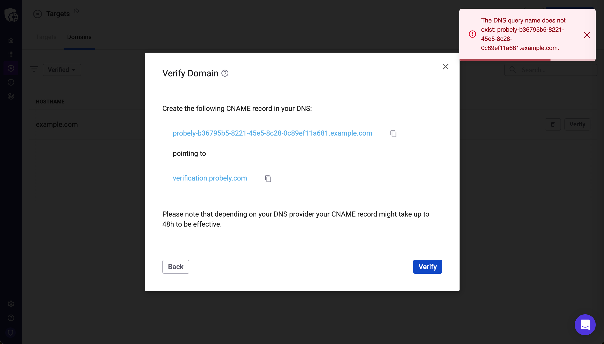
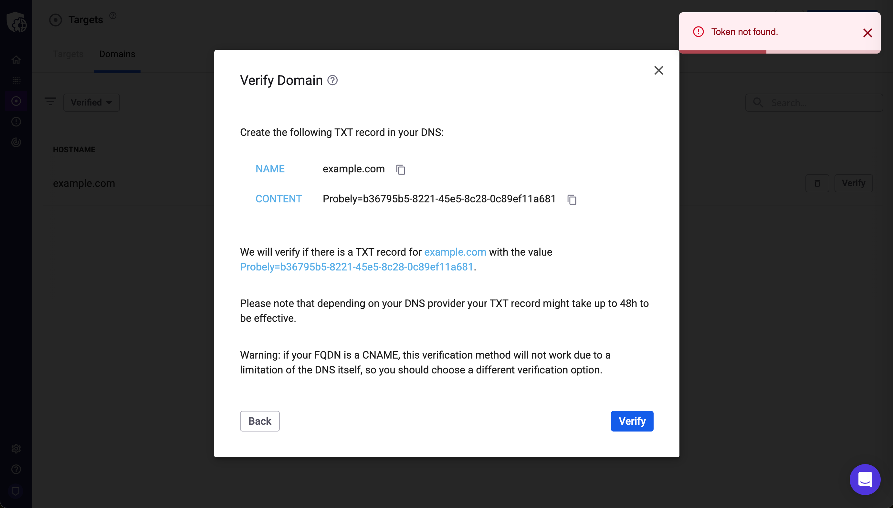

# Troubleshooting: Can’t verify a domain using DNS

Learn how to troubleshoot issues when verifying a domain using CNAME or TXT records in the DNS.

In order for Snyk API & Web to run full-fledged scans on your target, you need to verify its domain. Learn more about [why do we require you to verify the ownership of a domain](https://help.probely.com/en/articles/3285602-why-do-we-require-you-to-verify-the-ownership-of-your-target).

# The problem

Domain verification using CNAME or TXT records in your DNS fails with the following errors:

- 

  DNS (CNAME) error: `The DNS query name does not exist: <your CNAME record>`\
  ​

  

  

  

  

  

  

  

  

- 

  DNS (TXT) error: `Token not found`\
  ​

  

  

  

  

  

  \
  ​

  

# Troubleshoot the problem

To troubleshoot this problem, go through the following steps to identify the possible causes and respective solutions to fix it.\
​

## Step: Check the TTL value

Check the Time to Live (TTL) as follows:

1.  

    Go to <a href="https://toolbox.googleapps.com/apps/dig/" rel="nofollow noopener noreferrer" target="_blank">https://toolbox.googleapps.com/apps/dig/</a> and type the target's URL.

    

2.  

    Depending on your domain verification method, click on **CNAME** or **TXT** to see the TTL value.

    

If the TTL value is high, the DNS configuration with the CNAME / TXT record has not been propagated yet, and the domain verification fails.

<table>
<colgroup>
<col style="width: 50%" />
<col style="width: 50%" />
</colgroup>
<tbody>
<tr>
<td style="background-color: #cccccc">

<strong>Cause</strong>

</td>
<td style="background-color: #cccccc">

<strong>Solution</strong>

</td>
</tr>
<tr>
<td>

The DNS configuration with the CNAME / TXT record has not been propagated yet.

</td>
<td>

Wait more time for the DNS configuration to propagate, or go to your authoritative DNS server (e.g., Cloudflare) and reduce the TTL value.

</td>
</tr>
</tbody>
</table>

After following these steps, identifying the causes, and applying the respective solutions, you should be able to verify your domain using a meta tag.

Learn more about this subject in the following articles:

- 

  [Why do we require you to verify the ownership of the domain](https://help.probely.com/en/articles/3285602-why-do-we-require-you-to-verify-the-ownership-of-your-target)

  

- 

  [Verifying your domain](https://help.probely.com/en/collections/3869012-verifying-your-target)

  

- 

  [How to verify the ownership of a domain using DNS (CNAME Records)](https://help.probely.com/en/articles/5642359-how-to-verify-the-ownership-of-a-target-using-dns-cname-records)

  

- 

  [How to verify the ownership of a domain using DNS (TXT Records)](https://help.probely.com/en/articles/3285635-how-to-verify-the-ownership-of-a-target-using-dns-txt-records)

  

Did this answer your question?

😞

😐

😃

- 
- 
- 

<a href="https://www.intercom.com/intercom-link?company=Snyk+API+%26+Web&amp;solution=customer-support&amp;utm_campaign=intercom-link&amp;utm_content=We+run+on+Intercom&amp;utm_medium=help-center&amp;utm_referrer=https%3A%2F%2Fhelp.probely.com%2Fen%2Farticles%2F9657976-troubleshooting-can-t-verify-a-domain-using-dns&amp;utm_source=desktop-web" class="pl-2 align-middle no-underline">We run on Intercom</a>

