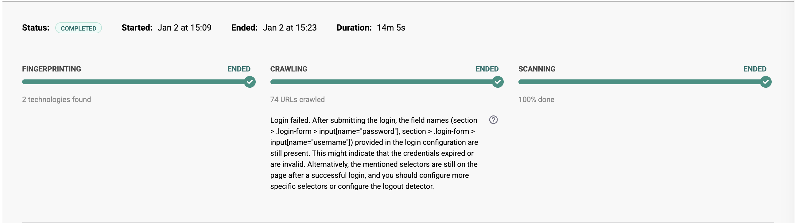

# Troubleshooting: Login failed in target authentication with a login form

Learn how to troubleshoot issues in target authentication with a login form.

In targets with authentication, Snyk API & Web scans must log in to reach areas reserved for authenticated users to scan them for vulnerabilities.

# The problem

When running scans on a target with a login form, Snyk API & Web fails to log in.\
​

# Troubleshoot the problem

To troubleshoot this problem, go through the following steps to identify the possible causes and respective solutions to fix it.

## Step 1: Test the current credentials

Test if the current credentials configured in the target settings are still valid, as follows:

1.  

    In the Snyk API & Web, go to the **TARGETS** tab.

    

2.  

    Identify the target in the list and click on the cogwheel to open its settings.

    

3.  

    In the **AUTHENTICATION** tab, check the **LOGIN FORM** configuration, get the URL of the login form, and the current login credentials.

    

4.  

    Open a browser and type the target’s login URL.

    

5.  

    Log in with the current credentials.

    

If the login fails, check the following possible causes and apply the respective solution:

<table>
<colgroup>
<col style="width: 50%" />
<col style="width: 50%" />
</colgroup>
<tbody>
<tr>
<td style="background-color: #e8e8e8">

<strong>Cause</strong>

</td>
<td style="background-color: #e8e8e8">

<strong>Solution</strong>

</td>
</tr>
<tr>
<td>

The credentials are invalid.

</td>
<td>

Obtain valid login credentials and update them in the target settings.

Learn more about <a href="https://help.probely.com/en/articles/3292779-how-to-set-up-target-authentication-with-a-login-form">How to set up Target Authentication with a Login Form</a>.

</td>
</tr>
<tr>
<td>

The credentials expired.

</td>
<td>

Obtain new login credentials and update them in the target settings.

Learn more about <a href="https://help.probely.com/en/articles/3292779-how-to-set-up-target-authentication-with-a-login-form">How to set up Target Authentication with a Login Form</a>.

</td>
</tr>
</tbody>
</table>

## Step 2: Test the login flow

Test if the login flow is still a login form, as follows:

1.  

    Open a browser and type the target’s login URL.

    

If the login is not a login form, the target authentication fails.

Check the following possible causes and apply the respective solution:

<table>
<colgroup>
<col style="width: 50%" />
<col style="width: 50%" />
</colgroup>
<tbody>
<tr>
<td style="background-color: #e8e8e880">

<strong>Cause</strong>

</td>
<td style="background-color: #e8e8e880">

<strong>Solution</strong>

</td>
</tr>
<tr>
<td>

The login flow is not a login form but a complex login (e.g., multi-step login).

</td>
<td>

Configure the target authentication to use a login sequence, which supports complex logins.

Learn more about <a href="https://help.probely.com/en/articles/5402712-how-to-set-up-target-authentication-with-a-login-sequence">How to set up Target Authentication with a Login Sequence</a>.

</td>
</tr>
</tbody>
</table>

## Step 3: Check the field names

Check the values configured in field names in the target authentication with a login form as follows

1.  

    In the Snyk API & Web, go to the **TARGETS** tab.

    

2.  

    Identify the target in the list and click on the cogwheel to open its settings.

    

3.  

    In the **AUTHENTICATION** tab, go to the **LOGIN FORM** configuration to see the configured **field names** (typically, one for the username and another for the password).

    

4.  

    Open a browser and type the target’s login URL.

    

5.  

    Right-click and select **Inspect** to see the attributes of the input fields on the login form.

    

6.  

    In the **LOGIN FORM** configuration, check if the values set in the **field names** for the input fields contain a valid “id”, “name”, or CSS selector from the login form.

    

If the values configured in the **field names** are not valid, Snyk API & Web scans cannot authenticate.

Check the following possible causes, and apply the respective solution:

<table>
<colgroup>
<col style="width: 50%" />
<col style="width: 50%" />
</colgroup>
<tbody>
<tr>
<td style="background-color: #e8e8e880">

<strong>Cause</strong>

</td>
<td style="background-color: #e8e8e880">

<strong>Solution</strong>

</td>
</tr>
<tr>
<td>

The value configured in a <strong>field name</strong> does not contain a valid “id”, “name”, or CSS selector that identifies that input field in the login form.

</td>
<td>

Go to the target authentication settings and set the value of the <strong>field name</strong> with the “id,” “name,” or the CSS selector that uniquely identifies that input field in the login form.

Learn more about <a href="https://help.probely.com/en/articles/3292779-how-to-set-up-target-authentication-with-a-login-form">How to set up Target Authentication with a Login Form</a>.

</td>
</tr>
</tbody>
</table>

## Step 4: Test for a blocking WAF

Test if there is a WAF blocking access to the authentication page with the login form as follows:

1.  

    Open a browser in incognito mode and type the target’s URL.

    

2.  

    Go to the authentication page with the login form.

    

If a WAF blocks access to the authentication page with the login form, Snyk API & Web scans cannot authenticate.

Check the following possible causes and apply the respective solution:

<table>
<colgroup>
<col style="width: 50%" />
<col style="width: 50%" />
</colgroup>
<tbody>
<tr>
<td style="background-color: #e8e8e880">

<strong>Cause</strong>

</td>
<td style="background-color: #e8e8e880">

<strong>Solution</strong>

</td>
</tr>
<tr>
<td>

A WAF is blocking access to the authentication page with the login form.

</td>
<td>

Add Snyk API &amp; Web IPs to the WAF’s whitelist.

Learn more about <a href="https://help.probely.com/en/articles/8931142-how-to-configure-probely-s-ips-in-wafs">How to configure Snyk API &amp; Web IPs in WAFs</a>.

</td>
</tr>
</tbody>
</table>

After following these steps, identifying the causes, and applying the respective solutions, scans should be able to log in to your target.

Learn more about this subject in the following articles:

- 

  [Scanning Targets with Authentication](https://help.probely.com/en/articles/9177848-scanning-targets-with-authentication)

  

- 

  [How to set up Target Authentication with a Login Form](https://help.probely.com/en/articles/3292779-how-to-set-up-target-authentication-with-a-login-form)

  

- 

  [How to set up Target Authentication with a Login Sequence](https://help.probely.com/en/articles/5402712-how-to-set-up-target-authentication-with-a-login-sequence)

  

Did this answer your question?

😞

😐

😃

- 
- 
- 

<a href="https://www.intercom.com/intercom-link?company=Snyk+API+%26+Web&amp;solution=customer-support&amp;utm_campaign=intercom-link&amp;utm_content=We+run+on+Intercom&amp;utm_medium=help-center&amp;utm_referrer=https%3A%2F%2Fhelp.probely.com%2Fen%2Farticles%2F9639573-troubleshooting-login-failed-in-target-authentication-with-a-login-form&amp;utm_source=desktop-web" class="pl-2 align-middle no-underline">We run on Intercom</a>

