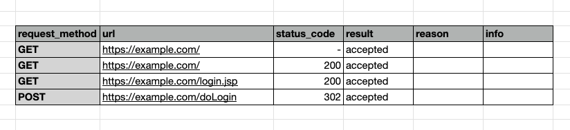

# Troubleshooting: Low coverage in a scan

Learn how to troubleshoot issues in a target scan with low coverage.

Scans should cover as much of the target scope as possible to identify the maximum number of vulnerabilities. Learn more about [how to generate a coverage report](https://help.probely.com/en/articles/3292591-how-to-generate-a-csv-coverage-report) and [what is the meaning of the coverage report?](https://help.probely.com/en/articles/5522983-what-is-the-meaning-of-the-csv-coverage-report)

# The problem

When running a scan on a target, the coverage is low.\
​

# Troubleshoot the problem

To troubleshoot this problem, go through the following steps to identify the possible causes and respective solutions to fix it.

## Step 1: Check for target authentication

If the target has authentication, check if the scanner was able to log in:

1.  

    In the Snyk API & Web, go to the **TARGETS** tab.

    

2.  

    Identify the target in the list, and click on its name to see its details.

    

3.  

    Click on **SCAN ACTIVITY** to see the list of scans.

    

4.  

    Identify the scan in the list, and click on **VIEW**.

    

5.  

    Click on **CRAWLING REPORT** to get the spreadsheet with the scanned URLs.

    

6.  

    Identify URLs that are only available for authenticated users.

    

If no URLs for authenticated users are listed, the scan must have failed to log in.

<table>
<colgroup>
<col style="width: 50%" />
<col style="width: 50%" />
</colgroup>
<tbody>
<tr>
<td style="background-color: #e8e8e8">

<strong>Cause</strong>

</td>
<td style="background-color: #e8e8e8">

<strong>Solution</strong>

</td>
</tr>
<tr>
<td>

The scan failed to log in to the target.

</td>
<td>

Check the target authentication configuration.

Learn more about <a href="https://help.probely.com/en/collections/9914791-troubleshooting-target-autentication">Troubleshooting Target Authentication</a>.

&#10;
</td>
</tr>
</tbody>
</table>

## Step 2: Check for missing SPA API

If the target is a SPA (Single-Page Application) with a backing API, check if the API is in a different URL. For example:

- 

  SPA URL: <a href="https://example.com" rel="nofollow noopener noreferrer" target="_blank">https://example.com</a>

  

- 

  SPA API URL: <a href="https://api.example.com" rel="nofollow noopener noreferrer" target="_blank">https://api.example.com</a>

  

  

  

If the backing API has a URL different from the SPA, Snyk API & Web scans need to know the API URL to scan the SPA properly.

<table>
<colgroup>
<col style="width: 50%" />
<col style="width: 50%" />
</colgroup>
<tbody>
<tr>
<td style="background-color: #e8e8e880">

<strong>Cause</strong>

</td>
<td style="background-color: #e8e8e880">

<strong>Solution</strong>

</td>
</tr>
<tr>
<td>

The target is a SPA with its backing API in a different URL.

</td>
<td>

Go to the target settings, and add an extra host with the URL of the backing API.

&#10;
</td>
</tr>
</tbody>
</table>

## Step 3: Check for a blocking WAF

Check if scan requests started being blocked by a WAF after the scan has started:

1.  

    In the Snyk API & Web, go to the **TARGETS** tab.

    

2.  

    Identify the target in the list, and click on its name to see its details.

    

3.  

    Click on **SCAN ACTIVITY** to see the list of scans.

    

4.  

    Identify the scan in the list, and click on **VIEW**.

    

5.  

    Click on **CRAWLING REPORT** to get the spreadsheet with the scanned URLs.

    

6.  

    Check if, at some point, the URLs started having HTTP error status 403.

    

7.  

    Open a browser in incognito mode, type those URLs to test them, and see if a WAF is blocking the access.

    

If a WAF starts blocking access to URLs, Snyk API & Web cannot scan them.

<table>
<colgroup>
<col style="width: 50%" />
<col style="width: 50%" />
</colgroup>
<tbody>
<tr>
<td style="background-color: #e8e8e880">

<strong>Cause</strong>

</td>
<td style="background-color: #e8e8e880">

<strong>Solution</strong>

</td>
</tr>
<tr>
<td>

A WAF started blocking access to the URLs during the scan.

</td>
<td>

Add Snyk API &amp; Web IPs to the WAF’s whitelist.

Learn more about <a href="https://help.probely.com/en/articles/8931142-how-to-configure-probely-s-ips-in-wafs">How to configure Snyk API &amp; Web IPs in WAFs</a>.

</td>
</tr>
</tbody>
</table>

## Step 4: Check for blocking WordPress plugin

If the target is WordPress, check if scan requests are being blocked by a WordPress plugin (e.g., WordFence):

1.  

    In the Snyk API & Web, go to the **TARGETS** tab.

    

2.  

    Identify the target in the list, and click on its name to see its details.

    

3.  

    Click on **SCAN ACTIVITY** to see the list of scans.

    

4.  

    Identify the scan in the list, and click on **VIEW**.

    

5.  

    Click on **CRAWLING REPORT** to get the spreadsheet with the scanned URLs.

    

6.  

    Check if the URLs have HTTP error status 403.

    

7.  

    Open a browser in incognito mode, type those URLs to test them, and see if a WordPress plugin is blocking the access.

    

If a WordPress plugin is blocking access to URLs, Snyk API & Web cannot scan them.

<table>
<colgroup>
<col style="width: 50%" />
<col style="width: 50%" />
</colgroup>
<tbody>
<tr>
<td style="background-color: #e8e8e880">

<strong>Cause</strong>

</td>
<td style="background-color: #e8e8e880">

<strong>Solution</strong>

</td>
</tr>
<tr>
<td>

A WordPress plugin (e.g., WordFence) is blocking access to the URLs.

</td>
<td>

Configure the WordPress plugin to allow requests from Snyk API &amp; Web IPs.

Refer to this article <a href="https://help.probely.com/en/articles/1975548-what-is-the-scanner-s-outgoing-ip-address">What is the scanner's outgoing IP address?</a>

</td>
</tr>
</tbody>
</table>

After following these steps, identifying the causes, and applying the respective solutions, scans should have the expected coverage for your targets.

Learn more about this subject in the following articles:

- 

  [What is the meaning of the coverage report?](https://help.probely.com/en/articles/5522983-what-is-the-meaning-of-the-csv-coverage-report)

  

- 

  [How to generate a coverage report?](https://help.probely.com/en/articles/3292591-how-to-generate-a-csv-coverage-report)

  

Did this answer your question?

😞

😐

😃

- 
- 
- 

<a href="https://www.intercom.com/intercom-link?company=Snyk+API+%26+Web&amp;solution=customer-support&amp;utm_campaign=intercom-link&amp;utm_content=We+run+on+Intercom&amp;utm_medium=help-center&amp;utm_referrer=https%3A%2F%2Fhelp.probely.com%2Fen%2Farticles%2F9662415-troubleshooting-low-coverage-in-a-scan&amp;utm_source=desktop-web" class="pl-2 align-middle no-underline">We run on Intercom</a>

