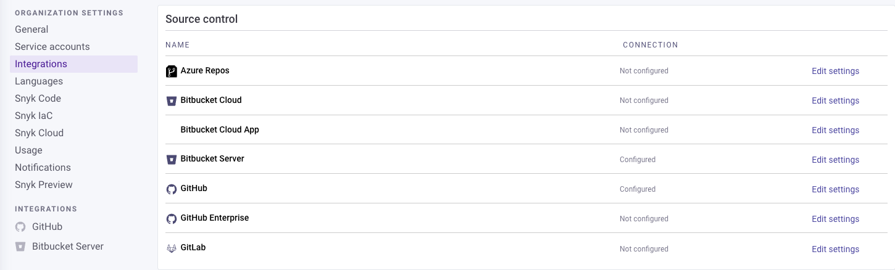

# Configure Snyk Code

## Conditions

To use [Snyk Code in the IDE](use-snyk-code-in-the-ide.md), [Snyk CLI](../../snyk-cli/scan-and-maintain-projects-using-the-cli/snyk-cli-for-snyk-code/), and [Snyk API](../../snyk-api/), you need to perform the following actions

1. [Enable Snyk Code in Snyk Web UI](configure-snyk-code.md#enable-snyk-code-in-snyk-web-ui)
2. [Integrate Git repository with Snyk](configure-snyk-code.md#integrate-git-repository-with-snyk)
3. [Import repositories to scan with Snyk Code](configure-snyk-code.md#import-repositories-to-scan-with-snyk-code)

Snyk Code only scans and tests new repositories that are imported to Snyk. If a repository has already been imported, Snyk Code analysis will not be applied. To analyze repositories that have already been imported, you will need to [re-import them](import-repository-to-snyk/#re-import-repository-to-snyk).

## Prerequisites for using Snyk Code in Snyk Web UI

Before scanning your code with Snyk Code, ensure the following:

* You have completed [Quickstart](../../getting-started/quickstart/).
* Your repositories contain code in a [supported language and platform](../supported-languages-and-frameworks/).&#x20;

## Enable Snyk Code in Snyk Web UI

### Prerequisites

To enable Snyk Code in your Organization, you need to be an [Org Admin](../../snyk-admin/manage-permissions-and-roles/pre-defined-user-roles.md).

### Enable Snyk Code&#x20;

If you've already [set up an integration for the first time](../../getting-started/quickstart/set-up-an-integration.md) and enabled Snyk Code, you can check if the setting is still valid before importing repositories.

1. Log in to the Snyk Web UI and select your [Group and Organization](../../snyk-admin/manage-groups-and-organizations/).
2. Navigate to **Settings** > **Snyk Code**.
3. In the **Enable Snyk Code** section, change the setting to **Enabled**.
4. Click **Save changes**.

<figure><figcaption>
Enable Snyk Code setting
</figcaption></figure>

The next step is to [integrate your Git repositories with Snyk](configure-snyk-code.md#integrate-git-repository-with-snyk).

## Integrate Git repository with Snyk

After you have activated Snyk Code and imported repositories to Snyk for testing, you can view and work with the Snyk Code test results, which include vulnerabilities and fixes. See [Exploring and working with the Snyk Code results](manage-code-vulnerabilities/).


If your SCM is already integrated with your Snyk Account, and you do not want to add additional SCMs, you can skip this step and move to [Importing repositories for Snyk Code testing](broken-reference).

\
If you are using Snyk Code with the API, but not the CLI, this step is mandatory.


After you enable Snyk Code in your Snyk Organization settings to work in the Web UI or with the API but not the CLI, you must integrate your account with the Git repository you want to test.

Then, you can import the required repositories to your Snyk account, and Snyk Code automatically analyzes them and displays the analysis results.


Snyk Code temporarily clones your repositories for code analysis. This requires appropriate permissions and HTTPS access to your SCM.

For more information on how data is stored in Snyk, see [How Snyk handles your data](../../working-with-snyk/how-snyk-handles-your-data.md). For more details about integrations, see [Integrate with Snyk](../../integrate-with-snyk/).


To integrate your SCM with your Snyk account:

1\. In the Snyk Web UI, navigate to **Settings** > **Integrations** > **Source control**.


If you already have an integrated SCM, it is marked as **Configured**. If you want to use the configured SCM, continue with[ Importing repositories to Snyk for the Snyk Code testing](broken-reference).


2\. From the available options, select the SCM system you want to integrate by clicking **Edit settings**.

The **Source control** integrations display only SCMs that are supported by Snyk Code.

<figure><figcaption>
Source control options for Snyk Code
</figcaption></figure>

3\. On the integration page, enter your account credentials and save your details.

This grants Snyk access permissions for the integrated SCM.

For more information on integrating Snyk with each of the available SCMs, see [Git repositories (SCMs)](../../integrate-with-snyk/git-repositories-scms-integrations-with-snyk/).

After you have integrated the SCM with your Snyk account, you can import the repositories you want to scan using Snyk Code.

## Import repositories to scan with Snyk Code

After you enable Snyk Code and integrate your Git repository with Snyk, you must import the repositories you want Snyk Code to scan for vulnerabilities.

Depending on your existing Snyk account and what you want to do:

* If you do not have any repositories in your Snyk account, [import your first repository to Snyk](../../getting-started/quickstart/import-a-project.md)**.**
* If you already have repositories in your Snyk account and do not want to import additional ones but want to scan your existing repositories with Snyk Code, you must [re-import these repositories](import-repository-to-snyk/#re-import-repository-to-snyk).
* If you already have repositories in your Snyk account and want to import more repositories to scan with Snyk Code, [import additional repositories to Snyk](import-repository-to-snyk/).

Before you import or re-import a repository to scan with Snyk Code, you can [exclude certain directories and files from the import by using the .snyk file](import-repository-to-snyk/excluding-directories-and-files-from-the-import-process.md).

## What's next?

* View vulnerabilities in your code
* Manage code vulnerabilities
