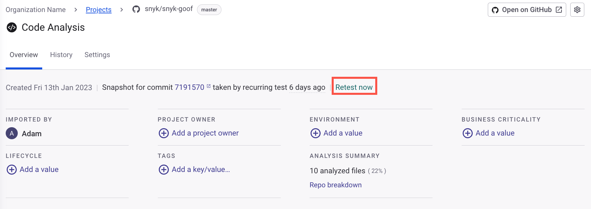
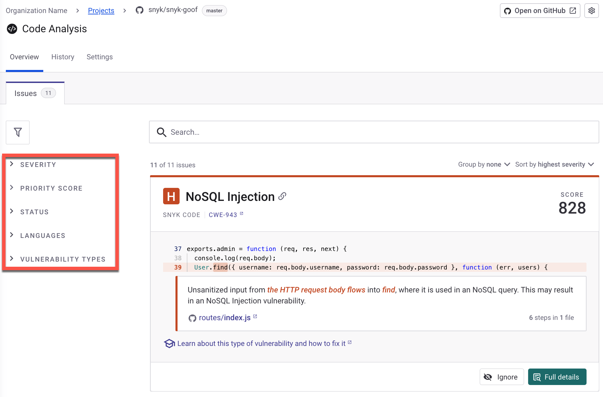
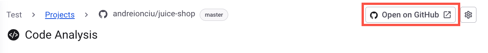
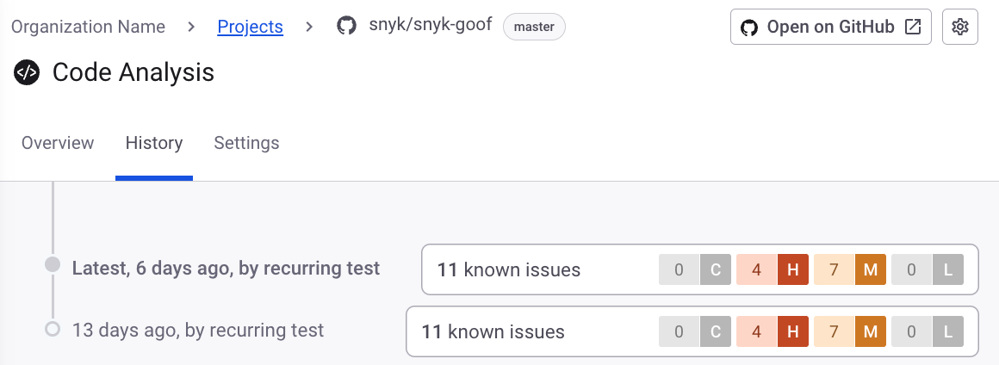

# Manage code vulnerabilities

## Prerequisites for managing code vulnerabilities in Snyk Web UI&#x20;

Before managing vulnerabilities with Snyk Code, ensure the following:

* You have completed the steps in [Getting started](../../../discover-snyk/getting-started/).
* Your repositories contain code in a [supported language and platform](../../../supported-languages/supported-languages-package-managers-and-frameworks.md).&#x20;
* You have [configured Snyk Code](../configure-snyk-code.md).

## How Project testing for Snyk Code works

Each time a Project is tested, Snyk Code takes a snapshot of the repository in its current state and analyzes it to find vulnerabilities.  All the files that contain source code that Snyk Code can analyze are aggregated in the Code analysis.

When you import a repository, Snyk creates a Target folder that contains different Snyk Projects based on the file types present in the repository. The name of the Target folder includes the repository name, the integrated Git repository account name and its icon, and the number of Snyk Projects created for the repository.

Snyk Code creates a single Project for all the imported files from a repository. This aggregates vulnerabilities detected in the repository code into one Project, presenting the data flow of a vulnerability issue across multiple files.

Automate importing multiple repositories using the API endpoint [Import targets](../../../snyk-api/reference/import-projects-v1.md#org-orgid-integrations-integrationid-import).

## Code testing from import to retest

The following provides an overview of the testing process in Snyk Code based on the testing phases.

<table><thead><tr><th width="250">Phase</th><th>Description</th></tr></thead><tbody><tr><td><a href="../import-project-with-snyk-code.md">Import repository</a></td><td>Performed when you import a repository.</td></tr><tr><td><a href="../../../snyk-platform-administration/snyk-projects/view-and-edit-project-settings.md">Schedule recurring tests</a></td><td>Automatically performed when you schedule them.</td></tr><tr><td><a href="./#retesting-code-repository">On demand testing (retesting code repository)</a></td><td>Performed on demand when you select <strong>Retest now</strong>.</td></tr></tbody></table>

### Retesting code repository

If you want to check for the most recent vulnerabilities in your repository, you can do a manual test by selecting the **Retest now** option. This will trigger Snyk Code to take a fresh snapshot of your repository and analyze its source code files. The results will then be displayed on the Code Analysis page. Take into consideration that Snyk counts a manual test as a new test. See [What counts as a test?](../../../snyk-data-and-governance/what-counts-as-a-test.md)

You can also use the **Retest now** option to apply the exclusion rules of the `.snyk` file to an imported repository. See [Exclude directories and files from Project import](../../import-project-repository/exclude-directories-and-files-from-project-import.md).

<figure><figcaption>
Retesting repository 
</figcaption></figure>

## Project filters

The Projects page on Snyk Web UI has a filter pane that categorizes Snyk Projects and shows the number of matching Projects for each criterion. See [Project information](../../../snyk-platform-administration/snyk-projects/project-information.md).

The **Grouping by File or Vulnerability Type** feature offers the following additional options:

* **Group by File**: This option helps identify specific files that contain multiple vulnerabilities, enabling you to focus on problematic files that may need more rigorous review or refactoring.
* **Group by Vulnerability Type**: This option categorizes vulnerabilities by their type, such as SQL Injection or Cross-Site Scripting (XSS), assisting in addressing the most prevalent types of vulnerabilities within your codebase.

## Vulnerability issues

You can change the display of the issues on the Code analysis page using the following options:

### Group by **File** or **Vulnerability Type**&#x20;

Identify problematic files with multiple issues or address frequent vulnerability types. Use these filtering options to determine where vulnerabilities are likely to cluster together.

### Sort by Severity level

Sort vulnerability issues by displaying those with the highest severity levels first, followed by those with lower severity levels.

### Filter vulnerabilities by criteria

Filter discovered vulnerability issues according to different criteria shown in the following table.

<table><thead><tr><th width="232">Vulnerability issue filter</th><th>Description</th></tr></thead><tbody><tr><td><a href="../../../manage-risk/prioritize-issues-for-fixing/severity-levels.md">Severity level</a></td><td>Show issues with a certain severity level. Snyk Code uses only <strong>High</strong>, <strong>Medium</strong>, and <strong>Low</strong> severity levels, without <strong>Critical</strong>. </td></tr><tr><td><a href="../../../manage-risk/prioritize-issues-for-fixing/priority-score.md#calculation-of-priority-score">Priority score</a></td><td>Show issues in a certain priority score range.</td></tr><tr><td>Status</td><td>Show <strong>Open</strong> issues or issues that were <strong>Ignored</strong>.</td></tr><tr><td><a href="../../../supported-languages/supported-languages-package-managers-and-frameworks.md">Languages</a></td><td>Show issues that were discovered in code files that were written in a specific language. Only programming languages discovered in the analyzed repository are displayed in the Filter pane.</td></tr><tr><td><a href="../snyk-code-security-rules/">Vulnerability types</a></td><td>Show issues with a certain Vulnerability Type. See <a href="../snyk-code-security-rules/">Snyk Code security rules</a>.</td></tr></tbody></table>

<figure><figcaption>
Vulnerability issue filtering, sorting, and grouping
</figcaption></figure>

## **Scan for code vulnerabilities**

To scan your repositories and manage code vulnerabilities, you can check the following actions.

### View vulnerabilities in a repository

1. Log in to the Snyk Web UI and select your [Group and Organization](../../../snyk-platform-administration/groups-and-organizations/).
2. Navigate to the **Projects** and select the Target folder containing your repository's Projects.
3. Open **Code analysis** Project to see all vulnerability issues detected by Snyk Code.

To understand the results, see [Breakdown of Code analysis](breakdown-of-code-analysis.md).&#x20;

### Import additional repositories

If you have existing Projects in your Snyk account, you can add additional repositories for Snyk to test. See [Import repository to Snyk](../import-project-with-snyk-code.md).

### Remove repositories from testing

You can remove the Code analysis Project or delete imported repositories if you no longer need to test them for vulnerabilities. See [Remove imported repository](../../import-project-repository/remove-imported-repository-from-a-project.md).

### Exclude directories and files

To exclude specific files and directories from being imported by Snyk Code, you need to create a `.snyk` YAML policy file in your repository. See [Exclude directories and files from Project import](../../import-project-repository/exclude-directories-and-files-from-project-import.md).

You can specify directories to exclude from the import process using the Exclude dialog box when you import repositories through Git repository. However, this feature is only supported for open-source dependency scans (SCA).

### Open repository external link&#x20;

To access the repository on the integrated Git repository platform, navigate to the Code analysis Project and select the name of the repository.

<figure><figcaption>
External repository link
</figcaption></figure>

### View Project history

The result history is shown on the **History** page of the **Code Analysis** Project. This page displays the snapshots taken when a test was performed. You can review Snyk Code test results for all the testing phases. See [Code testing from import to retest](./#code-testing-from-import-to-retest).

On the **History** page, only two distinct snapshots are displayed. A snapshot is deemed unique if either the repository or its associated vulnerability findings have altered since the last assessment, resulting in a snapshot that showcases these changes. If there have been no changes in the repository or the vulnerability results since the last test, the new snapshot will replicate the prior one. Consequently, this will be listed as an additional test run on the **History** page. This means while the page may present multiple test entries, only up to two will feature distinct results.

To view Project history:

1. Log in to the Snyk Web UI and select your [Group and Organization](../../../snyk-platform-administration/groups-and-organizations/).
2. Navigate to the **Projects** and select the Target folder containing your repository's Projects.
3. Open **Code analysis** Project and navigate to **History**.
4. Select a test from the list to view the Project historical snapshot.
5. (Optional) Select **View most recent snapshot**. This option is not available when the most recent snapshot is open.

<figure><figcaption>
Snyk Code Project history
</figcaption></figure>

### Manage Project settings

Manage Project settings as follows:

* Schedule recurring tests: [Configure Test & Automated Pull Request Frequency](../../../snyk-platform-administration/snyk-projects/#test-frequency-settings).
* Retrieve the Project ID: [Retrieve the unique identifier for the Project](../../../snyk-platform-administration/snyk-projects/#project).
* Deactivate Project: [Temporarily disable the Project without deleting any data](../../../snyk-platform-administration/snyk-projects/#delete-activate-or-deactivate).
* Delete the Project: [Permanently remove the Project and all associated data](../../../snyk-platform-administration/snyk-projects/#delete-activate-or-deactivate).

## Tracking vulnerabilities across code changes

Snyk Code goes beyond simple static analysis by tracking vulnerabilities across multiple scans, even as your codebase evolves. This ensures consistent and accurate vulnerability management, regardless of code refactoring, file renaming, or positional changes.\
\
Consider a scenario where a vulnerability exists in `file1.js` on line 45. After a code refactor, the vulnerability persists but is now located in a different file and line. To effectively address such scenarios, Snyk Code employs a sophisticated issue-tracking system. To tracks vulnerabilities\
Snyk Code performs the following:

1. Fingerprint matching:
   * Generates a min-hash of the code's syntax tree for each vulnerability.
   * Calculates nearest neighbors from these hashes to identify similar vulnerabilities across scans.
2. File position comparison:
   * Analyzes file paths and line numbers to account for code movement.
   * Calculates similarity based on directory, filename, and line/column changes.

### Final confidence scoring

Snyk Code combines the results of fingerprint matching, file position comparison, and historical weighting to generate a final confidence score. This score indicates the likelihood that two vulnerabilities from different scans are the same.

For example, if a vulnerability in `utils/auth_utils.js` is moved to `utils/auth_helpers.js` and the line number changes. Snyk Code's algorithms would perform the following:

* Identify a new vulnerability in `utils/auth_helpers.js` and generate a fingerprint from its AST.
* Compare the new vulnerability's fingerprint with issues found in the previous scan.
* Identify a high fingerprint similarity despite minor AST changes.
* Recognize the high file path similarity due to the shared directory and similar file names.
* Account for the line number change while maintaining a high overall confidence score.
* Match the new vulnerability with the vulnerability with highest confidence score from the previous scan.

## What's next?

* [See the breakdown of Code analysis](breakdown-of-code-analysis.md)
* [Fix code vulnerabilities automatically](fix-code-vulnerabilities-automatically.md)
* [See Snyk Code security rules](../snyk-code-security-rules/)
