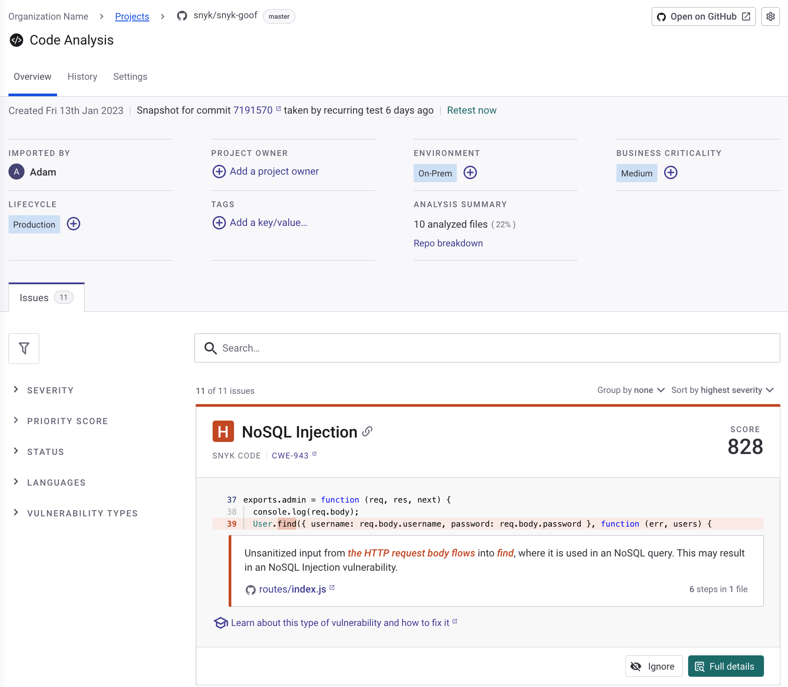
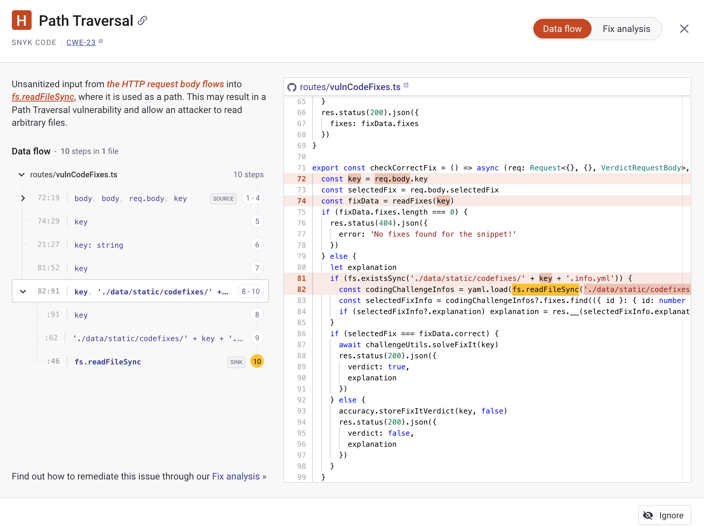
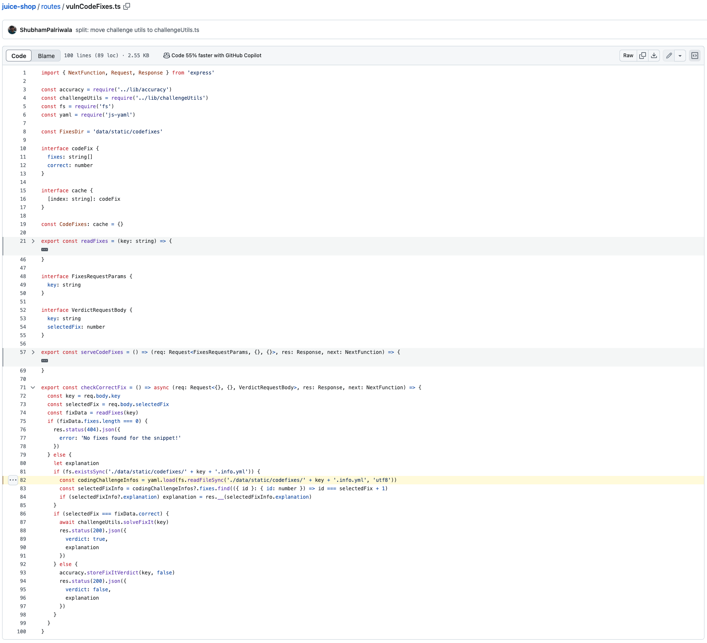
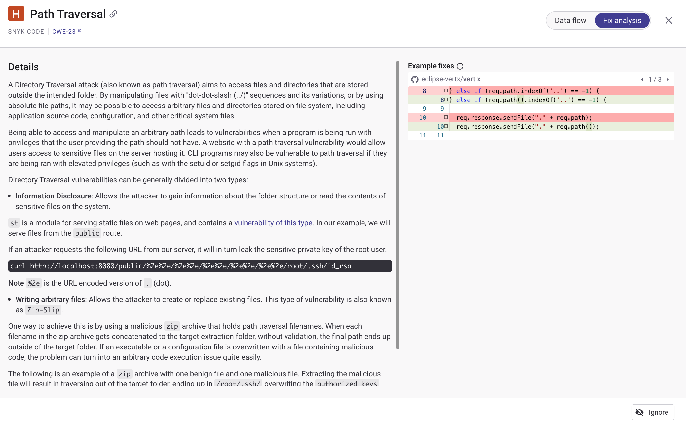
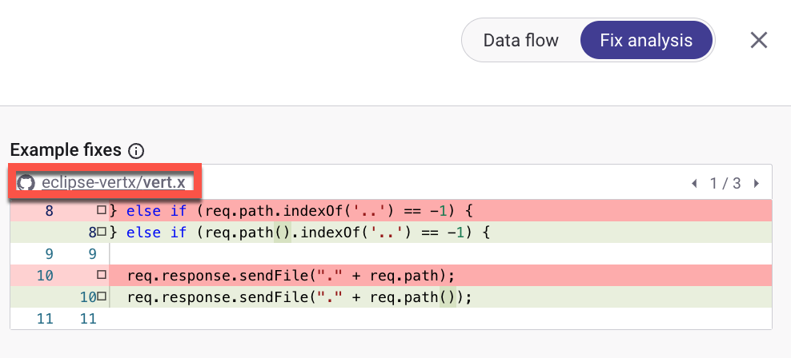

# Breakdown of Code analysis

When you import repositories, Snyk Code automatically tests for vulnerabilities within the imported code. The vulnerabilities detected across all files in a single repository are compiled into a Snyk Project, labeled as Code Analysis. Code Analysis presents the test outcome for a specific repository, listing all discovered vulnerabilities in the repository's source code.

<figure><figcaption>
The Code Analysis page
</figcaption></figure>

## Code analysis components

This table summarises the elements of a Code analysis Project.

<table><thead><tr><th width="160">Component</th><th>Description</th></tr></thead><tbody><tr><td>Header</td><td>Includes the details of the imported repository with a link to the repository in the Git repository, the Project name, and the Projects tabs: <strong>Overview</strong>, <strong>History</strong>, and <strong>Settings</strong>.</td></tr><tr><td>The Project Summary Information area</td><td>Includes the dates of the repository import and the last test of the repository, the Retest now option for an on-demand test, the name of the user who imported the repository, the name of the Project owner, and the number of code files that were analyzed and not analyzed. See <a href="./#retesting-code-repository">Retesting code repository</a></td></tr><tr><td><a href="../../../snyk-platform-administration/snyk-projects/project-information.md">Project filters</a></td><td>Includes a set of pre-defined criteria for filtering the displayed issues.</td></tr><tr><td>Vulnerability issues</td><td>Includes the vulnerability issues that Snyk Code discovered in the imported repository.</td></tr><tr><td><a href="breakdown-of-code-analysis.md#data-flow">Data flow</a></td><td>Displays the taint flow of the issue in the code.</td></tr><tr><td><a href="breakdown-of-code-analysis.md#fix-analysis">Fix analysis</a></td><td>Provides additional details about the discovered vulnerability type, best practices for preventing this issue, and code examples of fixes.</td></tr><tr><td>CWE</td><td>The CWE (Common Weakness Enumeration) ID of the specific vulnerability type and a link to the CWE website, where this vulnerability type is described. See <a href="breakdown-of-code-analysis.md#example-cwe-22-path-traversal">Example: CWE-22: Path Traversal</a>.</td></tr><tr><td><a href="./#open-repository-external-link">Open repository external link</a></td><td>Quick access to the integrated Git repository for immediate remediation.</td></tr><tr><td>Imported by</td><td>The Git repository username who imported the analyzed repository.</td></tr><tr><td><a href="../../../snyk-platform-administration/snyk-projects/project-information.md">Project owner</a></td><td>Identifies the lead for the Project in your Organization for administrative purposes only; it does not impact the Snyk Project itself. This is not a required field and is left blank by default. </td></tr><tr><td><a href="../../../snyk-platform-administration/snyk-projects/project-attributes.md">Environment</a></td><td>The Environment attribute describes the software's context, ranging from client-side (Frontend) to server-side (Backend), private (Internal) to public (External), across platforms like Mobile, Cloud (SaaS), On-Premises, Hosted services, and Distributed systems.</td></tr><tr><td><a href="../../../snyk-platform-administration/snyk-projects/project-attributes.md">Business criticality</a></td><td>When the Risk Score feature is enabled, the Business Criticality attribute automatically influences the score, scaling it to the most significant attribute level. See <a href="../../../manage-risk/prioritize-issues-for-fixing/risk-score.md">Risk Score</a>.</td></tr><tr><td><a href="../../../snyk-platform-administration/snyk-projects/project-attributes.md">Lifecycle</a></td><td>The Lifecycle attribute categorizes a Pro, Development, or Sandbox.</td></tr><tr><td><a href="../../../snyk-platform-administration/snyk-projects/project-tags.md">Tags</a></td><td>The Snyk Project tags feature enables the addition, removal, and use of custom metadata tags to organize and filter Projects, simplifying Project management and navigation.</td></tr><tr><td>Analysis summary</td><td>The number of code files analyzed in the repository and the percentage of the analyzed files out of the total repository code files.</td></tr><tr><td>Repo breakdown</td><td><ul><li><strong>Analyzed Files</strong>: Includes files that have been reviewed by Snyk Code, encompassing recognized extensions and programming languages.</li><li><strong>Unanalyzed Files:</strong> Consists of text files yet to be analyzed because of unsupported languages or extensions.</li><li><strong>Unknown</strong>: Files without recognized extensions, potentially including multimedia content (such as pictures and videos), binaries, proprietary format files, or any other formats that fall outside Snyk Code's scope of interest.</li></ul></td></tr></tbody></table>

## Data flow

Data flow shows the location of the discovered issue in your source code and how it flows throughout your application. It shows the taint flow of the issue in the code, with a step-by-step visualization from the source to the sink, presenting the code lines of all the steps in the flow.

The source is the input point of the potential problem. This is a point in the application where a user or an external device can enter data, which will potentially violate the security of the application. For example, in an SQL Injection issue, the source will be a form or any other data input area filled by a user.

The sink is the operation in the code where the application executes the problem. This point must receive clean input, or it can be exploited. For example, in an SQL Injection issue, the sink will be the internal operation that instructs the DB to perform certain actions according to the received input.

Every issue discovered by Snyk Code has a data flow. If an issue has only one step, for example, in the case of hardcoded secrets, the source of the issue will be displayed on the Data flow page.

### View Data flow

1. Log in to the Snyk Web UI and select your [Group and Organization](../../../snyk-platform-administration/groups-and-organizations/).
2. Navigate to the **Projects** and select the Target folder containing your repository's Projects.
3. Open **Code analysis** Project.
4. (Optional) [Search or filter for a specific vulnerability issue](./#vulnerability-issues).
5. Select a vulnerability issue and navigate to **Full details** > **Data flow**.
6. As part of the Data flow analysis, you can take the following actions:

* View the taint flow of an issue in your code from source to sink. See [Data flow analysis example](breakdown-of-code-analysis.md#data-flow-analysis-example).
* [Open Data flow external link in the integrated Git repository](breakdown-of-code-analysis.md#open-data-flow-external-link).
* Ignore the open vulnerability issue using the **Ignore** button. See [Ignore issues](../../../manage-risk/prioritize-issues-for-fixing/ignore-issues/).

### Data flow analysis example

In the following Path Traversal issue, the developer has not sanitized the input. This allows an attacker to perform a pass traversal attack to access any file in the file system, including sensitive data such as password files.

<figure><figcaption>
Data flow of a Path Traversal vulnerability issue
</figcaption></figure>

### Open Data flow external link

To open the displayed source code on the Git repository, select the file name above the right panel. In this example, the file name is "routes/profileImageUrlUpload.ts".

The source code appears in the integrated Git repository, showing you exactly where to fix the vulnerability. You can make the required fix to address the vulnerability in your code.

<figure><figcaption>
Vulnerability shown in the external source code
</figcaption></figure>

## Fix analysis

Fix analysis helps you fix the vulnerability issue discovered in your code. It provides details about the vulnerability type discovered, any available best practices for preventing this issue, and code examples of fixes from the global open-source community.

To explore in-depth details about the specific vulnerability identified, you can open the CWE link to understand more about the vulnerability type. See [CWE-22 ](breakdown-of-code-analysis.md#example-cwe-22-path-traversal)and [CWE-601 examples](breakdown-of-code-analysis.md#example-cwe-601-open-redirect).

Some vulnerabilities contain links to interactive lessons on understanding, fixing, and preventing vulnerability. See [Snyk Learn](https://learn.snyk.io/).

<figure><figcaption>
Fix analysis page for Path Traversal vulnerability
</figcaption></figure>

### View Fix analysis&#x20;

1. Log in to the Snyk Web UI and select your [Group and Organization](../../../snyk-platform-administration/groups-and-organizations/).
2. Navigate to the **Projects** and select the Target folder containing your repository's Projects.
3. Open **Code analysis** Project.
4. (Optional) [Search or filter for a specific vulnerability issue](./#vulnerability-issues).
5. Select a vulnerability issue and navigate to **Full details** > **Fix analysis**.
6. As part of the Fix analysis, you can take the following actions:

* View the discovered issue and ways to prevent it.
* Examine fix examples from the global open-source community by reviewing and browsing through code samples.
* View the code diff of the fix example that appears in the integrated Git repository, showing you how this vulnerability was fixed. See [Open Fix analysis external link in the integrated Git repository](breakdown-of-code-analysis.md#data-flow-analysis-example).
* Ignore the open vulnerability issue using the **Ignore** button. See [Ignore issues](../../../manage-risk/prioritize-issues-for-fixing/ignore-issues/).

The **Fix analysis** page enables you to do the following:

### **Open Fix analysis external link**

To open the code fix for the vulnerability on the Git repository, select the Git repository above the right panel. This will show you the differences in the Git repository code that address the issue. In this example, the Git repository name is "eclipse-vertx/vert.x".

<figure><figcaption>
Fix analysis of a Path Traversal vulnerability issue
</figcaption></figure>

The fix appears in the Git repository, showing you exactly where to fix the vulnerability. You can make the required fix to address the vulnerability.

<figure><figcaption>
Source code external link in Fix analysis
</figcaption></figure>

## Severity score factors

Snyk Code reports issues by severity levels: High, Medium, and Low. Snyk Code currently does not use the Critical severity level. The severity score is based on the following factors:

* Qualities intrinsic to a vulnerability
* Evolution of vulnerability over a lifetime

### **Exceptions**

If a vulnerability is detected in code, filename, or folder with the word `test`, it is deemed a low-severity vulnerability. This applies to all languages. The severity of CWEs may change depending on the environment.

## Priority score factors

Use the Priority Score to filter and prioritize discovered issues based on their importance, risk, frequency, and availability of a Fix analysis.

A Priority Score for each issue can be between 0 and 1,000, which changes automatically if one of its factors changes. For example, if the Severity Level of an issue has increased or decreased, the Priority Score of the issue changes accordingly.

You can filter issues in the Code analysis Project by Priority Score using the **PRIORITY SCORE** slider to set the range of the scores you want to display (see [View issues by Priority Score](../../../manage-risk/prioritize-issues-for-fixing/priority-score.md#view-issues-by-priority-score)).

<table><thead><tr><th width="209">Priority Score factor</th><th>Description</th></tr></thead><tbody><tr><td><a href="breakdown-of-code-analysis.md#severity-score-factors"><strong>Severity Level</strong></a></td><td>The higher the severity level, the higher the security risk of the issue. Each severity level adds a different Score to the issue. The Score can be, at most, 500 points. Currently, Snyk Code does not use the Critical severity level.</td></tr><tr><td><a href="breakdown-of-code-analysis.md#fix-analysis"><strong>Fix analysis</strong></a></td><td>When an issue has a real-world fix example, it is marked as easier to fix, with a higher Priority Score. The Score can be, at most, 200 points. When Fix analysis is available, it is displayed in the <strong>Full Details</strong> panel of the issue on the <strong>Fix analysis</strong> tab.</td></tr><tr><td><strong>Issue occurrence in a Project</strong></td><td>The number of times a specific issue appears in the <strong>Code Analysis</strong> Project. The higher the frequency, the higher the risk and the Score. The Score can be, at most, 100 points.</td></tr><tr><td><strong>Issue occurrence in a File</strong></td><td>The number of times an issue appears in a specific file. The higher the frequency, the higher the risk and the Score. The Score can be, at most, 100 points.</td></tr><tr><td><strong>Community Projects</strong></td><td>The number of times an issue was fixed in external open-source Projects that Snyk examined. The Score can be, at most, 100 points.</td></tr><tr><td><a href="../../../snyk-platform-administration/snyk-projects/project-tags.md"><strong>Project tags</strong></a></td><td>

When an issue has a Project tag, it decreases the Priority Score by 100 points. This internal tag can be one of the following:
<ul><li>Test - The issue was found in a test file.</li><li>Beta - The vulnerability type of the issue is in Beta status. These internal tags are automatically assigned by Snyk Code analysis, and they are not visible on the Web UI.</li></ul></td></tr></tbody></table>

### Quantitative factors

* Severity scores from other SAST products where information is publicly available
* Severity scores from identifying similar vulnerabilities in the Snyk Vulnerability database

### Qualitative factors&#x20;

* The severity of source, direct versus indirect
* Prevalence and impact of the sink
* Security team experience and research
* Customer feedback

## Example: CWE-22: Path Traversal

For CWE-22 Path Traversal, if the vulnerability occurs in a test, it is Low severity. If not, and it comes from a direct source, it is High severity. Otherwise, it is Low severity.

<figure><figcaption>
Decision flow chart for Priority Score CWE-22 Path Traversal
</figcaption></figure>

## Example: CWE-601: Open Redirect

For CWE-2601 Open Redirect, if the vulnerability occurs in a test, it is Low severity. If not, and it comes from a direct source, it is Medium severity.

<figure><figcaption>
Decision flow chart for Priority Score CWE-601 Open Redirect
</figcaption></figure>
