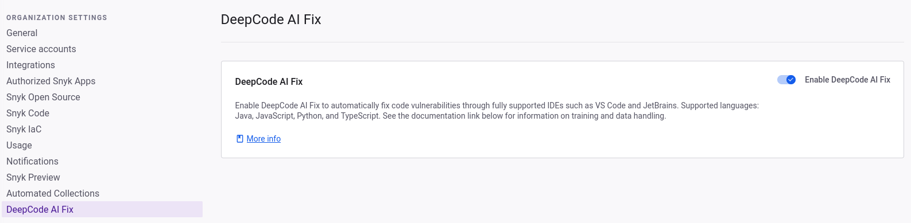

# Fix code vulnerabilities automatically

Fix the security issues and quality flaws in the source code through an automated flow. DeepCode AI Fix calculates the most suitable solution for your issues and applies it automatically.

## Why use DeepCode AI Fix?

DeepCode AI Fix combines the power of a thorough program analysis engine with the abilities of an in-house deep learning-based large language model. This combination allows for compiling large amounts of unstructured language information [from open-source code](fix-code-vulnerabilities-automatically.md#what-data-does-deepcode-ai-fix-suggestions-collect).

Key features set DeepCode AI Fix apart. It has a neural network trained on millions of lines of code, allowing for greater versatility and creativity. The [Snyk Code engine](../snyk-code-local-engine.md) rigorously checks the suggestions from the neural network, ensuring all automated fixes are small and targeted to each vulnerability or code issue.

## What issues can you fix automatically?

You can address various issues detected by the Snyk Code engine in terms of quality, promoting best code practices, and security vulnerabilities. DeepCode AI Fix currently does not support inter-file fixes.&#x20;

## DeepCode AI Fix language support

| Supported  | Limited support |
| ---------- | --------------- |
| Java       | APEX            |
| JavaScript | C/C++           |
| Python     | C#              |
| TypeScript | Go              |

What is the difference between supported and limited support?&#x20;

* Supported: AI Fix consistently generates fixes for the majority of Snyk Code rules.
* Limited support: AI Fix may not generate fixes as consistently, covering fewer Snyk Code rules.&#x20;

## What data does DeepCode AI Fix collect?

### Training data

Snyk trains its Large Language Model (LLM) using permissively-licensed public repositories. Snyk does not use code input by customers to train its LLM.

The data collection process is thorough and includes the following:

* Static analysis of permissive public repositories.
* Automated assessment of the suggested fix qualities.
* Partial in-house labeling by humans.

The training data is regularly checked for quality to optimize the performance of the LLM.

### Customer data

Snyk does not use customer code submitted to DeepCode AI Fix for training purposes.

For more information on how Snyk manages data, see [How Snyk handles your data](../../../working-with-snyk/how-snyk-handles-your-data.md).

## How DeepCode AI Fix works

A representation of information flow involved in fixing one issue is presented in the following table.

<table><thead><tr><th width="211">Stage</th><th>Subsystem<select><option value="144c7d0e56c649fdaffeeef234193541" label="Static Code Analysis Engine" color="blue"></option><option value="453931e7eaf94118b3ea6ec945dfce7f" label="Neural Network (Generative LLM)" color="blue"></option></select></th><th>Details</th></tr></thead><tbody><tr><td>Code scan and   discovery of issues</td><td>Static Code Analysis Engine</td><td>Corresponds to a normal flow of scanning the code from IDE.</td></tr><tr><td>Code preprocessing and minimization with respect to the data flow of the particular issue \mathcal{I}</td><td>Static Code Analysis Engine</td><td>Data flow of \mathcal{I} is analyzed and code is minimized, keeping the relevant context only.</td></tr><tr><td>Generating k candidate fixes for the given issue \mathcal{I}</td><td>Neural Network (Generative LLM)</td><td>Here, k is an implementation parameter.</td></tr><tr><td>Candidate fixes ranking and self-assessment</td><td>Static Code Analysis Engine</td><td>Each of the  k fixes is assessed by the Code Engine, filtering out those rendering invalid code or failing to fix the issue (the issue persists).</td></tr><tr><td>Returning the best candidate fix </td><td></td><td>The system has finished.</td></tr></tbody></table>

## Requirements for DeepCode AI Fix

* [Snyk Code](../../../implement-snyk/enterprise-implementation-guide/trial-limitations.md) enabled
* Snyk IDE Plugin for  [VS Code](https://marketplace.visualstudio.com/items?itemName=snyk-security.snyk-vulnerability-scanner-preview), [Eclipse](https://marketplace.eclipse.org/content/snyk-security-code%E2%80%8B-open-source%E2%80%8B-iac-configurations), or [JetBrains IDEs including IntelliJ](../../../scm-ide-and-ci-cd-integrations/snyk-ide-plugins-and-extensions/jetbrains-plugins/)

## Enable DeepCode AI Fix

Enable DeepCode AI Fix for your Group or Organization in the Snyk Web UI by navigating to **Group/Organization** > **Settings** > **DeepCode AI Fix**.

<figure><figcaption>
DeepCodeAI Fix Suggestions settings in Snyk Preview
</figcaption></figure>

## Fix code issues automatically


**Before you begin**

* Ensure you have automated fixes enabled in Snyk Preview to work with your [Snyk IDE plugin or extension](../../../scm-ide-and-ci-cd-integrations/snyk-ide-plugins-and-extensions/).
* Save the files and [scan your code](../../../snyk-cli/scan-and-maintain-projects-using-the-cli/snyk-cli-for-snyk-code/scan-source-code-with-snyk-code-using-the-cli.md) to generate a fresh set of results.
* You should see a zap icon next to all Snyk Code issues that can be automatically fixed.


1. Open your codebase.
2. Find and fix issues through the panel or by clicking **Fix this issue** in Code Lens.
3. After a fix has been applied,  save and rescan.

## Example: Fix a code issue automatically

DeepCode AI Fix highlights all identified vulnerabilities that can be automatically fixed. These are highlighted with a zap icon. For example, in this scenario, we have identified an Information Exposure vulnerability.

Opening the vulnerability gives us details on where the issue is and allows us to generate a fix using DeepCode AI Fix.

<figure><figcaption>
Opening the Snyk Code vulnerability panel
</figcaption></figure>

After you select Generate Fix using Snyk DeepCode AI, the system will analyze your code and generate up to five potential fixes. After you apply a fix, DeepCode AI Fix automatically retests the fix for quality using Snyk Code's engine.

The result, in this case, is five fixes, which you can navigate through to decide which one is best for you. The first fix is adding Helmet middleware package that disables the `X-Powered-By` header by default, preventing attackers from knowing that the app is running Express.&#x20;

<figure><figcaption>
5 fixes have been generated
</figcaption></figure>

When you apply the fix, you will be guided to where the new code has been introduced. After you save and rescan, the vulnerability will disappear.

<figure><figcaption>
Vulnerability has been fixed
</figcaption></figure>

## Limitations&#x20;

DeepCode AI Fix is at the forefront of AI, but there are still limitations based on the AI engine. Users must always review AI Fix suggestions to ensure that the resulting implementation of the fix does not break their application&#x20;

* DeepCode AI Fix suggestions might generate code that results in the application's not working properly&#x20;
* DeepCode AI Fix suggestions might generate code that is not syntactically correct&#x20;
* DeepCode AI Fix verifies that the vulnerability is fixed and no new vulnerabilities are introduced. This means that sometimes, a valid suggestion will not be made because the AI engine has not generated a good enough result.
