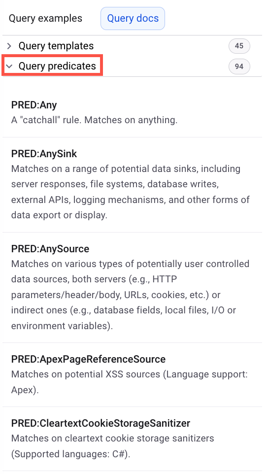

# Snyk Code custom rules


**Feature availability**

Snyk Code custom rules are Early Access and available only with Enterprise plans. To enable this feature, see [Snyk Preview](../../../snyk-admin/snyk-preview.md).


Create custom rules to run queries against the code stack as part of your investigation workflow. Use custom rules, as follows:

* Define a custom vulnerable method ([Sink](./#sink)) that security teams may be worried about.
* Create regular expression scans to check for the use of secrets and credentials that should not be part of the code.
* Determine whether certain unwanted methods are being called within the code base that are deemed unsafe by the security teams.
* After creating a query, test it against a [code snippet](run-query.md#run-query-on-a-code-snippet) or [repository](run-query.md#run-query-on-a-repository) you have previously imported to Snyk. This way, you can see the results of your query before you run regular scans. You can use this feature to validate a rule before pushing it to production and ensure that it provides the expected results.

You can run custom rules as part of any scan run by Snyk Code, and the feature is available when you are using Snyk Code in any of the following:

* [Snyk Web UI](../../../getting-started/snyk-web-ui.md)
* [Snyk CLI](../../../snyk-cli/scan-and-maintain-projects-using-the-cli/snyk-cli-for-snyk-code/)
* [IDE](../../../scm-ide-and-ci-cd-integrations/snyk-ide-plugins-and-extensions/)

## Use custom rules in the Snyk Web UI

You can create and test queries in a local environment, completely separate from your current Snyk scans. Perform one of the following actions in Snyk Web UI:

* [Run query on a repository](run-query.md#run-query-on-a-repository)
* [Run query on a code snippet](run-query.md#run-query-on-a-code-snippet)
* [Analyze query results](run-query.md#analyze-query-results)
* [Save custom rules](create-custom-rule.md)

## Use custom rules in the Snyk CLI

You can test your Code Projects using the Snyk CLI with regular commands and options as long as you have the [.snyk file](../../../manage-risk/policies/the-.snyk-file.md) to hold any custom rules you created using Snyk Web UI. See [Snyk CLI for Snyk Code](../../../snyk-cli/scan-and-maintain-projects-using-the-cli/snyk-cli-for-snyk-code/).

## Use custom rules in the IDE

IDE integrations with Snyk support custom rules as long as you have the [.snyk file](../../../manage-risk/policies/the-.snyk-file.md) to hold any custom rules you created using Snyk Web UI.&#x20;

## How Snyk Code custom rules work

### Query language

Snyk Code custom rules use a proprietary declarative query language based on logic programming, specifically Datalog.&#x20;

The goal is to create useful queries that will provide valuable and actionable results, helping security teams and developers focus on the most important vulnerabilities within their code.

### Components of Snyk Code custom rules

#### Query templates

The templates are abstract, pre-built constructs created to provide a quicker and easier way to build queries. See [Templates and predicates](templates-and-predicates.md).

<figure><figcaption><p>Query Templates</p></figcaption></figure>

#### Query predicates

The predicate is a symbolic representation of a relationship between objects or properties that evaluates true or false. Snyk provides an exhaustive list of predefined predicates.&#x20;

For example, all cross-site scripting (XSS) sinks as `PRED:XssSink`. You can extend these or define your own.  See [Query language](./#the-query-language).

<figure><figcaption><p>Query Predicates</p></figcaption></figure>

#### Source

Sources are entry points for data input and can potentially be controlled by a user or an environment. In many cases, the source should be assumed as tainted.&#x20;

#### Sanitizer

Sanitizers are used to sanitize data input from users or environments, ensuring the data is not tainted. By performing this sanitization, you remove the risk of tainted data being consumed by a sink.&#x20;

#### Sink

Sinks are points where data is consumed. If the consumed data is tainted, it could result in a vulnerability within your application.&#x20;

#### Hosting rules

Custom rules use the `.snyk` file, Whenever a repository is imported, this file will be picked up as part of the regular caching process.&#x20;

Given a `.snyk` file has custom rules within it; whenever a scan is run, these rules will run adjacent to the regular Snyk in-house rules and provide results as any other rules would.

### Custom rules behavior&#x20;

Snyk Code custom rules work as any other rule. Snyk Code parses your code to create an Abstract Syntax Tree (AST), which is analyzed to create an Event Grap&#x68;_._&#x20;

_&#x41;_&#x6C;l Snyk Code rules, including custom rules, run against the Event Graph, where any match is considered a vulnerability and identified for your developers or security teams.

A vulnerability is removed and added to the resolved issues section within the reporting tab when it has been addressed. See [The .snyk file](../../../manage-risk/policies/the-.snyk-file.md).

### Suggestive AI support

Snyk Code offers a user-friendly development environment that uses AI technology to simplify defining and testing rules. The AI acts as an intuitive assistant, providing helpful suggestions for queries based on the code you are testing.

For example, you can use the  `DataFlowsInto` [query template](./#query-templates) if you need to locate a method that data flows into. The AI will then suggest methods that data flows into within your code based on the Event Graph. This streamlines the process of creating rules and may also spark new query ideas.

<figure><figcaption><p>Suggestive AI support</p></figcaption></figure>

### Query language

Snyk Code provides custom queries using a domain-specific language for code search. In our case, it is a logic declarative programming language that is not Turing complete. This brings the advantage that every query written in the query language is guaranteed to terminate and return zero, one, or more matches.

The query language is independent of the programming language used for the code, and rules work across all Snyk-supported languages. If a code snippet is provided, you have to pick the language of the provided code snippet.


The query language is case-sensitive.


The query language is a language for finding matches in code. Every query discovers some elements in the queried code for which the specified properties match.

The first capability of the query language is to match program elements by their value. This is done by quoting the value in double quotes `"`. Program elements are identified by their fully qualified names. Consider the following Java code example:

```java
import java.time.LocalDate;
class Test {
 static void test() {
   System.out.println("test" + 123);
   System.out.println(LocalDate.now());
 }
}
```

You can match the method call for taking the current time by quoting its fully qualified name with the query `"java.time.LocalDate.now"`. &#x20;

You can match both the function declaration _test_ and the string '`test`' by using the query `"test"`.&#x20;

The number value 123 can be matched by using the query `"123"`. Quotes are used to match elements regardless of their type, identifier, string, number, or other value. Elements can also be matched by using regular expressions. Regular expressions are identified by putting the symbol `~` in front of the quotes. For example, the program element `123` can be matched by the expression `~"12.*".` The print statements can be matched by queries such as: `"java.lang.System.out.println"` or `~".*\.println"`.

To make sure that the correct, fully-qualified names of elements are used, the search interface provides autocompletion of the values for program elements that exist in the given code snippet or the provided repository.

#### **Predicate (**_**PRED**_**)**&#x20;

A predicate matches program elements based on some predefined condition. The main advantage of predicates is that you can use them to leverage the existing Snyk Code knowledge base. For example, if you need to find all program locations where an HTTP server handles cookies, you can use the predefined predicate `PRED:SourceCookie`.&#x20;

Similarly, there is a predicate `PRED:SqliSink` for matching all program locations where SQL queries are handled. To support discovering all available predicates, custom rules provide autocompletion capabilities. There are two special predicates `PRED:Any` and `PRED:None` that match all program elements or no program elements, respectively.


When multiple matches are provided in a sequence, the result is a combination of all of them.&#x20;

For example, using a query like: `PRED:SourceCookie ~"get.*"` will only match on methods that are both returning cookies and have a name that starts with `get` (logical AND of the two conditions that match elements).


#### **Template**

Templates are used for combining one or more conditions provided as their parameters. Templates themselves, just like predicates and value matches, also describe rules for matching elements in the given code. The parameters of templates are provided in chevrons or angle brackets, `<` and `>,` and are comma-separated. The predefined templates are designed for multiple use cases that are defined here.

Templates can be used to restrict the matches of their parameters. For example `StringLiteral<"test">` takes all the program elements with value test and only returns the elements that are string literals.

Templates can be used to relate different elements of the program. For example, the following query will find all program entities that have the string literal test as the first argument:\
`HasArg1<StringLiteral<"test">>`.

Note that the template `HasArg1` encodes semantic relations between program elements. For example, the preceding query will match only for the first print statement in the following Java code:

```java
class Test {
  String x;
  void test() {
    this.x = "test";
    System.out.println(x);
    this.x = "test2";
    System.out.println(x);
  }
}
```

Some templates encode logical relations, like the conjunction `And` and disjunctions `Or`. The following query finds all calls to `println` that receives the string literal test as the first argument:  `And<"java.lang.System.out.println", HasArg1<StringLiteral<"test">>>`

#### Formal syntax

The following two paragraphs provide the formal definition and relation of the query language to Datalog. This information is not needed to use the query language successfully but is provided for completeness.

The syntax of a query is defined as:

```ebnf
<query> ::= <term> | <term> “ ” <query>
<term> ::= <literal> | <regexp> | <predicate> | <template>
<literal> ::= “"” <value> “"”
<regexp> ::= “~"” <value> “"”
<predicate> ::= “PRED:” <predicate-name>
<template> ::= <template-name> “<” <template-params>  “>”
<template-params> ::= <term> | <term> “,” <template-params>
```

A query can contain one or more terms. Semantically, each term must be satisfied for the query to match, such as the conjunction of the terms. A term is a literal, regular expression, predicate, or template. Literals and regular expressions are in quotes; regular expressions are preceded by the symbol `~`. Predicates define complex conditions program elements should satisfy. Templates are used to combine multiple predicates.

#### Semantics and relationship to Datalog

Datalog is not a Turing complete language, and every program in Datalog is guaranteed to terminate. The query language is a subset of Datalog, focusing mostly on unary predicates. That is, a query either matches a program element or does not. The query language is not designed to define new relationships between pairs of program elements. It allows only querying existing relations as computed by the program analysis in Snyk Code, such as dataflow and taint.

Existing relations are queried via templates. Templates are essentially predefined snippets of Datalog code with some parts left as holes that are replaced by the customizing Snyk rules (v2) values in the templates used at their instantiation. Some templates include recursion in their implementation, allowing the custom query rule to include recursion, but only in the shape defined in the templates.

As a result, the Snyk Code Query Language becomes a subset of Datalog, effectively disallowing computations that could have large time or memory complexity. As a result, Snyk Code Query Language is guaranteed to terminate and will produce its matches fast. In the experience of Snyk, the restrictions that Snyk Code Query Language puts on Datalog rarely affect its expressibility in security-scanning settings.

## What's next?

* Learn from an end-to-end example with the [Snyk Code Custom Rules course](https://learn.snyk.io/lesson/custom-rules-for-snyk-code/)
* [Create custom rules](create-custom-rule.md)

