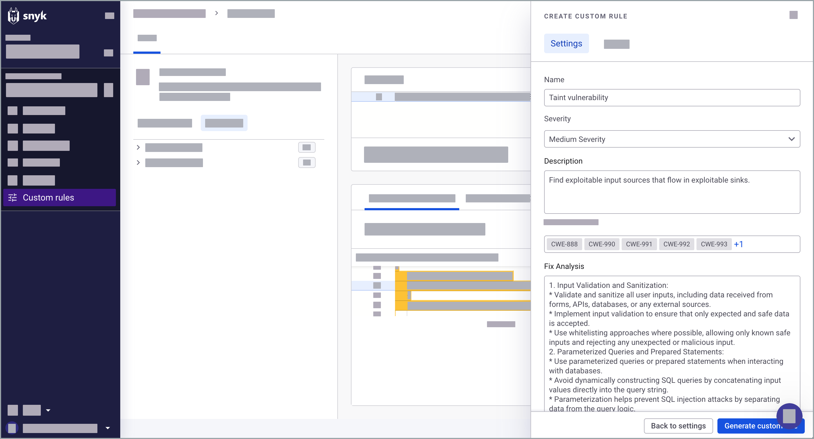
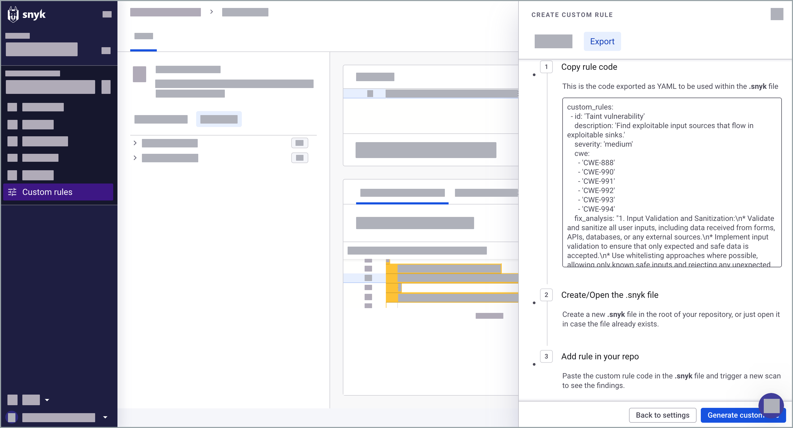

# Create custom rule

## Requirements for creating custom rules

* Before using the feature, you must [enable Snyk Code custom rules in Snyk Preview](../../../snyk-admin/snyk-preview.md#enable-or-disable-a-feature).
* To run custom rules against a Project, it must be hosted within a repository. This will have a 1:1 relationship, meaning a `.snyk` file needs to be present in every relevant repository.&#x20;
* If you do not have a `.snyk` file, you can create a file with a `.snyk` extension and paste the custom rule YAML formatted code into it for the rules to work. See [The .snyk file](../../../manage-risk/policies/the-.snyk-file.md).

## Create a custom rule

You can save custom rules from useful queries and add metadata. The metadata is used to create YAML formatted code. Export the YAML content as a rule in the [.snyk file](../../../manage-risk/policies/the-.snyk-file.md) of the relevant repository to run it alongside Snyk's in-house rules in future scans.

1. Log in to the Snyk Web UI and go to your Group and Organization.
2. Go to **Custom rules**.
3. Write your query in the **Code query** panel.
4. (Optional) [Run a query on a repository](run-query.md#run-query-on-a-repository) or a [code snippet](run-query.md#run-query-on-a-code-snippet).
5. Configure the metadata:
   * **Name**: This is shown whenever the query finds a result.
   * **Severity**: Set the severity of the result based on [Snyk security levels](../../../manage-risk/prioritize-your-issues/severity-levels.md#introduction-to-snyk-severity-levels). Snyk Code uses only three severity levels: `Low`, `Medium` and `High.`
   * **Description**: Add a description of the result and why it has surfaced.
   * **CWE**: Link relevant CWEs.
   * **Fix Analysis**: Describe how the developers should address the vulnerability. You could structure the fix as general guidance or based on your Organization's best practices.

<figure><figcaption>
Adding metadata to a saved custom rule
</figcaption></figure>

6. Click **Generate custom rule** to create YAML-formatted code.&#x20;
7. Export the query as a rule by copying the YAML content to the [.snyk file](../../../manage-risk/policies/the-.snyk-file.md) in the relevant repository.&#x20;

<figure><figcaption>
Exporting the query as a rule in the .snyk file
</figcaption></figure>

