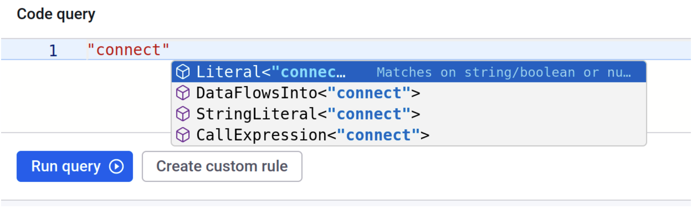
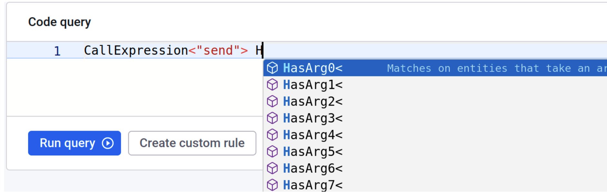
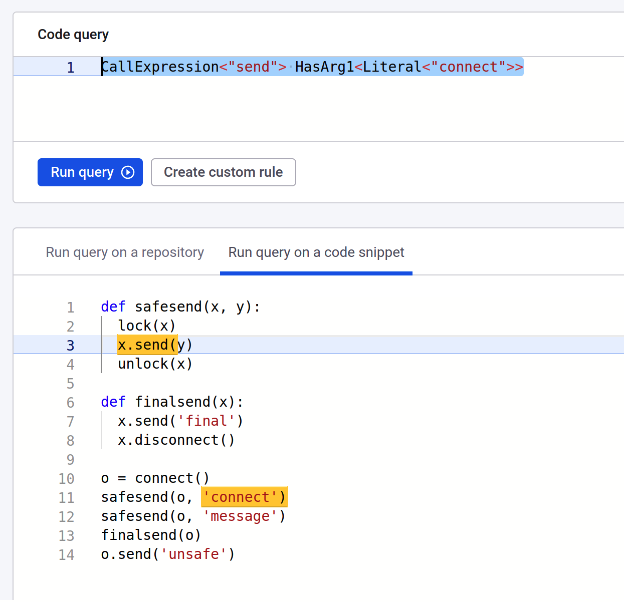

# Templates and predicates

This section provides an introduction to the Snyk Code Query Language standard library of templates and predicates, to give some practical examples of each predicate and template.

## Methods, literals, and arguments

A basic capability of Snyk Code is to find method calls and reason about their arguments. The goal here is to discover certain patterns of method calls and their arguments and to check if certain properties hold for these objects.&#x20;

Consider the following Python program to be analyzed and searched. If a similar program is provided, the same examples will work for any other language Snyk Code supports. The code does not need to be compiled to be queried.

```python
def safesend(x, y):
 lock(x)
 x.send(y)
 unlock(x)


def finalsend(x):
 x.send('final')
 x.disconnect()


o = connect()
o1 = connect()
safesend(o, 'connect')
safesend(o, 'message')
finalsend(o)
o.send('unsafe')
```

The first query finds the method `connect`. The query `"connect"`returns both the string with this value and the method call with this name. These can be separated by putting the value in a template. We can use autocompletion to find how the name `connect` can be wrapped. `Literal` or `StringLiteral` will restrict the search results to the string _`'connect'`_, whereas `CallExpression` will restrict the results to the function call `connect()`.

<figure><figcaption><p>Environment suggesting possible use for "connect"</p></figcaption></figure>

Note that you can find function calls to functions outside of the file being scanned. Trying to find `CallExpression<"safesend">` will not yield results. The reason is that the analysis may inline local functions in order to reason about their behavior.

Look at the most called method in the file, `send`. This method is called on an object returned by connect and takes various strings as input. To see its arguments, you can use some of the templates for its arguments. These are `HasArg0`, `HasArg1`, and so on.

<figure><figcaption><p>Environment suggests HasArg</p></figcaption></figure>

For example, you can find all calls to send on an object returned by `connect` with the following query:

`CallExpression<"send"> HasArg0<CallExpression<"connect">>`\
These are all locations, but we can find the places where we call send with the first argument taking the value `connect`.

<figure><figcaption><p>Call send with the first argument taking the value connect</p></figcaption></figure>

This gives a different picture. The interprocedural analysis figured out that the message connect was sent in a call to a local function.

Different tasks around the state of the object `o` can be explored. Assume we want to find all the calls to _send_ after _disconnect_. These should be pretty bad cases of the programs where the connection may be in a bad state. To do this query, you can perform the following query:\
`CallExpression<"send"> HasArg0<DataFlowAfter<Arg0In<CallExpression<"disconnect">>>>`

This query searches for calls to _send_ with its argument `0` satisfying the following property: in the dataflow, it is after a location that is an argument `0` in a call to `disconnect`. This matches only the final unsafe `send` call.

For negation, you can search for objects that are returned by `connect`, but not calling `disconnect` for the returned object.

`CallExpression<"connect"> Not<ForSameObject<Arg0In<CallExpression<"disconnect">>>>`

Similarly, you can call `send` with `connect` but not call `disconnect`. The following example has no matches in the preceding code snippet:

`CallExpression<"send"> HasArg0<CallExpression<"connect">> Not<HasArg0<ForSameObject<Arg0In<CallExpression<"disconnect">>>>>`

In all cases, the auto-completion for the rules should guide the search through the examples to make it easier to write such queries and those that are even more complex.

## Taint flows and data sources

In many cases, you want to ensure that certain types of data have no way to flow to certain sensitive locations in the program. This is often done for security reasons, both to ensure compliance and correctness.

The first important element to query is sensitive data sources. Snyk has built in the following set of  hierarchical data sources that you can query:

[AnySource](templates-and-predicates.md#anysource)

* [SourceServer](templates-and-predicates.md#sourceserver)
  * [SourceCookie](templates-and-predicates.md#sourcecookie)
  * [SourceHttpParam](templates-and-predicates.md#sourcehttpparam)
  * [SourceRequestUrl](templates-and-predicates.md#sourcerequesturl)
  * [SourceHttpHeader](templates-and-predicates.md#sourcehttpheader)
  * [SourceWebForm](templates-and-predicates.md#sourcewebform)
  * [SourceHttpBody](templates-and-predicates.md#sourcehttpbody)
  * [SourceHttpFileUpload](templates-and-predicates.md#sourcehttpbody)
  * [SourceRpcApiParam](templates-and-predicates.md#sourcerpcapiparam)
* [SourceNonServer](templates-and-predicates.md#sourcenonserver)
  * [SourceResourceAccess](templates-and-predicates.md#sourceresourceaccess)
    * [SourceDatabase](templates-and-predicates.md#sourcedatabase)
    * [SourceFile](templates-and-predicates.md#sourcefile)
    * [SourceArchive](templates-and-predicates.md#sourcearchive)
    * [SourceClientFramework](templates-and-predicates.md#sourceclientframework)
  * [SourceLocalEnv](templates-and-predicates.md#sourcelocalenv)
    * [SourceCLI](templates-and-predicates.md#sourcecli)
    * [SourceStdin](templates-and-predicates.md#sourcestdin)
    * [SourceEnvironmentVariable](templates-and-predicates.md#sourceenvironmentvariable)

The first category of sources (SourceServer) is defined for programs that implement servers. These sources are typically fully user-controllable. This means that a malicious user can use them to launch an attack against the application or that one needs to handle such data with additional care. For example, you may want to check that authentication is always performed or that some other property is enforced.

The non-server predicates also apply to programs that do not implement server functionality.\


Each of the predicates in the SourceServer category is returned by querying _`PRED:SourceServer`_ or _`PRED:AnySource`_. Consider the following TypeScript code example:

```javascript
import { Request, Response, NextFunction } from 'express';


module.exports = function productReviews () {
 return (req: Request, res: Response, next: NextFunction) => {
   let user = req.signedCookies;
   doSomething(user);
   console.log('Some message ' + user);
 }
}

```

This implements a request handler for an express server. In this case, the code reads the user cookie and logs it on the console. This might be a security vulnerability and a compliance problem for many applications. The first capability of Snyk Code is that it can discover these cookie locations, and you can connect them to check a lot of properties about them. In this case, running a _`PRED:SourceCookie`_ query will find the first line of the request handler.

You can now verify that cookies are handled correctly by the code. For example, you can check that cookies do not end up logged anywhere. You can try to use data flow or _`ForSameObject.`_ In this case, report if the cookie is logged as part of some other object, string concatenation, or other simple transformation.&#x20;

To achieve this, there is a taint analysis done with the `taint` predicate. This takes the following shape: `Taint< source, sanitizer, sink >` .&#x20;

_Source_ is the source of sensitive data, _sanitizer_ gives code patterns that would transform the data to be non-sensitive, and _sink_ is the location where the sensitive data should reach a report to be made. The report is then made at the sink location.

Now, consider finding places where the user is logged in. You can then use the following query:

`Taint<PRED:SourceCookie, PRED:None, CallExpression<"log">>`

Of course, one may want to say that if a cookie is hashed using the function `hash123`, then it is safe to be logged. Then, the query would look like:\
\
`Taint<PRED:SourceCookie, CallExpression<"hash123">, CallExpression<"log">>`

## Predefined sinks and sanitizers

Using the preceding taint template, you can start writing vulnerability detectors. However, Snyk Code provides predicates for various types of vulnerabilities. For example, if you want to detect SQL injection, this can be performed fully with the following query:

`Taint<PRED:AnySource, PRED:SqliSanitizer, PRED:SqliSink>`

Of course, this assumes that any of the sources in _`AnySource`_ (see the hierarchy above) is one that a malicious actor may control. For example, not every application is set up in a way that users control environment variables or command line arguments. If you want to find only such SQL injections, you can run a query like:\
\
`Taint<Or<PRED:AnySource, PRED:SourceResourceAccess>, PRED:SqliSanitizer, PRED:SqliSink>`

In addition to SQL injection, Snyk Code can detect tens of other vulnerabilities and has corresponding predicates accessible from search and custom rules. The number of predicates is growing over time, and more rules are getting open to modifications.

## Predefined templates and predicates

### Predicates

#### Any

A "catchall" rule. Matches on anything.

#### AnySink

Matches on a range of potential data sinks, including server responses, file systems, database writes, external APIs, logging mechanisms, and other forms of data export or display.

#### AnySource

Matches on various types of potentially user controlled data sources, both servers (e.g., HTTP parameters/header/body, URLs, cookies, etc.) or indirect ones (e.g., database fields, local files, I/O or environment variables).

#### ApexPageReferenceSource

Matches on potential XSS sources (Language support: Apex).

#### CleartextCookieStorageSanitizer

Matches on cleartext cookie storage sanitizers (Supported languages: C#).

#### CleartextCookieStorageSink

Matches on cleartext cookie storage sinks (Supported languages: C#).

#### CleartextTransmissionSanitizer

Matches on cleartext transmission sanitizers (Supported languages: C#).

#### CleartextTransmissionSink

Matches on cleartext transmission sinks (Supported languages: C#).

#### ClientXssSanitizer

Matches on client XSS (e.g., DOMXSS) sanitizers (Supported languages: Javascript).

#### ClientXssSink

Matches on client XSS (e.g., DOMXSS) sinks (Supported languages: Javascript).

#### CodeInjectionSanitizer

Matches on code injection sanitizers (Supported languages: C#, Java, JS, Kotlin, PHP, Python, Ruby, Scala, Swift, VB.NET).

#### CodeInjectionSink

Matches on code injection sinks (Supported languages: C#, Java, JS, Kotlin, PHP, Python, Ruby, Scala, Swift, VB.NET).

#### CommandInjectionSanitizer

Matches on command injection sanitizers.

#### CommandInjectionSink

Matches on command injection sinks.

#### DeserializationSanitizer

Matches on deserialization sanitizers.

#### DeserializationSink

Matches on deserialization sinks.

#### EmailContentInjectionSanitizer

Matches on email content injection sanitizers (Language support: Apex, Go).

#### EmailContentInjectionSink

Matches on email content injection sinks (Language support: Apex, Go).

#### ErrorMessageOutput

Matches on error message outputs (e.g., stacktraces) (Language support: C#, Go, Java, Javascript, Kotlin, PHP, Scala).

#### ErrorMessageOutputSanitizer

Matches on error message output sanitizers (Supported languages: C#, Java, Javascript, Kotlin, PHP, Scala).

#### ErrorMessageOutputSink

Matches on error message output sinks (Supported languages: C#, Go, Java, Javascript, Kotlin, PHP, Scala).

#### FileInclusionSanitizer

Matches on file inclusion sanitizers (Supported languages: PHP).

#### FileInclusionSink

Matches on file inclusion sinks (Supported languages: PHP).

#### InformationDisclosureSanitizer

Matches on information disclosure sanitizers (Supported languages: C#, Go, PHP).

#### InformationDisclosureSink

Matches on information disclosure sinks (Supported languages: C#, Go, PHP).

#### IsPaNode

Used to document which language variants are missing an implementation for various stdlib definitions

#### JndiInjectionSanitizer

Matches on JNDI injection sanitizers (Supported languages: Java, Kotlin, Scala).

#### JndiInjectionSink

Matches on JNDI injection sinks (Supported languages: Java, Kotlin, Scala).

#### LdapInjectionSanitizer

Matches on LDAP injection sanitizers (Supported languages: C++, C#, Java, Kotlin, Scala).

#### LdapInjectionSink

Matches on LDAP injection sinks (Supported languages: C++, C#, Java, Kotlin, Scala).

#### LogsForgingSanitizer

Matches on log-forging sanitizers (Supported languages: C#).

#### LogsForgingSink

Matches on log-forging sinks (Supported languages: C#).

#### MemoryCorruptionSanitizer

Matches on prototype memory corruption sanitizers (Supported languages: Swift).

#### NoSqliSanitizer

Matches on NoSQL sanitizers (Supported languages: Java, Javascript, Python).

#### NoSqliSink

Matches on NoSQL sinks (Supported languages: Java, Javascript, Python).

#### None

An "anti-catchall" rule. Matches on nothing.

#### OpenRedirectSanitizer

Matches on open-redirect sanitizers (Supported languages: Apex, C#, Go, Java, Javascript, Kotlin, PHP, Python, Scala, VB.NET).

#### OpenRedirectSink

Matches on open-redirect sinks (Supported languages: Apex, C#, Go, Java, Javascript, Kotlin, PHP, Python, Scala, VB.NET).

#### PointerOperationSink

Matches on prototype memory operation sinks (Supported languages: Swift).

#### PotentialXssSink

Matches on potential XSS sinks (Language support: Apex).

#### PrototypePollutionAssignmentSanitizer

Matches on prototype pollution assignment sanitizers (Supported languages: Javascript).

#### PrototypePollutionAssignmentSink

Matches on prototype pollution assignment sinks (Supported languages: Javascript).

#### PtSanitizer

Matches on path-traversal sanitizers.

#### PtSink

Matches on path-traversal sinks.

#### RedosSanitizer

Matches on regular-expression denial-of-service sanitizers.

#### RedosSink

Matches on regular-expression denial-of-service sinks.

#### ReflectionSanitizer

Matches on reflection sanitizers (Supported languages: Java, Ruby).

#### ReflectionSink

Matches on reflection sinks (Supported languages: Java, Ruby).

#### SoqliSanitizer

Matches on soqli sanitizers (Language support: Apex).

#### SoqliSink

Matches on soqli sinks (Language support: Apex).

#### SosliSanitizer

Matches on sosli sanitizers (Language support: Apex).

#### SosliSink

Matches on sosli sinks (Language support: Apex).

#### SourceArchive

Matches on reading values that are coming from zip, tar or other archives.

#### SourceCLI

Matches on reading command line arguments.

#### SourceClientFramework

Matches on reading values that are coming from a client-side framework such as Android, SwiftUI, UIKit, the DOM of an HTML page.

#### SourceContainsSensitiveData

Matches on reading sensitive data (Language support: C#, Go, PHP).

#### SourceCookie

Matches on reading values of cookies in an http server. These values are of security interest, because they can be fully controlled by malicious users.

#### SourceDatabase

Matches on reading values that are coming from a database.

#### SourceEnvironmentVariable

Matches on reading environment variables of a process.

#### SourceFile

Matches on reading values that are coming from files.

#### SourceHttpBody

Matches on reading http request body in an http server. These values are of security interest, because they may be fully controlled by malicious actors.

#### SourceHttpFileUpload

Matches on the name and content of file uploaded to an http server. These values are of security interest, because they may be fully controlled by malicious actors.

#### SourceHttpHeader

Matches on reading values of http headers in a server. These values are of security interest, because they may be fully controlled by malicious actors.

#### SourceHttpParam

Matches on reading values of http parameters in an http server. These values are of security interest, because they may be fully controlled by malicious actors.

#### SourceLocalEnv

Matches on reading values from the local environment of the running process. This includes command line arguments, standard input or environment variables.

#### SourceNetworkRequest

Matches on reading values that are coming from a remote resource through network requests.

#### SourceNonServer

Matches on reading values that may be controlled by an adversary, but not directly by sending requests to a server. E.g. if an application fetches a value from a URL, an adversary in control of that URL may use it to control its content.

#### SourceRequestUrl

Matches on reading request URLs in a server. The URLs are of security interest, because they may be fully controlled by malicious actors.

#### SourceResourceAccess

Matches on reading values that may be controlled by an adversary if they gain access to a resource. The resources this matches are remote URLs, files, database fields or other framework-specific cases such as Android intents.

#### SourceRpcApiParam

Matches on parameters of RPCs implemented in an RPC server. These values are of security interest, because they may be fully controlled by malicious actors.

#### SourceServer

Matches on reading values that an attacker can send to a server. Examples are HTTP parameters/header/body, URLs or cookies. Since these may be directly controllable by attacker, these sources are of significant security interest.

#### SourceStdin

Matches on reading input from the standard input of a process.

#### SourceUnrestrictedArchiveFilePath

Matches on zipslip sources (Language support: C#, Javascript, PHP, Python).

#### SourceWebForm

Matches on reading values of web forms in a web server. These values are of security interest, because they may be fully controlled by malicious actors.

#### SqliSanitizer

Matches on SQL injection sanitizers.

#### SqliSink

Matches on SQL injection sinks.

#### SsrfSanitizer

Matches on SSRF sanitizers.

#### SsrfSink

Matches on SSRF sinks.

#### SstiSanitizer

Matches on SSTI sanitizers (Language support: Javascript, Python, Ruby).

#### SstiSink

Matches on SSTI sinks (Language support: Javascript, Python, Ruby).

#### UnsafeSoqliConcatSource

Matches on unsafe sosli/soqli concatenations (Language support: Apex).

#### UnsafeSosliConcatSource

Matches on unsafe sosli/soqli concatenations (Language support: Apex).

#### XPathInjectionSanitizer

Matches on XPath injection sanitizers (Supported languages: Apex, C#, VB.NET).

#### XPathInjectionSink

Matches on XPath injection sinks (Supported languages: Apex, C#, VB.NET).

#### XamlInjectionSanitizer

Matches on XAML injection sanitizers (Supported languages: C#).

#### XamlInjectionSink

Matches on XAML injection sinks (Supported languages: C#).

#### XmlInjectionSanitizer

Matches on XML injection sanitizers (Language support: Apex, C#, VB.NET).

#### XmlInjectionSink

Matches on XML injection sinks (Language support: Apex, C#, VB.NET).

#### XssSanitizer

Matches on XSS sanitizers.

#### XssSink

Matches on XSS sinks.

#### XxeSanitizer

Matches on XXE sanitizers.

#### XxeSink

Matches on XXE sinks.

#### ZipSlipSanitizer

Matches on zipslip sanitizers (Supported languages: C#, Javascript, PHP, Python).

#### ZipSlipSink

Matches on zipslip sinks (Supported languages: C#, Javascript, PHP, Python).

### Templates

#### And

A binary conjunction. Matches only if both arguments match.

Template parameters:

* First - conjunct
* Second - conjunct

#### AnyParamIn

Matches on all parameters of the provided method or function declaration.

Template parameters:

* Function

#### Arg0In

Matches on the 0th index argument (i.e. the receiver object for method calls) for the provided method or function.

Template parameters:

* Function

#### Arg1In

Matches on the 1st index argument for the provided method or function.

Template parameters:

* Function

#### Arg2In

Matches on the 2nd index argument for the provided method or function.

Template parameters:

* Function

#### Arg3In

Matches on the 3rd index argument for the provided method or function.

Template parameters:

* Function

#### Arg4In

Matches on the 4th index argument for the provided method or function.

Template parameters:

* Function

#### Arg5In

Matches on the 5th index argument for the provided method or function.

Template parameters:

* Function

#### Arg6In

Matches on the 6th index argument for the provided method or function.

Template parameters:

* Function

#### Arg7In

Matches on the 7th index argument for the provided method or function.

Template parameters:

* Function

#### BooleanLiteral

Matches on boolean type literals.

Template parameters:

* Value

#### CallExpression

Matches when a given name is called.

Template parameters:

* Callee - Function, method or constructor to call.

#### DataFlowAfter

Matches on entities that happen after in the dataflow of its parameter.

Template parameters:

* PrevAction - The previous action executed.

<details>

<summary>Example</summary>

In the following code snippet, `replaceAll` is used as a sanitizer for data read from the source `scanner.nextLine()`:

```java
import java.util.Scanner;

public class RegexSanitize {
    public static void main(String[] args) {
        Scanner scanner = new Scanner(System.in);
        String input = scanner.nextLine();
        input = input.replaceAll("[^a-zA-Z0-9 ]", "");
        System.out.println(input);
    }
}
```

To verify **replaceAll** with specific parameters is part of this call chain, the following rule can be used:

```starlang
And<CallExpression<"replaceAll">, HasArg1<"[^a-zA-Z0-9 ]">>
HasArg0<DataFlowAfter<
  And<
    CallExpression<"nextLine">, 
    And<
      HasArg0<"java.util.Scanner">, 
      HasArg0<HasArg1<"java.lang.System.in">>
    >
  >
>>
```

Using `HasArg0`, a relationship to `DataFlowAfter` is established in order to express that a `replaceAll` call (matched by the preceding `And` template) appears on the data flow path after `scanner.nextLine()`.

***

Note this will only match on the function call being actually executed, regardless of whether `input` is re-assigned with the sanitised value or not.

It does not match on the data being sent to `System.out.println`. Combine this function with `Taint` to achieve such a check.

```starlang
Taint<
  And<
    And<CallExpression<"replaceAll">, HasArg1<"[^a-zA-Z0-9 ]">>,
    HasArg0<DataFlowAfter<
      And<
        CallExpression<"nextLine">, 
        And<
          HasArg0<"java.util.Scanner">, 
          HasArg0<HasArg1<"java.lang.System.in">>
        >
      >
    >>
  >,
  PRED:None,
  "java.lang.System.out.println"
>
```

</details>

#### DataFlowsFrom

Matches on places which a taint data can flow from.

Template parameters:

* Source

#### DataFlowsInto

Matches on places which a taint data can flow into.

Template parameters:

* Sink

#### ExplicitSelfParamIn

Matches on the explicit receiver parameter (e.g., self in Python and Rust) for the provided method or function declaration.

Template parameters:

* Function

#### ForSameObject

Matches on entities that happen on the same object as its parameter.

Template parameters:

* ObjectAction - The action that happens on the object.

#### HasAnnotation

Matches on entities annotated by a given annotation.

Template parameters:

* Annotation - The annotation with which the entity is annotated.

<details>

<summary>Example</summary>

```java
package snippets.java.docs;

public class HasAnnotationDemo {
    public void oldMethod(@Deprecated String parameter1, String parameter2) {

    }
}
```

To capture `parameter1`, use the following query:

```
HasAnnotation<"java.lang.Deprecated">
```

</details>

<details>

<summary>Example (named parameters)</summary>

```java
package snippets.java.docs;

import java.lang.annotation.ElementType;
import java.lang.annotation.Retention;
import java.lang.annotation.RetentionPolicy;
import java.lang.annotation.Target;

@Target({ElementType.FIELD, ElementType.METHOD})
@Retention(RetentionPolicy.RUNTIME)
@interface Sensitive {
    String reason();
}


public class HasAnnotationWithArgsDemo {
    private String email = "support@snyk.io";

    @Sensitive(reason = "PII")
    public String getEmail() {
        return email;
    }
}
```

To capture the `getEmail` method, use the following query:

```
HasAnnotation<And<"Sensitive", HasNamedArg<"reason", "PII">>>
```

</details>


`HasAnnotation` can not be used within `Taint` workflows yet.


#### HasAnyArg

Matches on entities that take any argument with the provided value.

Template parameters:

* Value

<details>

<summary>Example</summary>

```java
package snippets.java.docs;

public class VarArgsDemo {
    public void method(String... args) {}

    public static void main(String[] args) {
        VarArgsDemo check = new VarArgsDemo();
        check.method("tainted", "sample2", "sample3");
        check.method("sample0", "tainted", "sample2", "sample3");
        check.method("sample2", "sample3", "tainted");
    }
}
```

To match all 3 method calls which receive `tainted` values, use the following query:

```
HasAnyArg<"tainted">
```

</details>

#### HasArg0

Matches on entities that take an argument in the 0th index (i.e. receiver object for method calls) with the provided value.

Template parameters:

* Value

<details>

<summary>Example (Java)</summary>

The following code snippet demonstrates two types of logging into a network service using a method named `login`.

```java
import sun.net.ftp.FtpProtocolException;
import sun.net.ftp.impl.FtpClient;

import javax.security.auth.login.LoginContext;
import javax.security.auth.login.LoginException;
import java.io.IOException;

public class X {
    private static void ftpExample() {
        FtpClient client = new FtpClient();
        try {
            client.login("user", "pass".toCharArray());
        } catch (FtpProtocolException | IOException e) {
            throw new RuntimeException(e);
        }
    }

    private static void loginContextExample() {
        try {
            LoginContext lc = new LoginContext("MyLoginConfig");
            lc.login();
            System.out.println("Authentication succeeded!");

        } catch (LoginException e) {
            System.err.println("Authentication failed: " + e.getMessage());
        }
    }

    public static void main(String[] args) {
        ftpExample();
        loginContextExample();
    }
}
```

For this example, the target may be to capture only the login call on the FtpClient class. To select it, the following query will match:

```
And<HasArg0<"sun.net.ftp.impl.FtpClient">, CallExpression<"login">>
```

</details>

<details>

<summary>Example (Python)</summary>

The following code snippet demonstrates two types of logging into a network service using a method named `login`.

```python
from ftplib import FTP, error_perm
import smtplib

def ftp_example():
    try:
        ftp = FTP('ftp.example.com')
        ftp.login('user', 'pass')
        print("FTP login successful")
    except error_perm as e:
        print(f"FTP login failed: {e}")

def smtp_example():
    try:
        smtp = smtplib.SMTP('smtp.example.com', 587)
        smtp.ehlo()
        smtp.starttls()
        smtp.login('user@example.com', 'password')
        print("SMTP login successful")
    except smtplib.SMTPException as e:
        print(f"SMTP login failed: {e}")

if __name__ == '__main__':
    ftp_example()
    smtp_example()
```

For this example, the target may be to capture only the login call on the FTP class. To select it, the following query will match:

```starlang
And<HasArg0<"ftplib.FTP">, CallExpression<"login">>
```

</details>

#### HasArg1

Matches on entities that take an argument in the 1st index with the provided value.

Template parameters:

* Value

#### HasArg2

Matches on entities that take an argument in the 2nd index with the provided value.

Template parameters:

* Value

#### HasArg3

Matches on entities that take an argument in the 3rd index with the provided value.

Template parameters:

* Value

#### HasArg4

Matches on entities that take an argument in the 4th index with the provided value.

Template parameters:

* Value

#### HasArg5

Matches on entities that take an argument in the 5th index with the provided value.

Template parameters:

* Value

#### HasArg6

Matches on entities that take an argument in the 6th index with the provided value.

Template parameters:

* Value

#### HasArg7

Matches on entities that take an argument in the 7th index with the provided value.

Template parameters:

* Value

#### HasNamedArg

Matches on entities that take a named argument with the provided value.

Template parameters:

* Name - The name of the argument.
* Value - The value the named argument should have.

#### Identifier (deprecated)

Matches on an identifier.

Template parameters:

* Name - The entity that should be an identifier.

#### Literal

Matches on string/boolean or number type literals.

Template parameters:

* Value

#### NamedArgIn

Matches on the named argument for the provided method or function.

Template parameters:

* Name - The name of the argument.
* Function - The provided method or function.

#### Not

A negation. Matches only if the argument does not match.

Template parameters:

* Negated - property

#### NumberLiteral

Matches on numeric type literals.

Template parameters:

* Value

#### Or

A binary disjunction. Matches if either (or both) arguments match.

Template parameters:

* First - disjunct
* Second - disjunct

#### Param1In

Matches on the 1st parameter for the provided method or function declaration.

Template parameters:

* Function

#### Param2In

Matches on the 2nd parameter for the provided method or function declaration.

Template parameters:

* Function

#### Param3In

Matches on the 3rd parameter for the provided method or function declaration.

Template parameters:

* Function

#### Param4In

Matches on the 4th parameter for the provided method or function declaration.

Template parameters:

* Function

#### Param5In

Matches on the 5th parameter for the provided method or function declaration.

Template parameters:

* Function

#### Param6In

Matches on the 6th parameter for the provided method or function declaration.

Template parameters:

* Function

#### Param7In

Matches on the 7th parameter for the provided method or function declaration.

Template parameters:

* Function

#### ReturnedBy

Matches on the returned entity.

Template parameters:

* Function - The entity that returns.

#### Returns

Matches on the entity (e.g. a function or a method) that returns the value provided as argument.

Template parameters:

* Value - What is returned.

#### StringLiteral

Matches on string type literals.

Template parameters:

* Value

#### Taint

Identify data propagation flows that start at the specified source(s) and reach the designated destination sinks (like vulnerable methods) without going through the specified sanitizer(s).

Template parameters:

* Source
* Sanitizer
* Sink
