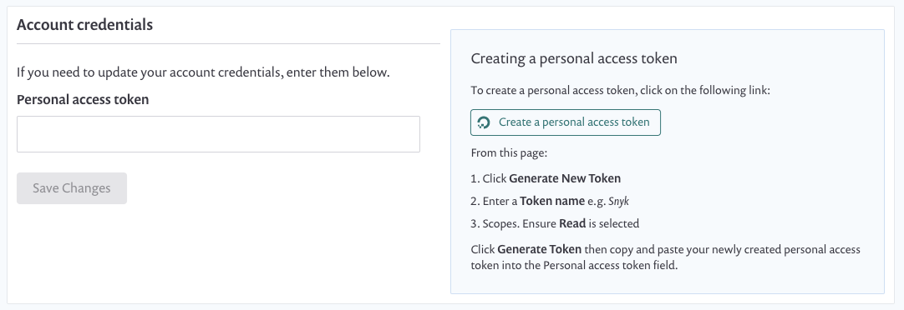
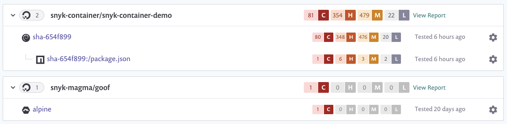

# Integrate with DigitalOcean

Snyk integrates with DigitalOcean to enable you to import your container images and monitor them for vulnerabilities.

Snyk tests the images you have imported (Projects) for any known security vulnerabilities, testing them at a frequency you control, and alerts you when new issues are detected.

Integration with DigitalOcean is available for all Snyk users.

This page explains how to set up DigitalOcean integration in Snyk and start managing image vulnerabilities.

## Integrate with DigitalOcean

### Prerequisites for Digital Ocean integration

* You must be an administrator for the Organization you are configuring in Snyk.
* Snyk needs user credentials to integrate with DigitalOcean and does not support DigitalOcean when configured for single sign-on (SSO).

### **Configure DigitalOcean integration**

1. In your Snyk account, navigate to Integrations. Under the Container Registries section, find the **DigitalOcean** option and click it.
2. In the **Account credentials** section, enter your DigitalOcean personal access token as the login credential. You can find detailed instructions for creating the access token on the integration page.
3. To finish, click **Save**.

<figure><figcaption>
DigitalOcean account credentials
</figcaption></figure>

If you are using self-hosted DigitalOcean, contact [Snyk Support](https://support.snyk.io) to provide you with a token. For more information, see [Snyk Container for self-hosted container registries (with Broker)](../../../implementation-and-setup/enterprise-setup/snyk-broker/snyk-broker-container-registry-agent/integrate-with-self-hosted-container-registries-broker.md).


For a successful connection, ensure you have a repository in DigitalOcean repository.


Snyk tests the connection values, and the page reloads, now displaying DigitalOcean integration information. The **Add your DigitalOcean images to Snyk** button becomes available.If the connection to DigitalOcean fails, a notification appears under the **Connected to DigitalOcean** section.

When the connection is successful, you can use Snyk to scan your images from DigitalOcean.

## Scan container images from DigitalOcean in Snyk

Snyk tests and monitors your DigitalOcean container images by evaluating the image tags in your repositories. After you import images to Snyk, your image vulnerabilities are identified and can be triaged easily.

The steps follow to add images from DigitalOcean to Snyk.

## **Prerequisites for DigitalOcean image scanning**

* A Snyk account with access to the relevant Organization authorized by an administrator.
* DigitalOcean integration configured. For more information, see [Container security with DigitalOcean integration](integrate-with-digitalocean.md).

## **Steps in scanning DigitalOcean images**

1. Log in to your account and navigate to the relevant Group and Organization that you want to manage.
2. Under the **Projects** tab, click **Add Project**.\
   The list of integrations already configured on your account opens.
3. Select the **DigitalOcean** option or **Other** if **DigitalOcean** doesn’t appear.\
   The view **Which images do you want to test?** opens, displaying the available images for your connected registry, grouped by each of your repositories
4. Select single or multiple images to be imported to Snyk.\
   You can select by choosing a specific image or by selecting an entire repository. You can also search by image name to find specific images to import.
5. To finish, click **Add selected repositories** on the top right.\
   A status bar appears at the top of the page as the images are imported; you can continue working in the meantime.
6. When the import ends:
   1. You can view the newly imported image, marked with a **NEW** tag, on the **Projects** page. Images are grouped by repository and are each linked individually to a detailed **Project** page.
   2. An **import log** becomes available; you can reach it at the top of the Projects list.
   3. To enrich the data and get recommendations regarding your base image, under **Settings**, you can connect your Dockerfile to the image Project. For more information, see [Adding your Dockerfile and testing your base image](../scan-your-dockerfile/detect-vulnerable-base-images-from-your-dockerfile.md).

DigitalOcean imports are indicated with a unique icon. You can filter the integration in the **Projects** view to see DigitalOcean Projects only:

<figure><figcaption>
DigitalOcean Projects in Projects listing
</figcaption></figure>


For application vulnerabilities within container images, any changes to the application will not be reflected with a manual or recurring retest. A re-import of the image is required. For more information, see [Detecting application vulnerabilities in container images](../use-snyk-container/detect-application-vulnerabilities-in-container-images.md).

