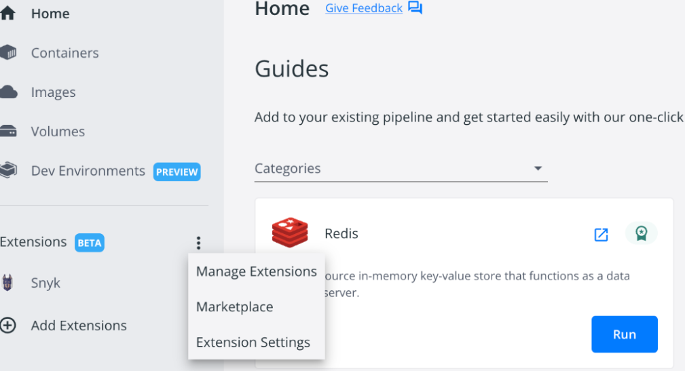
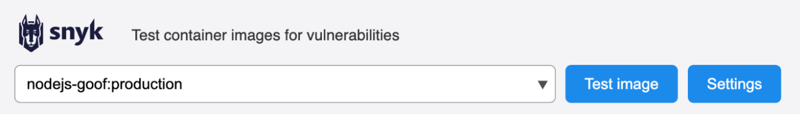
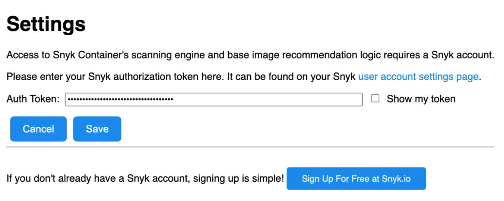
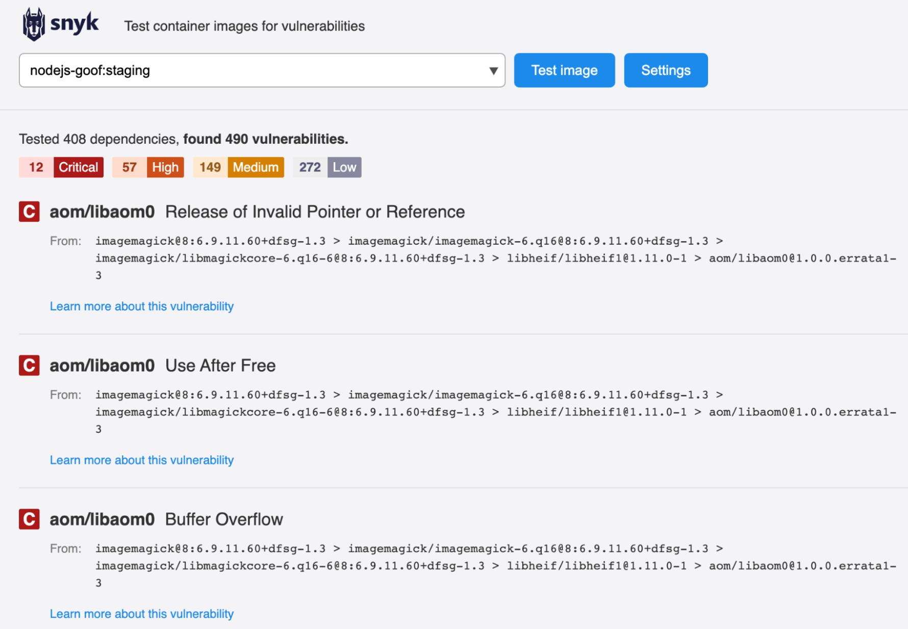

# Integrate with Docker Desktop Extension


**End of support for Snyk Docker Desktop extension**

Effective June 20, 2025, the integration with Docker Desktop will no longer be supported. After this date, the extension will no longer receive updates or technical support. Until June 20, updates for this integration will only address known high-severity security vulnerabilities.

To avoid disruption, Snyk encourages you to transition to scanning your container images using the [Snyk CLI](../../../snyk-cli/). This provides enhanced functionality, flexibility, and performance.


Docker Desktop is a GUI that simplifies the management of containers and containerized applications. You can use it with Mac, Windows, or Linux.

Snyk has a Docker Desktop extension that allows developers and platform teams to scan container images for vulnerabilities within the Docker Desktop interface.

To install and run the Snyk Docker Desktop Extension:

1.  On the Docker Desktop home screen, click the three dots next to **Extensions**, and select **Marketplace**.\

    <figure><figcaption>
Marketplace on Docker Desktop
</figcaption></figure>
2.  In the **Marketplace** window, navigate to the Snyk Extension and click **Install**.\

    <figure><figcaption>
Install Snyk Extension on Docker Desktop
</figcaption></figure>

&#x20;

3.  After installation, launch the Snyk Extension and click **Settings**.

    <figure><figcaption>
Snyk Extension page on Docker Desktop
</figcaption></figure>
4.  In the **Settings** window, add your API token or service account token and click **Save**.\

    <figure><figcaption>
Add authorization token in the Settings window
</figcaption></figure>

You can now select the local image you want to scan with Snyk by clicking **Test image**.

<figure><figcaption>
List of images in the Snyk Extension window
</figcaption></figure>
