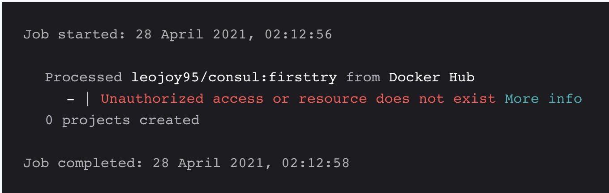

# Configure the integration with Docker Hub

This page explains how to enable and configure the integration between Docker Hub and Snyk. When the integration is complete, you can start managing your vulnerabilities.


For the integration with Docker Hub, Snyk does not support Organization Access Tokens (OAT).


## Enable the integration with Docker Hub

1. Navigate to **Integrations**.
2. Click **Docker Hub**.
3. Enter your Docker Hub username and Access Token.
4. Click **Save**.\
   The page reloads with new options. The **Access Token** field is blank.\
   A confirmation message that the details were saved also appears in green at the top of the screen.

If the connection to Docker Hub fails, an error notification appears.

## Troubleshooting with the Docker Hub integration

If issues occur, such as failure to import Projects, failure to connect, and no error shown, first try generating a new Access Token and resaving the Docker Hub integration on the Snyk settings page.

### Generate Docker Hub Access Token

1. Navigate to [https://hub.docker.com/settings/security](https://hub.docker.com/settings/security)
2. Select **New Access Token**.
3. Enter the Access Token description.
4. Set the permissions (Read is required and sufficient), and click **Generate**.
5. Select **Copy Access Token** for use with the username when you [enable integration with Docker Hub](configure-the-integration-with-docker-hub.md#enable-the-integration-with-docker-hub).

More information on [Docker Hub Access Tokens](https://docs.docker.com/docker-hub/access-tokens/) is available in the Docker Hub docs.

### Unauthorized access or Resource does not exist

This error occurs when importing images from Docker Hub fails, and you receive the error `Unauthorized access or Resource does not exist`_._

This error occurs because your image is private on your Docker Hub account. To resolve this, navigate to your repository's **Settings** > **Visibility settings** section in Docker Hub and make the image public.
