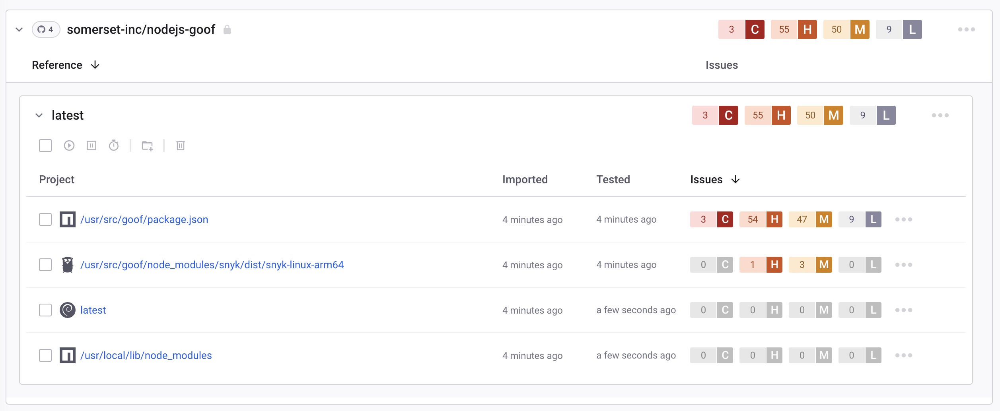

# Integrate with GitHub Container registry

Snyk integrates with the GitHub Container registry to enable you to import your container images and monitor them for vulnerabilities.

Snyk tests the images you have imported (Projects) for any known security vulnerabilities, testing them at a frequency you control, and alerts you when new issues are detected.

Integration with GitHub Container registry is available for all Snyk users.

This page explains how to set up GitHub Container registry integration in Snyk and start managing image vulnerabilities.

## Integrate with GitHub Container registry

### **Prerequisites for GitHub Container registry integration**

* You must be an administrator for the Organization you are configuring in Snyk.
* Snyk needs user credentials to integrate with GitHub Container Registry and does not support GitHub Container Registry when configured for single sign-on (SSO). However, you can use a Personal Access Token (PAT) with SSO when the token is authorized with the`read:packages`scope.

### **Configure GitHub Container registry integration**

1. In your Snyk account, navigate to **Integrations**. Under the **Container** **registries** section, find the GitHub Container registry option and click it.
2. Enter your GitHub Container registry username and password login credentials in the Account credentials section.
3. In the **container registry name** fill in the full URL to the registry you want to integrate with. To finish, click **Save**.

If you are using a self-hosted GitHub Container registry, [contact Snyk Support](https://support.snyk.io) to provide you with a token. For more information, see [Snyk Container for self-hosted container registries (with Broker)](../../../implementation-and-setup/enterprise-setup/snyk-broker/snyk-broker-container-registry-agent/integrate-with-self-hosted-container-registries-broker.md).

Snyk tests the connection values, and the page reloads, now displaying GitHub Container registry integration information. The **Add your GitHub container registry images to Snyk** button becomes available.

If the connection to the GitHub Container registry fails, a notification appears under the **Connected to GitHub container registry** section.

When the connection is successful, you can use Snyk to scan your images from the GitHub Container registry.

See the Snyk blog to learn more about [container registry security and security concerns for using a container registry.](https://snyk.io/learn/container-security/container-registry-security/)

## Scan images from GitHub Container registry in Snyk

Snyk tests and monitors your GitHub container images by evaluating their tags in your repositories. After you have imported images to Snyk, image vulnerabilities are identified and can be triaged efficiently.

Follow these steps to add images from the GitHub container registry to Snyk.

## **Prerequisites for scanning GitHub Container registry images**

* A Snyk account with access to the relevant Organization authorized by an administrator
* GitHub container registry integration configured; see [Integrate with GitHub Container registry](integrate-with-github-container-registry.md#integrate-with-github-container-registry).

## **Steps in scanning GitHub Container registry images**

1. Log in to your account and navigate to the relevant Group and Organization you want to manage.
2. Under the **Projects** tab, click **Add project**.\
   The list of integrations already configured on your account opens.
3. Select the **GitHub container registry** option or **Other** if the **GitHub container registry** does not appear.
4. The view titled **Which images do you want to test?** opens, displaying all available images for your connected registry grouped by each of your repositories.\
   Note that GitHub Container Registry does not follow docker v2 API. Therefore, it is not possible to list images in repositories. Therefore you must specify the images you wish to scan manually.
5. Select single or multiple images to be imported to Snyk.\
   You can choose a specific image or an entire repository. You can also search by image name to find specific images to import.
6. To finish, click **Add selected repositories** on the top-right.\
   A status bar appears at the top of the page as the images are imported; you can continue working in the meantime.
7. When the import ends:
   * You can view the newly imported image, marked with a **NEW** tag, on the **Projects** page. Images are grouped by repository and are each linked individually to a detailed **Project** page.
   * An import log becomes available; you can reach it at the top of the Projects list.
   * To enrich the data and get recommendations regarding your base image, you can connect your Dockerfile to the image Project under **Settings**. For more information, see [Adding your Dockerfile and testing your base image](../scan-your-dockerfile/detect-vulnerable-base-images-from-your-dockerfile.md).

GitHub container registry imports are designated with a unique icon. You can filter the integration in the **Projects** view to see GitHub container registry Projects only.

<figure><figcaption>
Example of a GitHub Project
</figcaption></figure>


For application vulnerabilities within container images, any changes to the application will not be reflected with a manual or recurring retest. A re-import of the image is required. For more information, see [Detecting application vulnerabilities in container images](../use-snyk-container/detect-application-vulnerabilities-in-container-images.md).

