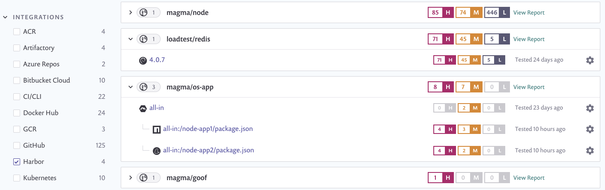

# Integrate with Harbor Container Registry


**Feature availability**\
This feature is available only with Enterprise plans. For more information, see [pricing plans](https://snyk.io/plans/).


Snyk integrates with Harbor Container Registry to enable you to import your container images and monitor them for vulnerabilities.

Snyk tests the images you have imported (referred to as Projects) for any known security vulnerabilities, testing them at a frequency you control, and alerts you when new issues are detected.

Follow these instructions to set up Harbor integration in Snyk and start managing image vulnerabilities.

## Integrate with Harbor Container Registry

### Prerequisites for Harbor integration

* You must be an administrator for the Organization you are configuring in Snyk.
* Snyk needs user credentials to integrate with Harbor and does not support Harbor when configured for single sign-on (SSO).

### **Configure Harbor integration**

1. In your Snyk account, navigate to **Integrations**, and under the **Container Registries** section, select **Harbor**.
2. In the **Account credentials** section, enter your Harbor username and password login credentials.
3. In the **Container registry name** fill in the full URL to the registry you want to integrate with.
4. To finish, select **Save**.

If you are using a self-hosted Harbor registry, contact Snyk to provide you with a token. For more information, see [Snyk Container for self-hosted container registries (with Broker)](../../../implementation-and-setup/enterprise-setup/snyk-broker/snyk-broker-container-registry-agent/integrate-with-self-hosted-container-registries-broker.md).


Integration setup requires a Harbor user with sufficient permissions to access the repository list via the `/v2/_catalog` endpoint. You can use an admin user or a system Robot account with Read Catalog permissions granted.


Snyk tests the connection values, and the page reloads, now displaying Harbor integration information. The **Add your Harbor images to Snyk** button becomes available. If the connection to Harbor fails, a notification appears under the **Connected to Harbor** section.

Once the connection is successful, you can use Snyk to scan your images from Harbor.

## Scan container images from Harbor in Snyk

Snyk tests and monitors your Harbor container images by evaluating the image tags in your repositories. After your container images are imported to Snyk, your image vulnerabilities are identified and can be triaged easily.

Follow these instructions to add images from Harbor to Snyk.

### **Prerequisites for Harbor image scanning**

* A Snyk account with access to the relevant Organization authorized by an administrator.
* Harbor integration configured; see Integrate with Harbor Container Registry.

### **Steps in scanning Harbor images**

1. Log in to your account and navigate to the relevant Group and Organization that you want to manage.
2. Under the **Projects** tab, click **Add project**.\
   The list of integrations already configured on your account opens.
3. Select the **Harbor** option or **Other** if Harbor does not appear.
4. The view **Which images do you want to test?** opens, displaying all of the available images for your connected registry, grouped by each of your repositories.
5. Select single or multiple images to be imported to Snyk by choosing a specific image or by selecting an entire repository. You can also search by image name to find specific images to import.
6. To finish, click **Add selected repositories** on the top right.\
   A status bar appears at the top of the page as the images are imported; you can continue working in the meantime.
7. When the import ends:
   1. You can view the newly imported image, marked with a **NEW** tag, on the **Projects** page. Images are grouped by repository and are each linked individually to a detailed Projects page.
   2. An import log becomes available; you can reach it from the top of the Projects list.
   3. To enrich the data and get recommendations regarding your base image, under **Settings,** you can connect your Dockerfile to the image Project. For more information, see [Adding your Dockerfile and testing your base image](../scan-your-dockerfile/detect-vulnerable-base-images-from-your-dockerfile.md).

Harbor imports are indicated with a unique icon. You can also filter to view only the Harbor Projects:

<figure><figcaption>
Harbor Projects in Projects listing
</figcaption></figure>


For application vulnerabilities within container images, any changes to the application will not be reflected with a manual or recurring retest. A re-import of the image is required. For more information, see [Detecting application vulnerabilities in container images](../use-snyk-container/detect-application-vulnerabilities-in-container-images.md).

