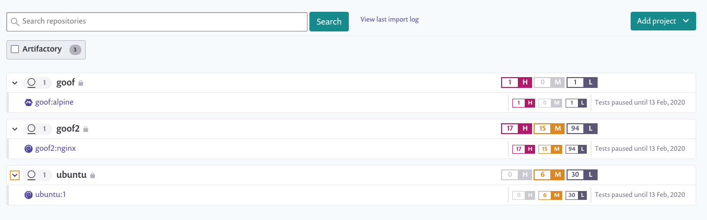

# Add Artifactory images to Snyk

Snyk tests and monitors your Artifactory container images by evaluating the tags in your repositories.

## **Prerequisites for adding Artifactory images**

* You must have an account with Snyk and be onboarded to your Organization by an administrator.
* The integration must be configured between Snyk and your Artifactory environment.

## **Steps to adding Artifactory images to Snyk**

* Log in to your account and navigate to the relevant Group and Organization you want to manage.
* Go to **Projects** and click **Add projects**. The list of integrations already configured on your account opens.
* The view **Which images do you want to test?** opens, displaying all of the available images for the registry to which you connected, grouped by each of your repositories.
* Select single or multiple images using any or all of the following methods:
  * Type the name of a single image for import in the Image Name field (at number 1, the image name field, in the image above),
  * Select any of the repositories if you want to import all of the associated images (at number 2, the second item listed in the image above).
  * Expand and collapse repositories to select multiple images (at number 3, the third image listed in the image above) across multiple repositories.
*   Click **Add selected repositories**.

    A status bar appears at the top of the page as the images are imported; you can continue working in the meantime.
* When the import ends, a notification of success or failure appears at the top of the page. Click Refresh to view the Projects page with the newly imported images. Images are grouped by repository and are each linked individually to a detailed Projects page.
* You can now connect your Git repo to this Project in order to use your Dockerfile for enriched fix advice. For more information, see [Adding your Dockerfile and testing your base image](../../scan-your-dockerfile/detect-vulnerable-base-images-from-your-dockerfile.md).

Images are indicated with a unique icon.  You can filter to view only the Artifactory Projects.

<figure><figcaption>
List of Artifactory Projects
</figcaption></figure>

Artifactory integration works like other Snyk integrations. To continue to monitor, fix and manage your Projects, see the relevant pages in the Snyk user documentation.


For application vulnerabilities within container images, any changes to the application will not be reflected with a manual or recurring retest. A re-import of the image is required. For more information, see [Detecting application vulnerabilities in container images](../../use-snyk-container/detect-application-vulnerabilities-in-container-images.md).

