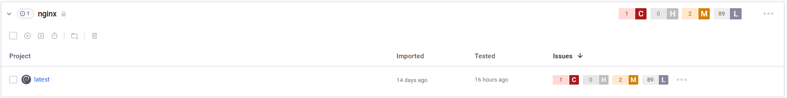

# Integrate with Nexus Container Registry


**Feature availability**\
This feature is available only with Enterprise plans. For more information, see [pricing plans](https://snyk.io/plans/).


Snyk integrates with Nexus Container Registry to enable you to import your container images and monitor them for vulnerabilities.

Snyk tests the images you have imported (Projects) for any known security vulnerabilities, testing them at a frequency you control, and alerts you when new issues are detected.

This page explains how to set up Nexus Container Registry integration in Snyk and start managing image vulnerabilities.

## Integrate with Nexus Container Registry

### Prerequisites for Nexus integration

* You must be an administrator for the Organization you are configuring in Snyk.
* Snyk needs user credentials to integrate with Nexus and does not support Nexus when configured for single sign-on (SSO).

### **Configure Nexus integration**

* In your Snyk account, navigate to **Integrations** from the menu bar at the top. Under the **Container registries** sectio&#x6E;**,** find the **Nexus** option and click it.
* In the **Account credentials** section, enter your Nexus username and password login credentials. In the **container registry name** fiel&#x64;**,** fill in the full URL to the registry you want to integrate with.
* To finish, click **Save**.

If you are using a self-hosted Nexus registry, [contact Snyk Support](https://support.snyk.io) to provide you with a token. For more information, see [Snyk Container for self-hosted container registries (with Broker)](../../../implementation-and-setup/enterprise-setup/snyk-broker/snyk-broker-container-registry-agent/integrate-with-self-hosted-container-registries-broker.md).

Snyk tests the connection values, and the page reloads, now displaying Nexus integration information. The **Add your Nexus images to Snyk** button becomes available.

If the connection to Nexus fails, a notification appears under the **Connected to Nexus** section.

## Scan container images from Nexus in Snyk

When the connection is successful, you can use Snyk to scan your images from Nexus.

Snyk tests and monitors your Nexus container images by evaluating the image tags in your repositories. After you have imported images to Snyk, the image vulnerabilities are identified and can be triaged easily.

Follow these steps to add images from Nexus to Snyk.

### **Prerequisites for Nexus image scanning**

* A Snyk account with access to the relevant Organization, authorized by an administrator
* Nexus integration configured; see [Integrate with Nexus Container Registry](integrate-with-nexus-container-registry.md#integrate-with-nexus-container-registry).

### **Steps in scanning Nexus images**

1. Log in to your account and navigate to the Group and Organization that you want to manage.
2. Under the **Projects** tab, click **Add project**.\
   The list of integrations already configured on your account opens.
3. Select the **Nexus** option or **Other** if Nexus does not appear.\
   The view **Which images do you want to test?** view opens, displaying all available images for your connected registry, grouped by each of your repositories.
4. Select single or multiple images to be imported to Snyk.\
   You can choose a specific image or select an entire repository. You can also search by image name to find specific images to import.
5. To finish, click **Add selected repositories** on the top-right.\
   A status bar appears at the top of the page as the images are imported; you can continue working in the meantime.
6. When the import ends:
   1. You can view the newly imported image, marked with a **NEW** tag, on the **Projects** page. Images are grouped by repository and are each linked individually to a detailed **Project** page.
   2. An **import log** becomes available; you can reach it at the top of the Projects list.
   3. To enrich the data and get recommendations regarding your base image, under **Settings,** you can connect your Dockerfile to the image Project. For more information, see [Adding your Dockerfile and testing your base image](../scan-your-dockerfile/detect-vulnerable-base-images-from-your-dockerfile.md).

Nexus imports are indicated with a unique icon. You can also filter to view only Nexus Projects.

<figure><figcaption>
Example of a Nexus Project
</figcaption></figure>


For application vulnerabilities within container images, any changes to the application will not be reflected with a manual or recurring retest. A re-import of the image is required. For more information, see [Detecting application vulnerabilities in container images](../use-snyk-container/detect-application-vulnerabilities-in-container-images.md).

