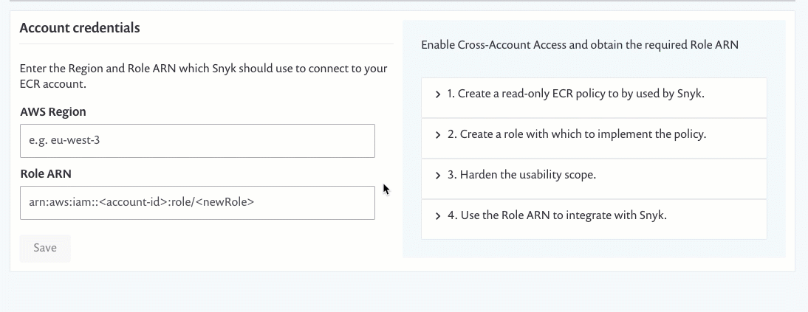

# Enable permissions to access Amazon Elastic Container Registry (ECR) for the first time

This process describes how to set up a resource role in AWS and the necessary policies. For additional assistance, see the [Amazon ECR documentation](https://docs.aws.amazon.com/AmazonECR/latest/userguide/ecr\_managed\_policies.html).

1. Click [here](https://console.aws.amazon.com/iam/home?#/policies) to log in to the AWS Management Console, navigate to the IAM service and then to the Policies page to create a policy for the role by updating the related JSON file, as follows:
   1. Create a new policy.
   2. Navigate to the JSON tab.
   3. Select and delete all of the default text in the JSON file.
   4. Copy script as it is displayed from the UI in your Snyk account and paste it inside the JSON file.
   5. Set **AmazonEC2ContainerRegistryReadOnlyForSnyk** as the **Name**.
   6. Enter Provides Snyk with read-only access to Amazon EC2 Container Registry repositories as the Description.
   7. Click Create Policy.
2. Create a role by which to implement the policy:
   1. From the [AWS Management Console](https://aws.amazon.com/console/) again, navigate to the Roles page and create a new role.
   2. Select AWS service as the trusted entity and EC2 as the service for this role.
   3. Click Next:permissions.
   4. From the Policies list that is displayed, search for and select the **AmazonEC2ContainerRegistryReadOnlyForSnyk** policy you just created.
   5. Skip to the last step (Review) of the process.
   6. Name the role **SnykServiceRole**, enter Allows EC2 instances to call Snyk AWS services on your behalf as the Description and then Create role.
3. Harden the usability scope for the role
   1. Again from the Roles page, find and click the link for the role you just created to update its configurations and navigate to the Trust relationships tab.
   2. Click Edit trust relationship.
   3. In the Policy Document, select and delete the entire script and then copy the following script as it is displayed from the UI in your Snyk account and paste:

