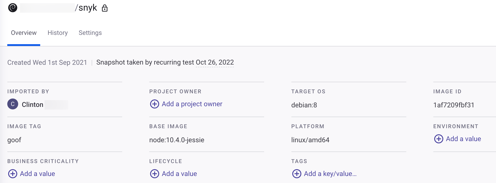
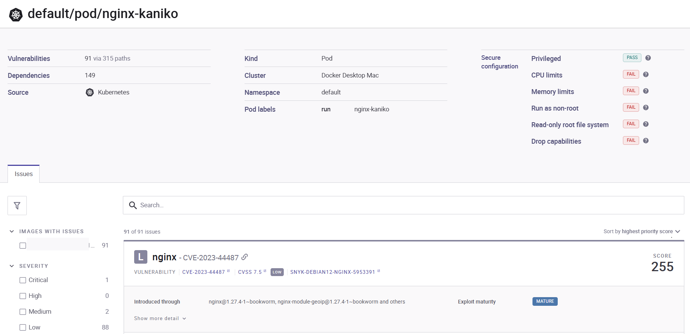

# View Project details and scan results

All workloads that you have imported for monitoring appear on the **Projects** page and are marked with a unique Kubernetes icon.

To view and manage the workload scan results, navigate to the **Projects** page and filter Kubernetes Projects.

<figure><figcaption>
Kubernetes Projects
</figcaption></figure>

Expand any Project to view:

* a list of the individual images used in the workload
* a summary of the number of vulnerabilities in each image.

To view vulnerabilities in detail for any image, including its history, click the image name. The Project details page loads for the selected image:

To view an aggregate list of the vulnerabilities in all of the images in the workload, including details about the security posture of the workload configuration, click the workload.

The Project details page loads for the selected image.

Snyk scans the workload configuration for the following properties:

| **Snyk parameter**     | **Associated Kubernetes parameters**         | **Description**                                                                                                                                                                                                                                                                                               |
| ---------------------- | -------------------------------------------- | ------------------------------------------------------------------------------------------------------------------------------------------------------------------------------------------------------------------------------------------------------------------------------------------------------------- |
| CPU and Memory limits  | Resources.limits.memory resources.limits.cpu | Limiting the expected CPU and Memory available to the container has both operational and security benefits. In the context of security, it is about limiting the impact of potential denial of service attacks to affecting the app rather than the node and potentially the entire cluster.                  |
| runAsNonRoot           | securityContext.runAsNonRoot                 | By default, containers can run as the root user. This property prevents this from happening at the container runtime. This means an attacker has limited permissions to execute a command in the context of the container.                                                                                    |
| readOnlyRootFilesystem | securityContext. readOnlyFilesystem          | By default, the filesystem mounted for the container is writable. This means an attacker who compromises the container can also write to the disk, which makes certain kinds of attacks easier. If your containers are stateless, then you do not need a writable filesystem.                                 |
| Capabilities           | securityContext.capabilities                 | At a low-level, Linux capabilities control what different processes in the container are allowed to do: from writing to the disk to communicating over the network. It is possible to drop all capabilities and add in those that are required, but it requires understanding the list of capabilities first. |
