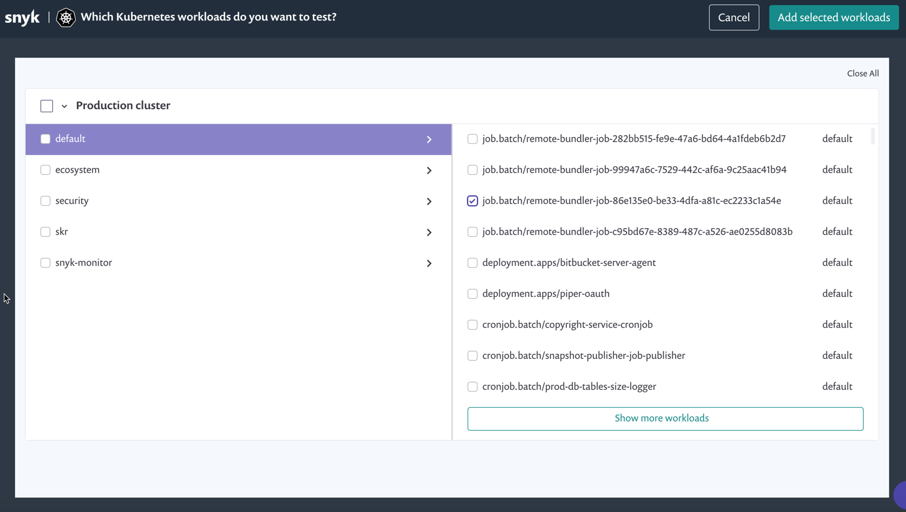
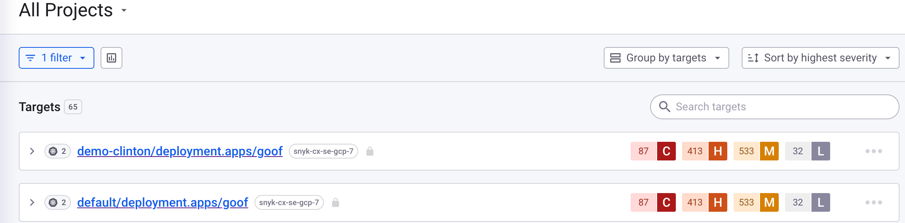

# Manually import Kubernetes workload Projects

Using the same integration ID, you can import multiple clusters to one Snyk Organization by giving clusters a unique cluster name during installation.

You can also import one cluster to multiple Snyk Organizations in manual import by [cloning an integration across your Snyk organizations](../../../implementation-and-setup/enterprise-setup/snyk-broker/classic-broker/clone-an-integration-across-your-snyk-organizations.md), so the integrations have the same integration ID.&#x20;

One Snyk Organization has a limit of 25,000 Projects. For more information, contact your Snyk admin.

## **Prerequisites for manually importing Kubernetes workload Projects**

You must first have an account with Snyk and be onboarded to your Organization by an administrator.

In addition, you must configure the integration between Snyk and your Kubernetes environment per Organization. To ensure the integration is configured, ensure you have an Integration ID. For more information, see [Enable the Kubernetes integration](overview-of-kubernetes-integration/enable-the-kubernetes-integration.md).

Next:

1. Deploy the Snyk Controller in your Kubernetes cluster.
2. Deploy the Kubernetes workloads that you want to import into the Kubernetes cluster.

## Manually add Kubernetes workloads

In the Snyk Web UI, navigate to the **Projects** page, and click **Add projects** at the top of the page. From the list of Projects, select **Kubernetes**.

On the import screen that appears, all namespaces from the Kubernetes environment are displayed on the left, and the relevant namespace workloads are displayed on the right.

<figure><figcaption><p>Kubernetes workloads import screen</p></figcaption></figure>

Snyk purposely ignores scanning certain namespaces that Snyk believes are internal to Kubernetes (any namespace starting with kube-\*). Therefore, those namespaces do not appear in the list, and neither do the workloads that those namespaces contain. You can see the full list of ignored namespaces in the [kubernetes-monitor internal-workspaces file](https://github.com/snyk/kubernetes-monitor/blob/master/src/supervisor/watchers/internal-namespaces.ts).

You can configure the list by adding the following code to Helm when you are setting up the snyk-monitor:

```
      --set excludedNamespaces={kube-node-lease,local-path-storage,some_namespace}
```

Select one or multiple namespaces from the left side of the screen, and for each namespace, select one or multiple workloads to import from the right side of the screen.

<figure><figcaption><p>Selecting namespaces from the Kubernetes workloads import screen</p></figcaption></figure>

Next, click **Add selected workloads** from the top right of the screen. When the import completes, the **Projects** page loads, and all the workloads that you have imported appear with a unique Kubernetes icon.

Each item is named according to its Kubernetes metadata:

\<namespace>/\<kind>/\<name>

In the **Projects** list, you can filter Kubernetes Projects.


