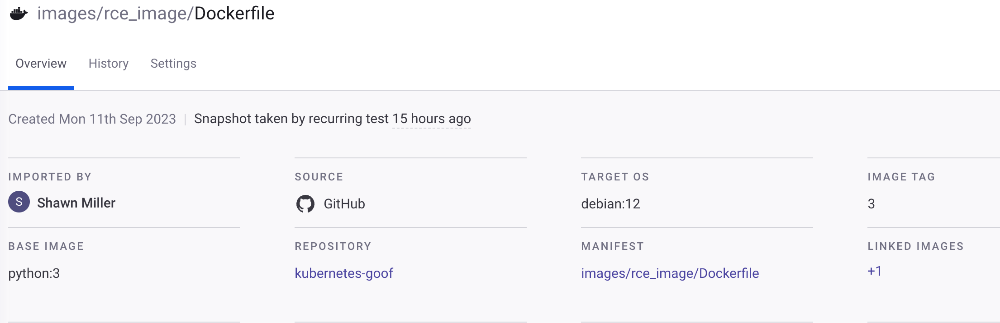
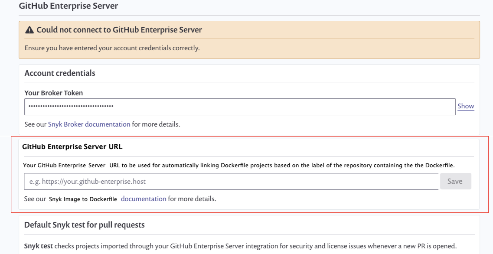

# Automatically link your Dockerfile with container images using labels

Snyk allows you to link manually or automatically from a Dockerfile to all container images built from it. You can use this to understand the security impact on your running applications and understand which images can be better secured or need to be rebuilt when you take action and update the Dockerfile base image.

## How linked images work

When it is imported or rescanned, the image is analyzed and scanned for vulnerabilities. Image labels are also retrieved from the image manifest. Snyk then checks that:

* Image labels defining the Dockerfile location exist:
  * (Mandatory) `org.opencontainers.image.source` - URL to the Project repository, for example, `org.opencontainers.image.source="https://github.com/example/test"`
  * (Optional) `io.snyk.containers.image.dockerfile` - path to the Dockerfile, for example,  `io.snyk.containers.image.dockerfile="/app/Dockerfile-prod"` . This label is only required if:
    * The Dockerfile is not in the root of your repository
    * The Dockerfile is not named `Dockerfile`&#x20;
* The Dockerfile Project exists in the same Organization, with a matching repository (and path or /Dockerfile) from the image labels.

If these conditions apply, Snyk automatically creates a link between the image and the Dockerfile Project.

## View linked images

You can see the linked images on the Project page, under **LINKED IMAGES.**&#x20;

<figure><figcaption>
Project showing linked images
</figcaption></figure>

Using container registry integration, you can get automatic links between imported images to existing Dockerfile Projects. To do this, ensure the OCI label in the image matches the path of a Dockerfile in the Organization in Snyk.

## Automatically update and remove links

Links are automatically updated if the Dockerfile labels are updated and are targeting a new location. This can happen during a re-scan or during a recurring scan.

Links are removed if:

* The image Project or Dockerfile Project is deleted.
* The Dockerfile labels are updated so that they target the Dockerfile location without an existing Project in Snyk or
* The Dockerfile labels are removed.

## Create an automatic link with brokered SCM integrations

To create a link, Snyk must be able to map the Dockerfile repository URL to the right SCM Organization source. For brokered integrations, the process is more complex, as the URL is not available by default.

To create automatic links between container images to Dockerfiles stored in brokered SCMs, enter the URL in the integration settings page.

<figure><figcaption>
Integration settings page with integration URL
</figcaption></figure>

When the URL is available, Snyk can use it to generate links.
