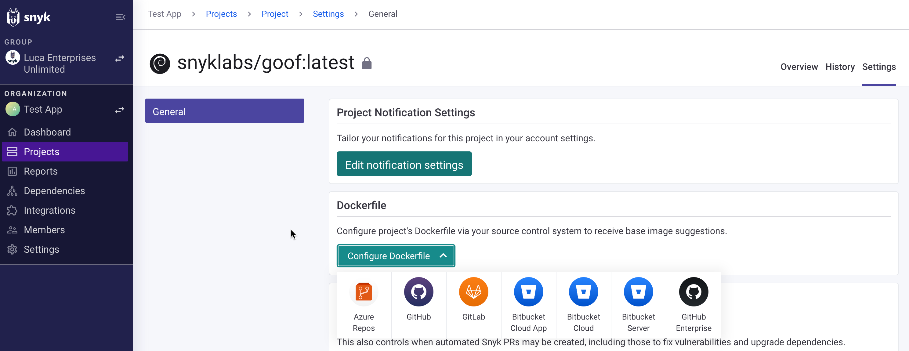
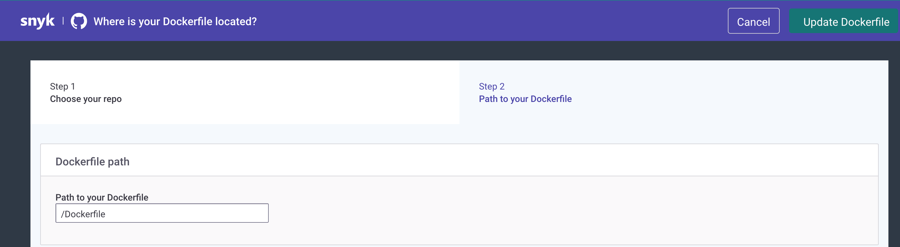
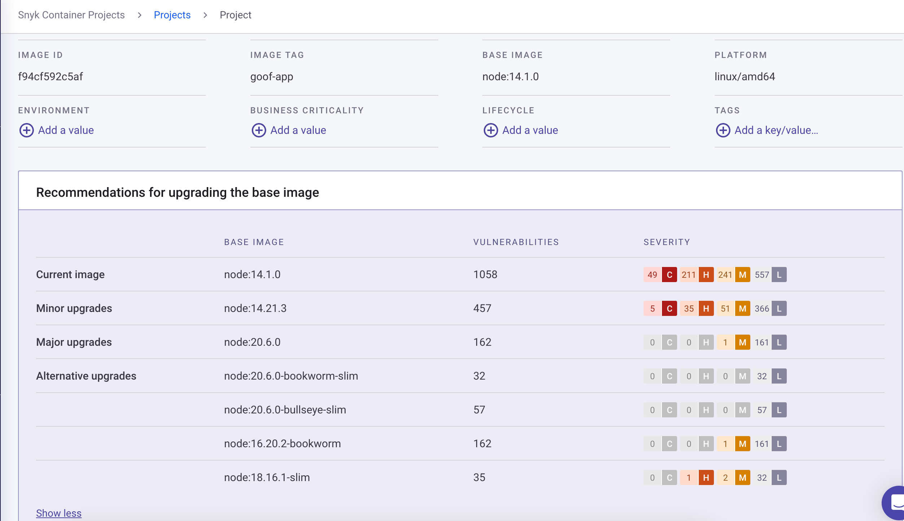
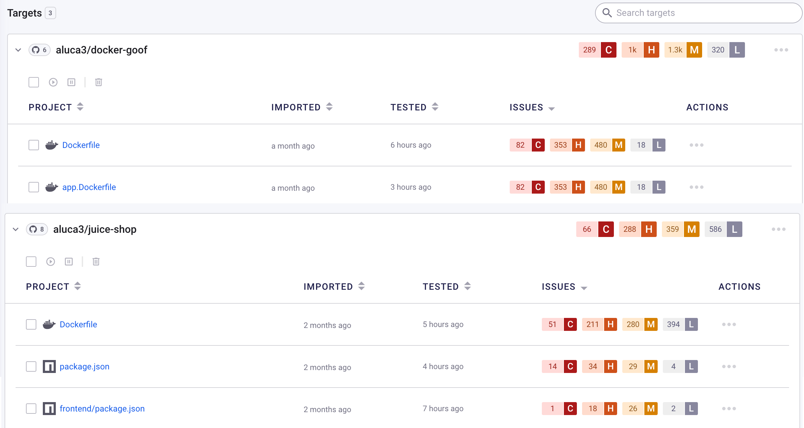

# Detect vulnerable base images from your Dockerfile


You can add a single Dockerfile to each image that you have imported.


## **Prerequisites for adding a Dockerfile**

To receive base image fix advice, including major, minor, and alternative upgrades, as well as advice when you need to rebuild your image, ensure you:

* Have configured your preferred Git repository
* Have imported the repository that contains the relevant Dockerfile.

## **Add a Dockerfile**

To add a Dockerfile for additional fix advice:

1. In the **Projects** tab, find your Project by using a filter and navigate to the Project page.
2. On the Project page, navigate to **Settings**.
3. On the **Settings** page, under **Dockerfile**, click **Configure Dockerfile** and select the relevant Git repository from the dropdown.

<figure><figcaption>
Configure Dockerfile
</figcaption></figure>

4. On the page listing the available repositories, select the relevant repository which contains your Dockerfile.
5. Under **Path to your Dockerfile**, add the relative path to your Dockerfile, in the following format: /path/dockerfile.

<figure><figcaption>
Add the path to your Dockerfile
</figcaption></figure>

6. Click **Update your Dockerfile**.

Snyk scans the Project again and provides relevant base image fix advice. You can see the fix advice on the Project page, under **Recommendations for upgrading the base image.**

The following information is displayed: **Current image**, **Minor upgrades**, **Major Upgrades**, **Alternative upgrades**, the number of vulnerabilities for each, and a severity ranking.

<figure><figcaption>
Recommendations for upgrading the base image
</figcaption></figure>

## Scan the base image from a Dockerfile

Snyk detects vulnerable base images by scanning your Dockerfile when you import a Git repository. This allows you to examine security issues before building the image and thus helps solve potential problems before they land in your registry or in production.


When scanning Dockerfiles, Snyk can provide vulnerability information and base image recommendations for supported base images. If you need help, contact [Snyk Support](https://support.snyk.io).


After you [integrate your Git repository with Snyk](../../../scm-integrations/organization-level-integrations/), any Dockerfiles in that repository are automatically identified and shown in the Web UI as Projects.

<figure><figcaption>
Dockerfiles displayed in the Project list
</figcaption></figure>

For details about detecting vulnerable base images in containers and fix recommendations, see [Detect the container base image](../use-snyk-container/detect-the-container-base-image.md).
