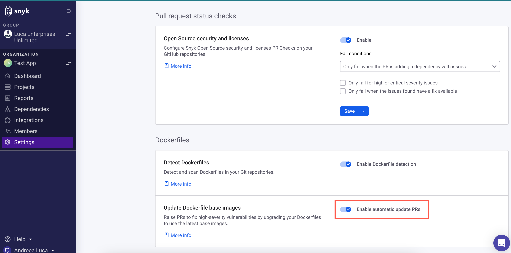

# Fix vulnerable base images in your Dockerfile

## Automatic Pull Requests (PRs)

Snyk detects vulnerable base images by scanning your Dockerfile when importing a Git repository and helps you fix them using automatic pull requests. This allows you to examine security issues before you build the image and fix them before they land in your registry or in production.

Supported Git-based repository managers for Dockerfile fix PRs include:

* GitHub
* GitLab
* Bitbucket Server
* Bitbucket Cloud
* GitHub Enterprise Server
* Azure Repos

For any Dockerfile Project created in Snyk, if the base image is a [Docker Official image](https://docs.docker.com/docker-hub/official_images/), the results include a list of suitable base images that can be used instead of the existing, more vulnerable one. For more information, see [Analyze and fix container images](../use-snyk-container/analyze-and-fix-container-images.md).

Snyk then automatically issues a fix pull request against your Dockerfile to upgrade to the latest minor version available.


In a multi-stage build, Snyk analyzes only the final stage. &#x20;


Snyk opens an automatic fix PR when there is a change in the Dockerfile or when it identifies a better base image after the initial scan.

### Enable automatic update of Dockerfile base images

The feature is available for all Snyk users. It is on by default for all users with free accounts and off by default for existing integrations of Snyk customers.

To enable automatic update PRs, navigate to **Settings** > **Integrations** and select your connected source code manager. On the settings configuration page, under **Dockerfiles**, toggle **Enable automatic update PRs**.

<figure><figcaption>
Enable automatic update PRs
</figcaption></figure>

## Open a fix PR manually

Alternatively, you can open a fix PR manually from the Project page by clicking **Open a Fix PR** for the base image version you wish to upgrade to.

<figure><figcaption>
Open a fix PR
</figcaption></figure>

After the fix PR is opened, you can view it in your Git repository and see what the change is and where it takes place. The `FROM` line in your Dockerfile is updated with the new and improved version.


Ensure your application works properly before merging the change.


When the PR is opened and ready, you can safely merge it and instantly reduce the number of vulnerabilities in your container image.
