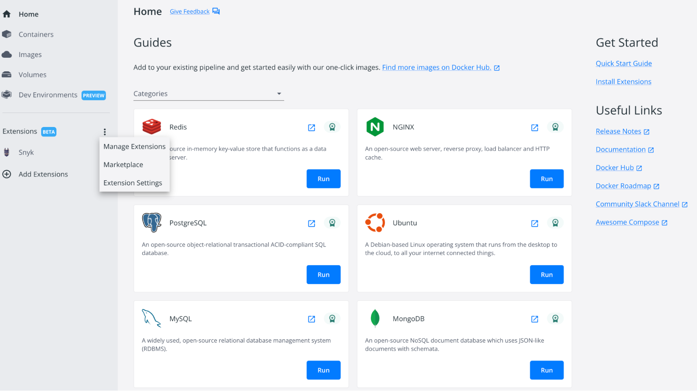
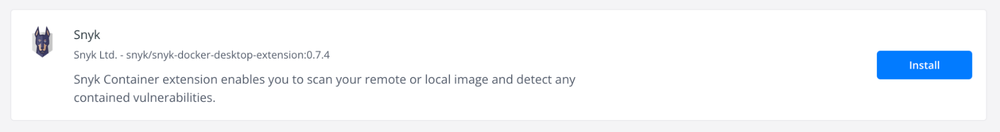
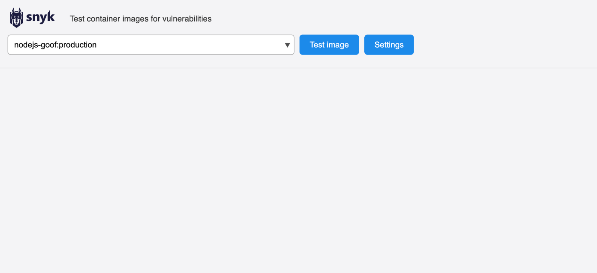
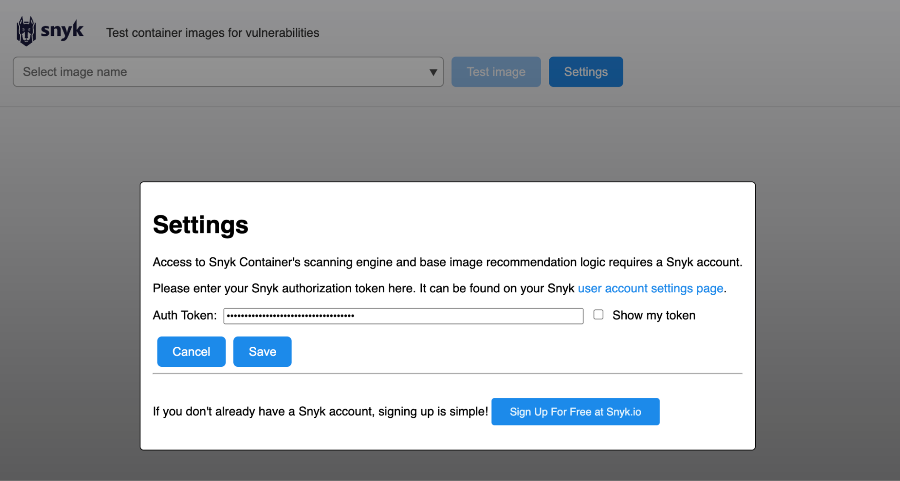
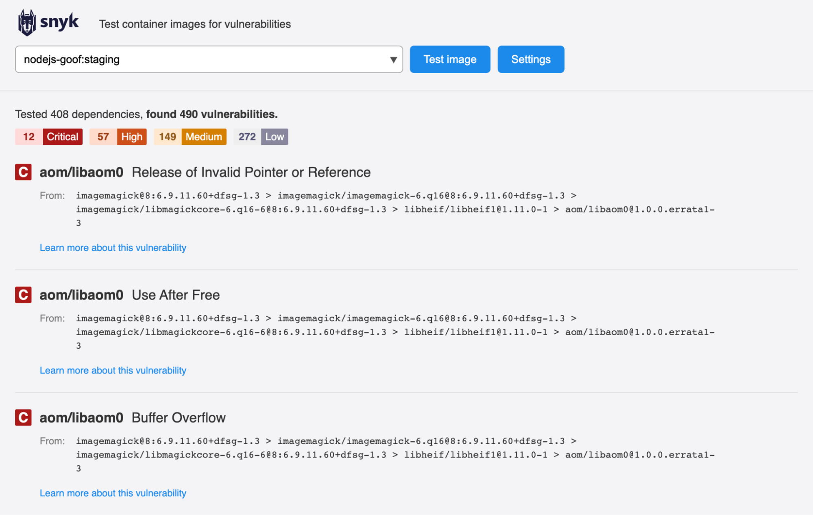

# Docker Desktop Snyk Extension

Docker Desktop is a GUI that can be installed on Mac, Windows, or Linux to simplify the management of containers and containerized applications. Snyk has a Docker Desktop extension, allowing developers and platform teams to scan container images for vulnerabilities within the Docker Desktop interface.

## How to Install and Run the Snyk Docker Desktop Extension

From the Docker Desktop Homescreen:

1. Select "Extensions" from the homepage then select "Marketplace":  
   

&nbsp;

2. Once in the Marketplace view, scroll down until you find the Snyk extension. Click to install:  
   

&nbsp;

3. Once the extension has been installed, click to "open" to launch the extension. This takes you to the Snyk Extension page:  
   

&nbsp;

4. Click the settings button to add your API token or service account token:  
   

&nbsp;

5. Select the local image you want to scan from the dropdown and then click "Test image":  
   
