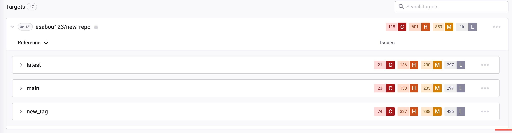

# Analyze and fix container images

You can import container Projects into Snyk using the CLI command [`snyk container monitor`](../../../developer-tools/snyk-cli/commands/container-monitor.md). Alternatively, you can import Projects directly from a supported container registry using the Snyk Web UI.

Snyk imports a snapshot of your container image and then scans the snapshot for vulnerabilities. Based on your configuration, daily or weekly, Snyk regularly scans the dependencies snapshotted in that original import, which in turn refers to its tag. Based on your configuration, Snyk sends you an update by email or Slack when any new vulnerabilities are identified.

If the tag for an image changes and the original tag is used for a different image, upon rescanning (daily or weekly), Snyk detects changes to the Linux package dependencies and creates a new snapshot of that Project, but it does not detect changes in the application dependencies and thus does not update the snapshot for application vulnerabilities.

This means that if you frequently reuse a tag to refer to a different image, you must reimport the other image so that Snyk can update the application dependencies.

## Grouping of Container Projects

Depending on how you import images (Snyk CLI, container registry integration, or Kubernetes integration), Projects are grouped differently in the **Projects** tab.

### Project grouping when importing images with Snyk CLI

Snyk groups images and the applications found in the image. However, Snyk CLI does not use image tags for grouping, so Snyk does not do sub-grouping for the different image tags. Thus images from the same repository with different image tags are all grouped.

### Project grouping when importing images with container registry integration

If you import images into Snyk with container registry integration, in the **Projects** list Snyk performs sub-grouping per image tag for each image name.

<figure><figcaption>
Images with different image tags grouped in sub-groups
</figcaption></figure>

### Project grouping when importing images with the Kubernetes integration

If you import images into Snyk using the Kubernetes integration, the top clickable item represents the workload in the cluster. Snyk performs grouping based on the image in the workload, without sub-grouping per image tag.

## View image vulnerabilities

If the Project is imported from a registry integration, on the **Projects** page, it is marked with the relevant registry icon. If the Project is imported from the CLI, it is marked with a CLI icon. You can also filter to display all container Projects.

When you open a container Project, the analysis and fix advice appear for that Project.

<figure><figcaption>
Analysis and fix advice for a container Project
</figcaption></figure>

The following information is displayed:

* Project summary: general Project details, including unique details:
  * **Image ID** - derived from the container image digest
  * **Image tag**
  * **Base Image**
  * Total dependencies with known vulnerabilities and the total number of vulnerabilities
* Fix advice: If you included your Dockerfile for monitoring, available and actionable fix advice is displayed. To view all fix advice, click **Show more upgrade types**.

The **Issues** tab provides a list of vulnerabilities, including origins and paths, as well as an overview of the vulnerabilities.

In the issues list, you can use the filters available for all supported Project types, as well as the following filters:

* **OS BINARIES** - to see specific binary or OS packages for binaries and packages containing issues.
* **IMAGE LAYER** - to see Dockerfile instructions. If you attach a Dockerfile, you can filter to view issues associated only with the base image, view Dockerfile-related advice (user instruction), or both.

<figure><figcaption>
Filters for OS binaries and image layers
</figcaption></figure>


The **OS BINARIES** filter does not appear if there is only one category of issues in your container, for example, Node binary vulnerabilities or OS packages.\\

The **IMAGE LAYER** filter does not appear if there is no Dockerfile attached.


The **Dependencies** tab provides a tree view of the package hierarchy inside the image.

## Fix image vulnerabilities

When providing public base image recommendations, Snyk bases its logic on the origin repo, flavor, and version of the base image it detects.

The Snyk recommendations for upgrading the base image refer to:

* **Minor upgrades**: the safest and best minor upgrade available
* **Major upgrades**: an option for a major upgrade that will reduce more vulnerabilities but with greater risk
* **Alternative upgrades**: viable image options for replacing your current base image with possible different base images that provide the least amount of vulnerabilities.
* Recommendation to rebuild your base image if it is outdated.

Recommendations for upgrading the base image include:

* The name of the recommended base image version
* The number of vulnerabilities that exist in the recommended upgrade
* A summary of the vulnerability severities.

<figure><figcaption>
Recommendations for upgrading the base image
</figcaption></figure>
