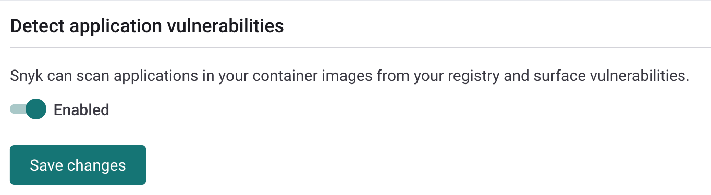
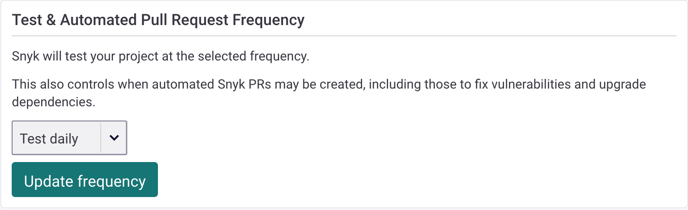

# Detect application vulnerabilities in container images

In one scan, Snyk can detect the vulnerabilities in your application dependencies from container images, as well as from the operating system.

Detecting application vulnerabilities is intended for scanning third-party images. This feature was not designed for detecting issues in code developed in-house, where the user has access to the source code and can shift left and detect Issues earlier in the SDLC by using Snyk Code and Snyk Open Source.

Detecting application vulnerabilities in container images for Container Registry integration is supported for Node, Ruby, PHP, Python, Go binaries, and Java. For the CLI and Kubernetes, this feature is supported for Node, PHP, Python, Go binaries, and Java.

After you integrate with a container registry and import your Projects, Snyk scans your image for vulnerabilities.

For application Projects created from images that are imported from container registry integrations, the applications are not re-imported during recurring scans or manual rescans.

Instead, the application dependencies that are found during the initial image import are scanned for new vulnerabilities.

If new dependencies are introduced in an application within an image, they will not be detected by recurring scans or manual rescans. To detect new or updated applications within images from container registries, you must re-import the image to Snyk.

For applications found in images imported from the Kubernetes integration, existing applications will be re-imported, but new apps added to the image will not be imported during recurring scans. To detect new applications within images from Kubernetes, you must re-import the image to Snyk.

## Enable container registries vulnerability scan

To enable the application vulnerability scan from container registries:

1. Navigate to **Integrations**, and then to your container registry integration settings.
2. Enable **Detect application vulnerabilities** and save the changes.

<figure><figcaption>
Enable Detect application vulnerabilties
</figcaption></figure>

When you are scanning an image using a container registry or Kubernetes integration, the scan also uses the `--app-vulns` flag by default. You can opt out of the flag in the container registry only. To do this, disable the **Detect application vulnerabilities** feature.


* For Java, when you use the flag, Snyk scans one level of nested jars by default.
* For Python, Snyk supports Poetry and Pip (in all integration points).
* For Go binaries, Snyk supports any type of Go binary built with Go module support.


## Snyk Container CLI options to detect vulnerabilities

### App vulns option

In CLI versions 1.1090.0 (2023-01-24) and higher, Snyk scans for application dependencies in your image by default; you do not need to specify the `--app-vulns` option.

If you want to opt out of application vulnerability scanning, you can specify the `--exclude-app-vulns` option. This omits the application vulnerabilities section from the results, mimicking the previous behavior. The `--exclude-app-vulns` option is available in CLI version 1.1021.0 and above.

### Java applications

Snyk Container CLI supports scanning Java applications embedded in container images as JARs or uber -jars. In the case of uber-jars or shaded jars, Snyk uses the `pom.properties` manifest file to resolve package versions and dependencies. The presence of the `pom.properties` file in a JAR file depends on how the JAR was built and what tools and configurations were used during the build process. Maven and Maven Shade Plugin built JARs include `pom.properties` manifest file by default.

### Nested jars depth option

When `--app-vulns` is enabled, you can also use the `--nested-jars-depth=n` option to set how many levels of nested jars Snyk will unpack. The implicit default is 1. When you specify 2, it means that Snyk unzips jars in jars; 3 means Snyk unzips jars in jars in jars, and so on.

To opt out of any scans you feel are unnecessary, use `--nested-jar-depth=0` .

### Maven packages suffixed with a version of @unknown

Snyk Container CLI could report Maven packages suffixed with a version of @unknown when `pom.properties` manifest file is not included in the scanned JARs. For details of other reasons why the package version is reported as @unknown, see [Why-does-my-Maven-package-show-Unknown-through-the-SCM](https://support.snyk.io/s/article/Why-does-my-Maven-package-show-unknown).

## View application vulnerabilities and licensing issues

When the **Detect application vulnerabilities** feature is enabled, it allows you to see:

* Dependency vulnerabilities and licensing issues of manifest files detected in your container image
* Vulnerabilities detected in operating system packages.

When an image is imported to Snyk, it appears under its registry record in the **Projects** view, showing the operating system vulnerabilities found in your image.

With this feature enabled, you can also see nested manifest files detected in the image and their vulnerabilities and licensing issues.

## Set up automated scanning

Depending on your Project settings, Snyk scans the image regularly. Based on your configuration, Snyk updates you by email or Slack whenever new vulnerabilities are identified in both the operating system and application dependencies.

You can set the scan frequency for each Project. The default is daily testing. To update the scan frequency, navigate to the **Settings** tab on the Project page and select the frequency from the dropdown. The options are **never**, **daily**, or **weekly**.

<figure><figcaption>
Update scan frequency
</figcaption></figure>

## Supported container registries

The following container registries are supported:

* Docker Hub
* GCR
* ACR
* Amazon ECR
* JFrog Artifactory
* Harbor
* Quay
* GitHub
* Nexus
* DigitalOcean
* GitLab

## Supported integrations

The supported languages work with the following integrations:

<table data-header-hidden><thead><tr><th width="133"></th><th width="165"></th><th width="157"></th><th></th></tr></thead><tbody><tr><td><strong>Language</strong></td><td><strong>Container Registry</strong></td><td><strong>CLI</strong></td><td><strong>Kubernetes</strong></td></tr><tr><td>Node</td><td>Yes</td><td>Yes</td><td>Yes</td></tr><tr><td>Ruby</td><td>Yes</td><td></td><td></td></tr><tr><td>PHP</td><td>Yes</td><td>Yes</td><td>Yes</td></tr><tr><td>Python</td><td>Yes</td><td>Yes</td><td>Yes</td></tr><tr><td>Go Binaries</td><td>Yes</td><td>Yes</td><td>Yes</td></tr><tr><td>Java</td><td>Yes</td><td>Yes</td><td>Yes</td></tr></tbody></table>
