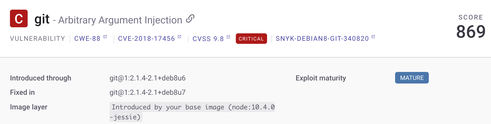
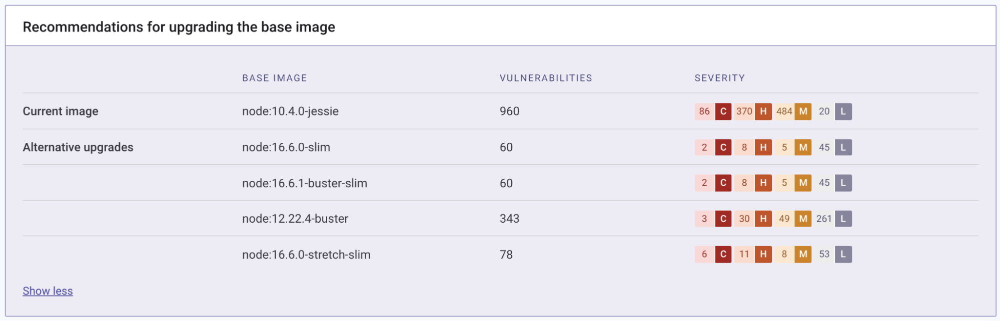

# Detect the container base image

Detecting vulnerable base images allows you to identify the source of your vulnerabilities and fix them by updating the base image according to recommendations.

You can detect your base image after you configure a [container integration](../#snyk-container-integrations) (such as the CLI or a container registry integration).


For details about supported container registries, see [Container security integrations.](../container-registry-integrations/)


## How Snyk Container identifies base images

To identify vulnerable base images, you can use one of the following methods:

* Auto-detection - when Snyk analyses your container image, it extracts relevant metadata from the image manifest, and detects the base image. This method analyses `rootfs` layers from the image manifest, which can be equivalent to more than one image or image tag in DockerHub.
* Dockerfile - Snyk can also detect vulnerable base images using your Dockerfile. It can either be attached with a `--file` flag to your CLI `snyk container test` scan, linked from an SCM through your Project settings, or detected and scanned when you import a Git repository. Compared to auto-detection, using your Dockerfile can be more accurate but requires an additional step.\
  \
  For multi-stage Dockerfiles, Snyk detects the base image included in the image introduced in the final `FROM` line. According to [Docker's multi-stage build documentation](https://docs.docker.com/develop/develop-images/multistage-build/#use-multi-stage-builds), this happens because using multiple `FROM` statements lets you "selectively copy artifacts from one stage to another, leaving behind everything you don't want in the final image."

For either method, a Project in the Snyk UI is created.


Snyk supports only a subset of official Docker images. If you need help, contact [Snyk Support](https://support.snyk.io).


## Image layer

When you scan a Docker image in Snyk, you can see the instruction in the image layer that introduces the vulnerability. You do not need to perform any action at this point.

<figure><figcaption>
Image layer information for a Docker image
</figcaption></figure>

## Snyk Container recommendations for upgrading base images

If the base image is a Snyk-supported image, the results include recommendations for upgrades to resolve some of the discovered vulnerabilities.

This allows you to see vulnerability counts in minor and major upgrades and in alternative base images, which might have fewer vulnerabilities. Based on this information, you can decide whether to upgrade your base image and which one is the best.

You can see the base image vulnerabilities in your Project among the vulnerabilities added by your instructions, sorted by their priority score.

<figure><figcaption>
Recommendations for upgrading the base image
</figcaption></figure>

You can also filter only the base image vulnerabilities using the **Base image** option under the **Image Layer** filter.

For more details, see [Analyze and fix container images](analyze-and-fix-container-images.md).
