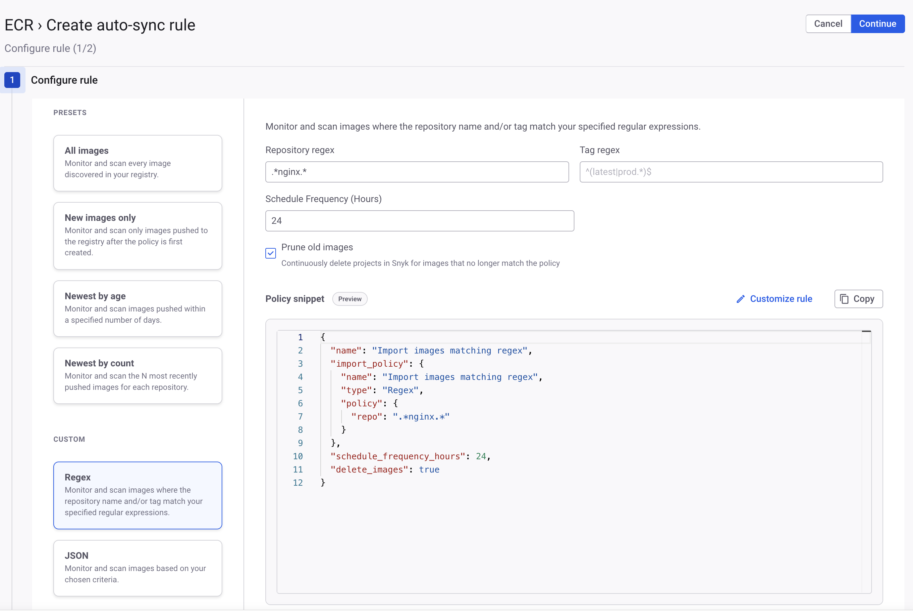

# Sync your container registry


You cannot use this functionality with GitLab or GitHub because they do not support a registry-scoped `/v2/_catalog` Docker registry endpoint.


The Container registry sync feature automatically scans and imports container images from your registry based on configurable policies. After you configure it, Snyk periodically checks your container registry for new images and automatically creates Snyk Projects for vulnerability scanning.

The sync process runs on a schedule you define and performs the following actions:

* Lists repositories: Snyk retrieves all repositories from your registry.
* Lists tags: Snyk enumerates all available image tags for each repository.
* Applies policy: Snyk evaluates the images against your import policy to determine which images to import or delete.
* Creates output:
  * For each matching repository, Snyk creates a target (e.g., `mycompany/web-app`). The target naming follows the pattern: `{repository_name}`
  * For each matching image tag, Snyk creates a Project under that target (e.g., `mycompany/web-app:latest`), which contains the vulnerability scan results. The Project naming follows the pattern: `{repository_name}:{tag}`

## Policy configuration

You can define how Snyk imports images using a policy object. This includes two top-level settings and a selection of policy types.

* `schedule_frequency_hours`: Sets how often the sync job runs, in hours. The minimum is two, and the default is 24.
* `delete_images`: When set to `true`, Snyk deletes Projects for images that no longer match your import policy (for example, an old tag is removed or no longer fits a `recent images` rule). The default is `false`.

## Policy types

You can use these policy types individually or combine them for more complex rules.

### **Import All**

Imports every image discovered in your registry.

```json
{
  "name": "Import all images from the registry",
  "import_policy": {
    "type": "ImportAll"
  }
}
```

### **Import All New**

Imports only images pushed to the registry after you create the policy. Snyk does not import existing images.

```json
{
  "name": "Import only newly pushed images",
  "import_policy": {
    "type": "ImportAllNew"
  }
}
```

### **Regex-based import**

Imports images where the repository name or tag matches your specified regular expressions.

```json
{
  "name": "Import by pattern",
  "import_policy": {
    "name": "regex policy",
    "type": "Regex",
    "policy": {
      "tag": "^(latest|prod.*)$",
      "repo": "^mycompany/.*$"
    }
  }
}
```

### **Recent images only**

Imports images pushed in a specified number of days. Snyk calculates the interval from the time you push the image to the registry. This policy applies per repository name, not across your entire registry. For example, set `maxAgeDays` to 30 to import images that are a maximum of 30 days old.

To target only a subset of repositories, combine this policy with a regex policy that targets those repositories.

Combine this policy with the `delete_images: true` option to continuously prune old Snyk Projects.


If push time data is unavailable from your registry, the policy uses the time Snyk first observed the image. Snyk does not import images pushed before the first scan of your container registry if push time data is unavailable.


```json
{
  "name": "Import images pushed in the last 30 days",
  "import_policy": {
    "type": "Recent",
    "policy": {
      "maxAgeDays": 30
    }
  }
}
```

### **Last N Observed per repository**

Imports the N most recently pushed images for each repository. The policy applies per repository, not across the entire registry. Snyk calculates the interval from the time you push the image to the registry. For example, you can keep one image per repository when `limitNewestImages` is 1.

To target only a subset of repositories, combine this policy with a regex policy that targets those repositories.

Combine this with `delete_images: true` to ensure Snyk monitors only the newest versions.


If push time data is unavailable from your registry, the policy uses the time Snyk first observed the image. Snyk does not import images pushed before it first scanned your container registry if push time data is unavailable.


```json
{
  "name": "Import latest versions",
  "import_policy": {
    "name": "last n policy",
    "type": "LastNObserved",
    "policy": {
      "limitNewestImages": 5
    }
  }
}
```

### **Complex policies**

Combine multiple policies using `And` and `Or` to create complex rules.

```json
{
  "name": "Complex: Import all prod tags OR only new images with the latest tag",
  "import_policy": {
    "type": "Or",
    "sub_policies": [
      {
        "type": "Regex",
        "policy": { "tag": "^prod.*" }
      },
      {
        "type": "And",
        "sub_policies": [
          { "type": "Regex", "policy": { "tag": "^latest$" } },
          { "type": "ImportAllNew" }
        ]
      }
    ]
  }
}
```

## Test policies with a dry run


This endpoint requires API version 2025-09-17 or later.


Test your policy configuration before you apply it to see which images Snyk imports or deletes.

To start a dry run of a policy, use the following endpoint: `POST /rest/orgs/{org_id}/container_import/{integration_id}/policy/dry_run`

The request body matches the body used to create a policy. The `dry_run` endpoint returns a job ID to query the status endpoint: `GET /rest/orgs/{org_id}/container_import/{integration_id}/policy/dry_run/{job_id}`

After you create a dry run, the `GET` endpoint returns one of the following responses based on the status:

* The dry run is still processing: status is `pending` or `running`
* Completed job response: status is `completed` or `failed`.

The results response returns the following parameters:

* `images_to_import`: The images Snyk imports based on your policy.
* `images_to_delete`: The images for which Snyk deletes the related Projects (only when `delete_images: true` is set in your policy).
* `total_images_processed`: The total number of images Snyk evaluates, including matching and non-matching images.

Example of a successful dry run:

```json
"attributes": {
      "status": "completed",
      "started_at": "2025-09-17T19:21:32.235084+03:00",
      "completed_at": "2025-09-17T19:22:09.666331+03:00",
      "result": {
        "images_to_import": [
          {
            "repository": "nginx",
            "tags": [
              {
                "tag": "1.15.11",
                "observed_at": "2025-09-17T19:21:53.700553+03:00"
              },
              {
                "tag": "1.13.1",
                "observed_at": "2025-09-17T19:21:53.700554+03:00"
              },
            ]
          }
        ],
        "images_to_delete": [
          {
                "tag": "1.11.8",
                "observed_at": "2025-09-17T19:21:53.700556+03:00"
          }
        ],
        "total_images_processed": 1367
}
```

## Configure container registry sync using the Snyk web UI


To use this feature through the Snyk web UI, you must have access to edit integrations in your Organization.


To configure a container registry sync using the Snyk web UI:

1. Navigate to **Integrations** and click the gear icon on the integration tile.
2. Click **Configure auto-sync**.
3. Select a predefined policy, for example, **New images only** or **Newest by count**, or write your own policy.
4. Select additional options, such as pruning out-of-policy images.

<figure><figcaption><p>Example of a regular expression policy</p></figcaption></figure>

Click **Continue**.

6. Verify your policy and click **Save**.

The policy runs immediately. Snyk scans each repository in the container registry. The time required for the first policy to run depends on the size of your registry.

## Configure container registry sync using the Snyk API

Endpoints:

* `POST /rest/orgs/{org_id}/container_import/{integration_id}/policy` - create or replace the entire policy for an integration.
* `GET /rest/orgs/{org_id}/container_import/{integration_id}/policy` - retrieve the current policy.
* `PATCH /rest/orgs/{org_id}/container_import/{integration_id}/policy` - update specific attributes of an existing policy.
* `DELETE /rest/orgs/{org_id}/container_import/{integration_id}/policy` - remove the policy and stop the auto-import.

## Setup workflow



**Test your policy (optional)**

```json
curl -X POST "https://api.snyk.io/rest/orgs/{org_id}/container_import/{integration_id}/policy/dry_run?version=2025-09-17" \
  -H "Authorization: token {api_token}" \
  -H "Content-Type: application/vnd.api+json" \
  -H "snyk-version: 2025-09-17" \
  -d '{
    "data": {
      "type": "container_registry_import_policy",
      "attributes": {
        "policy": {
          "name": "Test Policy",
          "import_policy": {
            "name": "test",
            "type": "ImportAllNew"
          }
        }
      }
    }
  }'

```



**Configure the import policy**

Configure the import policy. Use the `POST` or `PATCH` endpoints to apply the policy, depending on whether you have an existing policy for your container registry integration. The following example sets a policy to import all tags from a specific repository and run every 48 hours.

```json
# Apply a policy to the integration
curl -X POST \
  "https://api.snyk.io/rest/orgs/{org_id}/container_import/{integration_id}/policy?version=2025-08-21~experimental" \
  -H "Authorization: token {snyk_api_token}" \
  -H "Content-Type: application/vnd.api+json" \
  -d '{
    "data": {
      "type": "container_registry_import_policy",
      "attributes": {
        "policy": {
          "name": "Import my-app repository",
          "schedule_frequency_hours": 48,
          "import_policy": {
            "name": "Regex policy for my-app",
            "type": "Regex",
            "policy": { "repo": "^mycompany/my-app$" }
          }
        }
      }
    }
  }'
```



**Wait for the sync**

Snyk schedules new policies to run immediately. Snyk executes subsequent runs based on the defined `schedule_frequency_hours`. Check the Snyk web UI for new targets and Projects based on your defined policy.



### Import limits

A single sync job imports a maximum of 10,000 images. If your policy matches more than 10,000 images, Snyk processes only the first 10,000 in that run. Snyk imports further images in subsequent runs.

## Security considerations

To secure your API tokens:

* Use a dedicated service account token with minimal required permissions. Snyk does not recommend using an individual user token for automation.
* Store tokens securely and rotate them regularly.

To ensure the security of your network access:

* Ensure Snyk can reach your container registry.
* For private registries, verify that the firewall and network policies allow necessary access.

To ensure the security of the permission requirements:

* The API token used for configuration requires `integration.edit` permissions.
* The import token requires permissions to create targets and Projects and to run imports at the Organization level.

## Troubleshooting

* Imports do not run: Verify your API token has the correct `integration.edit` permissions. Verify the Integration ID in your API call is correct.
* Authentication failures: Ensure the credentials stored in your Snyk integration configuration for the container registry are valid. Confirm that your network policies or firewalls allow Snyk to reach the registry endpoints.
* Policy does not match the expected images: Use the `dry run` endpoint to test your policy logic. Review your regex patterns for syntax errors and ensure they match your repository and tag naming conventions.
* Images do not import after you manually delete them: If you manually delete a Snyk Project, Container Registry Sync does not automatically re-import them. If you need that Snyk Project again, you can manually import it.

## Advanced policy scenarios

This page provides registry sync policies for complex scenarios. Ensure you understand basic policy types before using these scenarios.

### Multiple environments with different rigor

In this scenario, the goal is to scan every shipped version in production, scan only the last three builds in staging, and exclude development environments.

Example policy:

```json
{
  "name": "Multi-environment - prod gets semver coverage, staging gets last 3, dev ignored",
  "schedule_frequency_hours": 12,
  "delete_images": true,
  "import_policy": {
    "name": "prod (all semver tags) OR staging (newest 3 per repo)",
    "type": "Or",
    "sub_policies": [
      {
        "name": "prod repos - every semver-tagged image",
        "type": "Regex",
        "policy": {
          "repo": "^prod/.*",
          "tag": "^v?[0-9]+\\.[0-9]+\\.[0-9]+$"
        }
      },
      {
        "name": "staging repos - newest 3 per repo",
        "type": "And",
        "sub_policies": [
          {
            "name": "staging repos",
            "type": "Regex",
            "policy": {
              "repo": "^staging/.*",
              "tag": ".*"
            }
          },
          {
            "name": "newest 3 per repo",
            "type": "LastNObserved",
            "policy": {
              "limitNewestImages": 3
            }
          }
        ]
      }
    ]
  }
}
```

This single policy applies different rules to different parts of your registry using repository prefixes:

* Repositories under `prod/`: Snyk imports every semantic version-tagged image, for example, `v1.2.3`.
* Repositories under `staging/`: Snyk imports the three most recent images regardless of tag.
* Repositories under `dev/` or other locations: Snyk ignores these repositories.

When you set `delete_images` to `true`, staging Projects rotate as new staging builds replace older builds. Snyk retains production-tagged images as long as the tag matches.

Required updates:

* In `"repo": "^prod/.*"`, change `^prod/.*` to match your production repository pattern.
* In `"repo": "^staging/.*"`, change `^staging/.*` to match your staging repository pattern.
* Adjust `"limitNewestImages": 3` to set the staging window size for your environment.

Auditors can read this policy and verify the scope. Production has a full release history, staging has three rolling tags, and other environments remain out of scope.

### Multiple naming conventions

In this scenario, the goal is to combine runtime, recency, and semantic versioning policies to eliminate coverage gaps. Single approaches can miss images. For example, runtime policies do not import images before deployment, recency policies miss long-lived images, and semantic versioning policies miss non-standard tags.

Example policy:

```json
{
  "name": "Running OR recently pushed OR tagged release",
  "schedule_frequency_hours": 12,
  "delete_images": false,
  "import_policy": {
    "name": "runtime OR recent OR semver releases",
    "type": "Or",
    "sub_policies": [
      {
        "name": "currently running in any cluster (last 24h)",
        "type": "RuntimeIntegrations",
        "policy": {
          "providerName": "{PROVIDER_NAME}",
          "intervalHours": 24
        }
      },
      {
        "name": "pushed to the registry in the last 14 days",
        "type": "Recent",
        "policy": {
          "maxAgeDays": 14
        }
      },
      {
        "name": "newest 3 semver releases per repo",
        "type": "And",
        "sub_policies": [
          {
            "name": "semver tags",
            "type": "Regex",
            "policy": {
              "repo": ".*",
              "tag": "^v?[0-9]+\\.[0-9]+\\.[0-9]+$"
            }
          },
          {
            "name": "newest 3 per repo",
            "type": "LastNObserved",
            "policy": {
              "limitNewestImages": 3
            }
          }
        ]
      }
    ]
  }
}
```

Using this combined policy, Snyk imports an image if any of the following conditions are met:

* The image runs in Kubernetes through the runtime integration.
* The registry received the image in the last 14 days.
* The image is one of the three newest semantic version-tagged images in the repository.

Set `delete_images` to `false` to ensure comprehensive coverage. This prevents Snyk from deleting Projects if a signal temporarily stops.

Required updates:

* Change `{PROVIDER_NAME}` to your runtime provider.
* Adjust `maxAgeDays` to set your recency window.
* Adjust `limitNewestImages` to set your semantic version retention depth.

This policy ensures that Snyk scans all active and upcoming production images. The three independent criteria close coverage gaps.

### Recent semantic version releases

In this scenario, the goal is to scan only recent released versions and rotate Projects automatically.

Example policy:

```json
{
  "name": "Production: semver releases, last 5 per repo, prune as they age out",
  "schedule_frequency_hours": 12,
  "delete_images": true,
  "import_policy": {
    "name": "semver-tagged AND last 5 newest per repo",
    "type": "And",
    "sub_policies": [
      {
        "name": "semver tags only",
        "type": "Regex",
        "policy": {
          "repo": ".*",
          "tag": "^v?[0-9]+\\.[0-9]+\\.[0-9]+(-[0-9A-Za-z.-]+)?$"
        }
      },
      {
        "name": "newest 5 per repo",
        "type": "LastNObserved",
        "policy": {
          "limitNewestImages": 5
        }
      }
    ]
  }
}
```

Snyk imports images that meet both of the following conditions:

* The image tag uses semantic versioning.
* The image is among the five newest images in the repository.

When you set `delete_images` to `true` on a 12-hour schedule, Snyk stays in sync with production. Snyk removes old versions and imports new releases.

Required updates: adjust `limitNewestImages` to change the number of retained releases.

This policy provides a clear scope: Snyk scans the five most recent releases for every service.

### Deployed and upcoming images

In this scenario, the goal is to scan both currently running production images and the newest tagged release before deployment.

Example policy:

```json
{
  "name": "Anything running in prod OR the newest semver release per repo",
  "schedule_frequency_hours": 12,
  "delete_images": true,
  "import_policy": {
    "name": "runtime OR newest semver per repo",
    "type": "Or",
    "sub_policies": [
      {
        "name": "currently running in prod",
        "type": "RuntimeIntegrations",
        "policy": {
          "providerName": "sysdig",
          "intervalHours": 24
        }
      },
      {
        "name": "newest semver release per repo",
        "type": "And",
        "sub_policies": [
          {
            "name": "semver tags only",
            "type": "Regex",
            "policy": {
              "repo": ".*",
              "tag": "^v?[0-9]+\\.[0-9]+\\.[0-9]+$"
            }
          },
          {
            "name": "newest 1 per repo",
            "type": "LastNObserved",
            "policy": {
              "limitNewestImages": 1
            }
          }
        ]
      }
    ]
  }
}
```

With this policy, Snyk imports an image if it runs in Kubernetes or if it is the newest semantic version release in the repository. This process secures the transition period between creating a release and deploying it to the cluster.

Required updates: change the runtime provider field to match your provider.

This policy closes the timing gap where Snyk only scans an image after deployment.

### Test policies using dry-run

Before you apply a policy, especially with `delete_images` set to `true`, use the dry-run endpoint. The endpoint returns the list of images Snyk imports and Projects Snyk deletes, without making changes.

Example policy:

```bash
curl -X POST "https://api.snyk.io/rest/orgs/${ORG_ID}/container_import/${INTEGRATION_ID}/policy/dry_run?version=2025-09-17" \
  -H "Authorization: token ${SNYK_TOKEN}" \
  -H "Content-Type: application/vnd.api+json" \
  -d '{
        "data": {
          "type": "container_registry_import_policy",
          "attributes": {
            "policy": { /* paste the JSON policy from any scenario above */ }
          }
        }
      }'
```

For the request and response schema, visit [Testing a policy with dry-run](https://app.gitbook.com/s/BJO0IZx7zB6bOkotxQP2/scan-with-snyk/snyk-container/use-snyk-container/sync-your-container-registry#test-policies-with-a-dry-run).

### Common policy behaviors

* Pattern matching is strict: The `repo` and `tag` fields use RE2 regular expressions. RE2 does not support backtracking, negative lookahead, or lookbehind. To exclude items, build an allowlist of items to include.
* `ImportAllNew` uses the initial scan as a baseline: Snyk records all existing registry images as known when you create the policy. Snyk only imports images pushed after policy creation. This behavior prevents large import volumes when you onboard a historical registry.
* `LastNObserved` and `Recent` require `delete_images` set to `true` to rotate: If you set `delete_images` to `false`, Snyk only adds images. Older Projects remain indefinitely even after they fall outside the specified window. This behavior is useful for comprehensive coverage (Multiple naming conventions scenario) but is not suitable for others.
* Snyk limits runs to 1,000 images: If your policy matches more than 1,000 images during a scheduled run, Snyk processes the remaining images during the next run.

