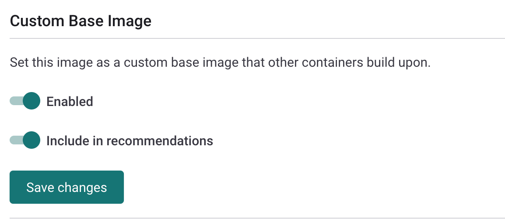
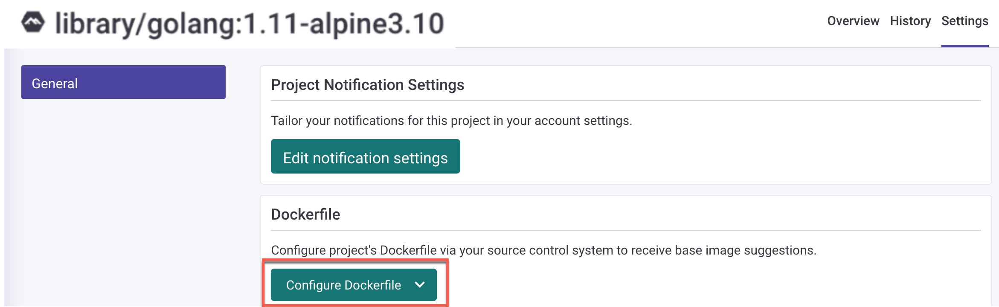

# Use Custom Base Image Recommendations


**Feature availability**\
The Custom Base Image Recommendation feature is available only with Enterprise plans.\
For more information, see [plans and pricing](https://snyk.io/plans/).


## **Overview of Custom Base Image Recommendations (CBIR)**

When scanning a container image, Snyk provides recommendations based on the base image it detects. Because Snyk precomputes recommendations only for Docker Official Images, these recommendations apply only to a subset of images.

Customers often maintain their own internal base images, built on top of Docker Official Images or other upstream images. These are provided as a service to a wider set of development teams. For example: `somecompany/base-python:3.12.1`.

The Custom Base Image Recommendation feature (CBIR) allows Snyk to recommend an image upgrade from a pool of your internal images. This allows teams to be notified of newer versions of their internal base images, along with a vulnerability count, in order to help with image selection.\
\
Snyk does not use the vulnerability data in order to detemine which version to display. All versions in the pool of images to recommend that are considered upgrades to the current image are offered. This provides users with the most control over what images to recommend and which not.\
\
You can remove images that must not be recommended by disabling the **Include in recommendations** option. For more information, see [Mark the created Project as a custom base image](./#mark-the-created-project-as-a-custom-base-image).

## How CBIR works

To use the Custom Base Image Recommendation feature, the base images and the application images built on top of a base image must be imported to Snyk as Projects. These Projects can be in different Organizations, but the Organizations must belong to the same Group.

To receive custom base image recommendations for an application image, you must specify a Dockerfile in the application image Project.


As opposed to public Docker Official Images, Snyk can detect a custom base image only when a Dockerfile is linked to the application image Project.


All custom base image recommendations are considered minor upgrades, regardless of the image tag.

To determine the latest version of a base image across Projects imported into the same repository, Snyk allows configuring a versioning schema. For more information, see [Versioning schemas for custom base images.](versioning-schema-for-custom-base-images.md)

The Custom Base Image Recommendation feature supports Automatic fix PRs. If you are not using the latest version of the base image, then immediately after image import Snyk automatically issues a fix pull request against your Dockerfile to upgrade to the latest available custom base image version.

## Special considerations

The recommendations provided by the CBIR feature rely on versioned tags that comply with the versioning schema configured.&#x20;


It is possible to add the "latest" tag to this pool as a single selection, or as part of a custom versioning scheme. However, Snyk does not recommend doing this, as it negates the benefits of the CBIR feature. The following information considers that the recommendations are not configured with the "latest" tag included in recommendations.


### Latest and other rolling image tags

Snyk recommends that you do not add the "latest" tag to the versioning schema pool along with other tags, so that Snyk does not provide this as an update. The same is true for other similar rolling tags.

For any image that uses the "latest" tag, Snyk recommends moving to the current latest image (by versioned tag) in that repository. This is because when the container that Snyk scans was built using the "latest" tag, this tag may or may not have referenced the same image that is considered the latest image.

### **Recommendations for upgrading the base image**

The **Recommendations for upgrading the base image** view does not show vulnerabilities for base images if they are not in the pool of CBIR tags. This is generally the case for images that have a "latest" image tag or other rolling tags, or other images that are not in the recommendation pool. This does not mean that the base image itself is free from vulnerabilities. To determine what vulnerabilities an image contains, view the scan results for that image.&#x20;

## Enable CBIR: configure an image as a custom base image

The following steps explain how to configure custom base images. The team that is responsible for creating and maintaining custom base images for the Organization performs these steps.

### Build and import a base image

1. Build a custom base image.
2. Import the image to a Snyk Project using one of the following options:
   * The Snyk Web UI: Import an image into Snyk using a container registry.
   * The CLI: Use the `snyk container monitor`  command.
     * Set the `--project-name` flag (mandatory) to give the Project a unique name. Snyk recommends using the image name and tag without the repository. For example `base-python:3.9.2_2021110408`.
     * Example of a Snyk CLI command: \
       `snyk container monitor somecompany/base-python:3.9.2_2021110408 --project-name=base-python:3.9.2_2021110408 --org=ORGANIZATION_ID/ORGANIZATION_NAME`

### Mark the created Project as a custom base image

1. From the Web UI, open the Project with the imported base image.
2. On the Project page, navigate to **Settings**.
3. Enable **Custom Base Image**. This allows Snyk to recognize this image as a base image in other Projects.
4. If you want Snyk to use this image as a source to determine the best upgrade path, enable **Include in recommendations**.


You can also do this using the API endpoint [Create a Custom Base Image from an existing container Project](../../../../snyk-api/reference/custom-base-images.md#custom_base_images).


<figure><figcaption>
Enable Custom Base Image
</figcaption></figure>

5. Click **Save changes**.

If this is the first Project you have marked as a custom base image in the image's repository, you must set a versioning schema. For more information, see [Versioning schemas for custom base images](versioning-schema-for-custom-base-images.md). If a schema already exists for the image's repository, it is displayed after you save the changes.


Any changes you make to the versioning schema apply to all custom base images in the repository.


You can also edit the **Custom base Image** **settings** for Projects that you have already marked as custom base images.

## Receive custom base image recommendations

The applications team that is responsible for using pre-built custom base images and adding additional layers on top of the pre-built images for applications performs this step.

First, import an image to a new Snyk Project. Ensure that the Project is in the same Group as the custom images. You can import an image using either the CLI or the Web UI.


If the same image is scanned from both the CLI and Web UI, Snyk creates two Projects and monitors both.


### Import a new image through the CLI and set the Dockerfile

The following is an example command for importing an image through the CLI:

`snyk container monitor somecompany/app-python:2021110408 --file=path/to/Dockerfile`

Use `--file` (mandatory) to specify the path to the Dockerfile.

### Use a previously imported image and set the Dockerfile

You can modify previously imported container Projects in order to attach a Dockerfile.

On the Project page for the application image, navigate to **Settings** and configure the Dockerfile by clicking **Configure Dockerfile** and selecting your source control system from the dropdown.

<figure><figcaption>
Configure the Project Dockerfile
</figcaption></figure>

Choose the Dockerfile repository and add the path to your Dockerfile. Click **Update Dockerfile**.

<figure><figcaption>
Configure the path to your Dockerfile
</figcaption></figure>

### View Custom Base Image Recommendations

Next, navigate to the **Project** page to see the recommendations for the image.


You may need to retest a Project when you set the Dockerfile for an existing project.


<figure><figcaption>
Example of Custom Base Image Recommendations
</figcaption></figure>

## Known limitations of CBIR

* When you scan an application image, custom base image recommendations do not appear unless you attach the Dockerfile to the scanned Project.
* The image registry is ignored when recommendations are given for custom base images. When Snyk shows recommendations and fix PRs, images with the same repository but different registries are treated as coming from the same registry (the current base image's registry).
