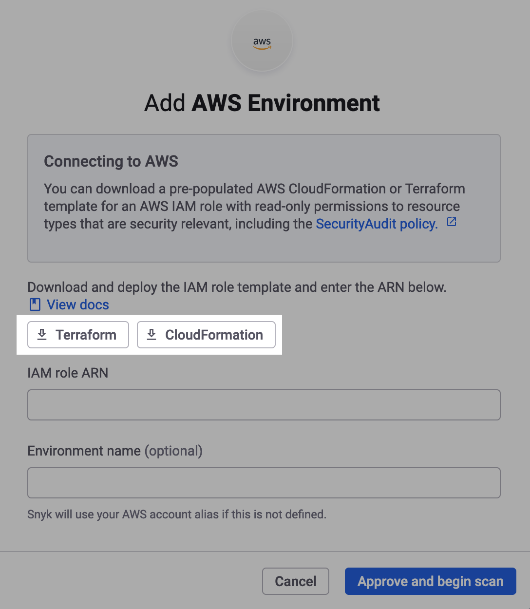

# Step 1: Download IAM role IaC template (Web UI)

Before you can create a Cloud Environment, you must download an Infrastructure as Code (IaC) template declaring a read-only **Identity and Access Management** (IAM) role that Snyk can assume to scan the configuration of resources in your Amazon Web Services (AWS) account.

Use this IaC template to provision the role in [Step 2: Create the Snyk IAM role](step-2-create-the-snyk-iam-role.md).

You can choose the template format, either [Terraform HCL](https://www.terraform.io/language/syntax/configuration) or [AWS CloudFormation](https://docs.aws.amazon.com/AWSCloudFormation/latest/UserGuide/Welcome.html). The IAM permissions are identical in both, so pick the format you are most comfortable working with.

The steps follow to **download the IaC template**.

1. In the [Snyk Web UI](https://app.snyk.io), navigate to **Integrations** > **Cloud platforms**.
2. Select **AWS**.
3. In the **Add AWS Environment** modal, select the **Terraform** button to download a `snyk-permissions-aws.tf` file or **CloudFormation** to download a `snyk-permissions-aws.yml` file:

<figure><figcaption>
The Add AWS Environment modal
</figcaption></figure>

You can now proceed to [Step 2: Create the Snyk IAM role (Web UI)](step-2-create-the-snyk-iam-role.md).
