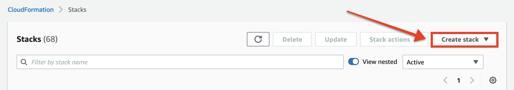

# Step 2: Create the Snyk IAM role


**Recap**\
You have downloaded the Terraform or Amazon Web Services (AWS) CloudFormation template declaring the Identity and Access Management (IAM) role for Snyk. Now you need to provision the infrastructure.


The process to create the Snyk IAM role is the same whether you are using the [Snyk Web UI](step-1-download-iam-role-iac-template-web-ui.md) or [Snyk API](../aws-integration-api/step-1-download-iam-role-iac-template-api.md) to onboard your AWS account.

The IAM role you will provision has the following policies attached to it:

* The AWS-managed [SecurityAudit](https://docs.aws.amazon.com/IAM/latest/UserGuide/access_policies_job-functions.html#jf_security-auditor) read-only policy.
* A supplemental inline policy granting required read permissions not covered by SecurityAudit.

The role also has a trust policy that specifies an [external ID](https://docs.aws.amazon.com/IAM/latest/UserGuide/id_roles_create_for-user_externalid.html). Snyk generates this unique ID for your organization to prevent other parties from assuming the role without the ID, even if they have your role Amazon Resource Name (ARN).

## Create the IAM role with Terraform or CloudFormation

You can create the IAM role using one of the following tools, according to the type of template you downloaded from Snyk:

* **Terraform:** [Terraform CLI](step-2-create-the-snyk-iam-role.md#create-the-iam-role-with-terraform)
* **AWS CloudFormation:** [AWS CLI](step-2-create-the-snyk-iam-role.md#create-the-iam-role-with-aws-cli) or [AWS Management Console](step-2-create-the-snyk-iam-role.md#create-the-iam-role-using-the-aws-management-console)

### Create the IAM role with Terraform


Before you use the [Terraform CLI](https://www.terraform.io/downloads), ensure you [configure it to use your AWS credentials](https://registry.terraform.io/providers/hashicorp/aws/latest/docs#authentication-and-configuration).


1. In your terminal, navigate to the directory containing the Snyk IAM role Terraform file (named `snyk-permissions-aws.tf` if it has been downloaded from the Snyk Web UI).
2. Using the Terraform CLI, initialize the Terraform Project:

```
terraform init
```

3\. Review and apply the Terraform plan:

```
terraform apply
```

4\. Enter `yes` when Terraform asks if you want to perform the actions.

Terraform then creates the IAM role. When the role has been created, you will see the following output:

```
Apply complete! Resources: 1 added, 0 changed, 0 destroyed.
```

### Create the IAM role with AWS CLI


Before you use the [AWS CLI](https://aws.amazon.com/cli/), ensure you [configure it to use your AWS credentials](https://docs.aws.amazon.com/cli/latest/userguide/cli-configure-quickstart.html).


1. In your terminal, navigate to the directory containing the Snyk IAM role CloudFormation file (named `snyk-permissions-aws.yml` if it has been downloaded from the Snyk Web UI).
2. Using the AWS CLI, launch the CloudFormation stack, replacing `snyk-cloud-role` with the name of your IAM role if you changed it and `snyk-permissions-aws.yml` with the name of your file:

```
aws cloudformation create-stack \
  --stack-name snyk-cloud-role \
  --capabilities CAPABILITY_NAMED_IAM \
  --template-body file://snyk-permissions-aws.yml
```

3\. AWS then creates the IAM role. This typically takes about a minute. To check if it is finished, get the stack status, replacing `snyk-cloud-role` with the name of your IAM role:

```
aws cloudformation describe-stacks \
  --stack-name snyk-cloud-role \
  --query 'Stacks[0].StackStatus'
```

If the output says `"CREATE_COMPLETE"`, AWS has finished creating your role.

### Create the IAM role using the AWS Management Console

1. Log in to the [AWS Management Console](https://console.aws.amazon.com).
2. Navigate to [CloudFormation](https://console.aws.amazon.com/cloudformation).
3. Select the **Create stack** button:

<figure><figcaption><p>Select the Create stack button in the AWS Management Console</p></figcaption></figure>

4\. Select **With new resources (standard)** from the drop-down menu.

5\. On the **Create stack** page, in the **Specify template** section and select **Upload a template file**.

6\. Click the **Choose file** button that appears and select your CloudFormation file containing the Snyk IAM role.

7\. Select **Next**.

8\. On the **Specify stack details** page, in the **Stack name** section, enter a stack name, such as `snyk-cloud-role`.

9\. Select **Next**.

10\. On the **Configure stack options** page, enter tags if desired and keep the rest of the defaults.

11\. Select **Next**.

12\. On the **Review** page, in the **Capabilities** section at the bottom, check the box **I acknowledge that AWS CloudFormation might create IAM resources with custom names.**

13\. Select **Create stack**.

14\. AWS launches the stack, and you'll see a page with stack details. You can select the **Refresh** button to refresh its status:

<figure><figcaption><p>Select the Refresh button to refresh the stack status in the AWS Management Console</p></figcaption></figure>

If the **Status** column says `CREATE_COMPLETE`, AWS has finished creating the IAM role.

## What's next?

The next step is to create and scan the Cloud Environment. See [Step 3: create and scan a Cloud Environment (Web UI)](step-3-create-and-scan-a-cloud-environment-web-ui.md) or [Step 3: create and scan a Cloud Environment (API)](../aws-integration-api/step-3-create-and-scan-a-cloud-environment-api.md).
