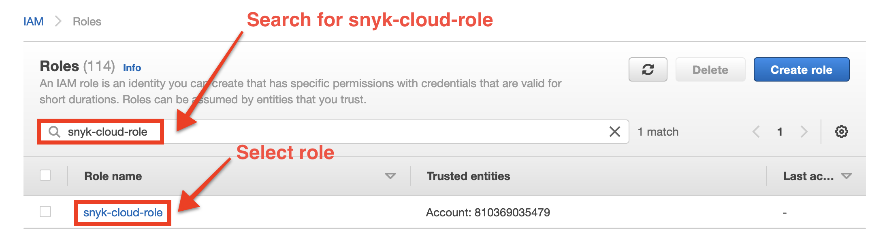
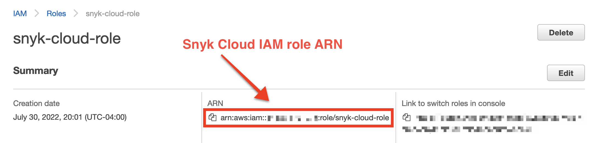
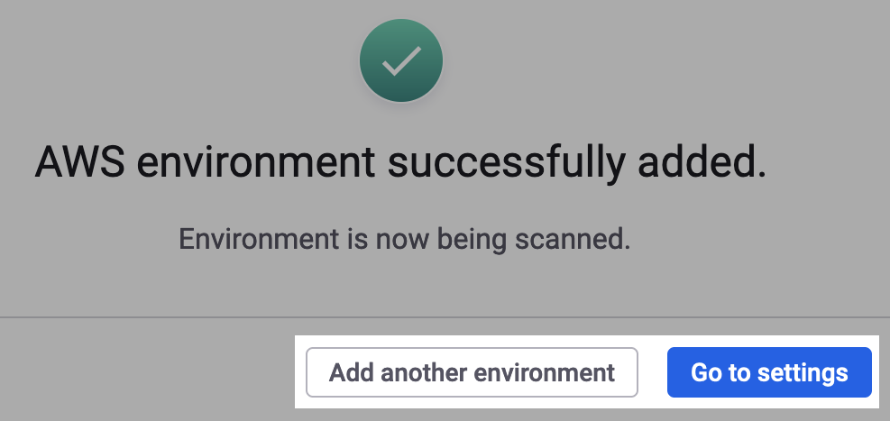

# Step 3: Create and scan a Cloud Environment (Web UI)


**Recap**\
You have created the Snyk IAM role. Now you can create and scan a Cloud Environment.


To create and scan a Cloud Environment, you must provide the role’s Amazon Resource Name (ARN). Then you can finish onboarding the environment.

## Find the role ARN

The role ARN should follow this format unless you [changed the name of the role](step-1-download-iam-role-iac-template-web-ui.md) in the Terraform or CloudFormation template:

```
arn:aws:iam::YOUR-ACCOUNT-ID:role/snyk-cloud-role
```

If you do not know your Amazon Web Services (AWS) account ID, or if you changed the name of the IAM role in the Terraform or CloudFormation template, you can find the role ARN using the [AWS CLI](step-3-create-and-scan-a-cloud-environment-web-ui.md#find-the-role-arn-using-the-aws-cli) or the [AWS Management Console](step-3-create-and-scan-a-cloud-environment-web-ui.md#find-the-role-arn-using-the-aws-management-console).

### Find the role ARN using the AWS CLI

To find the ARN of the Snyk Cloud IAM role using the AWS CLI, retrieve the role details, replacing `snyk-cloud-role` with the name of your role if you changed it:

```
aws iam get-role \
  --role-name snyk-cloud-role \
  --query 'Role.Arn' --output text
```

The output looks like this:

```
arn:aws:iam::123412341234:role/snyk-cloud-role
```

### Find the role ARN using the AWS Management Console

1. Log in to the [AWS Management Console](https://console.aws.amazon.com).
2. Navigate to [Identity and Access Management](https://console.aws.amazon.com/iamv2/home#/home).
3. In the left sidebar, select **Roles**.
4. On the **Roles** page, search for `snyk-cloud-role` or substitute the name of your role if you changed it:

<figure><figcaption><p>Search for the name of your role in the AWS Management Console</p></figcaption></figure>

5\. Select the role.

6\. On the role details page, in the **Summary** section, find and copy the ARN:

<figure><figcaption><p>Copy the role ARN in the AWS Management Console</p></figcaption></figure>

## Create and scan the AWS Environment

1. In the Snyk Web UI **Add AWS Environment** modal where you downloaded the IAM role template, enter your role ARN in the **IAM role ARN** field.
2. Optionally, enter an environment name. If one is not provided, Snyk will use your AWS account alias.
3. Select **Approve and begin scan**.
4. You will  see a confirmation message: "AWS environment successfully added." Select **Add another environment** to return to the **Add AWS Environment** modal and onboard a new account, or select **Go to settings** if you are finished:

<figure><figcaption><p>Success message after adding an AWS environment in the Snyk Web UI</p></figcaption></figure>

## What's next?

You can now do the following:

* View the cloud configuration issues Snyk finds. See [Manage cloud issues](../../../getting-started-with-cloud-scans/manage-cloud-issues/).
* Prioritize your vulnerabilities with cloud context.
