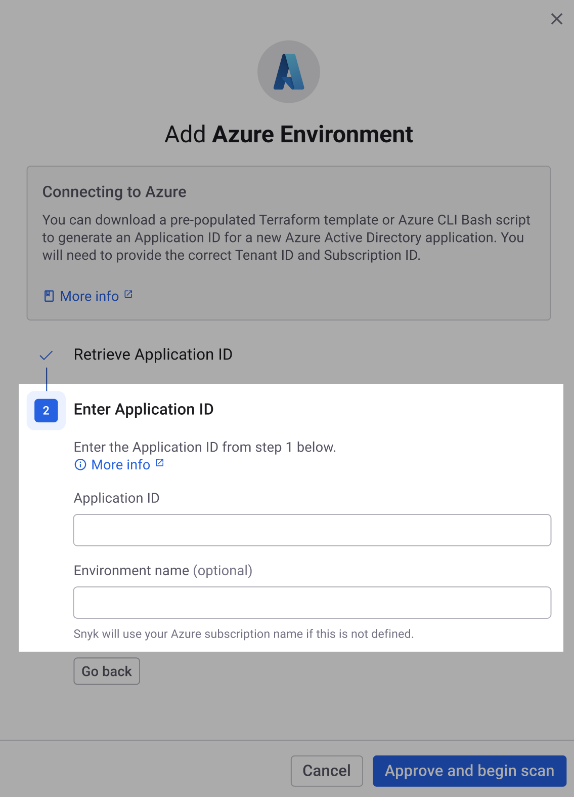

# Step 3: Create and scan a Cloud Environment for Azure (Web UI)


**Recap**\
You have created the Azure app registration, federated identity credential, and service principal for Snyk. Now you can create and scan a Cloud Environment.


The steps follow to create and scan a Cloud Environment for Azure using the Web UI.

1. In the Snyk Web UI **Add Azure Environment** modal where you downloaded the Terraform template or Bash script, enter your application ID in the **Application ID** field.
2. Optionally, enter an environment name. If one is not provided, Snyk will use your subscription name.\
   
3. Select **Approve and begin scan**.
4. You will see a confirmation message: "Azure environment successfully added." Select **Add another environment** to return to the **Add Azure Environment** modal and onboard a new subscription, or select **Go to settings** if you are finished.

You can now do the following:

* View the cloud configuration issues Snyk finds. See [Manage cloud issues](../../../getting-started-with-cloud-scans/manage-cloud-issues/).
* Prioritize your vulnerabilities with cloud context.
